# API Reference (Internal)

<cite>
**Referenced Files in This Document **   
- [main.rs](file://src/main.rs)
</cite>

## Table of Contents
1. [Introduction](#introduction)
2. [Core Data Structures](#core-data-structures)
3. [Configuration and Provider Management](#configuration-and-provider-management)
4. [Model Selection and Failure Handling](#model-selection-and-failure-handling)
5. [Commit Execution Flow](#commit-execution-flow)
6. [Watch Mode Implementation](#watch-mode-implementation)
7. [Key Functions Reference](#key-functions-reference)

## Introduction

This document provides an internal API reference for the aicommit Rust codebase, focusing on the core types and functions defined in `src/main.rs`. The tool generates descriptive git commit messages using Large Language Models (LLMs) through various providers including OpenRouter, Ollama, and OpenAI-compatible endpoints.

The system is designed with extensibility in mind, allowing developers to add new provider types and modify the commit generation workflow. Key features include automatic version management, watch mode for continuous integration, and sophisticated model selection logic for the Simple Free OpenRouter mode.

This reference targets developers who are extending or maintaining the codebase, providing detailed documentation of public structs, enums, and key functions that form the core functionality of the application.

## Core Data Structures

### Config Structure
The `Config` struct manages the global configuration state for the application, storing provider configurations and the active provider identifier.

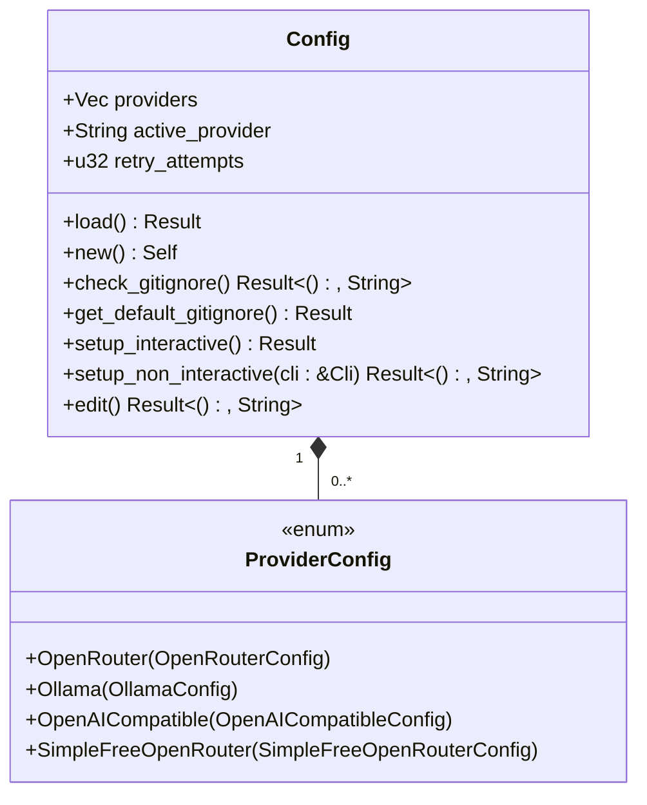

**Diagram sources**
- [main.rs](file://src/main.rs#L189-L209)

**Section sources**
- [main.rs](file://src/main.rs#L189-L209)

### CLI Arguments Structure
The `Cli` struct uses clap derive macros to automatically generate a command-line argument parser from its field definitions. Each field corresponds to a command-line flag with appropriate attributes for help text and default values.

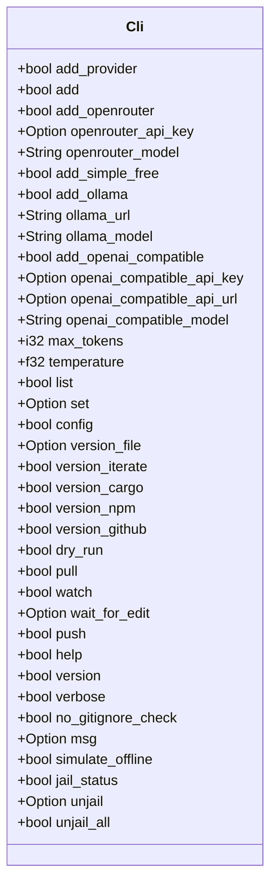

**Diagram sources**
- [main.rs](file://src/main.rs#L37-L200)

**Section sources**
- [main.rs](file://src/main.rs#L37-L200)

### Model Statistics Structure
The `ModelStats` struct tracks performance metrics for individual LLMs used in the Simple Free OpenRouter mode, enabling intelligent failover decisions based on historical success/failure patterns.

```mermaid
classDiagram
class ModelStats {
+usize success_count
+usize failure_count
+Option<DateTime<Utc>> last_success
+Option<DateTime<Utc>> last_failure
+Option<DateTime<Utc>> jail_until
+usize jail_count
+bool blacklisted
+Option<DateTime<Utc>> blacklisted_since
}
ModelStats : Default implementation
ModelStats : Serialization with chrono : : serde : : ts_seconds_option
```

**Diagram sources**
- [main.rs](file://src/main.rs#L134-L154)

**Section sources**
- [main.rs](file://src/main.rs#L134-L154)

### Usage Information Structure
The `UsageInfo` struct captures token usage and cost information from LLM API calls, providing transparency into resource consumption during commit message generation.

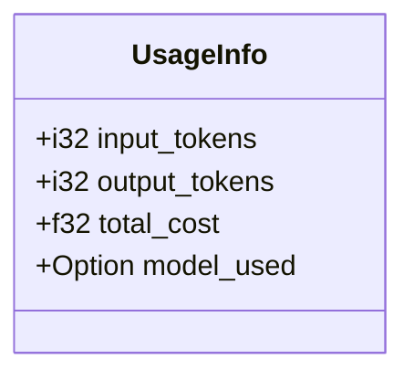

**Diagram sources**
- [main.rs](file://src/main.rs#L1178-L1182)

**Section sources**
- [main.rs](file://src/main.rs#L1178-L1182)

## Configuration and Provider Management

### Provider Configuration Types
The system supports multiple provider types through a sum type (`ProviderConfig`) that encapsulates configuration for different LLM services. Each provider has specific configuration requirements reflected in their respective structs.

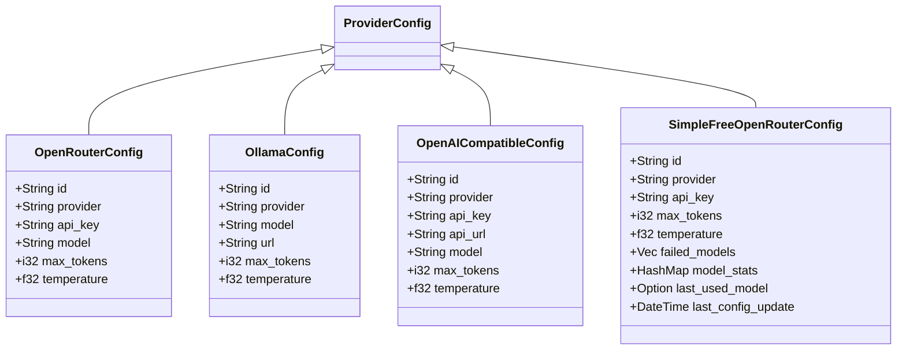

**Diagram sources**
- [main.rs](file://src/main.rs#L110-L187)

**Section sources**
- [main.rs](file://src/main.rs#L110-L187)

### Configuration Loading Process
The configuration system follows a hierarchical approach to loading settings, with sensible defaults when configuration files don't exist. The process involves checking for the existence of the configuration file, parsing JSON content, and falling back to default values when necessary.

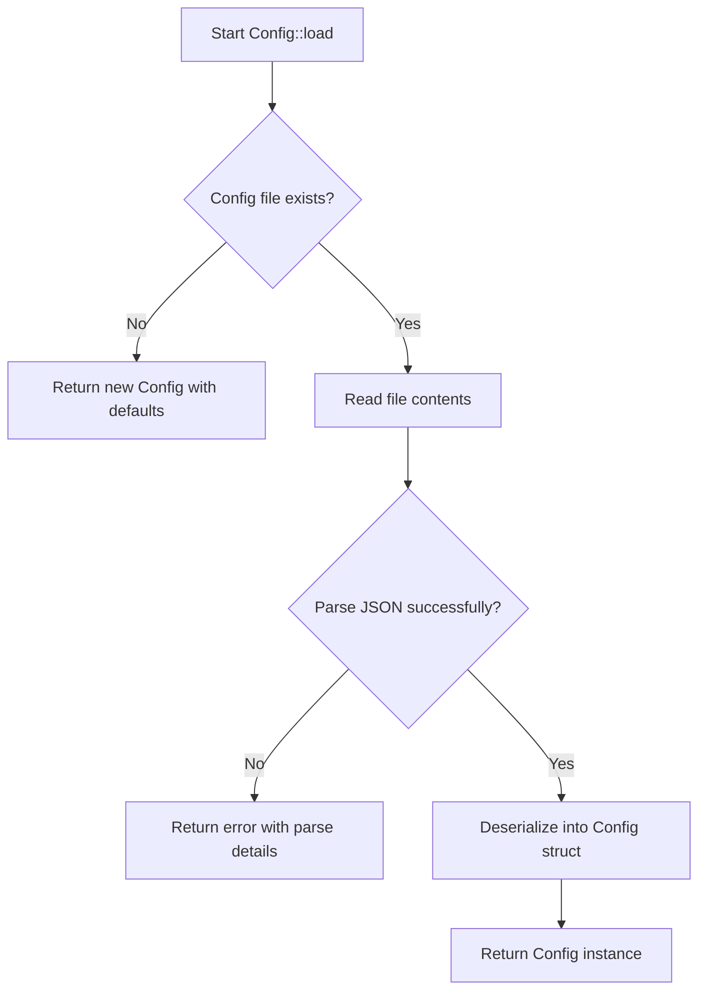

**Diagram sources**
- [main.rs](file://src/main.rs#L198-L208)

**Section sources**
- [main.rs](file://src/main.rs#L198-L208)

## Model Selection and Failure Handling

### Model Availability Decision Tree
The system implements a sophisticated decision-making process for selecting which LLM to use when multiple options are available, particularly in the Simple Free OpenRouter mode where automatic model selection occurs.

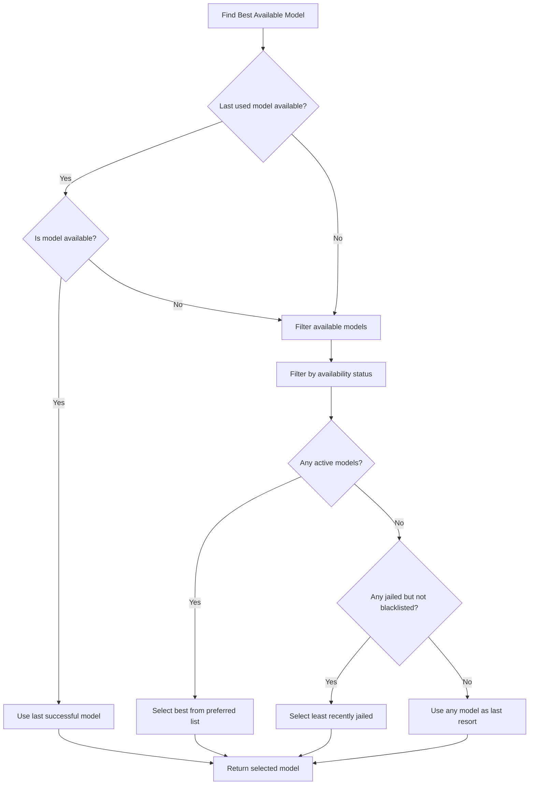

**Diagram sources**
- [main.rs](file://src/main.rs#L2200-L2300)

**Section sources**
- [main.rs](file://src/main.rs#L2200-L2300)

### Model Failure Consequences
When a model fails to generate a commit message, the system records this failure and may apply progressive penalties including temporary jailing and eventual blacklisting if failures persist.

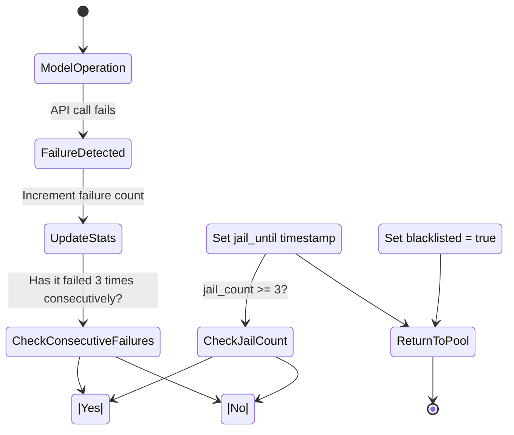

**Diagram sources**
- [main.rs](file://src/main.rs#L3000-L3191)

**Section sources**
- [main.rs](file://src/main.rs#L3000-L3191)

## Commit Execution Flow

### Main Execution Sequence
The primary execution flow handles all command-line arguments and routes to the appropriate functionality based on the provided flags, forming the central control structure of the application.

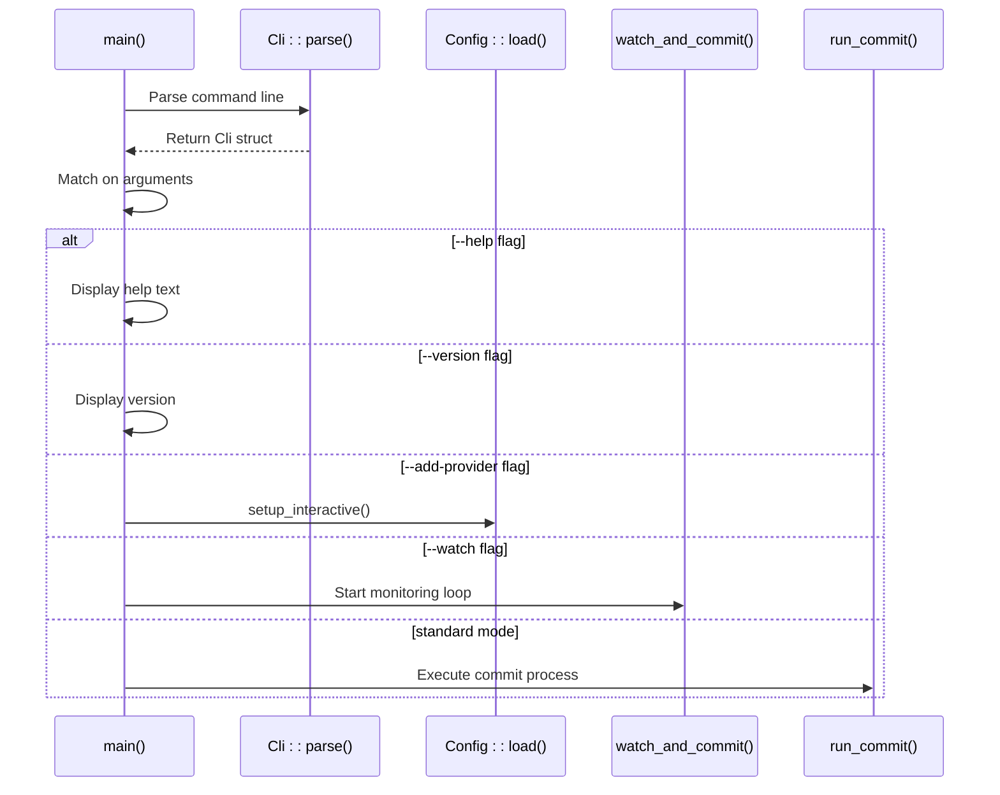

**Diagram sources**
- [main.rs](file://src/main.rs#L1200-L1500)

**Section sources**
- [main.rs](file://src/main.rs#L1200-L1500)

### Standard Commit Process
The standard commit process orchestrates the sequence of operations required to generate a commit message, create the commit, and optionally perform additional operations like pulling or pushing.

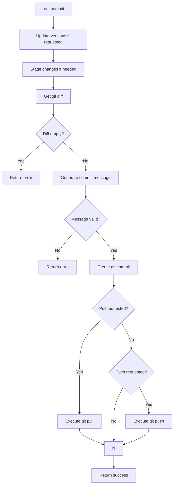

**Diagram sources**
- [main.rs](file://src/main.rs#L2000-L2500)

**Section sources**
- [main.rs](file://src/main.rs#L2000-L2500)

## Watch Mode Implementation

### File Monitoring Architecture
The watch mode implements a continuous monitoring system that detects file changes and can automatically stage and commit them after a configurable delay period.

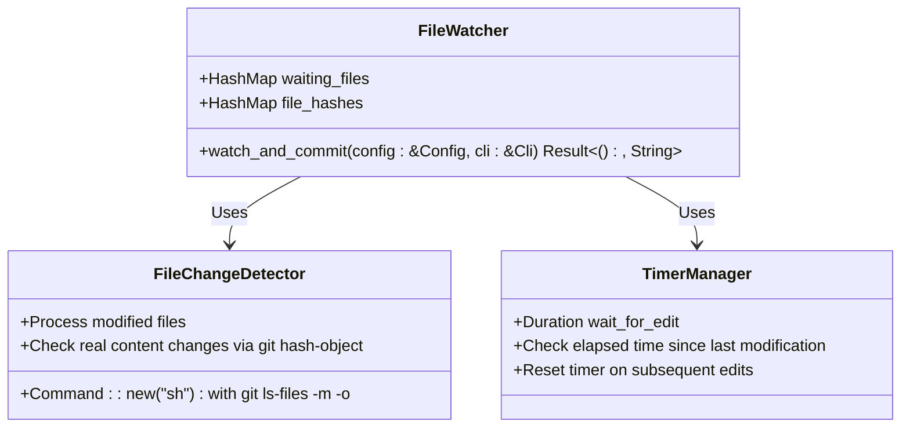

**Diagram sources**
- [main.rs](file://src/main.rs#L1200-L1500)

**Section sources**
- [main.rs](file://src/main.rs#L1200-L1500)

### Edit Delay Logic
The edit delay feature prevents premature commits during active editing sessions by requiring a period of stability before committing changes.

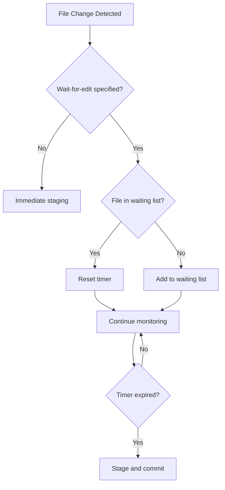

**Diagram sources**
- [main.rs](file://src/main.rs#L1200-L1500)

**Section sources**
- [main.rs](file://src/main.rs#L1200-L1500)

## Key Functions Reference

### setup_openrouter_provider Function
Initializes an OpenRouter provider configuration through interactive user input, collecting API credentials and model preferences.

**Function Signature**
```
async fn setup_openrouter_provider() -> Result<OpenRouterConfig, String>
```

**Parameters**: None (uses interactive prompts)

**Return Values**
- Success: `Ok(OpenRouterConfig)` with populated fields
- Error: `Err(String)` with descriptive error message

**Error Conditions**
- Failed to read API key input
- Failed to parse max_tokens as integer
- Failed to parse temperature as float

**Section sources**
- [main.rs](file://src/main.rs#L953-L1000)

### execute_watch_mode Function
Implements continuous file monitoring with optional delay before committing, allowing for automatic version control during development.

**Function Signature**
```
async fn watch_and_commit(config: &Config, cli: &Cli) -> Result<(), String>
```

**Parameters**
- `config`: Reference to current configuration
- `cli`: Reference to parsed command-line arguments

**Return Values**
- Success: `Ok(())` indicating ongoing monitoring
- Error: `Err(String)` with descriptive error message

**Behavior**
- Monitors for file changes using `git ls-files -m -o`
- Tracks file modification timestamps
- Implements configurable delay via `wait-for-edit`
- Automatically stages and commits stable changes
- Continues monitoring until interrupted

**Section sources**
- [main.rs](file://src/main.rs#L1200-L1500)

### handle_version_bump Function
Coordinates version updates across multiple project files, ensuring consistency between different versioning systems.

**Function Signature**
```
async fn run_commit(config: &Config, cli: &Cli) -> Result<(), String>
```

**Parameters**
- `config`: Reference to current configuration
- `cli`: Reference to parsed command-line arguments

**Return Values**
- Success: `Ok(())` after completing all requested operations
- Error: `Err(String)` with descriptive error message

**Operations Performed**
- Increments version in specified version file
- Updates Cargo.toml and Cargo.lock if requested
- Updates package.json if requested
- Creates GitHub release tag if requested
- Stages all version changes for commit

**Error Conditions**
- Version file not specified when version update flags are used
- Failed to read or write version files
- Failed to execute git commands for version updates
- Cargo update command fails

**Section sources**
- [main.rs](file://src/main.rs#L2000-L2500)

### Data Flow Between Components
The application follows a clear data flow pattern from configuration loading through provider initialization to commit execution, with well-defined interfaces between components.

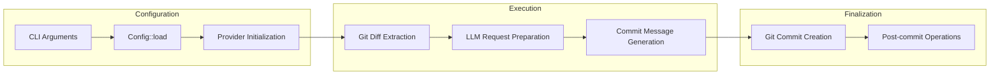

**Diagram sources**
- [main.rs](file://src/main.rs#L1200-L1500)

**Section sources**
- [main.rs](file://src/main.rs#L1200-L1500)

### Model Failure to Jail Decision Process
The system implements a progressive penalty system for failing models, moving from temporary restrictions to permanent blacklisting based on persistent failure patterns.

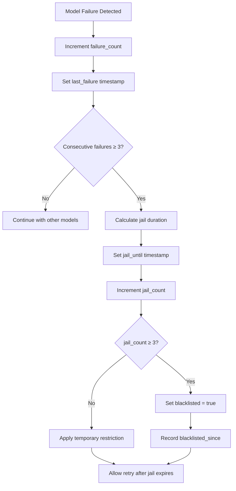

**Diagram sources**
- [main.rs](file://src/main.rs#L3000-L3191)

**Section sources**
- [main.rs](file://src/main.rs#L3000-L3191)