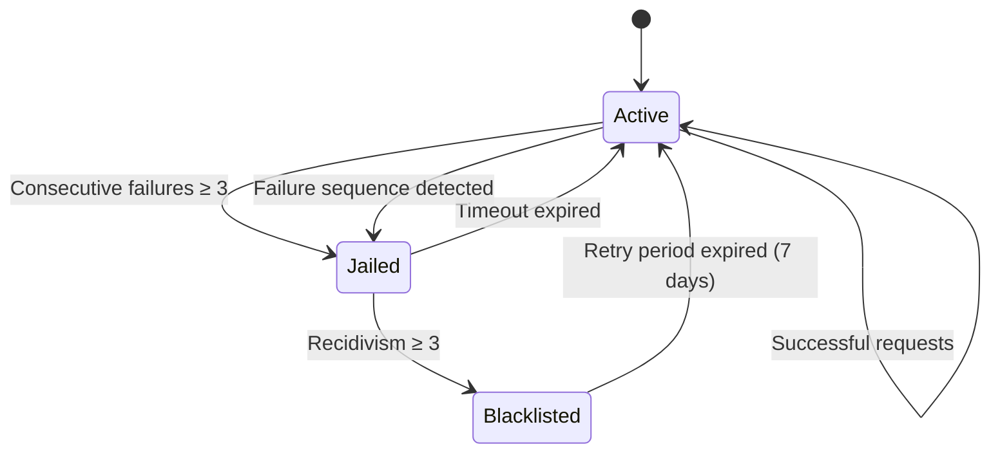
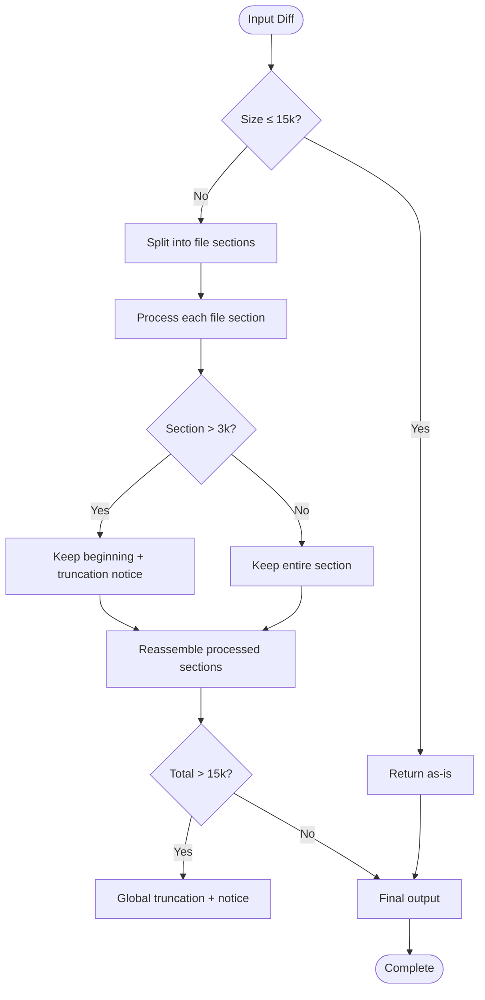
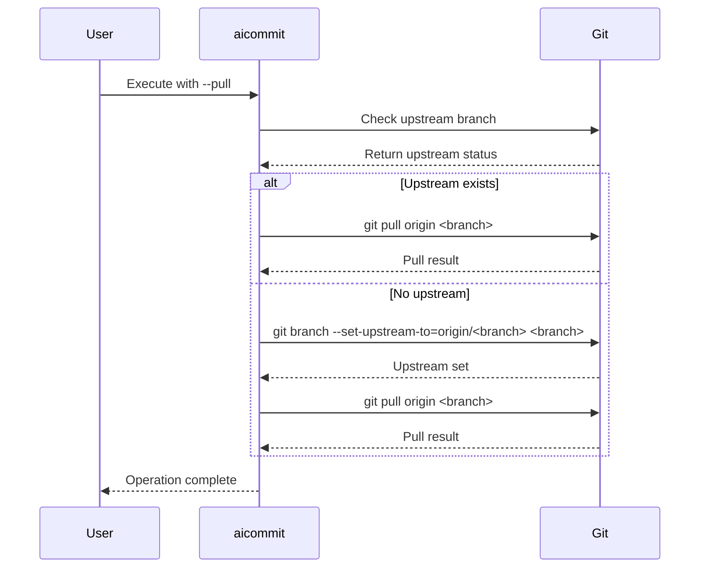
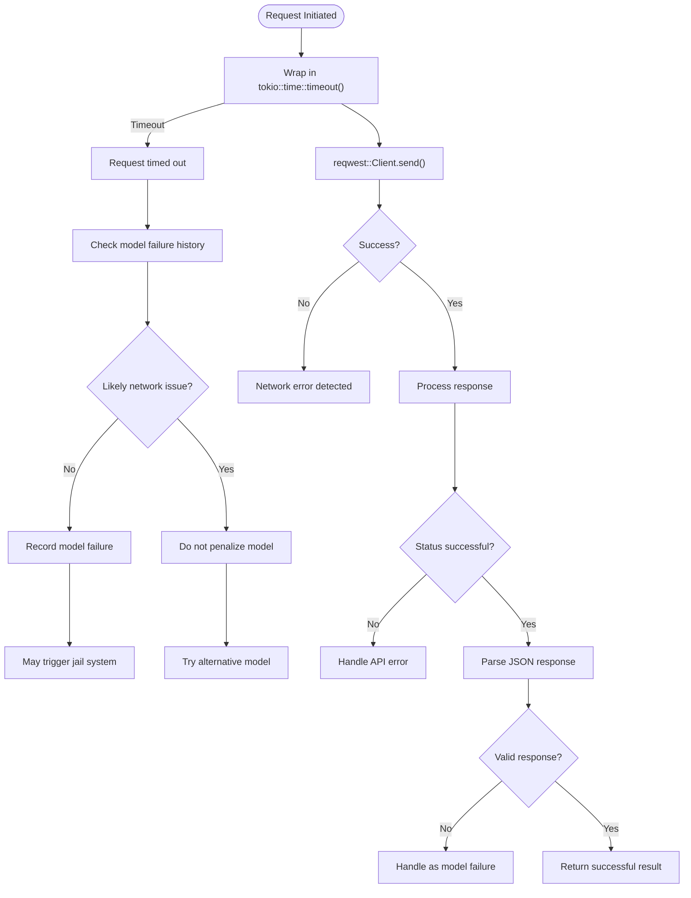
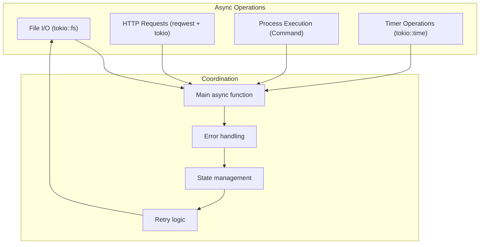

# Advanced Features

<cite>
**Referenced Files in This Document**   
- [main.rs](file://src/main.rs)
</cite>

## Table of Contents
1. [Introduction](#introduction)
2. [Model Jail System](#model-jail-system)
3. [Smart Diff Processing](#smart-diff-processing)
4. [Automatic Upstream Branch Setup](#automatic-upstream-branch-setup)
5. [Network Resilience Strategies](#network-resilience-strategies)
6. [Memory-Efficient Diff Streaming and Async Coordination](#memory-efficient-diff-streaming-and-async-coordination)
7. [Expert Usage Patterns](#expert-usage-patterns)
8. [Conclusion](#conclusion)

## Introduction
This document explores the advanced capabilities of the aicommit tool that extend beyond basic commit message generation. The system implements sophisticated features to enhance reliability, performance, and user experience through intelligent model management, efficient data processing, and resilient network operations. Built on Rust with async/await patterns using tokio and HTTP client functionality via reqwest, the tool demonstrates modern systems programming practices while solving practical developer workflow challenges.

## Model Jail System
The aicommit tool implements an automated model jail system that tracks the reliability of AI models through the `ModelStats` struct and automatically disables failing models based on error rates. This self-healing mechanism ensures consistent performance by preventing repeated failures from unreliable models.

The system maintains detailed statistics for each model including success and failure counts, timestamps of last activity, jail status, and blacklist information. When a model exhibits consecutive failures (defined by `MAX_CONSECUTIVE_FAILURES = 3`), it is automatically placed in "jail" with an exponentially increasing timeout period starting at 24 hours (`INITIAL_JAIL_HOURS`) and doubling with each recurrence up to a maximum of 168 hours (7 days).



**Diagram sources**
- [main.rs](file://src/main.rs#L449-L466)

The jail system employs progressive penalties: first-time offenders receive a 24-hour suspension, repeat offenders face increasingly longer timeouts (48 hours, 96 hours, etc.), and chronic failures result in blacklisting for one week. This approach balances fault tolerance with resource optimization, allowing temporary network issues without permanently discarding potentially useful models.

Administrative controls are provided through command-line arguments:
- `--jail-status`: Displays comprehensive status of all models including active, jailed, and blacklisted states
- `--unjail=<MODEL>`: Releases a specific model from jail/blacklist
- `--unjail-all`: Clears all jail and blacklist statuses

These controls enable both automated management and manual intervention when needed.

**Section sources**
- [main.rs](file://src/main.rs#L247-L257)
- [main.rs](file://src/main.rs#L1499-L1520)
- [main.rs](file://src/main.rs#L2945-L3144)

## Smart Diff Processing
The tool implements intelligent diff processing techniques that filter noise and highlight meaningful changes while respecting API limitations and computational efficiency. Two key constants govern this behavior: `MAX_DIFF_CHARS` (15,000 characters) limits the total diff size to prevent excessive API usage, and `MAX_FILE_DIFF_CHARS` (3,000 characters) caps individual file diff sections.

The `process_git_diff_output` function implements a multi-layered filtering strategy:



**Diagram sources**
- [main.rs](file://src/main.rs#L1057-L1120)

When processing large diffs, the system preserves context by keeping header information (file names, index lines) while truncating content from oversized files. For extremely large overall diffs, it applies global truncation while maintaining the most relevant initial portion. The `get_safe_slice_length` helper function ensures UTF-8 character boundary integrity during truncation operations.

This smart processing enables reliable operation across diverse repository sizes and change volumes while minimizing token consumption and API costs.

**Section sources**
- [main.rs](file://src/main.rs#L11-L12)
- [main.rs](file://src/main.rs#L1057-L1120)

## Automatic Upstream Branch Setup
The system includes automatic upstream branch setup functionality that ensures proper tracking relationships during pull operations. When the `--pull` flag is used, the tool first verifies whether the current branch has an upstream configured:



**Diagram sources**
- [main.rs](file://src/main.rs#L1800-L1999)

If no upstream is configured, the system automatically sets up the tracking relationship using the convention `origin/<current-branch-name>` before executing the pull operation. This eliminates manual configuration requirements and ensures consistent behavior across different repository states.

The implementation uses shell commands wrapped in Rust's `Command` interface to interact with git, checking for upstream existence with `git rev-parse --abbrev-ref --symbolic-full-name @{upstream}` and setting the upstream relationship when necessary.

**Section sources**
- [main.rs](file://src/main.rs#L1800-L1999)

## Network Resilience Strategies
The aicommit tool implements robust network resilience strategies using the reqwest HTTP client and tokio runtime to handle transient failures and maintain reliability. These strategies include comprehensive retry logic, timeout handling, and fallback mechanisms.

For API requests to OpenRouter, the system configures multiple layers of timeouts:
- Client-level timeout of 10 seconds for all operations
- Request-specific timeout of 15 seconds for model listing
- 30-second timeout for chat completion requests



**Diagram sources**
- [main.rs](file://src/main.rs#L2749-L2800)

The retry mechanism operates at multiple levels:
1. Individual request timeouts with graceful degradation
2. Configurable retry attempts (default: 3) with 5-second delays between attempts
3. Intelligent failure classification that distinguishes network issues from model failures
4. Fallback to predefined model lists when API access fails

When network connectivity issues occur, the system first attempts retries before falling back to a curated list of preferred free models defined in `PREFERRED_FREE_MODELS`. This hierarchical approach maximizes availability while maintaining quality.

**Section sources**
- [main.rs](file://src/main.rs#L8)
- [main.rs](file://src/main.rs#L2095-L2294)
- [main.rs](file://src/main.rs#L2749-L2800)

## Memory-Efficient Diff Streaming and Async Coordination
The system employs memory-efficient diff streaming and sophisticated async operation coordination to handle large repositories without excessive resource consumption. Built on Rust's tokio runtime, the implementation leverages async/await patterns throughout its architecture.

Key aspects of the async coordination include:
- Non-blocking file operations using `tokio::fs`
- Concurrent execution of independent tasks
- Proper synchronization of shared state
- Efficient sleep intervals to reduce CPU usage

For watch mode operations, the `watch_and_commit` function implements a polling loop with 500-millisecond intervals (`tokio::time::sleep(std::time::Duration::from_millis(500))`), striking a balance between responsiveness and resource efficiency.

The diff processing pipeline coordinates multiple asynchronous operations:
1. Git diff retrieval via subprocess execution
2. Content reading and writing operations
3. External API communication
4. Configuration file updates



**Diagram sources**
- [main.rs](file://src/main.rs#L8)
- [main.rs](file://src/main.rs#L1225)
- [main.rs](file://src/main.rs#L1816)

The system carefully manages ownership and borrowing in async contexts, cloning configuration data when necessary to satisfy lifetime requirements. This approach enables responsive, non-blocking operations while maintaining data integrity across concurrent processes.

**Section sources**
- [main.rs](file://src/main.rs#L8)
- [main.rs](file://src/main.rs#L1225)
- [main.rs](file://src/main.rs#L1816)
- [main.rs](file://src/main.rs#L1929)

## Expert Usage Patterns
The aicommit tool supports several expert usage patterns that leverage its advanced capabilities for unattended and automated workflows. These patterns combine multiple features to create powerful development automation solutions.

### Watch Mode with Auto-Push
One of the most valuable expert patterns combines watch mode with automatic pushing for completely unattended repositories:

```bash
aicommit --watch --wait-for-edit="30s" --push
```

This configuration monitors the repository for changes, waits 30 seconds after the last modification (allowing batch editing), generates a commit message, and automatically pushes to the remote repository. The `--wait-for-edit` parameter accepts duration specifications in seconds (s), minutes (m), or hours (h).

### Automated Version Management
The tool supports comprehensive version management workflows that synchronize versions across multiple file formats:

```bash
aicommit --version-file="VERSION" --version-iterate --version-cargo --version-npm --version-github --push
```

This command sequence:
1. Reads the current version from VERSION file
2. Increments the version number
3. Updates Cargo.toml and package.json
4. Creates a GitHub release tag
5. Commits all changes
6. Pushes to remote

### Resilient CI/CD Integration
For continuous integration environments, the tool can be configured for maximum reliability:

```bash
aicommit --add --msg="Automated update" || aicommit --add-simple-free --openrouter-api-key=$API_KEY
```

This pattern first attempts offline mode with a predefined message, falling back to AI-generated messages when appropriate credentials are available.

These expert patterns demonstrate how the tool's sophisticated features can be composed to create robust, automated development workflows that minimize manual intervention while maintaining high-quality commit practices.

**Section sources**
- [main.rs](file://src/main.rs#L208-L221)
- [main.rs](file://src/main.rs#L1800-L1999)

## Conclusion
The aicommit tool demonstrates sophisticated capabilities that significantly enhance developer productivity and workflow reliability. Through its model jail system, the tool automatically manages AI model reliability, ensuring consistent performance by isolating failing models based on statistical analysis of success and failure rates. The smart diff processing techniques effectively filter noise while preserving meaningful context, enabling efficient operation across repositories of all sizes.

Automatic upstream branch setup removes common friction points in git workflows, while comprehensive network resilience strategies ensure reliable operation even under adverse network conditions. The memory-efficient diff streaming and async coordination architecture leverages Rust's strengths to deliver responsive performance without excessive resource consumption.

Together, these features enable powerful expert usage patterns like unattended watch-and-push workflows and automated version management, transforming routine development tasks into seamless, automated processes. The thoughtful combination of reliability features, performance optimizations, and user experience enhancements makes aicommit a robust solution for modern software development workflows.