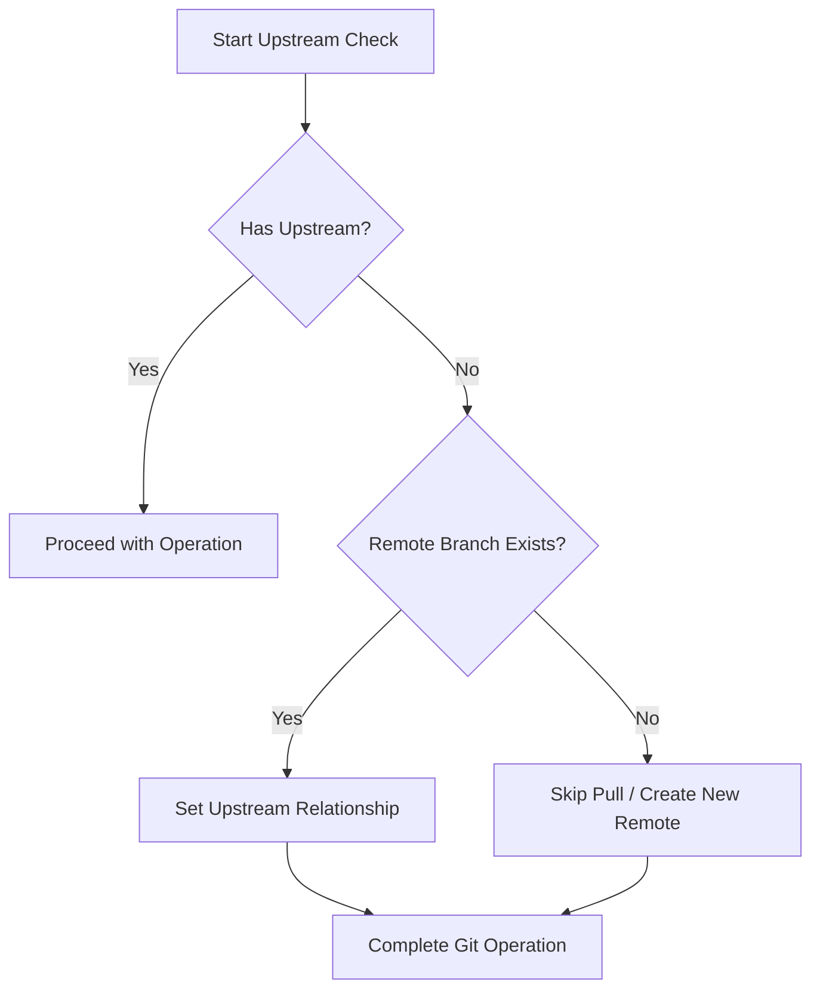
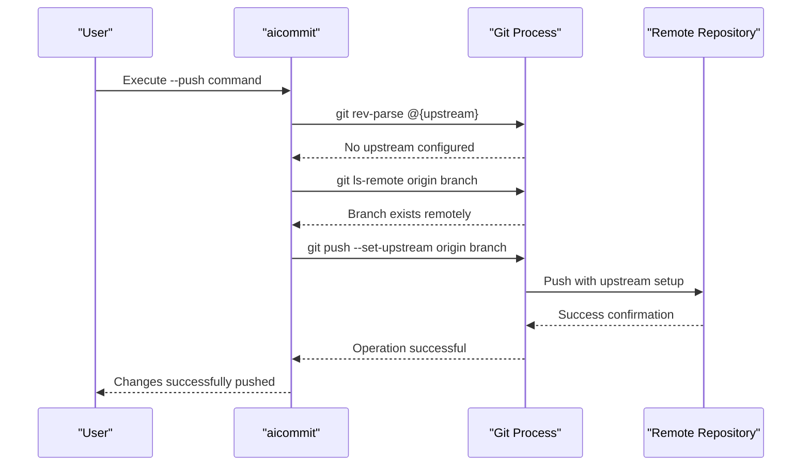

# Automatic Upstream Setup

<cite>
**Referenced Files in This Document **   
- [main.rs](file://src/main.rs)
</cite>

## Table of Contents
1. [Introduction](#introduction)
2. [Detection Logic for Missing Upstream Branches](#detection-logic-for-missing-upstream-branches)
3. [Git Command Execution via Child Process Spawning](#git-command-execution-via-child-process-spawning)
4. [Integration with Push-after-Commit Workflows](#integration-with-push-after-commit-workflows)
5. [Watch Mode Operations](#watch-mode-operations)
6. [User Experience Benefits](#user-experience-benefits)
7. [Edge Cases and Error Handling](#edge-cases-and-error-handling)
8. [Troubleshooting Common Failures](#troubleshooting-common-failures)
9. [Broader Git Workflow Optimization Strategies](#broader-git-workflow-optimization-strategies)

## Introduction
The Automatic Upstream Setup feature in aicommit is designed to streamline Git repository management by automatically configuring tracking relationships between local and remote branches during push operations. This eliminates the need for manual upstream configuration, reducing friction in development workflows. When users attempt to push commits using the `--push` flag, the system intelligently detects whether an upstream branch has been configured. If no upstream exists, it automatically sets up the appropriate tracking relationship using Git's `branch --set-upstream-to` command. This automation ensures seamless integration with both standard commit workflows and advanced features like watch mode, providing a cohesive experience across different usage patterns.

**Section sources**
- [main.rs](file://src/main.rs#L1978-L2094)

## Detection Logic for Missing Upstream Branches
The system employs a robust detection mechanism to identify when a local branch lacks an upstream tracking configuration. It uses the Git command `git rev-parse --abbrev-ref --symbolic-full-name @{upstream}` executed through a child process to query the current upstream status. A non-empty response indicates that an upstream is already configured, while an empty result triggers the automatic setup process. Before establishing the upstream link, the system verifies the existence of a corresponding remote branch on the origin repository using `git ls-remote --heads origin {branch_name}`. This two-step verification prevents erroneous configurations when pushing new branches for the first time. The detection logic operates transparently during both pull and push operations, ensuring consistent behavior regardless of workflow context.

**Diagram sources **
- [main.rs](file://src/main.rs#L1980-L2007)
- [main.rs](file://src/main.rs#L2053-L2060)

**Section sources**
- [main.rs](file://src/main.rs#L1978-L2007)
- [main.rs](file://src/main.rs#L2053-L2060)

## Git Command Execution via Child Process Spawning
All Git operations are executed through secure child process spawning using Rust's `std::process::Command` interface. The system wraps Git commands within shell invocations (`sh -c`) to ensure proper execution environment and argument handling. For upstream configuration, it executes `git branch --set-upstream-to=origin/{branch} {branch}` when a local branch exists but lacks tracking information. During push operations, if no upstream is detected, the system uses `git push --set-upstream origin {branch}` to simultaneously push changes and establish the tracking relationship. Each command execution includes comprehensive error handling, capturing stderr output for diagnostic purposes and returning meaningful error messages to the user. The process spawning mechanism ensures isolation and security while maintaining compatibility across different operating systems.

**Diagram sources **
- [main.rs](file://src/main.rs#L2015-L2024)
- [main.rs](file://src/main.rs#L2075-L2077)

**Section sources**
- [main.rs](file://src/main.rs#L2015-L2024)
- [main.rs](file://src/main.rs#L2075-L2077)

## Integration with Push-after-Commit Workflows
The automatic upstream setup seamlessly integrates with the `--push` flag functionality, enabling one-command commit-and-push workflows. When users combine commit creation with immediate pushing, the system first creates the local commit and then evaluates the upstream status before initiating the push operation. If no upstream tracking exists, it dynamically constructs the appropriate push command with the `--set-upstream` flag, eliminating the traditional requirement to manually configure branch tracking. This integration supports both existing branches that lack upstream configuration and entirely new branches being pushed for the first time. The feature maintains atomicity by completing both commit and push operations within a single command invocation, preserving workflow efficiency while enhancing reliability.

**Section sources**
- [main.rs](file://src/main.rs#L2069-L2094)

## Watch Mode Operations
In watch mode (`--watch`), the automatic upstream setup operates continuously as part of the background monitoring system. When file changes trigger auto-commits, the subsequent push operation automatically benefits from upstream detection and configuration. This persistent monitoring ensures that even repositories initialized without proper upstream settings eventually establish correct tracking relationships as soon as remote branches are created. The watch mode implementation caches upstream status between iterations, minimizing redundant Git queries while remaining responsive to changes in repository state. This approach maintains performance efficiency while guaranteeing that all automated pushes correctly establish or utilize upstream tracking as needed.

**Section sources**
- [main.rs](file://src/main.rs#L1670)

## User Experience Benefits
The primary user experience benefit of automatic upstream setup is the elimination of manual branch tracking configuration, reducing cognitive load and preventing common Git errors. Users no longer need to remember or understand the distinction between `git push --set-upstream` and regular `git push` commands. The system abstracts away complex Git concepts, allowing developers to focus on their work rather than repository mechanics. This convenience is particularly valuable for new team members or contributors working across multiple repositories with varying branching strategies. By automating what would otherwise require explicit user intervention, the tool promotes consistency in workflow practices and reduces the likelihood of push-related errors in collaborative environments.

## Edge Cases and Error Handling
The system handles several edge cases to ensure reliable operation across diverse scenarios. When a remote branch does not exist, the system allows the push operation to create it while establishing upstream tracking, rather than failing outright. Ambiguous remote names are prevented by explicitly targeting the 'origin' remote, avoiding potential conflicts with multiple remotes. Permission issues manifest as push failures, which are propagated to the user with descriptive error messages captured from Git's stderr output. Network connectivity problems are handled gracefully, with the system reporting push failures without attempting repeated upstream configuration. The implementation also accounts for repositories with non-standard configurations, falling back to basic push operations when upstream detection commands fail unexpectedly.

**Section sources**
- [main.rs](file://src/main.rs#L2007-L2037)
- [main.rs](file://src/main.rs#L2080-L2094)

## Troubleshooting Common Failures
Common failures typically stem from insufficient repository permissions, network connectivity issues, or misconfigured Git credentials. When upstream setup fails, users should first verify their authentication credentials and network access to the remote repository. The system provides detailed error output from Git operations, which can help diagnose specific issues such as permission denied errors or connection timeouts. For repositories with multiple remotes, ensure that 'origin' points to the intended destination. If automatic upstream configuration repeatedly fails, temporarily disabling the feature by manually setting upstream tracking can serve as a workaround. Checking Git version compatibility may also resolve issues, as older Git versions might behave differently with upstream tracking commands.

## Broader Git Workflow Optimization Strategies
Automatic upstream setup represents one component of a comprehensive strategy to optimize Git workflows through intelligent automation. By addressing the friction point of manual branch tracking configuration, this feature aligns with broader goals of reducing boilerplate operations and minimizing context switching. It complements other automation features like auto-commit on file changes and version synchronization across package managers. The underlying philosophy emphasizes proactive problem resolution—anticipating common pain points in developer workflows and implementing transparent solutions. This approach not only improves individual productivity but also promotes consistency across teams by standardizing best practices in version control operations.