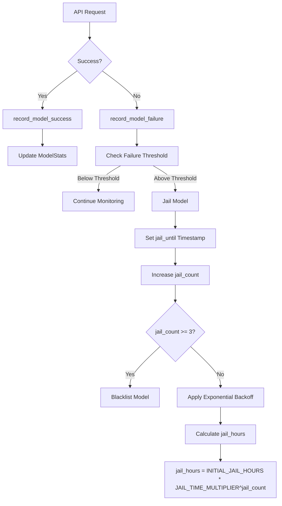
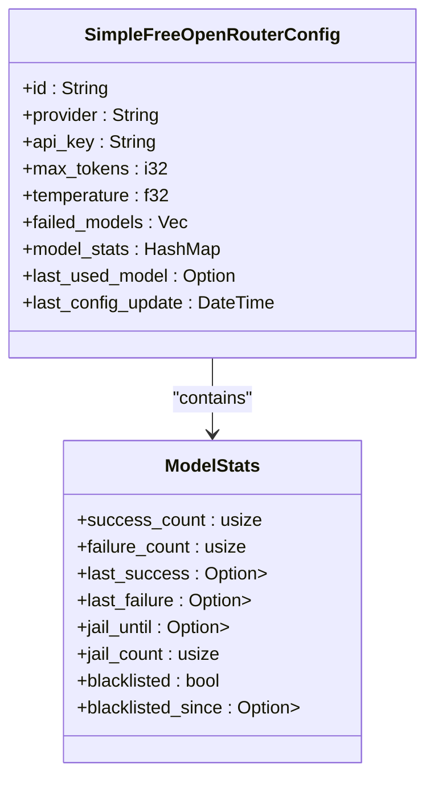
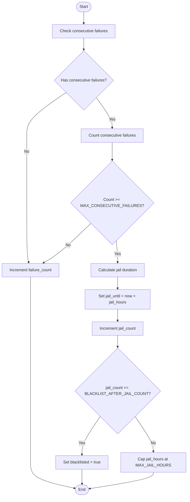
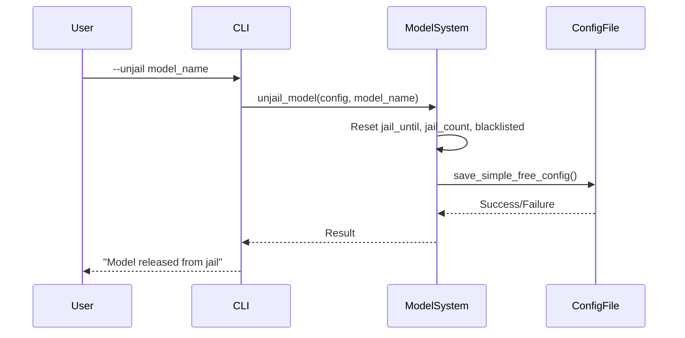

# Model Jail System

<cite>
**Referenced Files in This Document**   
- [main.rs](file://src/main.rs)
</cite>

## Table of Contents
1. [Introduction](#introduction)
2. [Core Components](#core-components)
3. [Architecture Overview](#architecture-overview)
4. [Detailed Component Analysis](#detailed-component-analysis)
5. [Configuration and CLI Integration](#configuration-and-cli-integration)
6. [Error Handling and Recovery Workflows](#error-handling-and-recovery-workflows)
7. [Performance and Reliability Benefits](#performance-and-reliability-benefits)

## Introduction
The Model Jail System is a self-healing mechanism designed to improve reliability in AI-powered commit message generation by automatically disabling underperforming models. This circuit-breaker-like pattern monitors API call success rates through the `ModelStats` struct, tracks failures over time, and temporarily disables (jails) models that consistently fail. The system ensures uninterrupted service by intelligently selecting alternative models while maintaining performance and cost efficiency. It operates within the Simple Free mode of the aicommit tool, which automatically selects from a pool of free OpenRouter models based on availability and historical performance.

## Core Components

The Model Jail System revolves around several key components that work together to monitor, evaluate, and manage model availability. At its core is the `ModelStats` struct, which maintains comprehensive tracking data for each model including success/failure counts, timestamps, jail status, and blacklist information. The system uses this data to make intelligent decisions about model selection and availability. Configuration parameters such as failure thresholds and cooldown periods are defined as constants within the codebase, allowing for fine-tuned control over the jail mechanism's sensitivity and recovery behavior.

**Section sources**
- [main.rs](file://src/main.rs#L442-L466)
- [main.rs](file://src/main.rs#L2936-L2941)

## Architecture Overview

The Model Jail System implements a sophisticated monitoring and management architecture that combines real-time API monitoring with persistent state tracking. When using Simple Free mode, the system first retrieves the available free models from OpenRouter's API or falls back to a predefined list. It then evaluates each model's eligibility based on its current jail status, calculated using the `is_model_available` function. The model selection process prioritizes previously successful models, followed by models from a curated preference list, and finally resorts to size-based sorting when necessary. Failed API calls are recorded through the `record_model_failure` function, which updates the model's statistics and determines whether jail conditions have been met.

**Diagram sources **
- [main.rs](file://src/main.rs#L2950-L3035)

## Detailed Component Analysis

### Model Statistics Tracking
The `ModelStats` struct serves as the central data structure for monitoring model performance. It maintains counters for successful and failed API calls, along with timestamps for the last success and failure events. Crucially, it tracks the `jail_until` timestamp which determines when a jailed model becomes eligible for reuse, and the `jail_count` which increases with each recidivism event. The struct also includes blacklisting functionality with a `blacklisted_since` timestamp, providing a last-resort measure for persistently problematic models.

#### For Object-Oriented Components:

**Diagram sources **
- [main.rs](file://src/main.rs#L442-L466)

### Failure Detection and Jail Logic
The system employs a multi-layered approach to failure detection and model management. The `record_model_failure` function analyzes consecutive failures by comparing the timing of successes and failures, ensuring that only genuine patterns of poor performance trigger jail conditions. When a model accumulates `MAX_CONSECUTIVE_FAILURES` (defined as 3), it is placed in jail with an exponentially increasing duration calculated as `INITIAL_JAIL_HOURS` (24 hours) multiplied by `JAIL_TIME_MULTIPLIER` (2) raised to the power of the model's `jail_count`. This exponential backoff strategy prevents rapid cycling of problematic models while allowing temporary issues to resolve naturally.

#### For Complex Logic Components:

**Diagram sources **
- [main.rs](file://src/main.rs#L2998-L3035)

## Configuration and CLI Integration

The Model Jail System integrates seamlessly with the application's configuration and command-line interface, exposing several key parameters that control its behavior. Users can interact with the system through specific CLI commands that provide visibility into model status and enable manual intervention when needed. The system's configuration constants allow for tuning of critical parameters such as the failure threshold, initial jail duration, and maximum jail time.

### Configuration Options
The following constants define the behavior of the Model Jail System:

| Parameter | Value | Description |
|---------|-------|-------------|
| MAX_CONSECUTIVE_FAILURES | 3 | Number of consecutive failures required to trigger jail conditions |
| INITIAL_JAIL_HOURS | 24 | Base duration (in hours) for the initial jail period |
| JAIL_TIME_MULTIPLIER | 2 | Multiplier applied to jail duration for repeat offenders |
| MAX_JAIL_HOURS | 168 | Maximum jail duration (7 days), preventing indefinite exclusion |
| BLACKLIST_AFTER_JAIL_COUNT | 3 | Number of jail events before permanent blacklisting |
| BLACKLIST_RETRY_DAYS | 7 | Duration after which blacklisted models are reconsidered |

### CLI Commands
The system provides three primary CLI commands for monitoring and managing the jail system:

- **--jail-status**: Displays comprehensive status information for all tracked models, showing their current state (ACTIVE, JAILED, or BLACKLISTED), success/failure counts, and timing information.
- **--unjail=<MODEL>**: Releases a specific model from jail or blacklist, resetting its jail count and making it immediately available for selection.
- **--unjail-all**: Releases all models from jail or blacklist, effectively resetting the entire tracking system.

These commands integrate with the provider configuration system, reading from and writing to the `.aicommit.json` configuration file to persist changes across sessions.

**Section sources**
- [main.rs](file://src/main.rs#L247-L257)
- [main.rs](file://src/main.rs#L2936-L2941)
- [main.rs](file://src/main.rs#L3040-L3140)

## Error Handling and Recovery Workflows

The Model Jail System handles various error scenarios that indicate model underperformance or unavailability. These include network timeouts, invalid API responses, empty or malformed commit messages, and authentication failures. When any of these errors occur during an API call, the system invokes the `record_model_failure` function to update the model's statistics. The system distinguishes between transient network issues and consistent model failures by analyzing the pattern of successes and failures over time.

Recovery workflows operate on multiple levels. For jailed models, automatic release occurs when the current time exceeds the `jail_until` timestamp. The system implements exponential backoff for repeat offenders, with jail durations doubling for each subsequent offense up to the `MAX_JAIL_HOURS` cap of 168 hours (7 days). For blacklisted models, the system implements a retry mechanism after `BLACKLIST_RETRY_DAYS` (7 days), giving models that were previously problematic another chance to demonstrate reliability.

Manual recovery is supported through the `--unjail` and `--unjail-all` commands, which allow administrators to override the automated system when they have external information indicating that a model has been fixed or was incorrectly flagged. These commands modify the model's `jail_until`, `jail_count`, and `blacklisted` fields, then persist the changes to the configuration file.

**Diagram sources **
- [main.rs](file://src/main.rs#L3110-L3140)

## Performance and Reliability Benefits

The Model Jail System delivers significant performance and reliability improvements by implementing a circuit-breaker pattern specifically tailored for AI model selection. By proactively identifying and isolating underperforming models, the system reduces the number of failed API calls and improves overall success rates for commit message generation. This results in faster operations and reduced user frustration from repeated failures.

The system's intelligent model selection algorithm prioritizes historically reliable models while maintaining diversity in the model pool. This approach balances performance optimization with resilience, ensuring that the system doesn't become overly dependent on a single model that might later degrade in quality. The persistence of model statistics across sessions means that the system continuously learns from past experiences, becoming more effective over time.

By automatically handling model failures without requiring user intervention, the system enables truly hands-off operation of the Simple Free mode. Users benefit from consistent performance even as individual models experience temporary outages or quality degradation. The combination of automatic failure detection, progressive penalties for repeat offenders, and manual override capabilities creates a robust self-healing system that maximizes uptime and reliability.

**Section sources**
- [main.rs](file://src/main.rs#L2936-L2941)
- [main.rs](file://src/main.rs#L2950-L3035)