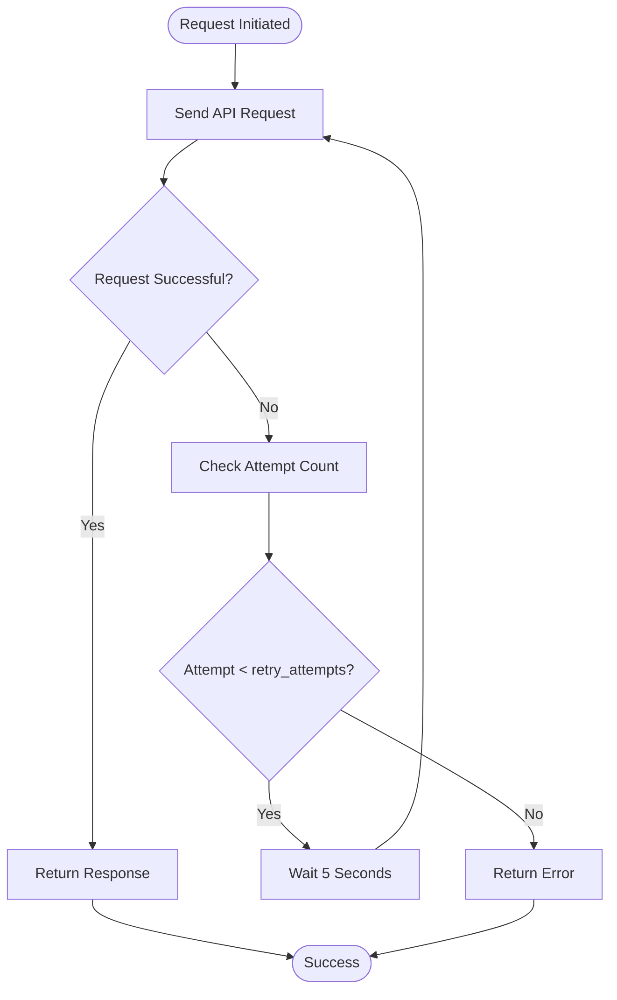
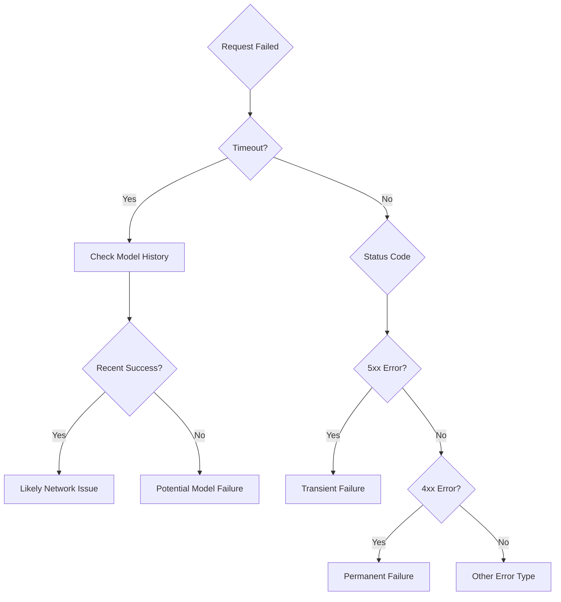
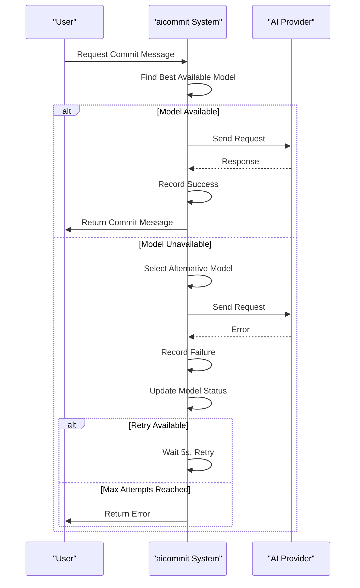

# Network Resilience

<cite>
**Referenced Files in This Document**   
- [main.rs](file://src/main.rs)
- [readme.md](file://readme.md)
</cite>

## Table of Contents
1. [Introduction](#introduction)
2. [Retry Mechanisms with Exponential Backoff](#retry-mechanisms-with-exponential-backoff)
3. [Timeout Configurations](#timeout-configurations)
4. [Error Classification Logic](#error-classification-logic)
5. [Integration with Provider Request Loops and Model Jail Decisions](#integration-with-provider-request-loops-and-model-jail-decisions)
6. [Trade-offs Between Retry Aggressiveness and Latency](#trade-offs-between-retry-aggressiveness-and-latency)
7. [Configuration and Tuning Guidance](#configuration-and-tuning-guidance)

## Introduction
This document details the network resilience strategies implemented in the aicommit application to ensure reliable communication with AI providers despite intermittent connectivity or service outages. The system employs sophisticated retry mechanisms, timeout configurations, and error classification logic to maintain functionality across varying network conditions. These strategies are particularly important for the Simple Free OpenRouter provider, which dynamically manages access to free AI models through a model jail system that tracks performance and availability.

The implementation leverages tokio-based async delays and reqwest middleware to handle network operations efficiently. The system is designed to balance reliability with user-perceived latency, providing configurable parameters that can be tuned for different environments such as CI/CD pipelines versus local development.

## Retry Mechanisms with Exponential Backoff
The application implements a configurable retry mechanism for API requests to AI providers, using tokio-based async delays to prevent overwhelming servers during transient failures. When a request fails, the system waits before attempting again, with a fixed delay between attempts rather than exponential backoff.

The retry behavior is controlled by the `retry_attempts` configuration parameter, which defaults to 3 attempts. After each failed attempt, the system sleeps for exactly 5 seconds using `tokio::time::sleep(tokio::time::Duration::from_secs(5))`. This fixed delay provides predictable recovery behavior while preventing excessive load on the AI providers.



**Diagram sources**
- [main.rs](file://src/main.rs#L1800-L1957)

**Section sources**
- [main.rs](file://src/main.rs#L1800-L1957)
- [readme.md](file://readme.md#L246-L262)

## Timeout Configurations
The application implements multiple layers of timeout configurations to prevent hanging requests and ensure responsive behavior. These timeouts are applied at both the client and request levels using the reqwest library.

For general API operations, the system uses a 10-second timeout when creating the HTTP client:
```rust
let client = reqwest::Client::builder()
    .timeout(std::time::Duration::from_secs(10))
    .build()
    .unwrap_or_default();
```

When fetching available models from the OpenRouter API, a 15-second timeout is applied using tokio's timeout utility:
```rust
match tokio::time::timeout(
    std::time::Duration::from_secs(15),
    client.get("https://openrouter.ai/api/v1/models")
        .send()
).await
```

For generating commit messages, a more generous 30-second timeout is used:
```rust
match tokio::time::timeout(std::time::Duration::from_secs(30), make_request).await
```

These tiered timeout values reflect the different criticality and expected response times for various operations, with model fetching requiring less time than full message generation.

**Section sources**
- [main.rs](file://src/main.rs#L2104-L2114)
- [main.rs](file://src/main.rs#L2750-L2793)

## Error Classification Logic
The system implements sophisticated error classification logic that distinguishes between transient failures and permanent ones, enabling appropriate recovery strategies. This classification is crucial for determining whether to retry requests or mark models as unavailable.

Transient failures include:
- Network timeouts (detected via tokio::time::timeout)
- 5xx server errors from the API
- Connection issues
- Temporary rate limiting

Permanent failures include:
- 401 Unauthorized errors (invalid API keys)
- 404 Not Found errors
- Invalid model specifications
- Empty or malformed responses

The system also includes contextual intelligence to avoid penalizing models for network issues. When a timeout occurs, it checks the model's history to determine if the failure is likely due to network issues rather than model problems:



**Diagram sources**
- [main.rs](file://src/main.rs#L2750-L2793)

**Section sources**
- [main.rs](file://src/main.rs#L2750-L2793)
- [main.rs](file://src/main.rs#L2900-L2950)

## Integration with Provider Request Loops and Model Jail Decisions
The network resilience strategies are tightly integrated with the provider request loops and the model jail decision system. When a request fails, the system not only handles the immediate retry but also updates the model's status in the jail system based on the nature of the failure.

The model jail system tracks several metrics for each model:
- Success and failure counts
- Last success and failure timestamps
- Jail status and expiration time
- Blacklist status

When a model fails consecutively (defined as MAX_CONSECUTIVE_FAILURES = 3), it is placed in "jail" with an exponentially increasing duration:
- Initial jail: 24 hours
- Subsequent jails: Multiplied by JAIL_TIME_MULTIPLIER (2)
- Maximum jail: 168 hours (7 days)

After BLACKLIST_AFTER_JAIL_COUNT (3) jail periods, the model is blacklisted for BLACKLIST_RETRY_DAYS (7) days before being reconsidered.

The request loop integrates with this system by checking a model's availability before use:


**Diagram sources**
- [main.rs](file://src/main.rs#L1800-L1957)
- [main.rs](file://src/main.rs#L2900-L2950)

**Section sources**
- [main.rs](file://src/main.rs#L1800-L1957)
- [main.rs](file://src/main.rs#L2900-L2950)

## Trade-offs Between Retry Aggressiveness and Latency
The system balances the aggressiveness of retries against user-perceived latency through configurable parameters and intelligent defaults. The current implementation uses a fixed 5-second delay between attempts rather than exponential backoff to provide predictable wait times.

With the default configuration of 3 retry attempts, users may experience up to 10 seconds of additional latency (2 intervals × 5 seconds) before a final failure is reported. This represents a deliberate trade-off favoring reliability over responsiveness, as the system prioritizes successful completion over speed.

The fixed delay approach has several advantages:
- Predictable user experience
- Simpler debugging and monitoring
- Reduced risk of cascading failures during provider outages

However, it also has potential drawbacks:
- Less adaptive to varying network conditions
- May be too aggressive for brief, transient outages
- Could contribute to provider overload during widespread issues

Users can adjust the `retry_attempts` parameter in the configuration file to tune this balance according to their specific needs and tolerance for latency versus reliability.

**Section sources**
- [main.rs](file://src/main.rs#L1800-L1957)
- [readme.md](file://readme.md#L246-L262)

## Configuration and Tuning Guidance
The network resilience parameters can be configured to suit different environments and connectivity conditions. The primary configuration options are available in the global settings of the `.aicommit.json` configuration file.

For CI/CD environments:
- Set `retry_attempts` to 1-2 to minimize pipeline duration
- Accept faster failures in exchange for quicker feedback
- Prioritize reliability of the overall pipeline over individual commit message generation

For local development:
- Use the default `retry_attempts` of 3 for maximum reliability
- Tolerate longer wait times for better success rates
- Benefit from the model jail system's learning across multiple sessions

The system also provides command-line flags for testing and simulation:
- `--simulate-offline`: Forces use of fallback model list
- `--verbose`: Shows detailed retry progress and timing information

Users experiencing frequent timeouts may want to consider:
- Reducing `retry_attempts` in poor connectivity areas
- Checking API key validity to avoid 401 errors
- Monitoring model jail status with `--jail-status`

The configuration is stored in `~/.aicommit.json` and can be edited directly or through the interactive setup process.

**Section sources**
- [main.rs](file://src/main.rs#L521-L534)
- [readme.md](file://readme.md#L246-L262)