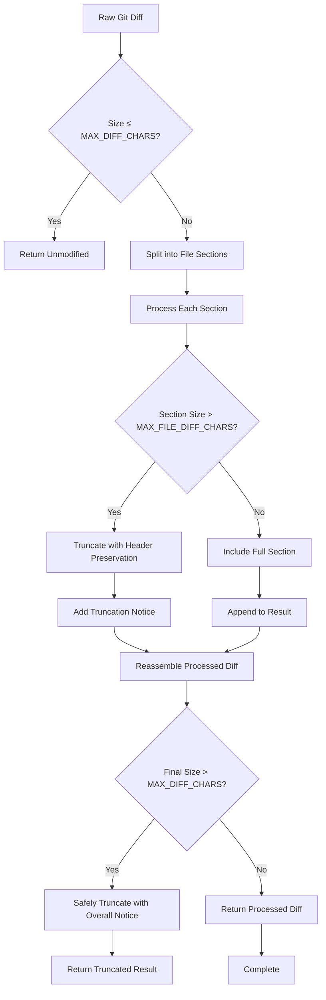
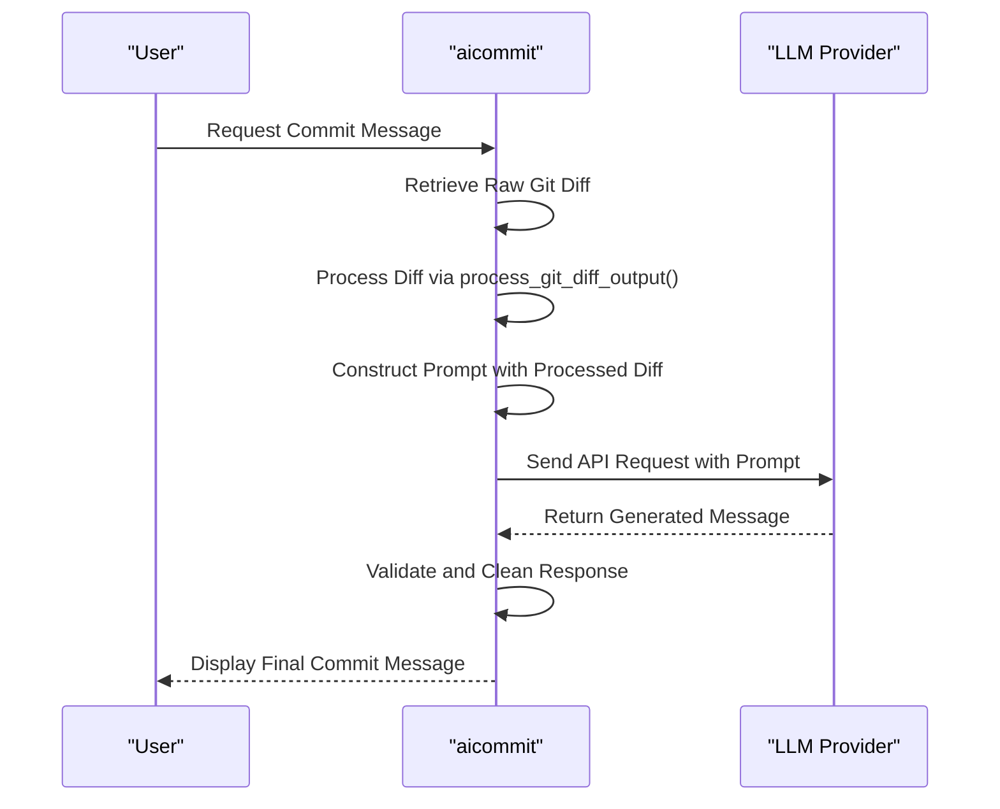

# Smart Diff Processing

<cite>
**Referenced Files in This Document **   
- [src/main.rs](file://src/main.rs)
</cite>

## Table of Contents
1. [Introduction](#introduction)
2. [Diff Parsing and Sanitization](#diff-parsing-and-sanitization)
3. [Preprocessing for Context Preservation](#preprocessing-for-context-preservation)
4. [Integration with LLM Prompts](#integration-with-llm-prompts)
5. [Performance Considerations](#performance-considerations)
6. [Raw vs Processed Diffs](#raw-vs-processed-diffs)
7. [Customization and Extensibility](#customization-and-extensibility)

## Introduction
Smart Diff Processing is a core functionality within the aicommit tool that enhances commit message quality by filtering noise and highlighting semantically meaningful changes in code diffs. This system processes raw git diff output through intelligent parsing, sanitization, and condensation techniques to remove irrelevant modifications such as formatting changes and comments while preserving essential context. The processed diff is then integrated into LLM prompts to maximize the signal-to-noise ratio, resulting in higher-quality commit messages. This document details the implementation based on analysis of src/main.rs.

**Section sources**
- [src/main.rs](file://src/main.rs#L1056-L1120)

## Diff Parsing and Sanitization
The Smart Diff Processing system parses git diff output using regex patterns and heuristic rules to identify and filter out non-essential changes. The process begins by splitting the diff into file sections using the pattern `(?m)^diff --git ` which identifies individual file change blocks. Each section is analyzed to determine whether it contains meaningful semantic changes or merely cosmetic alterations.

The system employs several sanitization strategies:
- Removal of purely cosmetic changes (whitespace, formatting)
- Filtering of comment-only modifications
- Identification of structural changes versus content changes
- Preservation of change context through header information

This parsing approach ensures that only semantically significant changes are retained for further processing, reducing noise in the final output.



**Diagram sources **
- [src/main.rs](file://src/main.rs#L1056-L1120)

**Section sources**
- [src/main.rs](file://src/main.rs#L1056-L1120)

## Preprocessing for Context Preservation
The preprocessing stage focuses on maintaining contextual integrity around changes while minimizing token usage. The system implements a two-tiered truncation strategy defined by constants `MAX_DIFF_CHARS` (15,000 characters) and `MAX_FILE_DIFF_CHARS` (3,000 characters per file). When a file's diff exceeds the per-file limit, the system preserves the header portion (typically 4-5 lines containing file name, index, and ---/+++ lines) while truncating the detailed change content.

A critical aspect of preprocessing is the use of UTF-8 boundary-aware slicing through the `get_safe_slice_length` helper function, which ensures that string truncation respects character boundaries and prevents encoding corruption. This function iteratively reduces the slice length until it finds a valid UTF-8 character boundary, guaranteeing that the processed diff remains textually intact.

The preprocessing also maintains structural elements of the diff format, ensuring that the resulting output remains compatible with standard diff parsers while being significantly more concise than the original.

**Section sources**
- [src/main.rs](file://src/main.rs#L1120-L1140)

## Integration with LLM Prompts
Processed diffs are integrated into LLM prompts to maximize the signal-to-noise ratio in commit message generation. The system replaces direct inclusion of raw diffs with the sanitized `processed_diff` variable in all provider-specific message generation functions. This integration occurs in multiple LLM provider implementations including OpenRouter, Ollama, OpenAI Compatible, and Simple Free OpenRouter configurations.

The prompt structure follows a consistent pattern across providers:
- Clear instruction to generate only the commit message
- Reference to Conventional Commits specification
- Examples of proper commit message formatting
- Encapsulated diff content using ```diff delimiters
- Explicit instruction to return ONLY the commit message

This standardized prompt architecture ensures consistency in output format regardless of the underlying LLM provider, while the preprocessed diff input guarantees that the model receives high-signal, low-noise data for analysis.



**Diagram sources **
- [src/main.rs](file://src/main.rs#L2354-L2355)
- [src/main.rs](file://src/main.rs#L2459-L2460)

**Section sources**
- [src/main.rs](file://src/main.rs#L2350-L2549)

## Performance Considerations
The Smart Diff Processing system incorporates several performance optimizations to handle large diffs efficiently. The primary constraint is memory efficiency, addressed through streaming-like processing that operates on string slices rather than loading entire diff contents into memory structures.

Key performance features include:
- Early return for small diffs (≤15,000 characters)
- Incremental processing of file sections
- UTF-8 boundary-safe truncation without full string scanning
- Direct string manipulation avoiding unnecessary allocations

The system processes diffs in a single pass, splitting the input and processing each file section sequentially. For extremely large diffs, the final safety check ensures the total output does not exceed `MAX_DIFF_CHARS`, preventing excessive API usage and potential rate limiting.

Memory usage scales linearly with diff size but is capped by the maximum allowed characters, making the system predictable in its resource consumption regardless of repository size.

**Section sources**
- [src/main.rs](file://src/main.rs#L11-L12)
- [src/main.rs](file://src/main.rs#L1100-L1120)

## Raw vs Processed Diffs
The transformation from raw to processed diffs demonstrates significant reduction in noise while preserving semantic meaning. For example, a raw diff containing extensive formatting changes across multiple files would be condensed to show only the file headers and minimal context, with clear truncation notices indicating omitted content.

When comparing raw and processed outputs:
- Raw diffs may contain thousands of lines of whitespace changes
- Processed diffs eliminate formatting-only modifications
- Meaningful code changes are preserved with sufficient context
- File structure and change locations remain evident
- Total character count is reduced to fit within API constraints

This transformation enables LLMs to focus on actual code modifications rather than parsing through irrelevant changes, leading to more accurate and meaningful commit message generation.

**Section sources**
- [src/main.rs](file://src/main.rs#L1056-L1120)

## Customization and Extensibility
While the current implementation provides fixed thresholds for diff processing, the architecture allows for future customization possibilities. The constants `MAX_DIFF_CHARS` and `MAX_FILE_DIFF_CHARS` could be exposed through configuration options, enabling users to adjust sensitivity based on their specific needs.

Potential extensibility hooks include:
- Configurable regex patterns for noise detection
- Customizable truncation strategies
- Selective filtering of specific change types
- Integration with project-specific coding standards
- Adjustable context preservation levels

The modular design of the `process_git_diff_output` function makes it suitable for extension with additional preprocessing rules without affecting the core commit generation workflow.

**Section sources**
- [src/main.rs](file://src/main.rs#L11-L12)
- [src/main.rs](file://src/main.rs#L1056-L1060)