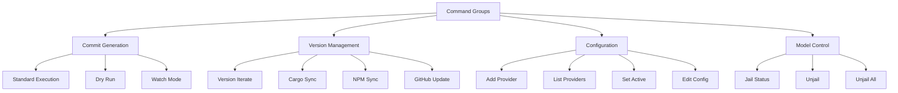
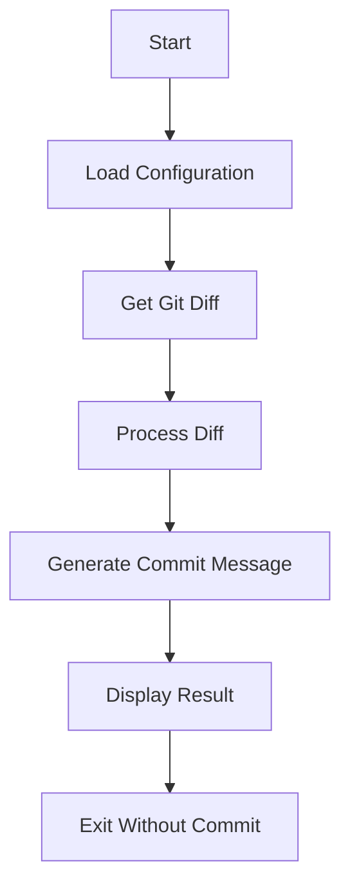
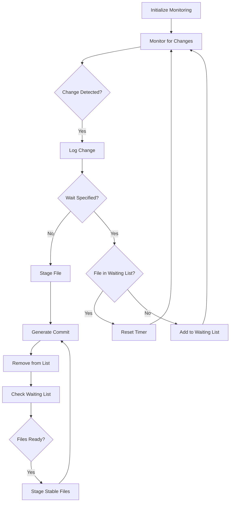
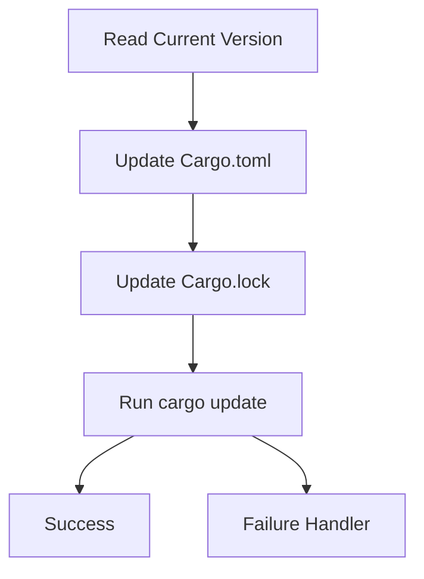
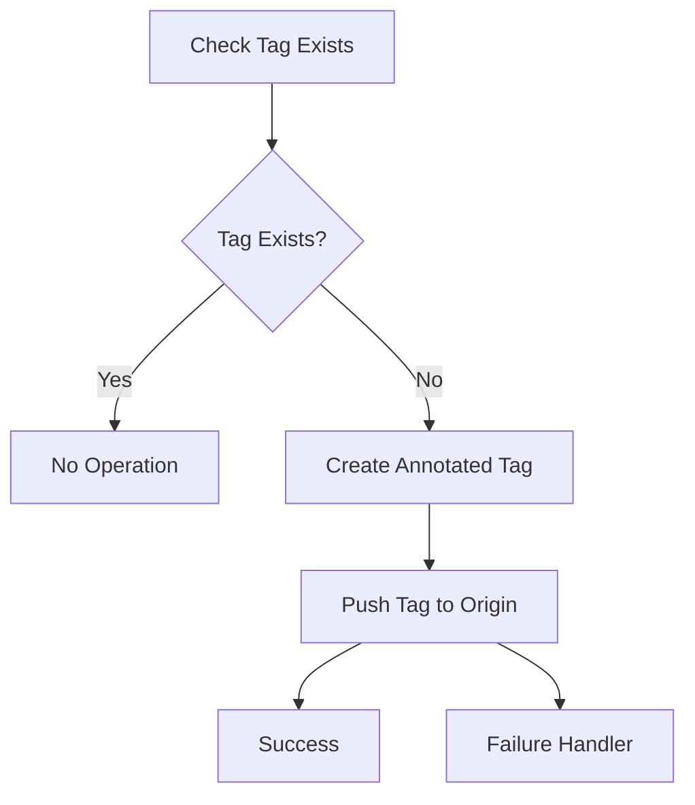
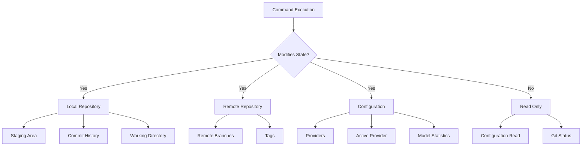
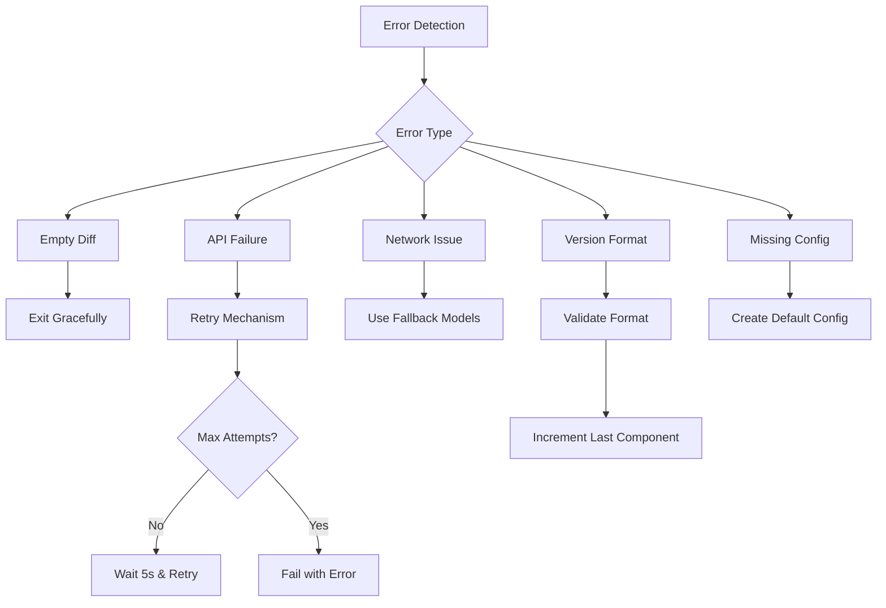
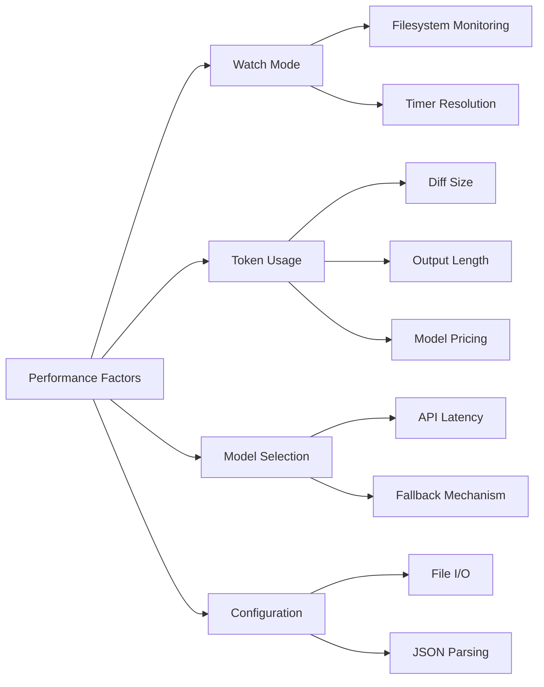

# Command Reference

<cite>
**Referenced Files in This Document**   
- [main.rs](file://src/main.rs)
- [Cargo.toml](file://Cargo.toml)
- [readme.md](file://readme.md)
</cite>

## Table of Contents
1. [Introduction](#introduction)
2. [Command Groups](#command-groups)
3. [Commit Generation Modes](#commit-generation-modes)
4. [Version Management Commands](#version-management-commands)
5. [Configuration Utilities](#configuration-utilities)
6. [Model Control Commands](#model-control-commands)
7. [Behavioral Side Effects](#behavioral-side-effects)
8. [Edge Cases and Error Handling](#edge-cases-and-error-handling)
9. [Performance Considerations](#performance-considerations)

## Introduction

aicommit is a CLI tool that generates concise and descriptive git commit messages using Large Language Models (LLMs). The tool integrates with various LLM providers through the OpenRouter API, supports local models via Ollama, and works with any OpenAI-compatible endpoint. Built with Rust and clap for argument parsing, aicommit provides a comprehensive set of commands for commit generation, version management, configuration, and model control.

The core functionality revolves around analyzing git diffs and generating appropriate commit messages based on the changes detected. Commands are organized into functional groups that address different aspects of the development workflow, from basic commit operations to advanced version synchronization and provider management.

This reference documents all CLI commands exposed by aicommit as parsed by clap in src/main.rs, including their syntax, parameters, return values, and behavioral side effects. It also explains how commands interact with configuration state and Git operations, addresses edge cases, and provides performance considerations for different usage patterns.

**Section sources**
- [main.rs](file://src/main.rs#L0-L3192)

## Command Groups

aicommit organizes its functionality into four primary command groups:

1. **Commit Generation Modes**: Commands that generate commit messages using AI or standard execution
2. **Version Management**: Commands that handle version file updates across different package formats
3. **Configuration Utilities**: Commands for managing providers and editing configuration
4. **Model Control**: Commands for managing model selection, jails, and blacklists

Each group serves a distinct purpose in the development workflow, allowing users to customize their experience based on their specific needs. The commands within each group can be combined to create powerful workflows that automate common development tasks.



**Diagram sources**
- [main.rs](file://src/main.rs#L0-L3192)

## Commit Generation Modes

### Standard Execution

The standard execution mode generates a commit message using the active provider and creates a git commit with that message.

[SPEC SYMBOL](file://src/main.rs#L100-L105)

**Syntax**:
```bash
aicommit [--add] [--pull] [--push] [--verbose]
```

**Parameters**:
- `--add`: Automatically stage all changes before committing
- `--pull`: Pull changes from remote before committing
- `--push`: Push changes to remote after committing
- `--verbose`: Display detailed information about the process

**Return Values**:
- Success: Creates a git commit with AI-generated message
- Failure: Exits with error code if message generation fails

**Behavioral Side Effects**:
- Modifies git repository state by creating commits
- May push/pull from remote repositories
- Updates configuration state when using version management flags

When no flags are provided, aicommit operates on already-staged changes only. With `--add`, it stages all modified files before committing. The `--pull` and `--push` flags enable automatic synchronization with the remote repository, including automatic upstream branch setup for new branches.

**Section sources**
- [main.rs](file://src/main.rs#L100-L105)
- [readme.md](file://readme.md#L288-L300)

### Dry Run Mode

The dry run mode generates a commit message without creating an actual commit, allowing users to review the AI-generated message before applying it.

[SPEC SYMBOL](file://src/main.rs#L125-L130)

**Syntax**:
```bash
aicommit --dry-run [--verbose]
```

**Parameters**:
- `--dry-run`: Generate message without creating commit
- `--verbose`: Display detailed information about the process

**Return Values**:
- Success: Displays generated commit message
- Failure: Exits with error code if message generation fails

**Behavioral Side Effects**:
- No changes to git repository state
- Does not modify files or create commits
- Provides preview of what would be committed

This mode is particularly useful for reviewing AI-generated messages before they become part of the permanent history. It allows developers to ensure the message accurately reflects the changes and meets team standards.



**Diagram sources**
- [main.rs](file://src/main.rs#L125-L130)
- [readme.md](file://readme.md#L650-L660)

### Watch Mode

The watch mode monitors the filesystem for changes and automatically commits them according to specified rules.

[SPEC SYMBOL](file://src/main.rs#L135-L140)

**Syntax**:
```bash
aicommit --watch [--wait-for-edit <duration>] [--add] [--push] [--verbose]
```

**Parameters**:
- `--watch`: Enable continuous file monitoring
- `--wait-for-edit <duration>`: Wait specified time after last edit before committing (e.g., "30s", "1m")
- `--add`: Stage changes before committing
- `--push`: Push changes after committing
- `--verbose`: Display detailed information

**Return Values**:
- Success: Continuously monitors and commits changes
- Failure: Exits with error code if monitoring fails

**Behavioral Side Effects**:
- Continuously monitors filesystem for changes
- Automatically stages and commits changes
- May push to remote repository
- Maintains waiting list of files with timer reset logic

The `--wait-for-edit` parameter accepts time units in seconds (s), minutes (m), or hours (h). When specified, aicommit implements a timer reset mechanism: if a file is modified while already in the waiting list, its timer is reset, preventing premature commits during active editing sessions.



**Diagram sources**
- [main.rs](file://src/main.rs#L135-L140)
- [readme.md](file://readme.md#L661-L700)

## Version Management Commands

### Version Iteration

Automatically increments the version number in a specified version file.

[SPEC SYMBOL](file://src/main.rs#L145-L150)

**Syntax**:
```bash
aicommit --version-file <path> --version-iterate
```

**Parameters**:
- `--version-file <path>`: Path to the version file (typically containing just a version string like "0.0.37")
- `--version-iterate`: Increment the version number

**Return Values**:
- Success: Updates version file with incremented version
- Failure: Exits with error if file cannot be read/written or version format is invalid

**Behavioral Side Effects**:
- Modifies the specified version file
- Increments the last numeric component of the version string
- Can be combined with other version management commands

The version incrementation follows semantic versioning principles, increasing the patch version (e.g., "0.0.37" becomes "0.0.38"). The function handles basic validation of version format but assumes standard numeric components separated by dots.

**Section sources**
- [main.rs](file://src/main.rs#L145-L150)
- [readme.md](file://readme.md#L301-L310)

### Cargo.toml Synchronization

Synchronizes the version in Cargo.toml with the current version.

[SPEC SYMBOL](file://src/main.rs#L155-L160)

**Syntax**:
```bash
aicommit --version-file <path> --version-iterate --version-cargo
```

**Parameters**:
- `--version-cargo`: Update version in Cargo.toml and Cargo.lock

**Return Values**:
- Success: Updates version in Cargo.toml and Cargo.lock
- Failure: Exits with error if files cannot be read/written or cargo update fails

**Behavioral Side Effects**:
- Modifies Cargo.toml (package version)
- Modifies Cargo.lock (package version)
- Executes `cargo update` command to ensure lockfile consistency
- Requires cargo to be available in PATH

This command updates both the manifest file (Cargo.toml) and the lockfile (Cargo.lock) to maintain consistency. After modifying Cargo.lock directly, it runs `cargo update --package aicommit` to ensure the lockfile remains valid and properly formatted.



**Diagram sources**
- [main.rs](file://src/main.rs#L155-L160)

### package.json Synchronization

Synchronizes the version in package.json with the current version.

[SPEC SYMBOL](file://src/main.rs#L165-L170)

**Syntax**:
```bash
aicommit --version-file <path> --version-iterate --version-npm
```

**Parameters**:
- `--version-npm`: Update version in package.json

**Return Values**:
- Success: Updates version in package.json
- Failure: Exits with error if file cannot be read/written or JSON parsing fails

**Behavioral Side Effects**:
- Modifies package.json file
- Preserves existing JSON structure and formatting
- Updates only the "version" field

The implementation uses serde_json to parse and modify the package.json file, ensuring that the updated file maintains proper JSON formatting while only changing the version field. This preserves comments and formatting in the original file as much as possible.

**Section sources**
- [main.rs](file://src/main.rs#L165-L170)

### GitHub Version Update

Creates a GitHub release tag for the current version.

[SPEC SYMBOL](file://src/main.rs#L175-L180)

**Syntax**:
```bash
aicommit --version-file <path> --version-iterate --version-github
```

**Parameters**:
- `--version-github`: Create GitHub release tag

**Return Values**:
- Success: Creates git tag and pushes to origin
- No Operation: If tag already exists
- Failure: Exits with error if git operations fail

**Behavioral Side Effects**:
- Creates annotated git tag (vX.X.X format)
- Pushes tag to origin remote
- Checks for existing tags to avoid duplicates
- Requires git and proper remote configuration

The command first checks if a tag for the current version already exists. If not, it creates an annotated tag with a release message and pushes it to the origin remote. This enables GitHub Releases to be created automatically when combined with CI/CD workflows.



**Diagram sources**
- [main.rs](file://src/main.rs#L175-L180)

## Configuration Utilities

### Add Provider

Interactively adds a new provider configuration to the system.

[SPEC SYMBOL](file://src/main.rs#L80-L85)

**Syntax**:
```bash
aicommit --add-provider [--add-openrouter] [--add-ollama] [--add-openai-compatible] [--add-simple-free]
```

**Parameters**:
- `--add-provider`: Initiate provider addition process
- `--add-openrouter`: Non-interactive OpenRouter setup
- `--add-ollama`: Non-interactive Ollama setup
- `--add-openai-compatible`: Non-interactive OpenAI-compatible setup
- `--add-simple-free`: Non-interactive Simple Free OpenRouter setup

**Return Values**:
- Success: Adds provider configuration to ~/.aicommit.json
- Failure: Exits with error if configuration cannot be saved

**Behavioral Side Effects**:
- Modifies configuration file (~/.aicommit.json)
- Adds new provider entry to providers array
- Sets new provider as active if no active provider exists
- Creates configuration file if it doesn't exist

In interactive mode, the command presents a menu of provider options. In non-interactive mode, it uses the specified flags and corresponding parameters (like API keys and URLs) to configure the provider without user input.

**Section sources**
- [main.rs](file://src/main.rs#L80-L85)
- [readme.md](file://readme.md#L311-L330)

### List Providers

Displays all configured providers.

[SPEC SYMBOL](file://src/main.rs#L115-L120)

**Syntax**:
```bash
aicommit --list
```

**Parameters**: None

**Return Values**:
- Success: Prints list of configured providers with IDs and types
- Failure: Exits with error if configuration cannot be loaded

**Behavioral Side Effects**:
- Reads configuration file
- Outputs provider information to stdout
- No modification of system state

The output includes each provider's ID, type, and relevant configuration details (with sensitive information like API keys partially obscured).

**Section sources**
- [main.rs](file://src/main.rs#L115-L120)

### Set Active Provider

Changes the active provider to the specified one.

[SPEC SYMBOL](file://src/main.rs#L120-L125)

**Syntax**:
```bash
aicommit --set <provider-id>
```

**Parameters**:
- `--set <provider-id>`: ID of the provider to make active

**Return Values**:
- Success: Updates active_provider in configuration
- Failure: Exits with error if provider ID not found or configuration cannot be saved

**Behavioral Side Effects**:
- Modifies configuration file
- Updates active_provider field
- Validates that provider ID exists in configuration

The command ensures that the specified provider ID matches one of the configured providers before updating the active provider setting.

**Section sources**
- [main.rs](file://src/main.rs#L120-L125)

### Edit Configuration

Opens the configuration file for direct editing.

[SPEC SYMBOL](file://src/main.rs#L130-L135)

**Syntax**:
```bash
aicommit --config
```

**Parameters**: None

**Return Values**:
- Success: Opens editor for configuration file
- Failure: Exits with error if configuration file cannot be created or opened

**Behavioral Side Effects**:
- Ensures configuration file exists
- Opens file in default editor
- May create configuration directory and file if they don't exist

The command uses the system's default text editor to open ~/.aicommit.json for manual editing, providing advanced users direct access to configuration options not exposed through command-line flags.

**Section sources**
- [main.rs](file://src/main.rs#L130-L135)

## Model Control Commands

### Jail Status

Displays the status of all models in the jail/blacklist system.

[SPEC SYMBOL](file://src/main.rs#L185-L190)

**Syntax**:
```bash
aicommit --jail-status
```

**Parameters**: None

**Return Values**:
- Success: Prints status of all models including success/failure counts and jail status
- Failure: Exits with error if configuration cannot be loaded

**Behavioral Side Effects**:
- Reads configuration file
- Outputs model statistics to stdout
- No modification of system state

This command provides visibility into the model management system, showing which models are active, jailed, or blacklisted, along with their performance history.

**Section sources**
- [main.rs](file://src/main.rs#L185-L190)

### Unjail

Releases a specific model from jail or blacklist.

[SPEC SYMBOL](file://src/main.rs#L190-L195)

**Syntax**:
```bash
aicommit --unjail <model-id>
```

**Parameters**:
- `--unjail <model-id>`: ID/name of the model to release

**Return Values**:
- Success: Updates model status in configuration
- Failure: Exits with error if model not found or configuration cannot be saved

**Behavioral Side Effects**:
- Modifies configuration file
- Resets jail status for specified model
- Clears blacklist status if applicable

Useful when a model was temporarily restricted due to failures but is now expected to work correctly.

**Section sources**
- [main.rs](file://src/main.rs#L190-L195)

### Unjail All

Releases all models from jail and blacklist status.

[SPEC SYMBOL](file://src/main.rs#L195-L200)

**Syntax**:
```bash
aicommit --unjail-all
```

**Parameters**: None

**Return Values**:
- Success: Resets jail and blacklist status for all models
- Failure: Exits with error if configuration cannot be saved

**Behavioral Side Effects**:
- Modifies configuration file
- Resets jail_until timestamps
- Clears jail_count counters
- Removes blacklisted status

This command performs a complete reset of the model management system, returning all models to active status regardless of their previous performance history.

**Section sources**
- [main.rs](file://src/main.rs#L195-L200)

## Behavioral Side Effects

aicommit commands have several important behavioral side effects that affect both the local repository and remote systems:

### Automatic Staging

When using the `--add` flag, aicommit automatically stages all changes in the repository using `git add .`. This bypasses the need for manual staging and ensures that all modified files are included in the commit.

[SPEC SYMBOL](file://src/main.rs#L90-L95)

### Automatic Pushing

The `--push` flag triggers automatic pushing of commits to the remote repository. When combined with `--add`, this creates a complete "stage-commit-push" workflow in a single command.

[SPEC SYMBOL](file://src/main.rs#L140-L145)

### Upstream Branch Setup

Both `--pull` and `--push` flags include automatic upstream branch configuration. If the current branch has no upstream set, aicommit automatically runs `git push --set-upstream origin <branch>` when needed, eliminating the need for manual upstream configuration.

[SPEC SYMBOL](file://src/main.rs#L135-L140)

### Configuration File Management

Several commands modify the configuration file (~/.aicommit.json), either by adding new providers, changing the active provider, or updating model statistics. The configuration file is automatically created if it doesn't exist.

[SPEC SYMBOL](file://src/main.rs#L250-L255)

### .gitignore Management

By default, aicommit checks for the existence of a .gitignore file in the current directory. If none exists, it creates one using a default template stored at ~/.default_gitignore, which is also created if it doesn't exist.

[SPEC SYMBOL](file://src/main.rs#L255-L260)



**Diagram sources**
- [main.rs](file://src/main.rs#L90-L145)
- [main.rs](file://src/main.rs#L250-L260)

## Edge Cases and Error Handling

### Empty Diffs

When there are no changes to commit, aicommit gracefully handles this case by exiting with a message indicating no changes were found, rather than attempting to generate a commit message.

[SPEC SYMBOL](file://src/main.rs#L500-L510)

### Failed API Calls

The tool implements a robust retry mechanism for failed API calls:

- Configurable number of retry attempts (default: 3)
- 5-second delay between attempts
- Informative messages about retry progress
- Different handling for network errors vs. model errors

For Simple Free OpenRouter mode, additional failover mechanisms are implemented:

- Three-tier model status (Active, Jailed, Blacklisted)
- Counter-based system (3 consecutive failures trigger jail)
- Time-based jail (24 hours initially, increasing for repeat offenses)
- Weekly retry of blacklisted models

[SPEC SYMBOL](file://src/main.rs#L800-L850)

### Network Connectivity Issues

When network connectivity to OpenRouter is unavailable, the Simple Free mode falls back to a predefined list of free models, allowing the tool to continue functioning in offline or limited-connectivity scenarios.

[SPEC SYMBOL](file://src/main.rs#L850-L860)

### Version Format Errors

The version incrementation function includes basic validation but may fail with non-standard version formats. It expects numeric components separated by dots and will error on invalid formats.

[SPEC SYMBOL](file://src/main.rs#L300-L310)

### Missing Configuration

If the configuration file does not exist, aicommit creates a default configuration with an empty providers array and no active provider. This allows the tool to start fresh without failing.

[SPEC SYMBOL](file://src/main.rs#L240-L245)



**Diagram sources**
- [main.rs](file://src/main.rs#L300-L310)
- [main.rs](file://src/main.rs#L500-L510)
- [main.rs](file://src/main.rs#L800-L860)

## Performance Considerations

### Watch Mode Latency

In watch mode, the tool continuously monitors the filesystem for changes. The performance impact depends on:

- Number of files in the repository
- Frequency of changes
- System I/O performance

The `--wait-for-edit` feature helps reduce unnecessary commits during active editing sessions but introduces a delay between the last edit and the commit.

[SPEC SYMBOL](file://src/main.rs#L1000-L1050)

### Token Cost Implications

When using paid models through OpenRouter or other providers, token costs can accumulate quickly:

- Input tokens: Based on diff size (capped at 15,000 characters globally, 3,000 per file)
- Output tokens: Based on message length (capped at 200 by default)

Large diffs result in higher costs, so the tool implements smart diff processing to truncate large files while preserving context.

[SPEC SYMBOL](file://src/main.rs#L70-L75)

### Model Selection Overhead

The Simple Free OpenRouter mode queries the OpenRouter API to discover available free models on each execution. This adds network latency but ensures access to the most current free models.

To mitigate this:
- Results are not cached between executions
- A fallback list of predefined free models is maintained for offline use
- The internal ranking of preferred models prioritizes high-performance options

[SPEC SYMBOL](file://src/main.rs#L50-L60)

### Configuration Loading

The configuration file is loaded on every command execution, which involves:
- File I/O to read ~/.aicommit.json
- JSON parsing
- Memory allocation for configuration structures

For frequently used commands, this overhead is minimal but noticeable in automated scripts.

[SPEC SYMBOL](file://src/main.rs#L240-L245)



**Diagram sources**
- [main.rs](file://src/main.rs#L50-L75)
- [main.rs](file://src/main.rs#L240-L245)
- [main.rs](file://src/main.rs#L1000-L1050)