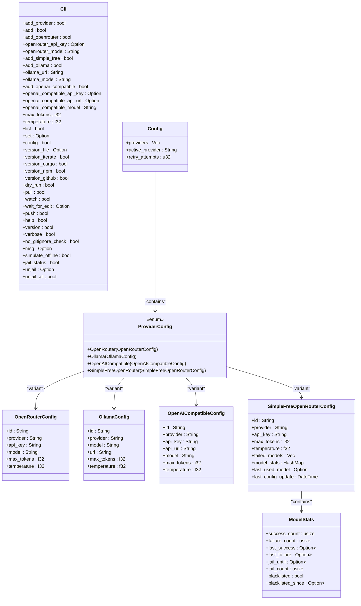
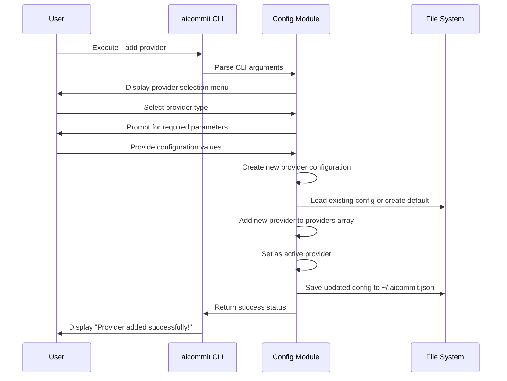

# Configuration Commands

<cite>
**Referenced Files in This Document**   
- [main.rs](file://src/main.rs)
- [Cargo.toml](file://Cargo.toml)
- [readme.md](file://readme.md)
</cite>

## Table of Contents
1. [Introduction](#introduction)
2. [Configuration File Structure](#configuration-file-structure)
3. [CLI Command Implementation](#cli-command-implementation)
4. [Provider Management Commands](#provider-management-commands)
5. [Configuration Validation and Security](#configuration-validation-and-security)
6. [Common Issues and Troubleshooting](#common-issues-and-troubleshooting)
7. [Backup, Migration, and Environment Setup](#backup-migration-and-environment-setup)

## Introduction

The aicommit CLI tool provides comprehensive configuration management through various commands that interact with the JSON configuration file located at `~/.aicommit.json`. These commands enable users to set up AI providers, manage credentials, and modify global settings for generating git commit messages using Large Language Models (LLMs). The implementation leverages serde for serialization/deserialization and clap for argument parsing, ensuring robust and type-safe configuration handling.

The configuration system supports multiple LLM providers including OpenRouter, Ollama, and OpenAI-compatible endpoints, allowing flexibility in how users integrate AI-powered commit message generation into their development workflow. Through commands like `--add-provider`, `--list-providers`, `--configure`, and `--reset-config`, users can easily manage their provider configurations and switch between different AI services based on their needs.

This documentation details how these configuration-related CLI commands work, how they interact with the JSON configuration file, and provides guidance on best practices for setup, security, and troubleshooting common issues.

**Section sources**
- [main.rs](file://src/main.rs#L0-L3192)
- [readme.md](file://readme.md#L0-L734)

## Configuration File Structure

The configuration file `~/.aicommit.json` stores all provider configurations and global settings in a structured JSON format. The file contains three main components: providers array, active_provider identifier, and retry_attempts setting.

```json
{
  "providers": [...],
  "active_provider": "provider-id",
  "retry_attempts": 3
}
```

The `providers` array contains objects for each configured provider, with each provider having a unique ID, provider type, and specific configuration parameters. Different provider types have distinct configuration structures:

- **OpenRouter**: Includes API key, model name, max_tokens, and temperature
- **Ollama**: Contains URL, model name, max_tokens, and temperature
- **OpenAI Compatible**: Stores API key, API URL, model name, max_tokens, and temperature
- **Simple Free OpenRouter**: Features API key, max_tokens, temperature, and advanced model management data including failed_models list and model_stats tracking

The `active_provider` field stores the UUID of the currently selected provider, determining which service is used for generating commit messages. The `retry_attempts` parameter specifies how many times the system should attempt to generate a commit message if the initial request fails, with a default value of 3 attempts and 5-second intervals between retries.

For Simple Free OpenRouter configuration, additional fields track model performance over time:
- `failed_models`: Array of models that have recently failed
- `model_stats`: HashMap storing success/failure counts and timestamps for each model
- `last_used_model`: Tracks the most recently successful model
- `last_config_update`: Timestamp of the last configuration update

These fields enable the sophisticated failover mechanism that automatically switches between free models based on reliability and availability.

**Section sources**
- [main.rs](file://src/main.rs#L800-L1430)
- [readme.md](file://readme.md#L238-L287)

## CLI Command Implementation

The CLI command implementation in src/main.rs uses clap for argument parsing and serde for configuration serialization. The `Cli` struct defined with `#[derive(Parser)]` contains all command-line options, with specific attributes mapping to the desired CLI flags.



**Diagram sources **
- [main.rs](file://src/main.rs#L0-L3192)

The main function processes these commands through pattern matching on the CLI arguments. When a configuration command is detected, it either loads the existing configuration or creates a new one, modifies it according to the command, and saves it back to the JSON file. The `Config::load()` method handles reading and parsing the configuration file, while various setup methods handle the creation and modification of provider configurations.

For non-interactive provider addition (e.g., `--add-openrouter`), the configuration is created directly from the provided command-line arguments. For interactive mode (`--add-provider`), the dialoguer crate provides a user-friendly interface to collect the necessary information through prompts and selection menus.

The configuration file is saved using serde_json's pretty printing functionality, ensuring human-readable JSON output with proper indentation and formatting. Error handling is implemented throughout to provide meaningful feedback if configuration operations fail due to permission issues, invalid data, or I/O errors.

**Section sources**
- [main.rs](file://src/main.rs#L1430-L2000)
- [Cargo.toml](file://Cargo.toml#L0-L27)

## Provider Management Commands

The provider management commands enable users to add, list, and configure different AI providers for commit message generation. Each command interacts with the JSON configuration file to persist changes across sessions.

### Add Provider Command

The `--add-provider` command initiates an interactive setup process that guides users through configuring a new provider. When executed, it presents a menu of available provider types:

```bash
aicommit --add-provider
```

Users can select from:
- Free OpenRouter (recommended)
- OpenRouter
- Ollama
- OpenAI Compatible

For the recommended "Free OpenRouter" option, users only need to provide an OpenRouter API key. The system automatically queries OpenRouter's API for available free models and implements an intelligent selection algorithm based on a predefined ranking of preferred models.

Non-interactive provider addition allows for scriptable configuration:

```bash
# Add OpenRouter provider
aicommit --add-provider --add-openrouter --openrouter-api-key "your-api-key" --openrouter-model "mistralai/mistral-tiny"

# Add Simple Free OpenRouter provider
aicommit --add-provider --add-simple-free --openrouter-api-key "your-api-key"

# Add Ollama provider
aicommit --add-provider --add-ollama --ollama-url "http://localhost:11434" --ollama-model "llama2"

# Add OpenAI compatible provider
aicommit --add-provider --add-openai-compatible \
  --openai-compatible-api-key "your-api-key" \
  --openai-compatible-api-url "https://api.deep-foundation.tech/v1/chat/completions" \
  --openai-compatible-model "gpt-4o-mini"
```

All non-interactive commands support optional parameters for `--max-tokens` (default: 200) and `--temperature` (default: 0.2) to customize the AI response characteristics.

### List Providers Command

The `--list` command displays all configured providers with their IDs:

```bash
aicommit --list
```

Output shows each provider type and its unique identifier:
```
OpenRouter: 550e8400-e29b-41d4-a716-446655440000
Ollama: 67e55044-10b1-426f-9247-bb680e5fe0c8
Simple Free OpenRouter: 789e1234-abcd-5678-efgh-ijklmnopqrstuv
```

This information is essential for switching between providers using the `--set` command.

### Set Active Provider Command

The `--set` command activates a specific provider by its ID:

```bash
aicommit --set <provider-id>
```

The command validates that the specified provider ID exists in the configuration before updating the `active_provider` field. If the provider is not found, it returns an error message indicating the missing provider.

### Configure Command

The `--config` command opens the configuration file in the user's default editor:

```bash
aicommit --config
```

If no editor is specified in the EDITOR environment variable, it defaults to vim. The command ensures the configuration file exists by creating a default configuration if needed, then launches the editor for direct modification of the JSON structure.



**Diagram sources **
- [main.rs](file://src/main.rs#L1430-L2000)

**Section sources**
- [main.rs](file://src/main.rs#L1430-L2000)
- [readme.md](file://readme.md#L238-L287)

## Configuration Validation and Security

The configuration system implements several validation and security measures to ensure reliable operation and protect sensitive information.

### Configuration Validation

When loading the configuration file, the system performs multiple validation checks:
- Verifies the home directory can be accessed
- Confirms the configuration file exists before attempting to read it
- Validates JSON structure and deserialization
- Checks that required fields are present and properly typed

The `Config::load()` method returns descriptive error messages for different failure scenarios:
- "Could not find home directory" if the home directory path cannot be determined
- "Failed to read config file" for I/O errors when accessing the file
- "Failed to parse config file" for malformed JSON or invalid data structures

For provider-specific validation, the system ensures required parameters are present:
- OpenRouter requires an API key
- OpenAI Compatible requires both API key and API URL
- Ollama uses default values for URL and model if not specified

### Security Considerations

The configuration system handles sensitive data with appropriate security measures:

API keys are stored in plain text within the JSON configuration file, but the file is created with restrictive permissions (typically 600) to prevent unauthorized access. The configuration file is stored in the user's home directory (`~/.aicommit.json`), which is generally protected from other users on multi-user systems.

For enhanced security, users can leverage environment variables instead of storing API keys directly in the configuration. While not explicitly implemented in the current code, this could be achieved by modifying the CLI argument parsing to check environment variables when API key parameters are empty.

The system also creates a default `.gitignore` file in the user's home directory to prevent accidental commits of sensitive configuration files. This helps avoid the common mistake of committing API keys to version control repositories.

When making API requests, the system includes appropriate headers to identify the application:
- Authorization header with Bearer token for authentication
- HTTP-Referer header pointing to the project website
- X-Title header identifying the application
- X-Description header providing context about the tool's purpose

These headers help API providers understand the source of requests while maintaining security through proper authentication.

**Section sources**
- [main.rs](file://src/main.rs#L0-L3192)

## Common Issues and Troubleshooting

Several common issues may arise when working with the configuration system, along with their solutions.

### Malformed Configuration Files

Malformed JSON in the configuration file can prevent the tool from starting. Symptoms include:
- "Failed to parse config file" error messages
- Application crashes on startup
- Missing providers or settings

Solutions:
1. Use `aicommit --config` to open the file in an editor with JSON syntax highlighting
2. Validate JSON structure using online tools or command-line utilities like `jq`
3. Check for common issues: missing commas, unbalanced brackets, improper quotes
4. As a last resort, rename the corrupted file and start fresh with `aicommit --add-provider`

### Duplicate Providers

While the system allows multiple providers of the same type, having too many can make management difficult. To avoid confusion:
- Use descriptive comments in the configuration file to document each provider's purpose
- Regularly review and remove unused providers
- Keep only one active provider of each type unless specifically needed

### Permission Errors

Permission errors typically occur when:
- The home directory has restrictive permissions
- The configuration file is owned by a different user
- Running the tool in restricted environments

Solutions:
1. Verify the user has read/write permissions to the home directory
2. Check file ownership and permissions of `~/.aicommit.json`
3. Run the tool with appropriate privileges if needed
4. Consider alternative configuration locations if home directory access is restricted

### Network Connectivity Issues

For cloud-based providers like OpenRouter, network issues can affect configuration:
- API key validation may fail temporarily
- Model availability checks might timeout
- Configuration updates requiring API calls could fail

The system includes resilience features:
- Timeout handling for API requests
- Fallback to predefined free models when network is unavailable
- Caching of previously successful configurations

Users experiencing persistent connectivity issues should:
1. Verify internet connection
2. Check if the API provider is operational
3. Consider using local providers like Ollama as alternatives
4. Use the `--simulate-offline` flag for testing in disconnected environments

The `--jail-status`, `--unjail`, and `--unjail-all` commands provide additional troubleshooting capabilities for the Simple Free OpenRouter mode, allowing users to inspect and modify the model management system that tracks model reliability over time.

**Section sources**
- [main.rs](file://src/main.rs#L0-L3192)
- [readme.md](file://readme.md#L238-L287)

## Backup, Migration, and Environment Setup

Effective backup, migration, and environment-specific setup strategies ensure consistent configuration across different systems and protect against data loss.

### Backup Strategies

Regular backups of the configuration file are essential:
```bash
# Manual backup
cp ~/.aicommit.json ~/.aicommit.json.backup.$(date +%Y%m%d)

# Automated backup script
#!/bin/bash
CONFIG_FILE="$HOME/.aicommit.json"
BACKUP_DIR="$HOME/.aicommit_backups"
mkdir -p "$BACKUP_DIR"
cp "$CONFIG_FILE" "$BACKUP_DIR/config_$(date +%Y%m%d_%H%M%S).json"
```

Recommended backup practices:
- Store backups in cloud storage or external drives
- Include backups in regular system backup routines
- Version control backups without sensitive information
- Test restoration procedures periodically

### Migration Between Systems

To migrate configurations between computers:
1. Copy the `~/.aicommit.json` file to the new system
2. Ensure the target system has the aicommit tool installed
3. Verify file permissions are correctly set (600)
4. Test the configuration with a simple command

For team environments, consider:
- Creating template configuration files without API keys
- Using configuration management tools to deploy settings
- Documenting provider setup procedures

### Environment-Specific Setup

Environment variables can override or supplement configuration settings:
```bash
# Set environment variables
export AICOMMIT_OPENROUTER_API_KEY="your-key-here"
export AICOMMIT_OLLAMA_URL="http://localhost:11434"
export EDITOR="nano"

# Use in scripts
AICOMMIT_OPENROUTER_API_KEY="temp-key" aicommit --add-simple-free --openrouter-api-key=$AICOMMIT_OPENROUTER_API_KEY
```

Different environments might require different configurations:
- **Development**: Local Ollama instance for privacy
- **Production**: Cloud-based providers for reliability
- **CI/CD**: Pre-configured containers with embedded settings
- **Shared machines**: User-specific configurations

The system supports environment-specific behavior through:
- The `--no-gitignore-check` flag to skip .gitignore creation
- Support for different editor preferences via the EDITOR environment variable
- Flexible provider configuration that can be scripted and automated

For complex deployment scenarios, consider using configuration management tools like Ansible, Puppet, or Chef to ensure consistent setup across multiple systems.

**Section sources**
- [main.rs](file://src/main.rs#L0-L3192)
- [readme.md](file://readme.md#L238-L287)