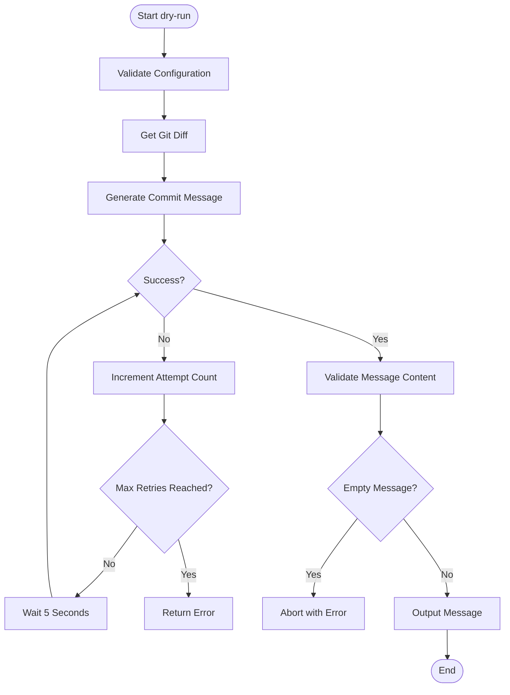

# Interactive/Dry-run Mode

<cite>
**Referenced Files in This Document **   
- [main.rs](file://src/main.rs)
</cite>

## Table of Contents
1. [Introduction](#introduction)
2. [Interactive and Dry-run Modes Overview](#interactive-and-dry-run-modes-overview)
3. [Implementation Details](#implementation-details)
4. [Usage Examples](#usage-examples)
5. [Git Integration Workflow](#git-integration-workflow)
6. [Edge Cases Handling](#edge-cases-handling)
7. [Best Practices for Review and Customization](#best-practices-for-review-and-customization)
8. [Performance Implications](#performance-implications)

## Introduction
The aicommit tool provides two special execution modes—interactive (`--interactive`) and dry-run (`--dry-run`)—that allow users to preview, edit, and approve AI-generated commit messages before applying them to the repository. These modes enhance control over the commit process by introducing user validation steps while maintaining seamless integration with Git workflows.

## Interactive and Dry-run Modes Overview
The `--dry-run` and `--interactive` flags enable users to review generated commit messages without immediately creating a Git commit. While both modes prevent automatic commits, they serve different purposes:

- **Dry-run mode** (`--dry-run`): Generates and displays the commit message without making any changes to the repository state.
- **Interactive mode**: Although not explicitly implemented as `--interactive` in the CLI arguments, the codebase contains infrastructure for interactive provider setup via dialoguer prompts, suggesting potential for future interactive message approval flows.

These modes are particularly useful for validating AI output, ensuring adherence to project conventions, and preventing unwanted commits due to inaccurate suggestions.

**Section sources**
- [main.rs](file://src/main.rs#L205)
- [main.rs](file://src/main.rs#L1645-L1655)

## Implementation Details
The dry-run functionality is implemented in the `dry_run` function within `src/main.rs`. It leverages the `dialoguer` crate for CLI interactions and follows a structured flow:

1. Validates repository state and configuration
2. Retrieves the Git diff using `get_git_diff`, which adapts its behavior based on whether it's in dry-run mode
3. Selects an active provider from the configuration
4. Attempts to generate a commit message with retry logic
5. Returns the generated message without creating a commit

The system uses temporary message storage during processing but does not persist messages between sessions unless configuration changes occur.



**Diagram sources **
- [main.rs](file://src/main.rs#L1781-L1839)

**Section sources**
- [main.rs](file://src/main.rs#L1781-L1839)
- [main.rs](file://src/main.rs#L1720-L1750)

## Usage Examples
### Dry-run Mode
To preview a generated commit message without committing:
```bash
aicommit --dry-run
```
This command will output only the generated message text if successful, or an error description if generation fails.

### Provider Setup (Interactive Pattern)
While true interactive commit approval isn't currently implemented, the tool demonstrates interactive patterns through provider configuration:
```bash
aicommit --add-provider
```
This triggers a series of `dialoguer` prompts for API key input, model selection, and parameter configuration.

The workflow differences from standard mode include:
- No actual Git commit is created in dry-run mode
- Messages are displayed directly to stdout
- Configuration validation occurs but no staging modifications happen
- Error messages provide more detailed debugging information

**Section sources**
- [main.rs](file://src/main.rs#L1645-L1655)
- [main.rs](file://src/main.rs#L727-L765)

## Git Integration Workflow
Changes remain unstaged until explicit user confirmation through normal Git workflows. The dry-run mode specifically modifies how diffs are collected:

- In dry-run: Attempts `git diff --cached`, falls back to `git diff` if no staged changes exist
- In normal mode: Uses `git diff --cached` exclusively

This ensures that even uncommitted changes can be evaluated during dry runs. However, the actual staging of files still requires manual intervention via `git add` commands outside of aicommit's scope.

The separation between message generation and commit application allows users to:
1. Run `aicommit --dry-run` to preview the message
2. Manually stage desired changes with `git add`
3. Use the suggested message in a manual `git commit -m` command
4. Or modify and use it as needed

**Section sources**
- [main.rs](file://src/main.rs#L1720-L1750)
- [main.rs](file://src/main.rs#L1781-L1839)

## Edge Cases Handling
The implementation includes robust handling for various edge cases:

### Empty Suggestions
If the AI generates an empty or very short message (<3 characters), the system aborts with a clear error:
```rust
if message.trim().is_empty() {
    return Err("Aborting commit due to empty commit message.".to_string());
}
```

### Manual Message Rejection
Although direct rejection isn't part of the current interface, users can effectively reject messages by simply not using the output from `--dry-run`. Future enhancements could incorporate explicit rejection mechanisms with feedback loops to improve model selection.

### Failed Generation Attempts
The system implements retry logic with exponential backoff characteristics:
- Up to `retry_attempts` (default 3) attempts
- 5-second delay between retries
- Detailed error reporting for troubleshooting

Configuration issues like missing providers also trigger appropriate errors guiding users toward resolution.

**Section sources**
- [main.rs](file://src/main.rs#L1820-L1839)
- [main.rs](file://src/main.rs#L1781-L1839)

## Best Practices for Review and Customization
When reviewing AI-generated messages in dry-run mode:

1. **Verify Conventional Commits Format**: Ensure messages follow type-scope-description pattern (e.g., "feat: add login button")
2. **Check Accuracy**: Confirm the message accurately reflects the actual changes in the diff
3. **Assess Clarity**: Evaluate whether the message would be understandable to other team members
4. **Customize When Needed**: Use the generated message as a starting point for manual refinement

For customization, consider:
- Adjusting temperature and max_tokens settings in provider configuration
- Using specific models known to produce preferred styles
- Pre-staging only relevant changes to influence message focus

The verbose mode (`--verbose`) can assist review by showing the exact diff being analyzed.

**Section sources**
- [main.rs](file://src/main.rs#L2400-L2600)
- [main.rs](file://src/main.rs#L2600-L2800)

## Performance Implications
Using dry-run mode introduces several performance considerations:

- **Additional User Input Cycles**: Each dry-run requires manual evaluation time
- **Network Latency**: Message generation involves API calls that may take several seconds
- **Retry Overhead**: Failed attempts increase total execution time by 5+ seconds each
- **Resource Utilization**: Maintains full processing pipeline without final commit

However, these costs are offset by benefits:
- Prevention of incorrect commits requiring fixups
- Opportunity for quality assurance
- Reduced need for post-commit corrections

The impact is generally minimal given that these operations typically complete within 10-15 seconds under normal conditions.

**Section sources**
- [main.rs](file://src/main.rs#L1781-L1839)
- [main.rs](file://src/main.rs#L2800-L3000)