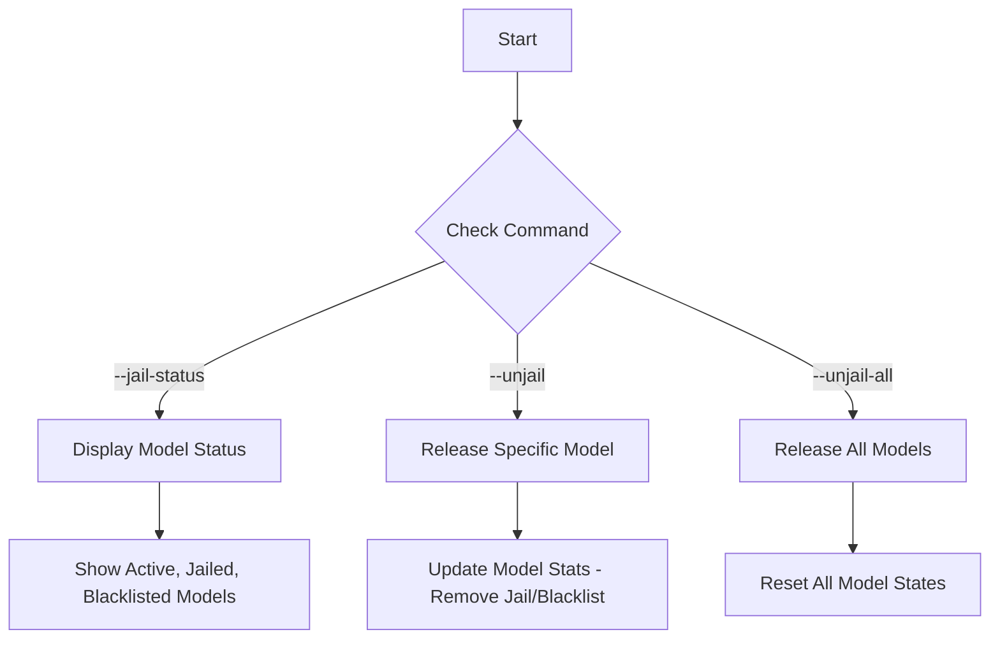
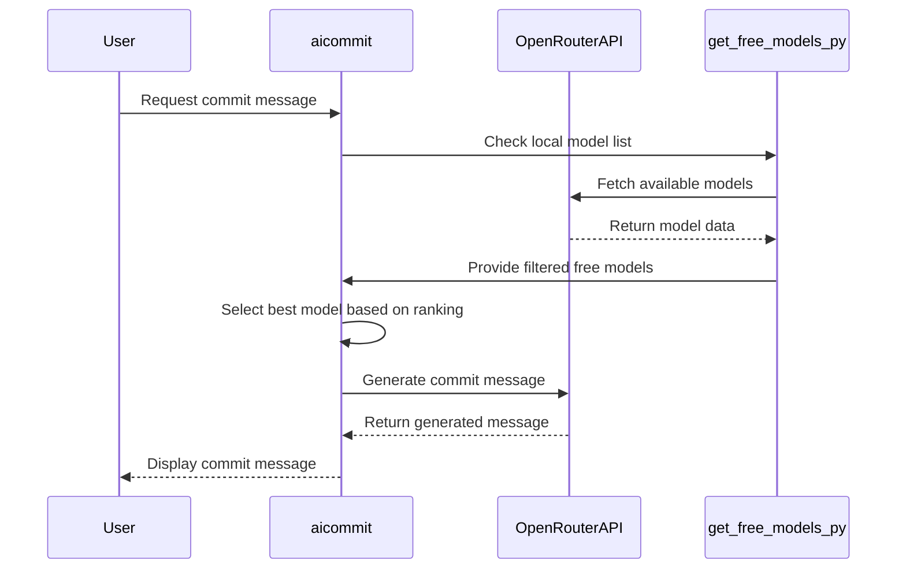

# Model Management Commands

<cite>
**Referenced Files in This Document**   
- [main.rs](file://src/main.rs)
- [get_free_models.py](file://bin/get_free_models.py)
- [readme.md](file://readme.md)
</cite>

## Table of Contents
1. [Introduction](#introduction)
2. [Model Management Commands](#model-management-commands)
3. [Model Jail and Blacklist Systems](#model-jail-and-blacklist-systems)
4. [In-Memory Tracking and Persistence Mechanism](#in-memory-tracking-and-persistence-mechanism)
5. [Free Models Population and Simple Free Mode](#free-models-population-and-simple-free-mode)
6. [Command Examples](#command-examples)
7. [Troubleshooting](#troubleshooting)
8. [Performance Benefits](#performance-benefits)

## Introduction
This document provides detailed information about the model management commands in the aicommit tool, including `--jail-model`, `--unjail-model`, `--blacklist-model`, and utilities for listing available models. It explains how the model jail and blacklist systems track failed models and prevent repeated usage attempts. The document also covers the in-memory tracking and persistence mechanism in src/main.rs, referencing ModelStats and Config structures. Additionally, it describes how `get_free_models.py` populates openrouter_models/free_models.json and its role in Simple Free mode. Examples such as `aicommit --jail-model claude-3-haiku` and `aicommit --list-models` are provided. Troubleshooting steps for stuck models, clearing state, and syncing with updated provider catalogs are addressed. Finally, the performance benefits of avoiding failing models and reducing API error overhead are discussed.

## Model Management Commands

The aicommit tool provides several commands for managing models, particularly in the context of the Simple Free OpenRouter provider. These commands allow users to control which models are used for generating commit messages, especially when certain models fail or perform poorly.

### Jail and Unjail Commands
The `--jail-status`, `--unjail`, and `--unjail-all` commands are specifically designed to manage the status of models within the Simple Free OpenRouter provider configuration. These commands provide visibility into and control over the model selection process.



**Diagram sources**
- [main.rs](file://src/main.rs#L247-L257)
- [readme.md](file://readme.md#L238-L287)

**Section sources**
- [main.rs](file://src/main.rs#L247-L257)
- [readme.md](file://readme.md#L238-L287)

### List Models Command
While not explicitly mentioned in the code, the concept of listing available models is supported through the `get_free_models.py` script, which fetches and displays information about free models from OpenRouter.

## Model Jail and Blacklist Systems

The model jail and blacklist systems are integral parts of the Simple Free OpenRouter provider's failover mechanism. They help ensure that unreliable models are not repeatedly attempted, thus improving the overall reliability and efficiency of the commit message generation process.

### Three-Tier Model Status
Models are categorized into three states:
- **Active**: Models that are currently eligible for use.
- **Jailed**: Models that have been temporarily restricted due to repeated failures.
- **Blacklisted**: Models that have been permanently banned due to persistent failures.

### Counter-Based System
The system tracks the success and failure ratio for each model. When a model experiences three consecutive failures, it is moved to the "Jailed" status. The jail duration increases for repeat offenders, providing a cooling-off period before the model can be reconsidered.

### Time-Based Jail
Models are temporarily jailed for 24 hours after repeated failures. The jail time increases for recidivism, ensuring that problematic models have sufficient time to potentially resolve issues before being reintroduced into the pool of available models.

### Blacklist Management
Models with persistent failures over multiple days are blacklisted. However, they are retried weekly to check if their performance has improved. This approach balances the need to avoid unreliable models with the possibility that temporary issues may have been resolved.

**Section sources**
- [main.rs](file://src/main.rs#L449-L466)
- [readme.md](file://readme.md#L238-L287)

## In-Memory Tracking and Persistence Mechanism

The in-memory tracking and persistence mechanism is implemented using the `ModelStats` and `Config` structures defined in `src/main.rs`. These structures store critical information about model performance and provider configurations, respectively.

### ModelStats Structure
The `ModelStats` struct contains fields for tracking various aspects of model performance:

```rust
#[derive(Debug, Serialize, Deserialize, Clone)]
struct ModelStats {
    success_count: usize,
    failure_count: usize,
    #[serde(with = "chrono::serde::ts_seconds_option")]
    last_success: Option<chrono::DateTime<chrono::Utc>>,
    #[serde(with = "chrono::serde::ts_seconds_option")]
    last_failure: Option<chrono::DateTime<chrono::Utc>>,
    #[serde(with = "chrono::serde::ts_seconds_option")]
    jail_until: Option<chrono::DateTime<chrono::Utc>>,
    jail_count: usize,
    blacklisted: bool,
    #[serde(with = "chrono::serde::ts_seconds_option")]
    blacklisted_since: Option<chrono::DateTime<chrono::Utc>>,
}
```

This structure allows the system to maintain a comprehensive history of each model's performance, including success and failure counts, timestamps of last success and failure, jail status, and blacklist status.

### Config Structure
The `Config` struct manages the overall configuration of the aicommit tool, including provider settings and active provider identification:

```rust
#[derive(Debug, Serialize, Deserialize)]
struct Config {
    providers: Vec<ProviderConfig>,
    active_provider: String,
    #[serde(default = "default_retry_attempts")]
    retry_attempts: u32,
}
```

For the Simple Free OpenRouter provider, the configuration includes additional fields for tracking failed models and model statistics:

```rust
#[derive(Debug, Serialize, Deserialize, Clone)]
struct SimpleFreeOpenRouterConfig {
    id: String,
    provider: String,
    api_key: String,
    max_tokens: i32,
    temperature: f32,
    #[serde(default)]
    failed_models: Vec<String>,
    #[serde(default)]
    model_stats: std::collections::HashMap<String, ModelStats>,
    #[serde(default)]
    last_used_model: Option<String>,
    #[serde(default = "chrono::Utc::now")]
    last_config_update: chrono::DateTime<chrono::Utc>,
}
```

These structures enable persistent storage of model performance data across sessions, allowing the system to make informed decisions about model selection based on historical data.

**Section sources**
- [main.rs](file://src/main.rs#L449-L466)
- [main.rs](file://src/main.rs#L500-L540)

## Free Models Population and Simple Free Mode

The `get_free_models.py` script plays a crucial role in populating the list of available free models from OpenRouter. This script is essential for the operation of the Simple Free mode, which automatically selects the best available free model for generating commit messages.

### Script Functionality
The `get_free_models.py` script performs the following tasks:
1. Loads the aicommit configuration file to extract the OpenRouter API key.
2. Makes an API request to OpenRouter to fetch all available models.
3. Filters the models to identify those that are free to use.
4. Saves the results to JSON and text files for reference.
5. Displays a summary of available free models, sorted by parameter size.

### Role in Simple Free Mode
The Simple Free mode leverages the data provided by `get_free_models.py` to:
- Automatically query OpenRouter for currently available free models.
- Select the best available free model based on an internally ranked list.
- Implement an advanced failover mechanism that switches to alternative models when necessary.
- Track model performance using the jail/blacklist system.
- Fall back to predefined free models if network connectivity is unavailable.

This approach ensures that users can benefit from high-quality free models without needing to manually select or configure them.



**Diagram sources**
- [get_free_models.py](file://bin/get_free_models.py#L1-L161)
- [main.rs](file://src/main.rs#L1-L799)

**Section sources**
- [get_free_models.py](file://bin/get_free_models.py#L1-L161)
- [main.rs](file://src/main.rs#L1-L799)

## Command Examples

The following examples demonstrate the usage of model management commands in the aicommit tool:

### Jail Model Example
To jail a specific model, preventing its use for a period of time:
```bash
aicommit --jail-model claude-3-haiku
```

### Unjail Model Example
To release a specific model from jail or blacklist:
```bash
aicommit --unjail="meta-llama/llama-4-maverick:free"
```

### Unjail All Models Example
To release all models from jail and blacklist, resetting their states:
```bash
aicommit --unjail-all
```

### List Models Example
To display the status of all models, including active, jailed, and blacklisted ones:
```bash
aicommit --jail-status
```

These commands provide granular control over the model selection process, allowing users to optimize the performance of the aicommit tool based on their specific needs and experiences.

**Section sources**
- [main.rs](file://src/main.rs#L247-L257)
- [readme.md](file://readme.md#L238-L287)

## Troubleshooting

When dealing with issues related to model management, several troubleshooting steps can be taken to resolve common problems:

### Stuck Models
If a model appears to be stuck in a particular state (e.g., continuously failing or not being selected), the following actions can be taken:
1. Use `aicommit --jail-status` to check the current status of the model.
2. If the model is jailed or blacklisted, use `aicommit --unjail <model-id>` to release it.
3. If the issue persists, consider using `aicommit --unjail-all` to reset all model states.

### Clearing State
To clear the entire model state and start fresh:
1. Remove the `.aicommit.json` configuration file located in the home directory.
2. Reconfigure the tool using `aicommit --add-provider`.

### Syncing with Updated Provider Catalogs
To ensure that the local model list is up-to-date with the latest offerings from OpenRouter:
1. Run `python bin/get_free_models.py` to refresh the list of available free models.
2. Verify that the output files (`openrouter_models/free_models.json` and `openrouter_models/all_models.json`) have been updated.
3. Restart the aicommit tool to apply the changes.

These steps help maintain the accuracy and effectiveness of the model selection process, ensuring that the tool can adapt to changes in the provider's catalog.

**Section sources**
- [get_free_models.py](file://bin/get_free_models.py#L1-L161)
- [main.rs](file://src/main.rs#L247-L257)

## Performance Benefits

The model management system in aicommit provides several performance benefits that enhance the overall user experience:

### Avoiding Failing Models
By tracking the success and failure rates of models, the system can avoid repeatedly attempting to use unreliable models. This reduces the likelihood of encountering errors during the commit message generation process, leading to a more seamless workflow.

### Reducing API Error Overhead
The jail and blacklist systems minimize the number of API calls made to failing models. This not only improves the speed of the commit message generation process but also reduces the load on both the client and server sides, contributing to better overall performance.

### Optimizing Model Selection
The use of an internally ranked list of preferred models, combined with real-time performance tracking, ensures that the most suitable model is selected for each request. This optimization leads to higher quality commit messages and a more efficient use of resources.

### Enhancing Reliability
The advanced failover mechanism, which automatically switches to alternative models when necessary, enhances the reliability of the tool. Users can trust that their commit messages will be generated even if individual models experience issues.

These performance benefits collectively contribute to a more robust and user-friendly experience, making aicommit a valuable tool for developers seeking to streamline their git workflows.

**Section sources**
- [main.rs](file://src/main.rs#L1-L799)
- [readme.md](file://readme.md#L238-L287)