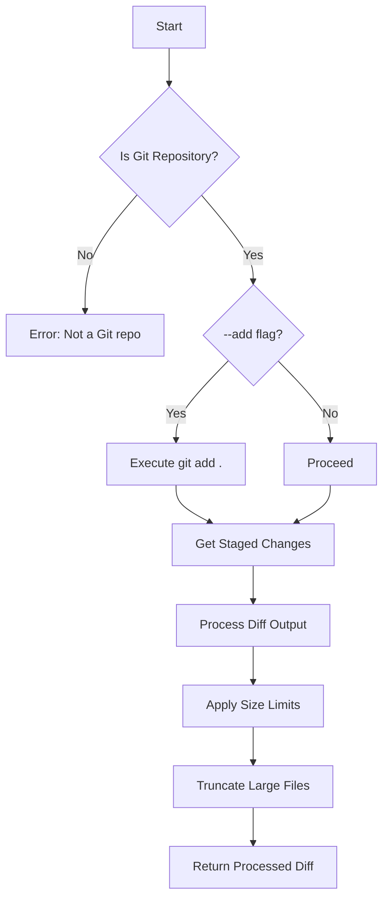
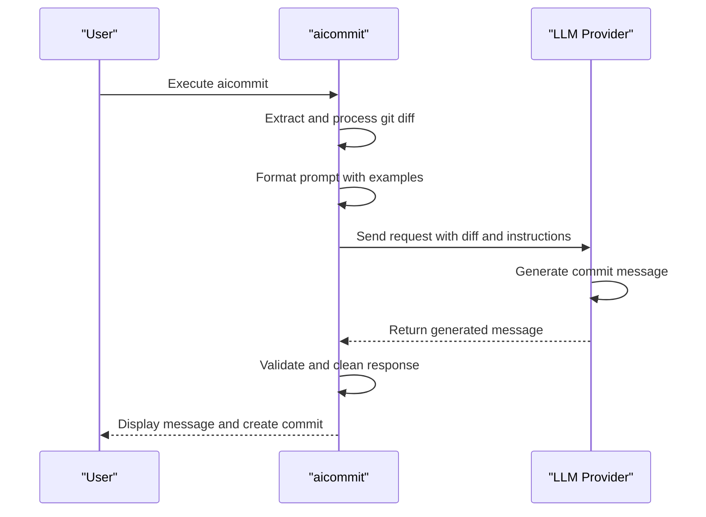
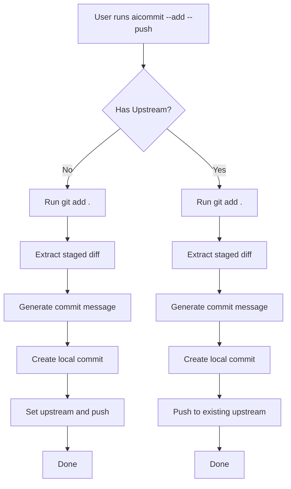
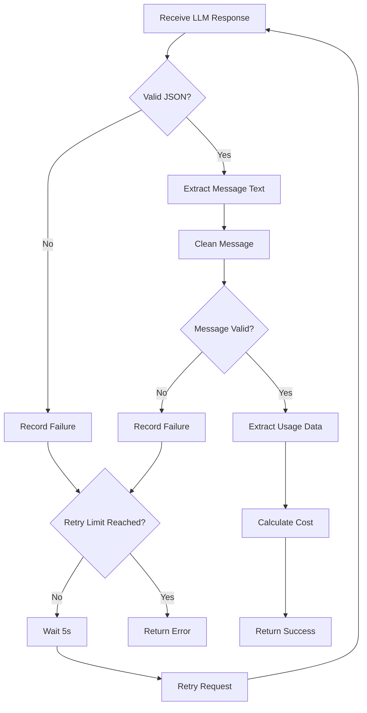

# Standard Mode

<cite>
**Referenced Files in This Document **   
- [main.rs](file://src/main.rs)
- [Cargo.toml](file://Cargo.toml)
- [readme.md](file://readme.md)
</cite>

## Table of Contents
1. [Introduction](#introduction)
2. [Standard Commit Message Generation](#standard-commit-message-generation)
3. [Diff Extraction and Processing](#diff-extraction-and-processing)
4. [Prompt Formatting and LLM Integration](#prompt-formatting-and-llm-integration)
5. [Command Usage Examples](#command-usage-examples)
6. [Automatic Staging and Committing](#automatic-staging-and-committing)
7. [Provider Configuration and Model Selection](#provider-configuration-and-model-selection)
8. [Response Parsing and Validation](#response-parsing-and-validation)
9. [Performance Considerations](#performance-considerations)
10. [Common Issues and Troubleshooting](#common-issues-and-troubleshooting)
11. [Optimization Recommendations](#optimization-recommendations)

## Introduction
The aicommit tool provides an AI-powered solution for generating meaningful git commit messages automatically. The standard mode enables users to generate concise, descriptive commit messages from Git diffs without manual intervention. This documentation details the inner workings of the standard commit message generation process, focusing on how the tool extracts changes, formats prompts, communicates with LLM providers, and handles responses.

**Section sources**
- [main.rs](file://src/main.rs#L1431-L3192)
- [readme.md](file://readme.md#L0-L734)

## Standard Commit Message Generation
In standard mode, aicommit automatically generates commit messages by analyzing the current Git diff and sending it to a configured LLM provider. When executed without flags, the command `aicommit` follows a streamlined workflow: it retrieves the staged changes, processes the diff, formats a prompt for the active LLM provider, sends the request, parses the response, and creates a commit with the generated message.

The process begins with configuration loading from `~/.aicommit.json`, where the active provider is identified. If no provider is configured or active, the tool prompts users to set up a provider using `--add-provider`. Once properly configured, the tool proceeds through its core workflow, handling version updates if specified with version-related flags (`--version-iterate`, `--version-cargo`, etc.) before processing the Git diff.

This automated approach eliminates the need for developers to manually craft commit messages while ensuring consistency with conventional commit specifications. The generated messages follow the format "type: description" (e.g., "feat: add user authentication", "fix: resolve login bug"), making them both human-readable and machine-parsable.

**Section sources**
- [main.rs](file://src/main.rs#L1630-L2229)
- [readme.md](file://readme.md#L100-L150)

## Diff Extraction and Processing
The diff extraction process begins with validation that the current directory is a valid Git repository. The tool executes `git rev-parse --is-inside-work-tree` to confirm repository status before proceeding. For standard operation, aicommit retrieves only staged changes using `git diff --cached`, ensuring that uncommitted modifications don't interfere with the commit message generation.

When the `--add` flag is present, the tool first stages all changes with `git add .` before extracting the diff. This automatic staging feature simplifies the commit workflow, allowing users to generate AI-powered messages for all pending changes in a single command. The extracted diff undergoes smart processing to handle large files and prevent excessive token usage.

The `process_git_diff_output` function implements intelligent truncation logic, limiting individual file diffs to MAX_FILE_DIFF_CHARS (3000 characters) while preserving context around changes. The overall diff size is capped at MAX_DIFF_CHARS (15000 characters) to prevent overwhelming LLM providers with excessively large inputs. This processing ensures that critical changes remain visible to the model while avoiding API limitations and excessive costs.



**Diagram sources **
- [main.rs](file://src/main.rs#L1830-L1879)
- [main.rs](file://src/main.rs#L0-L799)

**Section sources**
- [main.rs](file://src/main.rs#L1830-L1879)
- [main.rs](file://src/main.rs#L0-L799)

## Prompt Formatting and LLM Integration
After diff extraction, aicommit formats a structured prompt for the LLM provider. The prompt template emphasizes concise, conventional commit messages by providing clear instructions and examples. It explicitly requests only the commit message string without introductory phrases, explanations, or markdown formatting.

The standardized prompt includes multiple examples following the Conventional Commits specification:
- feat: Add user authentication feature
- fix: Correct calculation error in payment module  
- docs: Update README with installation instructions
- style: Format code according to style guide
- refactor: Simplify database query logic
- test: Add unit tests for user service
- chore: Update dependencies

The processed diff is embedded within a code block labeled "Git Diff:", followed by the instruction "Commit Message ONLY:" to reinforce the expected output format. This structured approach guides the LLM toward generating appropriate, consistent messages.

For OpenRouter and OpenAI-compatible providers, the prompt is sent via the chat completions API with system-defined parameters including max_tokens (default: 200) and temperature (default: 0.2). The low temperature setting ensures deterministic outputs, reducing randomness in message generation. Ollama integration uses a similar pattern but adapts to its specific API structure, sending the prompt directly to the generate endpoint.



**Diagram sources **
- [main.rs](file://src/main.rs#L2430-L2629)
- [main.rs](file://src/main.rs#L2630-L2829)

**Section sources**
- [main.rs](file://src/main.rs#L2430-L2829)

## Command Usage Examples
The standard mode supports various usage patterns through different command combinations. The simplest invocation requires no flags:

```bash
aicommit
```

This command generates a commit message for currently staged changes and creates a commit. To combine staging and committing in one step:

```bash
aicommit --add
```

Additional common patterns include automatic pushing after commit:

```bash
aicommit --add --push
```

Or pulling before committing to ensure synchronization with the remote repository:

```bash
aicommit --add --pull --push
```

For version-controlled projects, aicommit can automatically increment version numbers across multiple files:

```bash
aicommit --add --version-file version.txt --version-iterate --version-cargo --version-npm
```

This command stages changes, increments the version in version.txt, synchronizes the update with Cargo.toml and package.json, then commits all changes with an AI-generated message.

Verbose output can be enabled to see detailed information about the process:

```bash
aicommit --verbose
```

This displays the extracted diff, prompt content, API interaction details, token usage, and cost information, providing transparency into the message generation process.

**Section sources**
- [readme.md](file://readme.md#L200-L300)
- [main.rs](file://src/main.rs#L1431-L1630)

## Automatic Staging and Committing
The `--add` flag enables automatic staging of all changes before commit message generation. This feature streamlines the development workflow by eliminating the need for separate `git add .` commands. When `--add` is specified, aicommit first checks for unstaged changes by running `git status --porcelain`. If modified, newly created, or untracked files are detected, it executes `git add .` to stage all changes.

After successful staging, the tool proceeds with diff extraction using `git diff --cached`, ensuring that only the newly staged changes are considered for message generation. This approach prevents potential conflicts with previously staged changes that might not be part of the current commit intent.

The automatic upstream branch setup enhances this workflow further. When using `--pull` or `--push` flags, aicommit automatically configures upstream tracking for new branches. If the current branch lacks an upstream reference, `--push` automatically runs `git push --set-upstream origin <branch>`, creating the remote branch and establishing tracking. Similarly, `--pull` sets up tracking when needed, eliminating manual configuration steps.

This integrated approach makes branch management more seamless, particularly for feature branches and experimental work, where developers can focus on coding rather than Git administration overhead.



**Diagram sources **
- [main.rs](file://src/main.rs#L2030-L2229)
- [main.rs](file://src/main.rs#L1830-L1879)

**Section sources**
- [main.rs](file://src/main.rs#L1830-L2229)
- [readme.md](file://readme.md#L500-L550)

## Provider Configuration and Model Selection
Standard mode operates with the active provider configured in `~/.aicommit.json`. The tool supports multiple LLM providers including OpenRouter, Ollama, and OpenAI-compatible endpoints. Each provider type has specific configuration requirements stored in the JSON configuration file.

For OpenRouter, the configuration includes:
- api_key: Authentication credential
- model: Specific model identifier
- max_tokens: Response length limit  
- temperature: Output randomness control

Ollama configuration requires:
- url: Local server address (default: http://localhost:11434)
- model: Local model name
- max_tokens and temperature settings

OpenAI-compatible providers need:
- api_key: Authentication token
- api_url: Endpoint URL
- model: Model identifier
- max_tokens and temperature parameters

The Simple Free OpenRouter mode offers automated model selection using a sophisticated ranking system. It queries OpenRouter's API for available free models, filters them based on cost indicators (:free suffix, zero pricing, free_tokens > 0), and selects the best available option according to a predefined preference list. This list prioritizes powerful models like Meta's Llama 4 series and NVIDIA's Nemotron Ultra variants.

When network connectivity is unavailable, the system falls back to a predefined list of free models maintained in the codebase. The model selection algorithm also incorporates intelligent fallback mechanisms, analyzing model names for parameter counts (e.g., "70b", "32b") to identify high-quality options even when they're not in the preferred list.

**Section sources**
- [main.rs](file://src/main.rs#L0-L799)
- [main.rs](file://src/main.rs#L2230-L2429)
- [readme.md](file://readme.md#L150-L200)

## Response Parsing and Validation
After receiving a response from the LLM provider, aicommit performs rigorous parsing and validation to ensure message quality. The raw response undergoes cleaning operations that remove unwanted characters, trim whitespace, and eliminate common prefixes/suffixes like quotes, dashes, or bullet points.

The validation process checks that the message meets minimum quality standards:
- Length greater than 3 characters
- Non-empty after cleaning
- Proper formatting per conventional commits

For OpenRouter and OpenAI-compatible APIs, token usage information is extracted from the response metadata, including input_tokens, output_tokens, and total_tokens. This data enables accurate cost calculation and reporting. Ollama responses require estimation since the API doesn't provide detailed token counts; a rough approximation of 4 characters per token is used instead.

The tool implements a retry mechanism when message generation fails. Configured with a default of 3 retry attempts, it waits 5 seconds between retries to avoid overwhelming rate-limited APIs. Each retry attempt is logged in verbose mode, showing progress and eventual success or failure.

Failed responses trigger appropriate error handling, with detailed messages explaining issues like empty responses, parsing errors, or API failures. The final commit message is always validated before creation, preventing empty or malformed messages from being committed to the repository.



**Diagram sources **
- [main.rs](file://src/main.rs#L2430-L2829)
- [main.rs](file://src/main.rs#L1830-L2029)

**Section sources**
- [main.rs](file://src/main.rs#L2430-L2829)
- [main.rs](file://src/main.rs#L1830-L2029)

## Performance Considerations
Standard mode balances functionality with performance optimization through several mechanisms. API latency is managed via timeout configurations (15-second timeout for model listing, 30-second timeout for message generation) and retry strategies that prevent indefinite blocking.

Token usage is carefully controlled through diff processing that limits both individual file sizes (MAX_FILE_DIFF_CHARS = 3000) and total diff size (MAX_DIFF_CHARS = 15000). This prevents excessive token consumption that could lead to high costs or API errors. The prompt design itself is optimized to minimize input tokens while maintaining effectiveness.

Network efficiency is enhanced by caching provider configurations and minimizing redundant API calls. The Simple Free mode intelligently manages model availability, reducing unnecessary requests to already-failed models through its jail/blacklist system. Models with repeated failures are temporarily restricted (jail) or long-term banned (blacklist), improving overall reliability.

Cost considerations vary by provider:
- OpenRouter: Costs calculated based on actual token usage
- Ollama: Local execution with zero monetary cost
- OpenAI-compatible: Costs depend on the specific service

The verbose mode provides detailed token usage reporting ("Tokens: X↑ Y↓") and cost estimates, helping users monitor and optimize their usage patterns over time.

**Section sources**
- [main.rs](file://src/main.rs#L0-L799)
- [main.rs](file://src/main.rs#L2230-L2429)
- [readme.md](file://readme.md#L600-L650)

## Common Issues and Troubleshooting
Several common issues may arise during standard mode operation. Vague or overly verbose messages typically result from insufficient prompt constraints or inappropriate model selection. Ensuring the temperature parameter remains low (0.2-0.3) helps maintain focused, concise outputs.

Empty or missing commit messages often indicate parsing failures or API errors. These can stem from network connectivity issues, invalid API keys, or temporary provider outages. The retry mechanism usually resolves transient issues, but persistent problems may require configuration verification.

Large repository performance issues can occur when diffs exceed size limits. The tool's diff truncation protects against this, but users should consider breaking large changes into smaller, logical commits for better message quality.

Model-specific issues may manifest as formatting inconsistencies or content deviations. The cleaning and validation pipeline addresses many of these, but selecting well-behaved models improves results. The Simple Free mode's model management system automatically identifies and avoids problematic models over time.

Configuration problems frequently involve incorrect API keys, outdated model names, or missing provider setup. The interactive `--add-provider` flow helps prevent these issues, while the `--list` and `--set` commands facilitate provider management.

Network-related errors trigger the fallback mechanism in Simple Free mode, switching to predefined models when API access fails. Users experiencing persistent connectivity issues can use the `--simulate-offline` flag (hidden) to force fallback behavior for testing purposes.

**Section sources**
- [main.rs](file://src/main.rs#L2430-L2829)
- [readme.md](file://readme.md#L400-L450)

## Optimization Recommendations
To achieve optimal results with standard mode, consider these recommendations:

**Model Selection**: Choose models known for strong instruction following and concise output. For cloud providers, smaller specialized models often outperform larger general-purpose ones for this specific task. The Simple Free mode's automatic selection generally provides good results by prioritizing reliable free models.

**Prompt Engineering**: While the built-in prompt is effective, advanced users can modify the prompt template in the source code to better match their project's conventions. Adding project-specific examples or adjusting the tone can improve relevance.

**Temperature Settings**: Maintain low temperature values (0.1-0.3) to ensure consistent, predictable outputs. Higher temperatures increase creativity but reduce reliability for structured tasks like commit message generation.

**Version Integration**: Combine commit automation with version management by using `--version-iterate` with `--version-cargo` and `--version-npm` to maintain synchronized version numbers across different package managers.

**Watch Mode**: For continuous development workflows, combine standard mode with `--watch` to automatically commit changes after periods of inactivity, providing regular save points without manual intervention.

**Cost Management**: Monitor token usage through verbose output and consider local models (Ollama) for high-frequency usage scenarios to eliminate API costs while maintaining privacy.

**Configuration Backup**: Regularly backup the `~/.aicommit.json` configuration file, especially when using custom provider setups or modified settings.

These optimizations help maximize the effectiveness of AI-powered commit message generation while maintaining control over quality, cost, and reliability.

**Section sources**
- [main.rs](file://src/main.rs#L0-L799)
- [readme.md](file://readme.md#L300-L400)