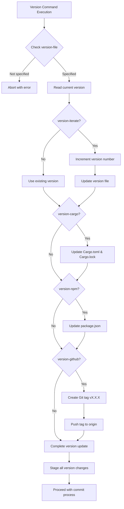
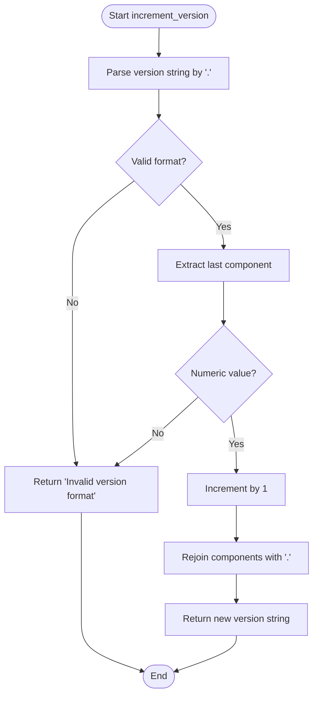
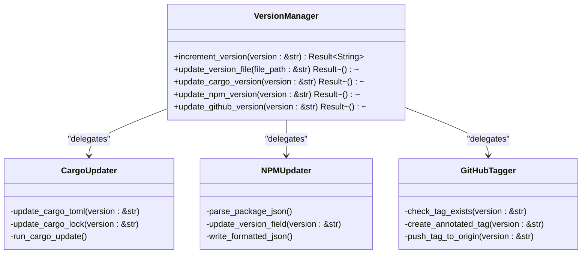
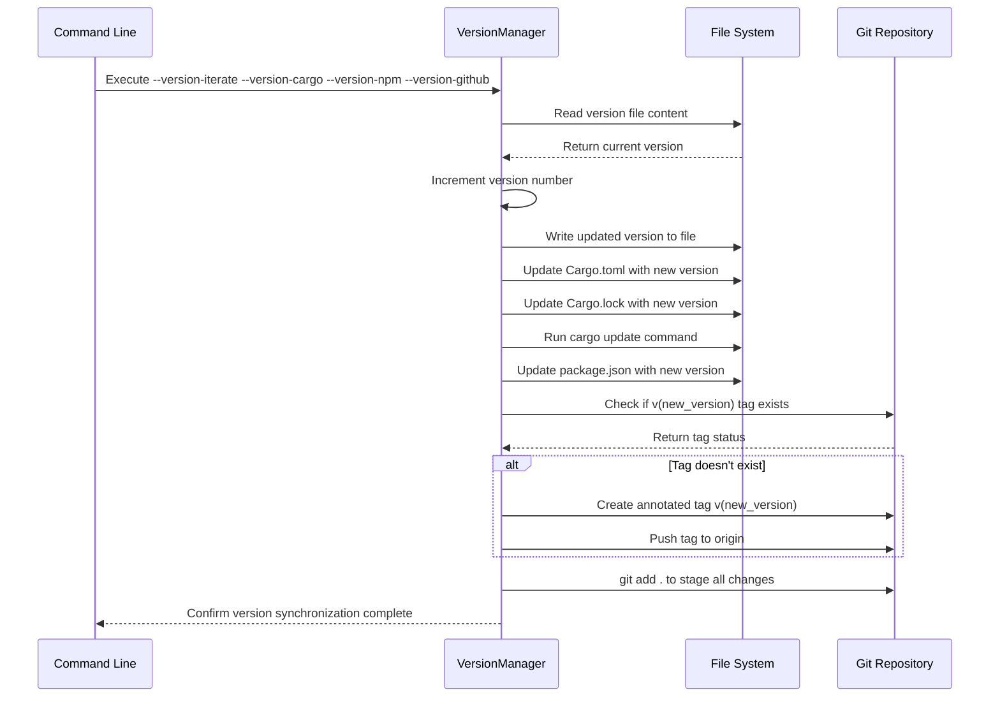
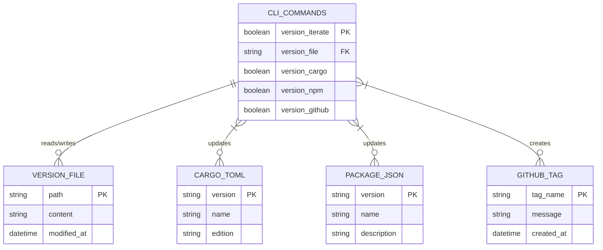
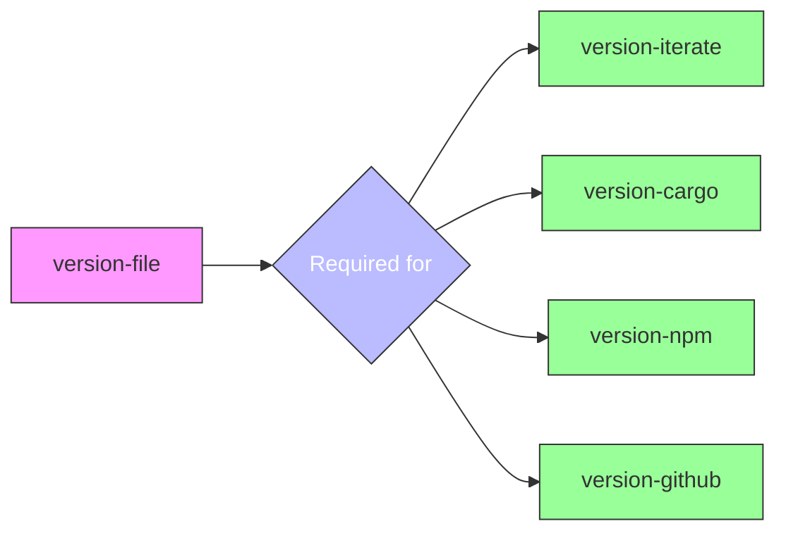
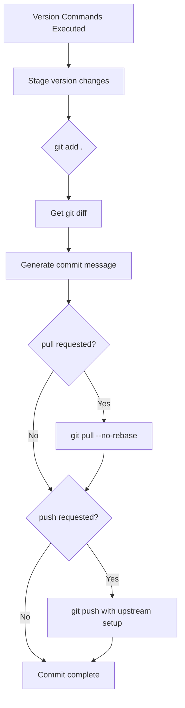
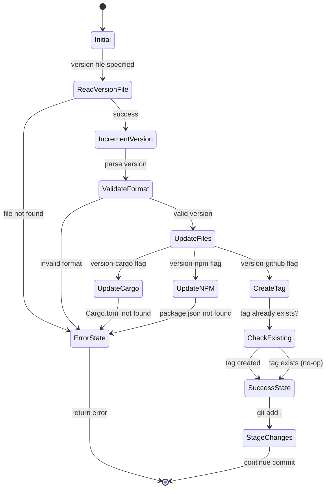
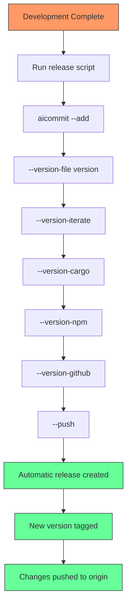

# Version Management Commands

<cite>
**Referenced Files in This Document **   
- [src/main.rs](file://src/main.rs)
- [Cargo.toml](file://Cargo.toml)
- [package.json](file://package.json)
- [readme.md](file://readme.md)
</cite>

## Table of Contents
1. [Introduction](#introduction)
2. [Version Management Architecture](#version-management-architecture)
3. [Core Versioning Components](#core-versioning-components)
4. [Version Synchronization Workflow](#version-synchronization-workflow)
5. [Command Implementation Details](#command-implementation-details)
6. [Integration with Git Operations](#integration-with-git-operations)
7. [Error Handling and Edge Cases](#error-handling-and-edge-cases)
8. [Best Practices for Release Automation](#best-practices-for-release-automation)

## Introduction
The aicommit tool provides comprehensive version management capabilities that enable synchronized version updates across multiple package managers and repository systems. This documentation details the implementation and usage of version management commands including `--version-bump`, `--version-file`, `--sync-cargo`, and related flags. The system ensures consistent versioning across Cargo.toml, package.json, and GitHub tags through a coordinated workflow that maintains version integrity and prevents drift between different package management systems.

**Section sources**
- [readme.md](file://readme.md#L1-L734)

## Version Management Architecture

**Diagram sources **
- [src/main.rs](file://src/main.rs#L260-L301)
- [src/main.rs](file://src/main.rs#L1844-L1923)

## Core Versioning Components

### Version Increment Logic
The version increment functionality is implemented through the `increment_version` function which parses semantic version strings and increments the patch number. The function handles standard semantic versioning format (MAJOR.MINOR.PATCH) by splitting the version string on periods and incrementing the rightmost numeric component.

**Diagram sources **
- [src/main.rs](file://src/main.rs#L260-L301)

### Configuration File Updates
The system implements separate functions for updating different configuration files, ensuring proper formatting and syntax preservation:

**Diagram sources **
- [src/main.rs](file://src/main.rs#L303-L343)
- [src/main.rs](file://src/main.rs#L345-L385)

**Section sources**
- [src/main.rs](file://src/main.rs#L260-L301)
- [src/main.rs](file://src/main.rs#L303-L385)

## Version Synchronization Workflow

**Diagram sources **
- [src/main.rs](file://src/main.rs#L1844-L1923)
- [src/main.rs](file://src/main.rs#L303-L385)

## Command Implementation Details

### Command Line Interface Definitions
The version management commands are defined in the CLI structure with specific parameters for controlling version synchronization behavior:

**Section sources**
- [src/main.rs](file://src/main.rs#L146-L175)

### Version Update Dependencies
The implementation enforces strict dependencies between version management commands, requiring a version file as the source of truth for all synchronization operations:

**Diagram sources **
- [src/main.rs](file://src/main.rs#L1844-L1885)
- [src/main.rs](file://src/main.rs#L1887-L1892)

## Integration with Git Operations
The version management system integrates seamlessly with Git operations, automatically staging version changes and supporting tag creation and push operations:

**Diagram sources **
- [src/main.rs](file://src/main.rs#L1887-L1923)
- [src/main.rs](file://src/main.rs#L1925-L2149)

**Section sources**
- [src/main.rs](file://src/main.rs#L1844-L2149)

## Error Handling and Edge Cases
The system implements comprehensive error handling for various edge cases that may occur during version management operations:

**Diagram sources **
- [src/main.rs](file://src/main.rs#L260-L301)
- [src/main.rs](file://src/main.rs#L1844-L1885)

**Section sources**
- [src/main.rs](file://src/main.rs#L260-L301)
- [src/main.rs](file://src/main.rs#L1844-L1885)

## Best Practices for Release Automation
The aicommit tool supports automated release workflows through scriptable commands that can be integrated into CI/CD pipelines. The recommended approach combines version bumping with automatic pushing to ensure consistent releases:

**Section sources**
- [package.json](file://package.json#L45-L47)
- [readme.md](file://readme.md#L1-L734)