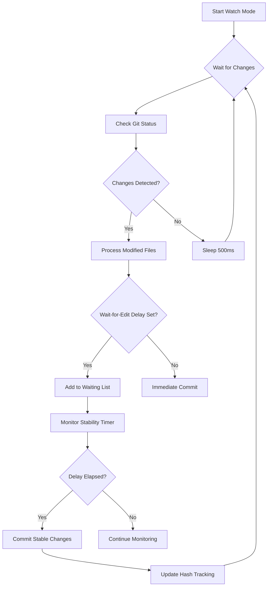
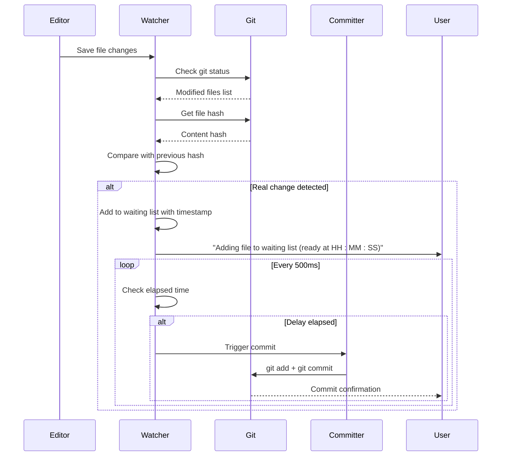

# Watch Mode

<cite>
**Referenced Files in This Document**   
- [main.rs](file://src/main.rs)
</cite>

## Table of Contents
1. [Introduction](#introduction)
2. [Watch Mode Implementation](#watch-mode-implementation)
3. [File Change Detection and Monitoring](#file-change-detection-and-monitoring)
4. [Delay Mechanisms and Edit Stabilization](#delay-mechanisms-and-edit-stabilization)
5. [Git Integration and Auto-Commit Workflow](#git-integration-and-auto-commit-workflow)
6. [Auto-Push Functionality](#auto-push-functionality)
7. [Performance Considerations](#performance-considerations)
8. [Use Cases](#use-cases)
9. [Troubleshooting Common Issues](#troubleshooting-common-issues)

## Introduction
The watch mode functionality in aicommit, activated via the `--watch` flag, provides an automated development workflow by continuously monitoring file system changes and automatically generating AI-powered commit messages when modifications are detected. This feature leverages asynchronous event processing through Tokio to efficiently detect changes without blocking the main execution thread. The implementation includes sophisticated delay mechanisms via the `--edit-delay` parameter to prevent premature commits during active editing sessions. This document details the technical architecture, operational flow, and practical applications of this functionality, providing comprehensive guidance for developers and users.

## Watch Mode Implementation

The watch mode is implemented as an asynchronous loop within the `watch_and_commit` function in the main application. When the `--watch` flag is provided in the CLI arguments, the program branches from standard one-time execution into continuous monitoring mode. The core implementation uses Tokio's runtime for non-blocking operations, allowing the tool to sleep between polling intervals without consuming excessive CPU resources. File system monitoring is achieved through periodic polling of Git's status rather than native filesystem watchers, ensuring compatibility across platforms and accurate detection of version-controlled changes.

**Diagram sources**
- [main.rs](file://src/main.rs#L1207-L1500)

**Section sources**
- [main.rs](file://src/main.rs#L1207-L1500)

## File Change Detection and Monitoring

File change detection is implemented through Git's built-in status tracking rather than direct filesystem watching. The system periodically executes `git ls-files -m -o --exclude-standard` to identify modified and untracked files that are not ignored by `.gitignore`. To distinguish genuine content changes from transient editor operations, the implementation calculates SHA hashes of file contents using `git hash-object`. This prevents false positives from temporary file operations or editor swap files. The current state tracks both waiting files (those being monitored for stabilization) and file hashes (to detect actual content modifications).

The monitoring loop operates with a 500ms sleep interval between checks, balancing responsiveness with resource efficiency. For each detected change, the system verifies whether the file's content hash has actually changed before proceeding with further processing. This two-layer verification—first through Git's modification detection and second through content hashing—ensures that only meaningful changes trigger the commit pipeline.

**Section sources**
- [main.rs](file://src/main.rs#L1215-L1265)

## Delay Mechanisms and Edit Stabilization

The `--edit-delay` parameter implements a crucial stabilization mechanism that prevents premature commits during active editing sessions. When specified (e.g., `--edit-delay 30s`), the system does not immediately commit upon detecting changes. Instead, it maintains a waiting list of modified files, each with a timestamp of their last modification. The delay duration is parsed from the command-line argument using the `parse_duration` helper function, supporting various time units (seconds, minutes, etc.).

When a file is modified, it's added to the waiting list or its timestamp is reset if already present. The system continuously monitors this list, and only when a file has remained unchanged for the full duration of the specified delay will it be committed. This approach accommodates bursty editing patterns where developers might make rapid successive changes across multiple files. The implementation provides real-time feedback by displaying countdown timers showing when files will be ready for commitment, enhancing user experience and predictability.

**Diagram sources**
- [main.rs](file://src/main.rs#L1230-L1355)
- [main.rs](file://src/main.rs#L1000-L1050)

**Section sources**
- [main.rs](file://src/main.rs#L1230-L1355)
- [main.rs](file://src/main.rs#L1000-L1050)

## Git Integration and Auto-Commit Workflow

The auto-commit workflow integrates tightly with Git operations, handling both modified and newly created files through `git add` commands executed via shell subprocesses. When changes are ready for commitment (either immediately or after delay expiration), the system first stages the relevant files using `git add` with proper shell escaping to handle filenames containing spaces or special characters. The actual commit message generation follows the same pipeline as non-watch mode, utilizing the configured LLM provider to create concise, conventional commit messages based on the diff content.

Before generating commit messages, the system retrieves the staged changes using `git diff --cached`, ensuring that only the intended changes are included in the commit context provided to the AI model. The implementation includes robust error handling for Git operations, with appropriate error messages displayed if staging or committing fails. After successful commits, the system updates its internal file hash tracking to reflect the new committed state, preventing immediate re-committing of the same changes.

**Section sources**
- [main.rs](file://src/main.rs#L1355-L1403)
- [main.rs](file://src/main.rs#L1800-L1850)

## Auto-Push Functionality

When the `--push` flag is used in conjunction with `--watch`, the system automatically pushes committed changes to the remote repository. The implementation first checks whether the current branch has an upstream configuration. If no upstream exists, it automatically sets up the tracking relationship using `git push --set-upstream`. This ensures seamless operation even for newly created branches. For branches with existing upstream configurations, it performs a standard `git push` operation.

The auto-push feature includes intelligent handling of network conditions and authentication requirements. It captures and reports push failures appropriately, allowing users to address issues like authentication problems or merge conflicts. This functionality enables fully automated development workflows where local changes are not only committed but also synchronized with remote repositories without manual intervention, making it particularly valuable for continuous integration scenarios and collaborative development environments.

**Section sources**
- [main.rs](file://src/main.rs#L2050-L2100)

## Performance Considerations

The watch mode implementation balances responsiveness with resource efficiency through several optimization strategies. The 500ms polling interval minimizes CPU usage while maintaining acceptable responsiveness. By leveraging Git's efficient status checking rather than recursive filesystem scanning, the system scales well even in large repositories. However, prolonged monitoring sessions may accumulate memory usage due to the tracking of file hashes and waiting lists, though this overhead remains minimal for typical project sizes.

Network considerations are significant when combined with frequent API calls to LLM providers. The implementation mitigates rate limiting risks by batching changes and respecting the `--edit-delay` stabilization period, which naturally throttles the frequency of commit message generation requests. Users should be aware that extremely short delay values in active development sessions could potentially trigger API rate limits, particularly with cloud-based LLM services. The system's verbose mode can help monitor and diagnose such issues by providing detailed timing and request information.

## Use Cases

Watch mode excels in continuous development workflows where developers prefer to focus on coding without interrupting their flow for manual commits. It's particularly effective in test-driven development (TDD) cycles, where frequent small changes occur rapidly. Automated environments such as CI/CD pipelines can leverage this functionality to automatically commit generated artifacts or documentation updates. The combination of `--watch`, `--add`, and `--push` flags enables fully automated synchronization of changes, ideal for distributed teams or remote development setups. Educational settings benefit from this feature by automatically capturing the evolution of code during learning sessions without requiring students to master Git commands.

## Troubleshooting Common Issues

Common issues include missed events due to insufficient delay periods or permission problems accessing Git repositories. Users experiencing missed commits should verify that their `--edit-delay` value adequately covers their editing patterns—typically 10-30 seconds for most workflows. Excessive commits often result from editor autosave features creating rapid successive changes; adjusting editor settings or increasing the delay can resolve this. Permission errors may occur if the tool lacks access to the Git repository or configuration files, requiring appropriate file system permissions. Network-related issues with LLM providers can be diagnosed using the `--verbose` flag to inspect API request details and response codes.

**Section sources**
- [main.rs](file://src/main.rs#L1207-L1500)
- [main.rs](file://src/main.rs#L1800-L1850)
- [main.rs](file://src/main.rs#L2050-L2100)