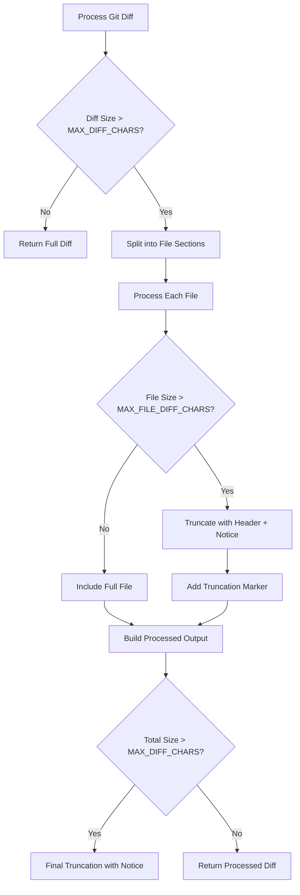
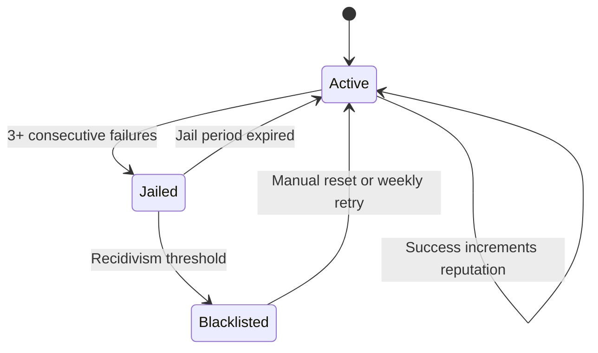

# Advanced Configuration

<cite>
**Referenced Files in This Document**   
- [main.rs](file://src/main.rs)
- [Cargo.toml](file://Cargo.toml)
- [readme.md](file://readme.md)
</cite>

## Table of Contents
1. [Introduction](#introduction)
2. [Advanced Configuration Parameters](#advanced-configuration-parameters)
3. [Runtime Behavior Tuning](#runtime-behavior-tuning)
4. [Interactive Reconfiguration](#interactive-reconfiguration)
5. [Use Cases and Optimization Strategies](#use-cases-and-optimization-strategies)
6. [Configuration Validation and Schema Compliance](#configuration-validation-and-schema-compliance)

## Introduction
This document details advanced configuration options for the aicommit tool that influence internal behavior beyond basic provider settings. While not explicitly documented in the README, these parameters can be manually added to the configuration file to optimize performance, reliability, and cost efficiency. The system leverages Rust's lazy_static and env_logger for runtime tuning while using dialoguer for interactive reconfiguration. Understanding these advanced options enables users to tailor the tool for specific environments and use cases.

**Section sources**
- [readme.md](file://readme.md#L238-L287)

## Advanced Configuration Parameters
The aicommit tool exposes several advanced configuration parameters that control internal behavior and performance characteristics. These parameters are not exposed through command-line arguments but can be manually added to the `~/.aicommit.json` configuration file.

### Diff Formatting Rules
The tool implements intelligent diff processing to prevent excessive API usage and maintain performance:

- **MAX_DIFF_CHARS**: Global limit of 15,000 characters for the entire diff output
- **MAX_FILE_DIFF_CHARS**: Per-file limit of 3,000 characters for individual file diffs

When these limits are exceeded, the system intelligently truncates large files while preserving context headers, adding clear truncation notices. This prevents overwhelming LLM providers with excessively large inputs while maintaining meaningful context for commit message generation.



**Diagram sources**
- [main.rs](file://src/main.rs#L1056-L1122)

### Timeout Thresholds for LLM Requests
The system implements multiple timeout mechanisms to ensure responsiveness and prevent hanging requests:

- **API Client Timeout**: 10 seconds for establishing connections to OpenRouter
- **Model Request Timeout**: 30 seconds for individual model inference requests
- **Model Discovery Timeout**: 15 seconds for fetching available models from OpenRouter API

These timeouts are implemented using tokio::time::timeout and are designed to balance between giving models sufficient time to respond and maintaining application responsiveness. Network-related timeouts are distinguished from model failures to prevent unfairly penalizing reliable models during temporary connectivity issues.

**Section sources**
- [main.rs](file://src/main.rs#L2096-L2127)
- [main.rs](file://src/main.rs#L2761-L2793)

### Custom Cost Tracking for Ollama
While OpenRouter automatically provides token cost information, Ollama configurations support manual cost tracking through optional fields:

- **input_cost_per_1k_tokens**: Manual specification of input token costs
- **output_cost_per_1k_tokens**: Manual specification of output token costs

These fields allow users to track computational costs when running local models, providing visibility into resource consumption even when no monetary cost is incurred. The values are used to generate cost estimates in the output, helping users monitor and optimize their AI usage patterns.

**Section sources**
- [readme.md](file://readme.md#L285-L287)

### Logging Verbosity Levels
The application uses env_logger for comprehensive logging with configurable verbosity levels. While not directly exposed in the configuration file, logging behavior can be controlled through environment variables:

- **RUST_LOG=error**: Show only critical errors
- **RUST_LOG=warn**: Include warnings about potential issues
- **RUST_LOG=info**: Display operational information and progress
- **RUST_LOG=debug**: Show detailed debugging information
- **RUST_LOG=trace**: Maximum verbosity for troubleshooting

This logging infrastructure provides insight into the internal decision-making processes, particularly useful for understanding model selection in Simple Free mode and troubleshooting connectivity issues.

**Section sources**
- [Cargo.toml](file://Cargo.toml#L27)

## Runtime Behavior Tuning
The aicommit tool employs sophisticated runtime behavior tuning mechanisms that adapt to changing conditions and user preferences.

### Lazy Initialization with lazy_static
The application uses lazy_static to manage global configuration state and preferred model lists:

```rust
const PREFERRED_FREE_MODELS: &[&str] = &[
    "meta-llama/llama-4-maverick:free",
    "meta-llama/llama-4-scout:free",
    // ... additional models
];
```

This predefined ranking of free models serves as a fallback when network connectivity is unavailable or when the API query fails. The list prioritizes models by parameter count and quality, ensuring optimal model selection even in offline scenarios. The lazy_static initialization ensures this data structure is created only when first accessed, minimizing startup overhead.

**Section sources**
- [main.rs](file://src/main.rs#L15-L158)

### Model Jail and Blacklist System
The Simple Free OpenRouter implementation includes an advanced model management system with three-tier status tracking:

- **Active**: Models available for immediate use
- **Jailed**: Temporarily restricted due to consecutive failures
- **Blacklisted**: Long-term ban for persistently problematic models

The system tracks detailed statistics for each model:
- Success and failure counts
- Timestamps of last success/failure
- Jail duration and recidivism tracking
- Blacklist status with historical data

Jail durations increase exponentially for repeat offenders (initially 24 hours, doubling with each subsequent offense), while blacklisting occurs after multiple jail periods. This sophisticated system learns from experience, prioritizing reliable models while giving failing models opportunities to rehabilitate after cooling-off periods.



**Diagram sources**
- [main.rs](file://src/main.rs#L440-L486)
- [main.rs](file://src/main.rs#L3016-L3036)

## Interactive Reconfiguration
The tool provides robust interactive reconfiguration capabilities through the dialoguer library, enabling users to modify settings without direct file editing.

### Provider Setup Workflow
The interactive configuration process guides users through provider setup with intelligent defaults:

```mermaid
flowchart TD
A[Initiate Setup] --> B[Select Provider Type]
B --> C[Enter API Key]
C --> D[Configure max_tokens]
D --> E[Set temperature]
E --> F[Save Configuration]
D --> |Default| G["200"]
E --> |Default| H["0.2" for Simple Free, "0.3" otherwise]
```

The workflow presents sensible defaults for advanced parameters like max_tokens (200) and temperature (0.2-0.3), reducing configuration complexity while allowing customization. Provider-specific defaults reflect typical usage patterns and performance characteristics.

**Section sources**
- [main.rs](file://src/main.rs#L723-L774)

### Model Management Commands
The system provides specialized commands for managing the model jail system:

- **--jail-status**: Displays current status of all models, including jail durations and failure statistics
- **--unjail [model-id]**: Releases a specific model from restrictions
- **--unjail-all**: Resets all models to active status

These commands provide transparency into the model selection process and allow users to override automated decisions when appropriate. The --jail-status command is particularly valuable for understanding why certain models aren't being selected and diagnosing connectivity versus model-specific issues.

**Section sources**
- [main.rs](file://src/main.rs#L3038-L3134)

## Use Cases and Optimization Strategies
Understanding advanced configuration options enables optimization for specific use cases and environmental constraints.

### Low-Latency Connection Optimization
For environments with unreliable or high-latency connections, configure the system to prioritize responsiveness:

1. Reduce max_tokens to minimize payload size
2. Implement aggressive timeouts through environment variables
3. Pre-populate the configuration with reliable fallback models
4. Increase retry_attempts to compensate for intermittent failures

This configuration strategy minimizes wait times and improves user experience in challenging network conditions, trading some message quality for reliability and speed.

### Constrained Environment Token Usage Reduction
In environments with limited computational resources or strict token budgets:

1. Set lower max_tokens values to reduce model processing load
2. Configure conservative temperature settings (0.1-0.2) to minimize randomness
3. Utilize the diff truncation features to reduce input size
4. Monitor and adjust based on actual token usage statistics

These adjustments significantly reduce both input and output token consumption, making the tool more efficient and cost-effective when working with rate-limited or expensive LLM providers.

### High-Reliability Production Deployment
For mission-critical deployments requiring maximum reliability:

1. Configure multiple providers as fallbacks
2. Increase retry_attempts to 5-7 for greater resilience
3. Implement monitoring of jail status to proactively address issues
4. Use the simulate_offline flag for testing failover scenarios

This approach creates a robust system capable of maintaining functionality even during extended provider outages or network disruptions.

## Configuration Validation and Schema Compliance
Manual configuration extension requires careful attention to schema compliance to avoid parsing errors.

### Schema Validation Requirements
The configuration system uses serde for JSON serialization/deserialization with strict parsing rules:

- All field names must match exactly (case-sensitive)
- Data types must be correct (strings, numbers, booleans)
- Required fields cannot be omitted
- Unknown fields may cause deserialization failures

Invalid field names or type mismatches will result in configuration loading failures, preventing the application from starting until the issue is resolved.

### Safe Manual Extension Practices
When extending the configuration manually:

1. Always back up the existing configuration
2. Validate JSON syntax before saving
3. Test changes incrementally rather than making multiple modifications at once
4. Verify functionality after each change

The system's strict serde parsing protects against malformed configurations but requires precision when editing manually. Users should consult the codebase documentation in main.rs when uncertain about field names or types.

**Section sources**
- [main.rs](file://src/main.rs#L488-L520)