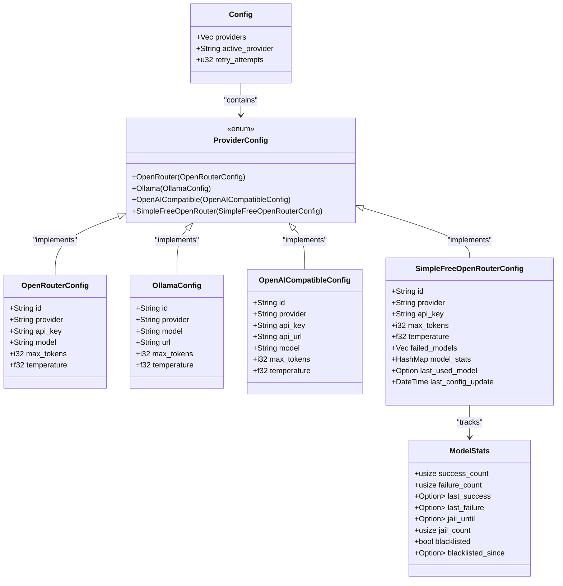

# Configuration File Reference

<cite>
**Referenced Files in This Document **   
- [main.rs](file://src/main.rs)
- [Cargo.toml](file://Cargo.toml)
- [readme.md](file://readme.md)
</cite>

## Table of Contents
1. [Introduction](#introduction)
2. [Configuration Structure](#configuration-structure)
3. [Global Settings](#global-settings)
4. [Provider Configurations](#provider-configurations)
5. [Configuration Loading and Validation](#configuration-loading-and-validation)
6. [Configuration Precedence Rules](#configuration-precedence-rules)
7. [Common Customization Scenarios](#common-customization-scenarios)
8. [Data Persistence and Cross-Platform Path Handling](#data-persistence-and-cross-platform-path-handling)

## Introduction
The `~/.aicommit.json` configuration file is the central configuration mechanism for the aicommit tool, enabling users to manage AI provider settings, define global behavior, and customize commit generation parameters. This document provides comprehensive documentation of the configuration file structure based on the `Config` struct defined in `src/main.rs`. The configuration system supports multiple LLM providers including OpenRouter, Ollama, and OpenAI-compatible endpoints, with special support for free model usage through the Simple Free OpenRouter mode. The configuration interacts with command-line arguments through well-defined precedence rules and is managed using serde for serialization/deserialization and dialoguer for interactive editing.

**Section sources**
- [main.rs](file://src/main.rs#L0-L3192)
- [readme.md](file://readme.md#L0-L734)

## Configuration Structure
The configuration file follows a structured JSON format with three main components: providers, active provider identifier, and global retry attempts. The root configuration object contains an array of provider configurations, each with its own specific settings based on the provider type. The configuration structure is defined by the `Config` struct in `src/main.rs`, which uses serde for serialization and deserialization. Each provider configuration includes unique identifiers, provider type indicators, and provider-specific parameters such as API keys, model names, URLs, and generation parameters.

**Diagram sources **
- [main.rs](file://src/main.rs#L470-L525)
- [main.rs](file://src/main.rs#L374-L381)

**Section sources**
- [main.rs](file://src/main.rs#L470-L525)
- [readme.md](file://readme.md#L238-L287)

## Global Settings
The global configuration settings are defined at the root level of the configuration file and apply to all provider operations. The primary global setting is `retry_attempts`, which determines the number of times the system will attempt to generate a commit message if the initial provider request fails. By default, this value is set to 3, with a 5-second delay between attempts. The retry mechanism shows informative progress messages and can be adjusted based on provider reliability requirements. The retry system is implemented in the `run_commit` function, where it loops through attempts until successful or the retry limit is reached. Other implicit global behaviors include diff size limitations (MAX_DIFF_CHARS set to 15000) and per-file diff character limits (MAX_FILE_DIFF_CHARS set to 3000), which prevent excessive API usage by truncating large diffs.

**Section sources**
- [main.rs](file://src/main.rs#L515-L525)
- [readme.md](file://readme.md#L246-L262)

## Provider Configurations
The configuration supports four distinct provider types, each with specific configuration requirements and capabilities. The OpenRouter provider requires an API key and model name, while the Ollama provider needs a URL and model specification. The OpenAI-compatible provider supports any service with an OpenAI-compatible API endpoint, requiring an API key, URL, and model name. The Simple Free OpenRouter provider offers automated selection of free models from OpenRouter, using only an API key and intelligent failover mechanisms. Each provider configuration includes standard generation parameters such as `max_tokens` (default: 200) and `temperature` (default: 0.3), which control response length and randomness respectively. The Simple Free OpenRouter configuration includes advanced model management features like `failed_models`, `model_stats`, and `last_used_model` to track performance and optimize future selections.

```mermaid
flowchart TD
A["Provider Configuration"] --> B[OpenRouter]
A --> C[Ollama]
A --> D[OpenAI Compatible]
A --> E[Simple Free OpenRouter]
B --> B1["Required: api_key"]
B --> B2["Required: model"]
B --> B3["Optional: max_tokens"]
B --> B4["Optional: temperature"]
C --> C1["Required: url"]
C --> C2["Required: model"]
C --> C3["Optional: max_tokens"]
C --> C4["Optional: temperature"]
D --> D1["Required: api_key"]
D --> D2["Required: api_url"]
D --> D3["Required: model"]
D --> D4["Optional: max_tokens"]
D --> D5["Optional: temperature"]
E --> E1["Required: api_key"]
E --> E2["Optional: max_tokens"]
E --> E3["Optional: temperature"]
E --> E4["Advanced: model_stats"]
E --> E5["Advanced: failed_models"]
E --> E6["Advanced: last_used_model"]
style A fill:#f9f,stroke:#333,stroke-width:2px
```

**Diagram sources **
- [main.rs](file://src/main.rs#L374-L525)
- [readme.md](file://readme.md#L263-L287)

**Section sources**
- [main.rs](file://src/main.rs#L374-L525)
- [readme.md](file://readme.md#L263-L287)

## Configuration Loading and Validation
The configuration system uses serde for JSON serialization and deserialization, with the dirs crate handling cross-platform path resolution for the configuration file location (`~/.aicommit.json`). When loading, the system first checks if the configuration file exists in the user's home directory; if not, it returns a new default configuration. The loading process validates the JSON structure and handles parsing errors gracefully, providing descriptive error messages. Configuration validation occurs through Rust's type system and serde's deserialization process, ensuring that all required fields are present and correctly typed. The system also performs runtime validation, such as checking for valid provider IDs when switching active providers. Interactive configuration editing is supported through the `edit` method, which launches the user's default editor (from the EDITOR environment variable, defaulting to vim) to modify the configuration file directly.

**Section sources**
- [main.rs](file://src/main.rs#L527-L555)
- [main.rs](file://src/main.rs#L828-L865)

## Configuration Precedence Rules
The aicommit tool follows a clear hierarchy of configuration precedence, with command-line arguments taking priority over configuration file settings. When a user specifies a parameter via command-line flag (e.g., `--max-tokens`, `--temperature`, `--openrouter-model`), these values override the corresponding settings in the configuration file for that execution. The configuration file itself serves as the persistent storage for provider settings and global defaults, loaded at application startup. For provider-specific parameters, the active provider's configuration takes precedence within the file-based settings. The precedence order is: command-line arguments > active provider configuration > global configuration defaults. This allows users to temporarily override settings without modifying the persistent configuration, while maintaining consistent defaults for regular usage.

**Section sources**
- [main.rs](file://src/main.rs#L0-L3192)
- [readme.md](file://readme.md#L0-L734)

## Common Customization Scenarios
Users commonly customize the configuration for specific workflows and preferences. Changing the default model involves either updating the `model` field in an existing provider configuration or adding a new provider with the preferred model. Adjusting watch mode delays is accomplished through the `--wait-for-edit` command-line parameter (e.g., `--wait-for-edit 30s`), which accepts time units in seconds (s), minutes (m), or hours (h). Users frequently configure multiple providers and switch between them using the `--set` command with the provider ID. The Simple Free OpenRouter mode is popular for avoiding costs, configured with just an API key and automatically selecting the best available free model. Advanced users customize generation parameters like `max_tokens` and `temperature` to balance message detail and creativity. The configuration can be edited directly using `aicommit --config` or programmatically through non-interactive setup commands.

**Section sources**
- [main.rs](file://src/main.rs#L0-L3192)
- [readme.md](file://readme.md#L0-L734)

## Data Persistence and Cross-Platform Path Handling
The configuration system employs robust data persistence mechanisms using the dirs crate to determine the appropriate configuration directory across different operating systems. The configuration file is stored at `~/.aicommit.json`, with the home directory resolved using `dirs::home_dir()` for cross-platform compatibility. All configuration modifications—whether through interactive setup, non-interactive commands, or direct editing—are immediately persisted to disk using atomic write operations. The system uses serde_json's pretty printing functionality to maintain human-readable JSON formatting with proper indentation. Error handling during file operations provides descriptive messages for common issues like permission errors or disk space limitations. The configuration file is created with appropriate permissions when first initialized, and the system gracefully handles cases where the home directory cannot be determined. This cross-platform approach ensures consistent behavior on Windows, macOS, and Linux systems.

**Section sources**
- [main.rs](file://src/main.rs#L539-L555)
- [main.rs](file://src/main.rs#L834-L855)