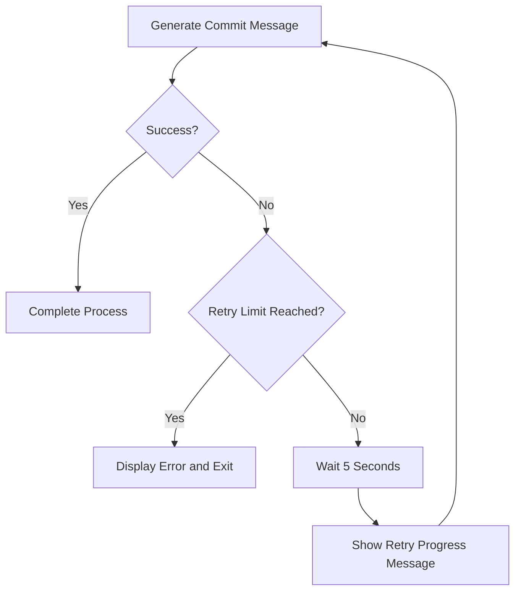

# Global Settings

<cite>
**Referenced Files in This Document **   
- [main.rs](file://src/main.rs)
- [readme.md](file://readme.md)
</cite>

## Table of Contents
1. [Introduction](#introduction)
2. [Configuration File Location and Access](#configuration-file-location-and-access)
3. [Core Global Settings](#core-global-settings)
4. [active_provider Configuration](#active_provider-configuration)
5. [retry_attempts Behavior and Retry Mechanism](#retry_attempts-behavior-and-retry-mechanism)
6. [Configuration Validation and Loading](#configuration-validation-and-loading)
7. [Interactive Configuration Management](#interactive-configuration-management)
8. [CLI Argument Precedence](#cli-argument-precedence)
9. [Common Issues and Troubleshooting](#common-issues-and-troubleshooting)
10. [Integration Context](#integration-context)

## Introduction
This document provides comprehensive documentation for the global settings in the `~/.aicommit.json` configuration file used by the aicommit tool. The configuration system enables users to customize the behavior of AI-powered commit message generation, manage provider selection, and control retry mechanisms. Key settings such as `active_provider` (which references providers by UUID) and `retry_attempts` (which governs retry behavior on API failures) are central to the tool's reliability and user experience. This documentation explains how these settings affect overall tool behavior, including fallback mechanisms during provider failures and user feedback during retry attempts. The document also covers configuration validation using serde, cross-platform file location via the dirs crate, interactive editing through the `--config` flag, and the precedence rules that determine how command-line arguments override configuration file values.

## Configuration File Location and Access
The aicommit configuration is stored in a JSON file located at `~/.aicommit.json`, where `~` represents the user's home directory. This location is determined programmatically using the `dirs` crate, which ensures cross-platform compatibility across different operating systems (Windows, macOS, Linux). The configuration file can be created, modified, or viewed through multiple methods. Users can directly edit the file using any text editor, or they can use the built-in interactive configuration interface by running `aicommit --config`. This command launches an interactive editor that validates changes and ensures the configuration remains in a valid state. When the configuration file does not exist, the application creates a default configuration with empty providers and default retry settings upon first use. The configuration loading process is handled by the `Config::load()` method in the main application, which safely handles cases where the home directory cannot be determined or where the configuration file is missing or malformed.

**Section sources**
- [main.rs](file://src/main.rs#L520-L534)
- [readme.md](file://readme.md#L238-L245)

## Core Global Settings
The global configuration in `~/.aicommit.json` consists of three primary fields: `providers`, `active_provider`, and `retry_attempts`. The `providers` array contains all configured LLM providers with their respective settings, while `active_provider` specifies which provider from this list should be used for generating commit messages. The `retry_attempts` field controls the number of times the application will attempt to generate a commit message if the initial provider call fails. These settings work together to create a robust system for AI-powered commit message generation. The configuration structure is defined by the `Config` struct in the application code, which uses serde for serialization and deserialization. Default values are applied when specific settings are omitted, with `retry_attempts` defaulting to 3. The configuration supports multiple provider types including OpenRouter, Ollama, OpenAI-compatible endpoints, and the specialized Simple Free OpenRouter mode that automatically selects from available free models.

**Section sources**
- [main.rs](file://src/main.rs#L520-L522)
- [readme.md](file://readme.md#L246-L262)

## active_provider Configuration
The `active_provider` setting is a string field that contains the UUID identifier of the currently selected provider from the `providers` array. This UUID-based reference system allows for reliable provider selection even when provider details change, as the identifier remains constant throughout the provider's lifecycle. When configuring multiple providers, users can switch between them by updating the `active_provider` field to match the desired provider's ID. The application validates that the specified UUID corresponds to an existing provider in the configuration during startup. If the referenced provider is not found, the application returns an error indicating "Provider 'uuid' not found". Provider IDs are generated as version 4 UUIDs when new providers are added, ensuring uniqueness across installations. The active provider determines which LLM endpoint will be used to generate commit messages, making this setting crucial for directing the tool's behavior. Users can view their current provider configuration and IDs by running `aicommit --list`.

**Section sources**
- [main.rs](file://src/main.rs#L520-L520)
- [main.rs](file://src/main.rs#L1587-L1637)
- [readme.md](file://readme.md#L275-L287)

## retry_attempts Behavior and Retry Mechanism
The `retry_attempts` setting controls the number of retry attempts the application will make when a provider fails to generate a commit message. By default, this value is set to 3, meaning the application will attempt to generate a message up to four times (the initial attempt plus three retries) before failing. When a provider call fails, the application waits 5 seconds before each retry attempt, providing time for transient network issues to resolve. During the retry process, the application displays informative messages about the retry progress, keeping users informed about what is happening. This retry mechanism enhances reliability when working with cloud-based LLM providers that may experience temporary outages or rate limiting. Users can adjust this value based on their network stability and provider reliability needs—for example, increasing it to 5 for less stable connections or decreasing it to 1 for faster failure detection. The retry logic is implemented in the main execution flow, where failed attempts trigger a delay before recursively attempting message generation again.

**Diagram sources **
- [main.rs](file://src/main.rs#L522-L522)
- [readme.md](file://readme.md#L249-L253)

**Section sources**
- [main.rs](file://src/main.rs#L521-L525)
- [readme.md](file://readme.md#L249-L253)

## Configuration Validation and Loading
Configuration validation and loading is handled through Rust's serde framework, which provides robust serialization and deserialization capabilities for the JSON configuration format. The `Config` struct implements serde's `Serialize` and `Deserialize` traits, enabling automatic conversion between the in-memory representation and the JSON file format. Default values are applied through serde attributes, such as `#[serde(default = "default_retry_attempts")]` for the `retry_attempts` field, ensuring sensible defaults when values are omitted. The loading process begins by constructing the configuration path using `dirs::home_dir().join(".aicommit.json")`, then checking if the file exists. If the file is missing, a default configuration is returned; otherwise, the file contents are read and parsed. Any parsing errors result in descriptive error messages that help users identify configuration issues. The validation process occurs at multiple levels: syntactic validation of JSON structure, semantic validation of field types, and logical validation of provider references. This multi-layered approach ensures configuration integrity and prevents runtime errors due to malformed settings.

**Section sources**
- [main.rs](file://src/main.rs#L520-L534)
- [main.rs](file://src/main.rs#L548-L570)

## Interactive Configuration Management
Users can interactively manage their configuration through the `--config` command-line flag, which provides a direct interface for editing the configuration file. When executed as `aicommit --config`, this command invokes the `Config::edit()` method that opens the configuration file in the user's default text editor. After editing, the application reloads the configuration and validates its structure, providing immediate feedback if syntax errors are detected. This interactive approach lowers the barrier to configuration management, allowing users to modify settings without needing to locate the configuration file manually. The edit functionality is integrated into the main application loop, where it's processed before other operations to ensure configuration changes take effect immediately. For provider management, additional interactive commands are available: `--add-provider` launches an interactive setup wizard for adding new providers, while `--set` allows users to change the active provider by specifying a provider ID. These interactive features create a user-friendly configuration experience that complements direct file editing.

**Section sources**
- [main.rs](file://src/main.rs#L1634-L1636)
- [readme.md](file://readme.md#L238-L245)

## CLI Argument Precedence
Command-line arguments take precedence over configuration file values, allowing users to override settings temporarily without modifying the persistent configuration. This precedence hierarchy ensures that explicit user commands on the command line supersede stored configuration values. For example, if a user specifies `--max-tokens 100` on the command line, this value will be used even if the configuration file specifies a different value for the same provider. The application processes command-line arguments after loading the configuration file, effectively layering the CLI values on top of the loaded configuration. This design supports both persistent configuration through the JSON file and ephemeral overrides through command-line flags. The precedence system is particularly useful for testing different providers or settings without committing to permanent changes. It also enables automation scripts to use different configurations for different contexts without modifying the user's default settings. The implementation of this precedence is handled in the main application logic, where CLI parameters are applied to the loaded configuration before execution.

**Section sources**
- [main.rs](file://src/main.rs#L1634-L1668)
- [readme.md](file://readme.md#L238-L287)

## Common Issues and Troubleshooting
Several common issues can arise with the global configuration settings, along with corresponding troubleshooting strategies. Invalid UUID references in the `active_provider` field occur when the specified provider ID does not match any provider in the `providers` array, typically due to manual editing errors or provider removal. This results in an error message indicating the provider was not found. To resolve this, users should verify the provider ID using `aicommit --list` and update the `active_provider` field accordingly. Excessive retry delays can occur when `retry_attempts` is set too high, potentially causing long wait times during provider outages. Users experiencing this issue should consider reducing the retry count or addressing underlying connectivity problems. Other common issues include malformed JSON syntax, missing required fields, or incorrect data types. The application provides descriptive error messages for most configuration problems, guiding users toward resolution. For persistent issues, users can reset their configuration by removing the `~/.aicommit.json` file and reconfiguring through the interactive setup process.

**Section sources**
- [main.rs](file://src/main.rs#L1623-L1624)
- [readme.md](file://readme.md#L249-L253)

## Integration Context
The global settings in `~/.aicommit.json` integrate with various aspects of the application's functionality and external systems. The configuration system works in conjunction with the VS Code extension, which accesses similar settings through the editor's configuration API, creating a consistent experience across different interfaces. Provider configuration extends beyond the global settings to include provider-specific options like `max_tokens` and `temperature`, which are stored within individual provider objects in the `providers` array. The retry mechanism integrates with the user interface by providing real-time feedback during retry attempts, maintaining transparency about the application's status. Network resilience features, such as the fallback to predefined free models when connectivity is unavailable, depend on the proper configuration of retry settings and provider options. The configuration also interacts with version management features, as certain operations may have different requirements based on the active provider's capabilities. This integrated approach ensures that the global settings function as a cohesive system rather than isolated configuration options.

**Section sources**
- [main.rs](file://src/main.rs#L520-L522)
- [readme.md](file://readme.md#L238-L287)