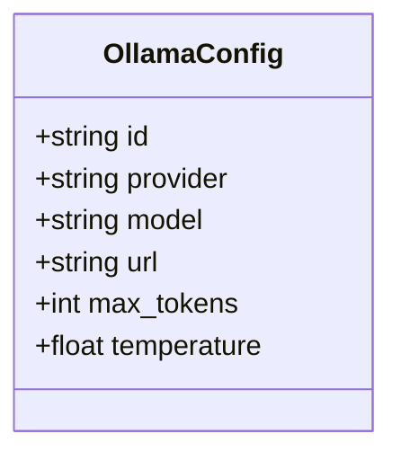
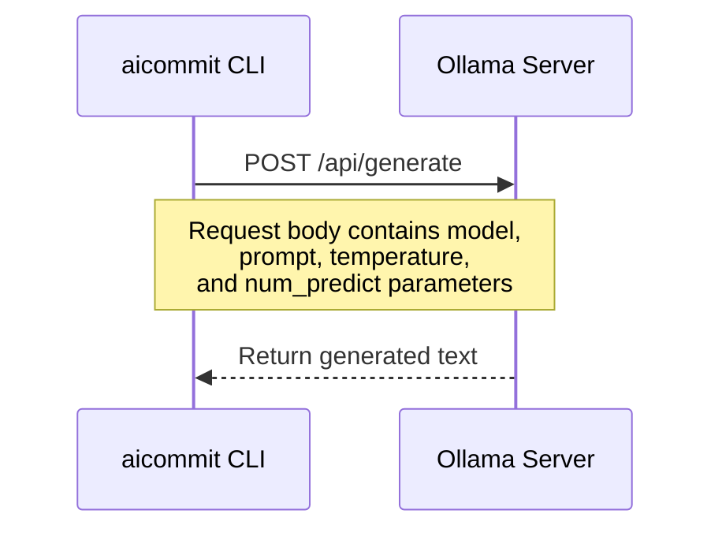

# Ollama Provider Settings

<cite>
**Referenced Files in This Document**   
- [main.rs](file://src/main.rs)
</cite>

## Table of Contents
1. [Introduction](#introduction)
2. [Configuration Structure](#configuration-structure)
3. [Field Definitions](#field-definitions)
4. [Communication with Ollama Server](#communication-with-ollama-server)
5. [Cost Tracking Capabilities](#cost-tracking-capabilities)
6. [Practical Configuration Examples](#practical-configuration-examples)
7. [Troubleshooting Guide](#troubleshooting-guide)
8. [Model Management](#model-management)

## Introduction
This document provides comprehensive guidance on configuring the Ollama provider within the `~/.aicommit.json` configuration file. The Ollama integration enables local AI model execution for generating git commit messages through a simple, efficient interface that communicates directly with the Ollama server running on your machine.

**Section sources**
- [main.rs](file://src/main.rs#L488-L504)

## Configuration Structure
The Ollama provider configuration follows a structured JSON format with specific fields that control how the tool interacts with local models. Each provider entry in the configuration file contains essential parameters for establishing connections, specifying models, and controlling generation behavior.

**Diagram sources**
- [main.rs](file://src/main.rs#L488-L504)

**Section sources**
- [main.rs](file://src/main.rs#L488-L504)

## Field Definitions
The Ollama provider configuration includes several key fields that determine its behavior:

- **id**: A UUIDv4 identifier that uniquely identifies this provider instance within the configuration
- **provider**: Must be set to "ollama" to specify the Ollama provider type
- **api_key**: Optional field; typically not required as Ollama runs locally without authentication
- **model**: Specifies the local model name (e.g., "llama3", "mistral", or "llama2")
- **max_tokens**: Controls the maximum number of tokens in the generated response (default: 200)
- **temperature**: Determines the randomness of the output (default: 0.3), where lower values produce more deterministic results

These fields are implemented as part of the `OllamaConfig` struct in the application code, ensuring type safety and proper serialization.

**Section sources**
- [main.rs](file://src/main.rs#L488-L504)

## Communication with Ollama Server
The tool communicates with the local Ollama server using HTTP requests to the default endpoint at `http://localhost:11434`. This connection is established when generating commit messages, with the application sending POST requests to the `/api/generate` endpoint containing the prompt and configuration parameters.

Users can override the default endpoint through either configuration settings or environment variables. The URL can be customized during setup via the `--ollama-url` command-line parameter or by directly editing the configuration file. When making requests, the tool constructs the full URL by combining the configured endpoint with the appropriate API path.

**Diagram sources**
- [main.rs](file://src/main.rs#L2466-L2512)

**Section sources**
- [main.rs](file://src/main.rs#L2466-L2512)

## Cost Tracking Capabilities
While Ollama typically runs locally without direct costs, the system provides optional manual cost tracking capabilities for usage monitoring. Users can define custom cost per token values to track resource utilization, even though actual monetary costs are generally zero for local execution.

The cost calculation uses a rough approximation based on character count divided by four to estimate token usage. Both input (diff) and output (commit message) tokens are tracked, with the system reporting these metrics during verbose operations. This feature allows users to monitor their usage patterns and optimize their workflow accordingly.

**Section sources**
- [main.rs](file://src/main.rs#L2500-L2510)

## Practical Configuration Examples
When configuring popular Ollama models, users can specify various parameters to optimize performance. For example, setting up a llama3 model would involve specifying "llama3" as the model name with appropriate temperature and token limits. Similarly, using the mistral model requires setting the model field to "mistral" while adjusting temperature for desired creativity levels.

Configuration can be done interactively through the setup process or non-interactively using command-line parameters such as `--add-ollama`, `--ollama-model`, and `--ollama-url`. These options allow for automated configuration in scripts or CI/CD environments.

**Section sources**
- [main.rs](file://src/main.rs#L895-L923)

## Troubleshooting Guide
Common issues with Ollama integration include connection failures, missing models, and model loading errors. Connection failures typically occur when the Ollama server is not running or when the URL is incorrectly configured. Ensure the Ollama service is active and verify the endpoint matches the configured URL.

Missing models result from attempting to use models that haven't been downloaded yet. Model loading errors may occur due to insufficient system resources or corrupted model files. When encountering these issues, check server status, verify model availability, and ensure adequate memory and storage space.

**Section sources**
- [main.rs](file://src/main.rs#L2490-L2495)

## Model Management
Before using any model with Ollama, it must be pulled to the local system using the Ollama CLI. This process downloads the model weights and prepares them for execution. Users should pull models using commands like `ollama pull llama3` or `ollama pull mistral` before attempting to use them in the configuration.

The interactive setup process guides users through selecting and configuring models, with default values provided for convenience. Non-interactive configuration allows automation of this process through command-line parameters, enabling scripted deployments and consistent configurations across multiple environments.

**Section sources**
- [main.rs](file://src/main.rs#L776-L836)