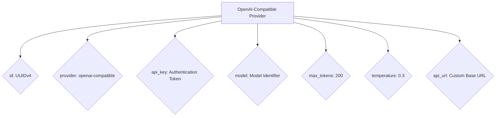
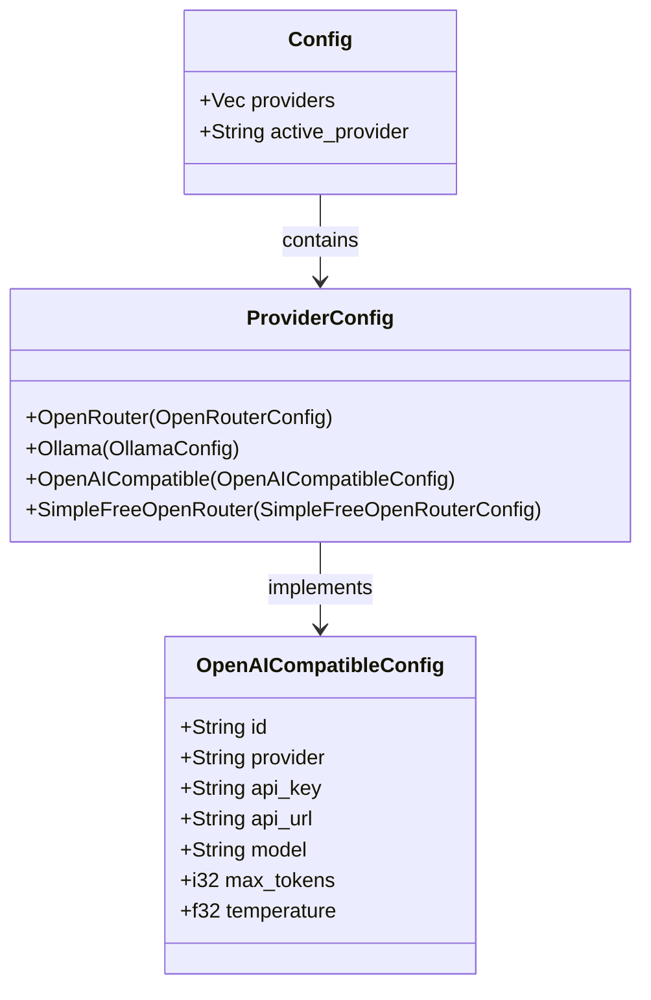
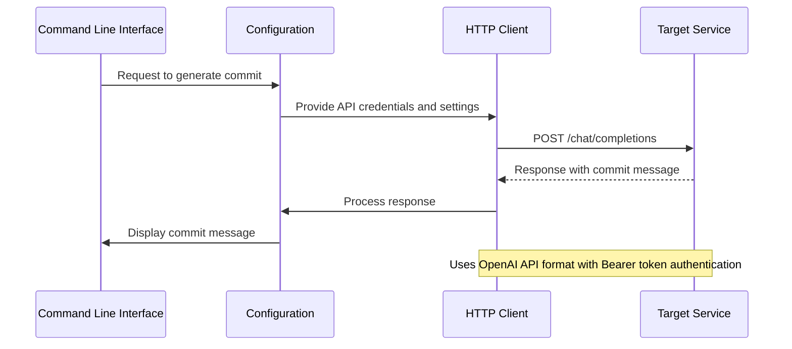

# OpenAI-Compatible Provider Settings

<cite>
**Referenced Files in This Document **   
- [main.rs](file://src/main.rs)
- [readme.md](file://readme.md)
</cite>

## Table of Contents
1. [Configuration Overview](#configuration-overview)
2. [Field Specifications](#field-specifications)
3. [Provider Implementation](#provider-implementation)
4. [HTTP Client Setup](#http-client-setup)
5. [Working Examples](#working-examples)
6. [Debugging Common Issues](#debugging-common-issues)
7. [Interoperability Considerations](#interoperability-considerations)

## Configuration Overview

The OpenAI-compatible provider configuration enables integration with various LLM services through standardized API endpoints. The configuration is stored in `~/.aicommit.json` and supports multiple provider types, including OpenAI-compatible endpoints that can interface with Azure OpenAI, Groq, local inference servers (like llama.cpp), and other services implementing the OpenAI API format.



**Diagram sources **
- [main.rs](file://src/main.rs#L895-L923)
- [readme.md](file://readme.md#L238-L287)

**Section sources**
- [main.rs](file://src/main.rs#L895-L923)
- [readme.md](file://readme.md#L238-L287)

## Field Specifications

### id (UUIDv4)
Unique identifier for the provider configuration, generated using UUID version 4 standard. This field serves as the reference key when managing multiple providers.

[SPEC SYMBOL](file://src/main.rs#L776-L804)

### provider: 'openai-compatible'
Specifies the provider type as OpenAI-compatible, enabling the system to route requests through the appropriate handler that constructs OpenAI-formatted API calls.

[SPEC SYMBOL](file://src/main.rs#L895-L923)

### api_key
Authentication token required by the target endpoint. For local services like LM Studio, any non-empty string may be accepted as the API key since authentication might be disabled.

[SPEC SYMBOL](file://src/main.rs#L965-L1000)

### model
Identifier for the specific model to be used at the target service. This must match one of the models supported by the endpoint being accessed.

[SPEC SYMBOL](file://src/main.rs#L895-L923)

### max_tokens
Maximum number of tokens in the response, with a default value of 200. This parameter controls the length of the generated commit message.

[SPEC SYMBOL](file://src/main.rs#L965-L1000)

### temperature
Controls randomness in the response generation, with a default value of 0.3. Lower values produce more deterministic outputs while higher values increase creativity.

[SPEC SYMBOL](file://src/main.rs#L965-L1000)

### Custom Base URL Requirement
The base URL for the API endpoint must be specified either through an environment variable or directly in the wrapper configuration. This allows connection to custom deployments and local instances.

[SPEC SYMBOL](file://src/main.rs#L965-L1000)

**Section sources**
- [main.rs](file://src/main.rs#L965-L1000)
- [readme.md](file://readme.md#L238-L287)

## Provider Implementation

The OpenAI-compatible provider implementation follows Rust's enum-based configuration pattern, allowing multiple provider types to coexist within the same configuration structure. When adding a new OpenAI-compatible provider, the system validates required fields and constructs a configuration object with all necessary parameters.



**Diagram sources **
- [main.rs](file://src/main.rs#L895-L923)

**Section sources**
- [main.rs](file://src/main.rs#L895-L923)

## HTTP Client Setup

The HTTP client in src/main.rs dynamically constructs requests compatible with the OpenAI API format. It uses the reqwest library to send POST requests to the specified API URL with proper headers and JSON payload formatting.



**Diagram sources **
- [main.rs](file://src/main.rs#L2582-L2626)

**Section sources**
- [main.rs](file://src/main.rs#L2582-L2626)

## Working Examples

### Azure OpenAI Configuration
```json
{
  "id": "550e8400-e29b-41d4-a716-446655440000",
  "provider": "openai-compatible",
  "api_key": "your-azure-api-key",
  "api_url": "https://your-resource.azure.com/openai/deployments/your-deployment/chat/completions?api-version=2023-05-15",
  "model": "gpt-35-turbo",
  "max_tokens": 200,
  "temperature": 0.3
}
```

### Groq Configuration
```json
{
  "id": "67e55044-10b1-426f-9247-bb680e5fe0c8",
  "provider": "openai-compatible",
  "api_key": "your-groq-api-key",
  "api_url": "https://api.groq.com/openai/v1/chat/completions",
  "model": "mixtral-8x7b-32768",
  "max_tokens": 200,
  "temperature": 0.3
}
```

### Local Inference Server (llama.cpp)
```json
{
  "id": "789e5044-10b1-426f-9247-bb680e5fe0c9",
  "provider": "openai-compatible",
  "api_key": "any-string",
  "api_url": "http://localhost:8080/v1/chat/completions",
  "model": "llama-2-7b-chat",
  "max_tokens": 200,
  "temperature": 0.3
}
```

**Section sources**
- [readme.md](file://readme.md#L238-L287)

## Debugging Common Issues

### SSL Errors
When encountering SSL certificate errors with local servers:
- Ensure the server is configured with valid certificates
- For development purposes, consider using HTTP instead of HTTPS on localhost
- Verify that the system trusts the certificate authority

[SPEC SYMBOL](file://src/main.rs#L2407)

### Malformed Responses
To troubleshoot malformed responses:
- Check that the target service returns properly formatted JSON
- Verify the response structure matches OpenAI API specifications
- Use verbose mode (`--verbose`) to inspect raw responses

[SPEC SYMBOL](file://src/main.rs#L2823-L2862)

### Authentication Mismatches
For authentication issues:
- Confirm the API key format requirements of the target service
- Check if the service requires additional headers beyond Authorization
- Validate that the API key has appropriate permissions

[SPEC SYMBOL](file://src/main.rs#L2600)

**Section sources**
- [main.rs](file://src/main.rs#L2407)
- [main.rs](file://src/main.rs#L2600)
- [main.rs](file://src/main.rs#L2823-L2862)

## Interoperability Considerations

The OpenAI-compatible provider design emphasizes flexibility and interoperability across different services. By adhering to the OpenAI API specification, it enables seamless integration with various platforms while maintaining consistent configuration patterns.

Key interoperability features include:
- Standardized request/response formats
- Flexible authentication mechanisms
- Dynamic URL configuration
- Consistent error handling across providers

This approach allows users to switch between different LLM services without changing their workflow, promoting vendor neutrality and future-proofing the tool against service availability changes.

**Section sources**
- [main.rs](file://src/main.rs#L895-L923)
- [readme.md](file://readme.md#L238-L287)