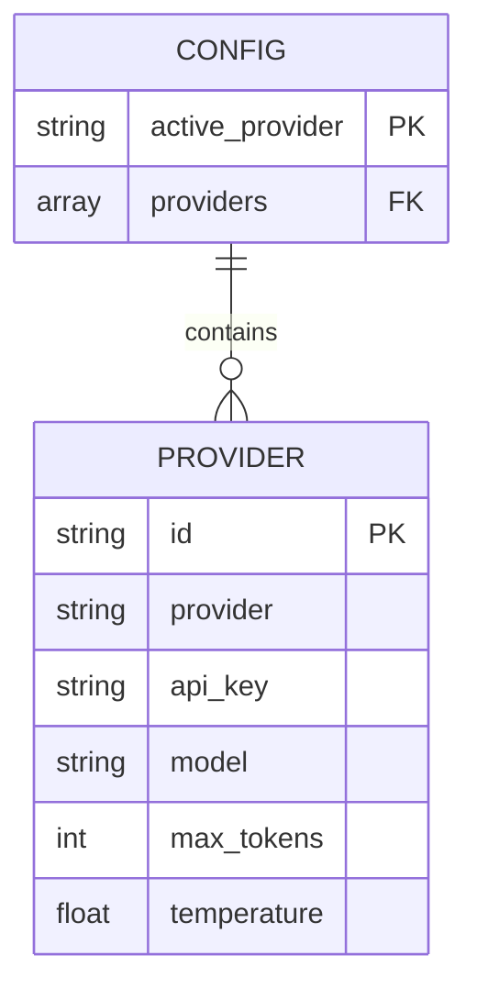
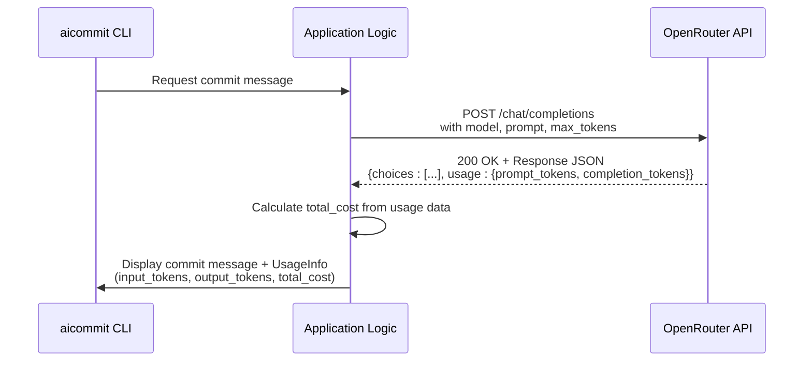

# OpenRouter Provider Settings

<cite>
**Referenced Files in This Document**   
- [main.rs](file://src/main.rs)
- [.aicommit.json](file://~/.aicommit.json)
- [all_models.json](file://openrouter_models/all_models.json)
- [free_models.json](file://openrouter_models/free_models.json)
</cite>

## Table of Contents
1. [Introduction](#introduction)
2. [Configuration File Structure](#configuration-file-structure)
3. [Field Definitions](#field-definitions)
4. [Token Cost Retrieval Mechanism](#token-cost-retrieval-mechanism)
5. [Security Practices](#security-practices)
6. [Model Selection Impact](#model-selection-impact)
7. [Real-World Configuration Examples](#real-world-configuration-examples)
8. [Debugging Common Issues](#debugging-common-issues)

## Introduction
This document provides comprehensive guidance on configuring the OpenRouter provider within the `~/.aicommit.json` configuration file. The aicommit tool leverages Large Language Models (LLMs) via the OpenRouter API to generate concise and descriptive git commit messages. Proper configuration ensures secure, cost-effective, and reliable operation. This guide details each configuration field, explains how token costs are automatically retrieved, outlines security best practices, and provides troubleshooting steps for common issues.

## Configuration File Structure
The `~/.aicommit.json` file stores provider configurations as a JSON array under the "providers" key, with an "active_provider" field indicating the currently used provider by its UUID identifier. Each provider entry contains specific configuration parameters. For OpenRouter, this includes authentication credentials, model selection, and generation parameters.



**Diagram sources**
- [main.rs](file://src/main.rs#L431-L450)

**Section sources**
- [main.rs](file://src/main.rs#L538-L630)

## Field Definitions
Each OpenRouter provider configuration requires several fields that control authentication, model behavior, and response generation.

### id
The **id** field is a UUIDv4 string that uniquely identifies a specific provider configuration within the `~/.aicommit.json` file. This identifier allows the system to manage multiple providers and switch between them using the `--set` command-line option. The ID is automatically generated when a new provider is added.

[SPEC SYMBOL](file://src/main.rs#L433)

### provider
The **provider** field must be set to the string `"openrouter"` to designate this configuration block as an OpenRouter provider. This value is used internally to route API requests to the correct service endpoint and apply provider-specific logic during message generation.

[SPEC SYMBOL](file://src/main.rs#L434)

### api_key
The **api_key** field contains the secret token required to authenticate requests to the OpenRouter API. This key is mandatory for all non-free model interactions and must be kept confidential. It is transmitted in the HTTP Authorization header for every API call.

[SPEC SYMBOL](file://src/main.rs#L435)

### model
The **model** field specifies the exact LLM to use for generating commit messages. The value must be a valid OpenRouter model ID, such as `"mistralai/mistral-tiny"`. The model ID determines the capabilities, context length, and pricing of the service. A list of available models can be found in the `openrouter_models/all_models.json` file.

[SPEC SYMBOL](file://src/main.rs#L436)

### max_tokens
The **max_tokens** field sets the upper limit on the number of tokens in the generated response. This controls the length and detail of the commit message. The default value is 200 tokens, which typically produces concise yet informative messages. Increasing this value may result in more verbose output but also higher costs.

[SPEC SYMBOL](file://src/main.rs#L437)

### temperature
The **temperature** field controls the randomness or creativity of the generated text. It accepts a floating-point value between 0.0 and 1.0. A lower temperature (e.g., 0.0) produces more deterministic and focused output, ideal for technical commit messages. A higher temperature (e.g., 1.0) increases variability and creativity. The default value is 0.3, balancing consistency with natural language flow.

[SPEC SYMBOL](file://src/main.rs#L438)

## Token Cost Retrieval Mechanism
The aicommit application automatically retrieves and calculates token usage and associated costs during each request to the OpenRouter API. This functionality is implemented in the `generate_openrouter_commit_message` function within `src/main.rs`.

When a request is sent to OpenRouter, the API responds with detailed usage statistics in the `usage` field of the response payload. The application parses this data into an `OpenRouterUsage` struct, which contains `prompt_tokens`, `completion_tokens`, and `total_tokens`. These values are then used to construct a `UsageInfo` object that tracks both token consumption and monetary cost.

The cost calculation is performed client-side based on pricing information obtained from the OpenRouter API. The application does not need to store pricing data locally, ensuring accurate cost tracking even when model prices change. This information is reported back to the user after each commit message generation.



**Diagram sources**
- [main.rs](file://src/main.rs#L1140-L1339)
- [main.rs](file://src/main.rs#L2350-L2449)

**Section sources**
- [main.rs](file://src/main.rs#L1140-L1339)

## Security Practices
Proper security practices are essential when handling API keys and configuration data.

### Environment Variable Injection
For enhanced security, the OpenRouter API key can be provided via the `OPENROUTER_API_KEY` environment variable instead of being stored directly in the configuration file. When present, this environment variable takes precedence over any `api_key` value in `~/.aicommit.json`. This approach prevents accidental exposure of the key through version control systems or configuration file backups.

[SPEC SYMBOL](file://src/main.rs#L955)

### Secure Storage
When an API key is stored in `~/.aicommit.json`, the file should have restrictive permissions (e.g., 600) to prevent unauthorized access. Users are advised to treat this file with the same level of security as other sensitive credentials. The configuration file is stored in the user's home directory and should not be shared or committed to repositories.

[SPEC SYMBOL](file://src/main.rs#L538-L600)

## Model Selection Impact
The choice of model significantly affects both performance and cost.

### Performance Considerations
Larger models generally provide better reasoning and contextual understanding, which can lead to more accurate and meaningful commit messages. Models like `meta-llama/llama-4-maverick:free` offer extensive context windows (256,000 tokens), enabling analysis of large code changes. Smaller models like `mistralai/mistral-tiny` are faster and sufficient for simple changes but may lack depth in complex scenarios.

### Cost Implications
Model selection directly impacts cost. Free models (indicated by `:free` suffix) incur no charges but may have usage limits or lower priority. Paid models are billed per token, with pricing varying significantly between providers. The `all_models.json` file contains up-to-date pricing information for all available models, allowing users to make informed decisions based on their budget and requirements.

[SPEC SYMBOL](file://openrouter_models/all_models.json)
[SPEC SYMBOL](file://openrouter_models/free_models.json)

## Real-World Configuration Examples
Below are practical examples of OpenRouter configurations in the `~/.aicommit.json` file.

### Basic Configuration with Default Model
```json
{
  "providers": [
    {
      "OpenRouter": {
        "id": "f47ac10b-58cc-4372-a567-0e02b2c3d479",
        "provider": "openrouter",
        "api_key": "sk-or-v1-xxxxxxxxxxxxxxxxxxxxxxxxxxxxxxxxxxxxxxxxxxxxxxxxxxxxxxxxxxxxxxxx",
        "model": "mistralai/mistral-tiny",
        "max_tokens": 200,
        "temperature": 0.3
      }
    }
  ],
  "active_provider": "f47ac10b-58cc-4372-a567-0e02b2c3d479"
}
```

### High-Performance Configuration
```json
{
  "providers": [
    {
      "OpenRouter": {
        "id": "a1b2c3d4-e5f6-7890-g1h2-i3j4k5l6m7n8",
        "provider": "openrouter",
        "api_key": "sk-or-v1-yyyyyyyyyyyyyyyyyyyyyyyyyyyyyyyyyyyyyyyyyyyyyyyyyyyyyyyyyyyy",
        "model": "meta-llama/llama-4-maverick",
        "max_tokens": 300,
        "temperature": 0.2
      }
    }
  ],
  "active_provider": "a1b2c3d4-e5f6-7890-g1h2-i3j4k5l6m7n8"
}
```

**Section sources**
- [main.rs](file://src/main.rs#L431-L450)

## Debugging Common Issues
This section addresses frequent problems encountered when using the OpenRouter provider.

### Invalid API Keys
If authentication fails, verify that the API key is correct and has not been revoked. Ensure there are no leading or trailing spaces in the key value. When using environment variables, confirm that `OPENROUTER_API_KEY` is properly set in the current shell session.

[SPEC SYMBOL](file://src/main.rs#L955)

### Unsupported Models
Receiving a 404 or model not found error indicates an invalid model ID. Consult the `all_models.json` file to verify the model exists and is spelled correctly. Some models require special access; ensure your account has permission to use the selected model.

[SPEC SYMBOL](file://openrouter_models/all_models.json)

### Rate Limiting Responses
OpenRouter enforces rate limits based on account tier and model usage. If you receive rate limit errors (HTTP 429), implement retry logic with exponential backoff. The application already includes retry mechanisms, but excessive requests may still be blocked. Consider switching to a different model or upgrading your account if rate limiting persists.

[SPEC SYMBOL](file://src/main.rs#L2350-L2449)

**Section sources**
- [main.rs](file://src/main.rs#L953-L1152)
- [main.rs](file://src/main.rs#L2350-L2449)