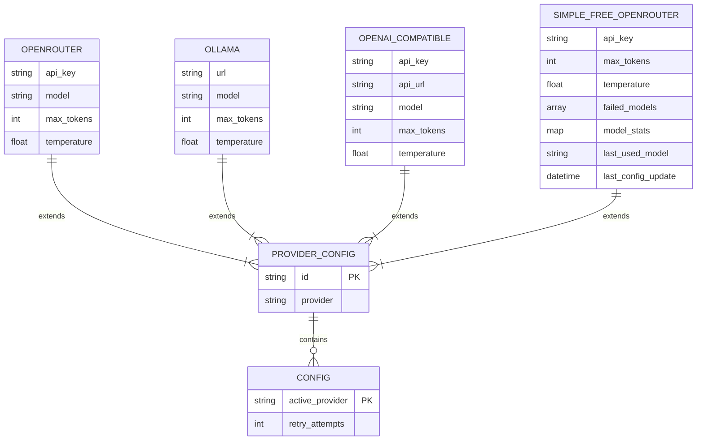
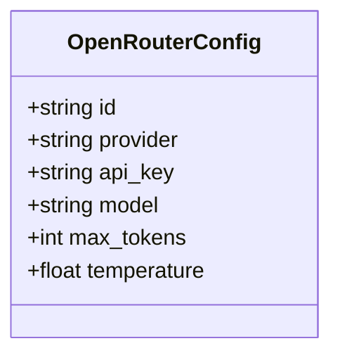
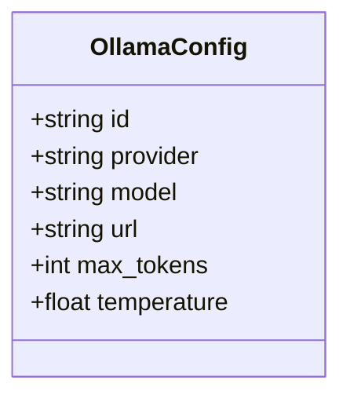
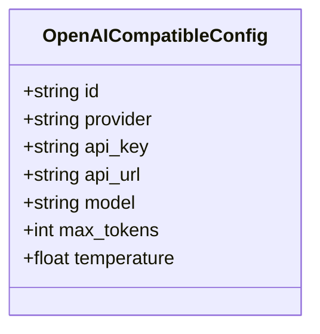
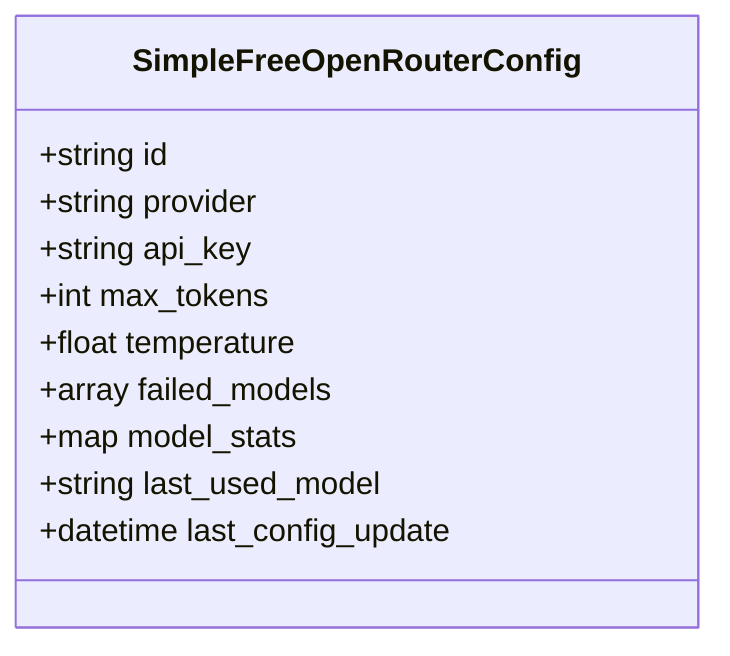

# Provider-specific Settings

<cite>
**Referenced Files in This Document **   
- [main.rs](file://src/main.rs)
- [readme.md](file://readme.md)
</cite>

## Table of Contents
1. [Introduction](#introduction)
2. [Configuration Structure](#configuration-structure)
3. [Field Definitions](#field-definitions)
4. [Provider Configuration Types](#provider-configuration-types)
5. [Deserialization Process](#deserialization-process)
6. [Provider-Specific Behavior](#provider-specific-behavior)
7. [Configuration Examples](#configuration-examples)
8. [Security Considerations](#security-considerations)
9. [Debugging Guidance](#debugging-guidance)

## Introduction
This document details the provider-specific configuration blocks within the ~/.aicommit.json file used by the aicommit CLI tool. The configuration system supports multiple LLM providers through a flexible JSON structure that is deserialized into Rust enum variants using serde. Each provider entry contains specific fields that control API connectivity, model selection, and response generation parameters.

**Section sources**
- [main.rs](file://src/main.rs#L480-L548)
- [readme.md](file://readme.md#L238-L286)

## Configuration Structure
The configuration file follows a structured JSON format with a global configuration section and an array of provider configurations. The root object contains:

- `providers`: Array of provider configuration objects
- `active_provider`: UUID string identifying the currently active provider
- `retry_attempts`: Global setting for retry attempts (default: 3)

Each provider configuration is polymorphic, with different fields based on the provider type, distinguished by the `provider` discriminant field.



**Diagram sources **
- [main.rs](file://src/main.rs#L480-L548)
- [readme.md](file://readme.md#L238-L286)

## Field Definitions
Each provider configuration shares common fields while having provider-specific additional fields.

### Common Fields
All provider types include these core configuration fields:

- `id`: UUIDv4 identifier for the provider instance, generated automatically when adding a new provider
- `provider`: Discriminant string that identifies the provider type ('openrouter', 'ollama', 'openai_compatible', or 'simple_free_openrouter')
- `max_tokens`: Response length limit in tokens (integer, default: 200)
- `temperature`: Creativity control parameter (float, 0.0–1.0, default: 0.3)

### Provider-Specific Fields
Additional fields vary by provider type:

- `api_key`: Secure credential for API authentication (required for OpenRouter and OpenAI-compatible providers, optional for local providers)
- `model`: Selected model identifier (required for all providers except Simple Free OpenRouter)
- `url`: API endpoint URL (required for Ollama and OpenAI-compatible providers)

**Section sources**
- [main.rs](file://src/main.rs#L480-L548)
- [readme.md](file://readme.md#L263-L287)

## Provider Configuration Types
The system implements four distinct provider configuration types, each with its own struct definition in the codebase.

### OpenRouter Configuration
The OpenRouter provider connects to the OpenRouter.ai service using their API. It requires an API key and allows specification of any available model.



**Diagram sources **
- [main.rs](file://src/main.rs#L488-L494)

### Ollama Configuration
The Ollama provider connects to a locally running Ollama server, allowing use of locally hosted models.



**Diagram sources **
- [main.rs](file://src/main.rs#L488-L494)

### OpenAI-Compatible Configuration
This provider connects to any service that provides an OpenAI-compatible API endpoint, such as LM Studio or custom inference servers.



**Diagram sources **
- [main.rs](file://src/main.rs#L496-L503)

### Simple Free OpenRouter Configuration
A specialized configuration for automatic selection of free models from OpenRouter, with advanced failover and model management capabilities.



**Diagram sources **
- [main.rs](file://src/main.rs#L450-L479)

## Deserialization Process
The configuration system uses serde to deserialize JSON into Rust structs, leveraging enums for polymorphic provider handling.

### Enum-Based Deserialization
The `ProviderConfig` enum serves as a container for different provider types, enabling type-safe handling of heterogeneous provider configurations:

```rust
#[derive(Debug, Serialize, Deserialize)]
enum ProviderConfig {
    OpenRouter(OpenRouterConfig),
    Ollama(OllamaConfig),
    OpenAICompatible(OpenAICompatibleConfig),
    SimpleFreeOpenRouter(SimpleFreeOpenRouterConfig),
}
```

The `provider` field acts as a discriminant, guiding serde's deserialization process to instantiate the appropriate struct variant based on the string value.

### Configuration Loading
The `Config::load()` method handles the complete deserialization workflow:
1. Locate ~/.aicommit.json in the user's home directory
2. Read the file contents as a string
3. Parse JSON using serde_json::from_str()
4. Handle deserialization errors with descriptive messages
5. Return a Config struct with properly typed provider instances

The process leverages serde's derive macros to automatically generate serialization/deserialization code, ensuring type safety while minimizing boilerplate.

**Section sources**
- [main.rs](file://src/main.rs#L505-L548)

## Provider-Specific Behavior
Different providers exhibit distinct behaviors in terms of cost tracking, model selection, and operational characteristics.

### OpenRouter Automatic Cost Tracking
When using the OpenRouter provider, token costs are automatically fetched from the OpenRouter API. The system retrieves pricing information dynamically, eliminating the need for manual cost configuration. This ensures accurate cost calculation based on current pricing models.

### Ollama Manual Cost Tracking
For Ollama providers, users can optionally specify manual cost tracking if they wish to monitor usage economics. Since Ollama typically runs locally, costs are often considered zero, but the framework allows for custom cost assignment for organizational tracking purposes.

### Simple Free OpenRouter Intelligence
The Simple Free OpenRouter mode implements sophisticated model management:
- Automatically queries OpenRouter for currently available free models
- Selects the best available model based on a predefined ranking
- Implements a jail/blacklist system for failed models
- Tracks model performance with success/failure counters
- Falls back to predefined models during network outages

**Section sources**
- [main.rs](file://src/main.rs#L15-L799)
- [readme.md](file://readme.md#L286-L287)

## Configuration Examples
Real-world configuration examples for each provider type.

### OpenRouter Example
```json
{
  "providers": [{
    "id": "550e8400-e29b-41d4-a716-446655440000",
    "provider": "openrouter",
    "api_key": "sk-or-v1-...",
    "model": "mistralai/mistral-tiny",
    "max_tokens": 200,
    "temperature": 0.3
  }],
  "active_provider": "550e8400-e29b-41d4-a716-446655440000",
  "retry_attempts": 3
}
```

### Ollama Example
```json
{
  "providers": [{
    "id": "67e55044-10b1-426f-9247-bb680e5fe0c8",
    "provider": "ollama",
    "url": "http://localhost:11434",
    "model": "llama2",
    "max_tokens": 200,
    "temperature": 0.3
  }],
  "active_provider": "67e55044-10b1-426f-9247-bb680e5fe0c8"
}
```

### OpenAI-Compatible Example
```json
{
  "providers": [{
    "id": "a1b2c3d4-e5f6-7890-g1h2-i3j4k5l6m7n8",
    "provider": "openai_compatible",
    "api_key": "your-api-key",
    "api_url": "https://api.example.com/v1/chat/completions",
    "model": "gpt-3.5-turbo",
    "max_tokens": 200,
    "temperature": 0.3
  }],
  "active_provider": "a1b2c3d4-e5f6-7890-g1h2-i3j4k5l6m7n8"
}
```

**Section sources**
- [readme.md](file://readme.md#L263-L287)

## Security Considerations
Proper handling of sensitive configuration data is critical for system security.

### API Key Storage
API keys are stored in plaintext within the ~/.aicommit.json file, which presents a security consideration. The file should have appropriate permissions (600) to prevent unauthorized access. For production environments, consider using environment variables instead.

### Environment Variable Overrides
The system supports environment variable overrides for API keys, allowing secure credential management without storing secrets in configuration files. Users can set API keys via environment variables and reference them in configuration, reducing the risk of accidental exposure.

### Configuration File Location
The configuration file is stored in the user's home directory with a dot prefix (~/.aicommit.json), following Unix conventions for configuration files. This location is generally protected from web server exposure and other external access vectors.

**Section sources**
- [main.rs](file://src/main.rs#L505-L548)
- [readme.md](file://readme.md#L238-L286)

## Debugging Guidance
Common issues and troubleshooting steps for misconfigured providers.

### URL Validation
Ensure API URLs are correctly formatted with proper protocols and endpoints:
- Ollama: Should point to http://localhost:11434 (or custom port)
- OpenAI-compatible: Must include the full path to the chat completions endpoint
- Verify connectivity with curl or similar tools before configuration

### Model Support Verification
Confirm model identifiers are supported by the target provider:
- Check provider documentation for valid model names
- Test model availability through the provider's web interface
- Use provider-specific model listing commands when available

### Configuration Validation
Validate JSON syntax and structure:
- Use JSON validators to check for syntax errors
- Verify required fields are present for each provider type
- Ensure UUIDs are properly formatted as v4 identifiers
- Confirm the active_provider ID matches one of the configured provider IDs

**Section sources**
- [main.rs](file://src/main.rs#L953-L1152)
- [readme.md](file://readme.md#L238-L286)