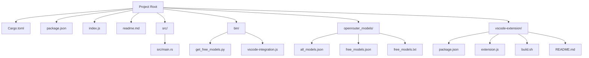
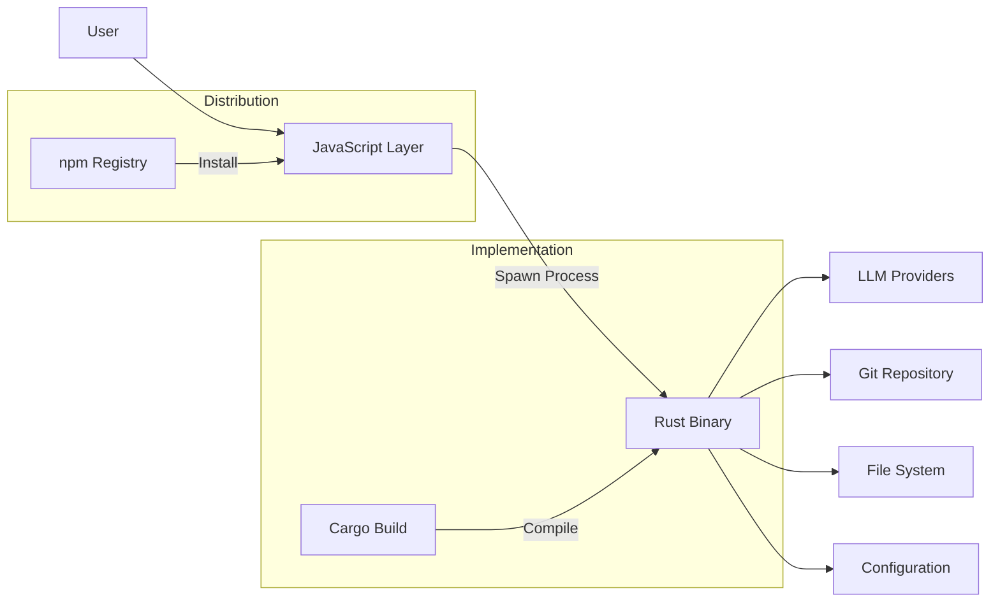
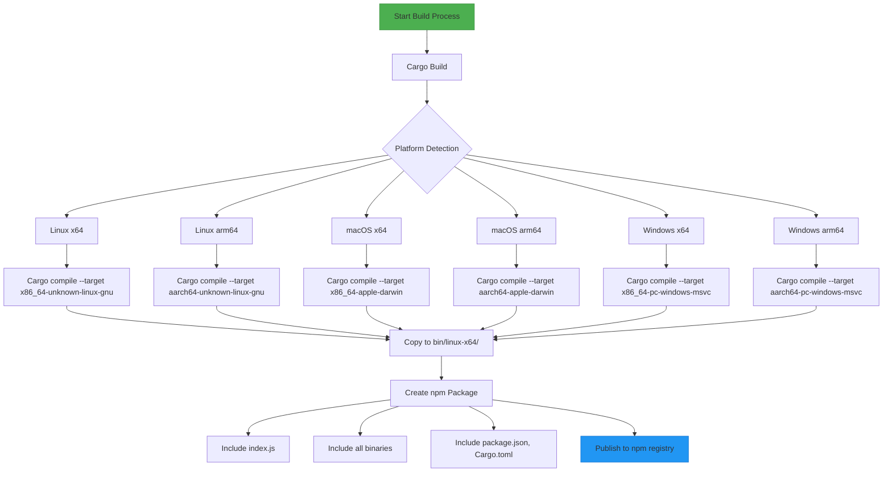
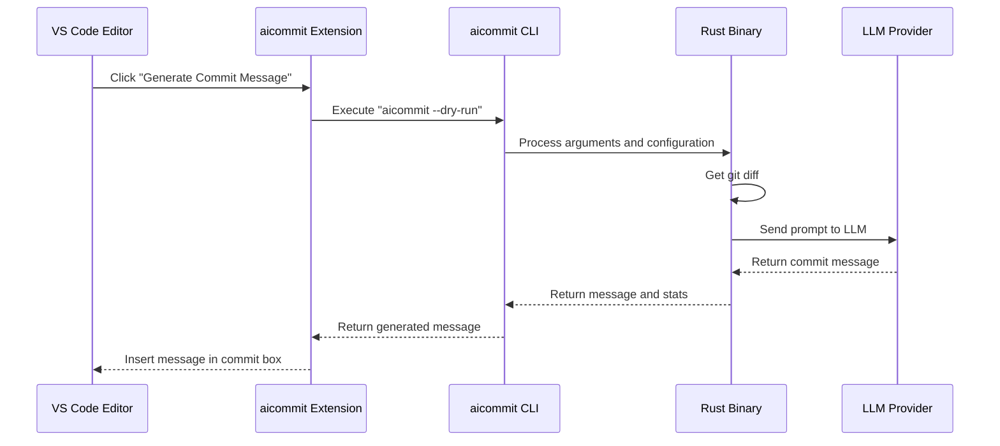

# Development Guide

<cite>
**Referenced Files in This Document**   
- [Cargo.toml](file://Cargo.toml)
- [package.json](file://package.json)
- [index.js](file://index.js)
- [src/main.rs](file://src/main.rs)
- [vscode-extension/package.json](file://vscode-extension/package.json)
</cite>

## Table of Contents
1. [Introduction](#introduction)
2. [Project Structure](#project-structure)
3. [Dual-Language Architecture](#dual-language-architecture)
4. [Build Process](#build-process)
5. [Testing Methodologies](#testing-methodologies)
6. [Contribution Workflow](#contribution-workflow)
7. [Code Style and Linting](#code-style-and-linting)
8. [Dependency Management](#dependency-management)
9. [Debugging Async Operations](#debugging-async-operations)
10. [VS Code Extension Integration](#vs-code-extension-integration)

## Introduction

The aicommit project is a CLI tool that generates concise and descriptive git commit messages using Large Language Models (LLMs). The codebase follows a dual-language architecture with Rust as the primary implementation language for performance-critical operations and JavaScript for distribution and integration purposes.

This development guide provides comprehensive documentation for contributors and maintainers, covering build processes, testing methodologies, contribution workflows, and debugging techniques. The tool supports multiple LLM providers including OpenRouter, Ollama, and OpenAI-compatible endpoints, with a focus on providing intelligent model selection and failover mechanisms.

The project emphasizes ease of use through interactive configuration, automatic version management, and seamless integration with existing development workflows. It includes advanced features such as watch mode for automatic commits, sophisticated model management with jail/blacklist systems, and support for various version control operations.

**Section sources**
- [readme.md](file://readme.md#L1-L734)

## Project Structure

The aicommit repository follows a modular structure that separates concerns between core functionality, distribution, and extension integrations. The project root contains essential configuration files and entry points, while specialized directories handle specific aspects of the application.

The `src` directory contains the Rust implementation in `main.rs`, which constitutes the core logic of the application. The `bin` directory includes utility scripts like `get_free_models.py` for fetching available models from OpenRouter and `vscode-integration.js` for editor integration. Configuration data for LLM providers is stored in the `openrouter_models` directory.

The project includes two package manifests: `Cargo.toml` for Rust dependencies and `package.json` for Node.js packaging. The `index.js` file serves as the JavaScript wrapper that executes the compiled Rust binary. A separate VS Code extension is maintained in the `vscode-extension` directory with its own package configuration and build scripts.

This structure enables independent development of the core CLI tool and its distribution mechanisms while maintaining clear separation between implementation languages and deployment targets.

**Diagram sources **
- [Cargo.toml](file://Cargo.toml#L1-L28)
- [package.json](file://package.json#L1-L58)
- [index.js](file://index.js#L1-L71)

**Section sources**
- [Cargo.toml](file://Cargo.toml#L1-L28)
- [package.json](file://package.json#L1-L58)
- [index.js](file://index.js#L1-L71)

## Dual-Language Architecture

The aicommit project employs a dual-language architecture that leverages the strengths of both Rust and JavaScript to create a robust and accessible CLI tool. Rust serves as the primary implementation language, handling all core functionality including LLM communication, git operations, and configuration management. JavaScript acts as a distribution and integration layer, wrapping the compiled Rust binary for cross-platform execution and enabling npm-based installation.

The architecture follows a clear division of responsibilities: Rust implements the business logic with its strong type system and memory safety guarantees, while JavaScript provides the entry point that users interact with through the `aicommit` command. This approach combines Rust's performance and reliability for critical operations with JavaScript's ecosystem advantages for distribution and package management.

The integration between languages is achieved through the `index.js` file, which determines the appropriate binary path based on the user's platform and architecture, ensures proper permissions, and spawns the Rust binary with the provided arguments. This design allows the tool to be published to npm while maintaining the performance benefits of native compilation.

**Diagram sources **
- [index.js](file://index.js#L1-L71)
- [src/main.rs](file://src/main.rs#L1-L3192)

**Section sources**
- [index.js](file://index.js#L1-L71)
- [src/main.rs](file://src/main.rs#L1-L3192)

## Build Process

The build process for aicommit involves compiling the Rust source code into platform-specific binaries and packaging them with the JavaScript wrapper for distribution via npm. The process leverages both Cargo for Rust compilation and npm scripts for packaging and distribution.

Building the Rust component requires Cargo, which compiles `src/main.rs` into optimized binaries for different platforms. The resulting binaries are placed in architecture-specific directories under `bin/` following the pattern `{platform}-{architecture}`. For example, Linux x64 binaries are stored in `bin/linux-x64/aicommit`. The compilation process includes all dependencies specified in `Cargo.toml` such as tokio for async runtime, reqwest for HTTP requests, and clap for command-line argument parsing.

The JavaScript wrapper defined in `index.js` remains unchanged during the build process but is configured in `package.json` to execute when the `aicommit` command is invoked. The postinstall script automatically makes the index.js file executable. For distribution, the complete package including binaries for all supported platforms is published to npm, allowing users to install it globally with a single command.

**Diagram sources **
- [Cargo.toml](file://Cargo.toml#L1-L28)
- [package.json](file://package.json#L1-L58)
- [index.js](file://index.js#L1-L71)

**Section sources**
- [Cargo.toml](file://Cargo.toml#L1-L28)
- [package.json](file://package.json#L1-L58)
- [index.js](file://index.js#L1-L71)

## Testing Methodologies

The aicommit project employs a multi-layered testing strategy that combines unit tests, integration tests, and manual verification to ensure reliability across different scenarios. While explicit test files are not present in the repository structure, the codebase incorporates testing principles through its design and functionality.

Unit testing focuses on individual functions and components within the Rust implementation, particularly those handling configuration management, model selection algorithms, and string processing. Key functions like `process_git_diff_output`, `increment_version`, and `parse_duration` contain internal validation and error handling that serve as implicit unit tests. The model selection algorithm in `find_best_available_model` includes comprehensive logic for evaluating model availability, jail status, and performance history.

Integration testing is performed through the various operational modes of the tool, particularly the `--dry-run` flag which allows users to generate commit messages without creating actual commits. This mode serves as a safe environment for testing the interaction between components. The watch mode with `--wait-for-edit` provides another integration testing scenario by simulating real-world usage patterns of continuous development and automatic committing.

Manual verification steps include using the `--verbose` flag to inspect the generated prompts sent to LLM providers, examining token usage statistics, and validating the quality of generated commit messages against conventional commits specifications. The VS Code extension also provides a visual interface for testing the integration between the CLI tool and editor environments.

**Section sources**
- [src/main.rs](file://src/main.rs#L1-L3192)
- [readme.md](file://readme.md#L1-L734)

## Contribution Workflow

The contribution workflow for aicommit follows standard open-source practices with specific considerations for the dual-language nature of the project. Contributors begin by setting up a development environment with both Rust and Node.js toolchains, as changes may affect either the core implementation or the distribution layer.

Development setup starts with cloning the repository and installing dependencies. For Rust development, contributors need Cargo to compile and test changes to `src/main.rs`. For JavaScript modifications, Node.js and npm are required to manage the `index.js` wrapper and package configuration. The VS Code extension development requires additional tools like vsce for packaging.

The typical contribution flow involves:
1. Creating a feature branch from main
2. Implementing changes with attention to both Rust and JavaScript components
3. Testing locally using cargo run for direct execution or node index.js for wrapped execution
4. Verifying cross-platform compatibility by testing on different operating systems
5. Submitting a pull request with a clear description of changes and their impact

Pull requests should include updates to relevant documentation, particularly when adding new features or modifying existing behavior. Contributors are encouraged to follow the established code style and patterns, especially regarding error handling and async operations. The project maintains backward compatibility for configuration formats and command-line interfaces.

**Section sources**
- [Cargo.toml](file://Cargo.toml#L1-L28)
- [package.json](file://package.json#L1-L58)
- [index.js](file://index.js#L1-L71)
- [src/main.rs](file://src/main.rs#L1-L3192)

## Code Style and Linting

The aicommit project maintains consistent code style across its dual-language codebase, with distinct conventions for Rust and JavaScript components. The Rust implementation follows idiomatic Rust patterns with proper use of async/await syntax, error propagation with the `?` operator, and structured configuration management through serde serialization.

Rust code style emphasizes readability and safety, using descriptive variable names, comprehensive error messages, and clear function separation. The codebase leverages Rust's type system extensively, with well-defined structs for configuration (`Config`, `ProviderConfig`) and command-line arguments (`Cli`). Error handling follows Rust best practices with Result types and appropriate error conversion.

For the JavaScript components, the VS Code extension includes ESLint configuration as indicated in its package.json, suggesting the use of linting for code quality. The main `index.js` wrapper follows Node.js conventions for process spawning and error handling. Code style prioritizes clarity in the binary execution logic, with proper platform detection and permission management.

Contributors should maintain consistency with existing patterns, particularly in areas like configuration loading, error reporting, and async operation management. The project uses conventional comments and documentation strings to explain complex logic, especially in the model selection and failover algorithms.

**Section sources**
- [src/main.rs](file://src/main.rs#L1-L3192)
- [index.js](file://index.js#L1-L71)
- [vscode-extension/package.json](file://vscode-extension/package.json#L1-L81)

## Dependency Management

The aicommit project manages dependencies through two package managers: Cargo for Rust and npm for JavaScript, reflecting its dual-language architecture. The dependency strategy prioritizes stability, security, and functionality for both the core implementation and distribution layers.

In `Cargo.toml`, the project specifies critical crates that enable its core functionality:
- **tokio**: Provides the async runtime for non-blocking operations like HTTP requests and file I/O
- **reqwest**: Handles HTTP client operations for communicating with LLM providers
- **clap**: Implements command-line argument parsing with comprehensive flag support
- **serde** and **serde_json**: Enable configuration serialization and deserialization
- **dialoguer**: Facilitates interactive user input during provider setup
- **uuid**: Generates unique identifiers for provider configurations

The JavaScript dependencies in `package.json` focus on distribution and integration:
- The package is published to npm with appropriate metadata and versioning
- Scripts automate common tasks like documentation building and VS Code extension packaging
- The postinstall script ensures proper execution permissions for the wrapper

Dependencies are carefully selected to minimize attack surface while providing necessary functionality. The project avoids unnecessary transitive dependencies and maintains up-to-date versions to address security vulnerabilities. The dual dependency management allows each language component to leverage its ecosystem's strengths while maintaining clear boundaries between implementation and distribution concerns.

```mermaid
graph TD
Rust[Rust Dependencies] --> Tokio[tokio: Async Runtime]
Rust --> Reqwest[reqwest: HTTP Client]
Rust --> Clap[clap: CLI Arguments]
Rust --> Serde[serde: Serialization]
Rust --> Dialoguer[dialoguer: User Input]
Rust --> Uuid[uuid: Unique IDs]
Rust --> Console[console: Terminal Output]
Rust --> Dirs[dirs: Home Directory]
Rust --> Regex[regex: Pattern Matching]
Rust --> Log[log: Logging]
Rust --> EnvLogger[env_logger: Environment Logging]
Rust --> LazyStatic[lazy_static: Static Initialization]
Rust --> Chrono[chrono: Date/Time]
JS[JavaScript Dependencies] --> NPM[npm: Package Manager]
JS --> Node[node: Runtime]
JS --> Vsce[vsce: VS Code Extension Packaging]
JS --> ESLint[eslint: Code Linting]
BuildProcess[Build Process] --> Cargo[Cargo Build]
BuildProcess --> NPMInstall[npm install]
Cargo --> Rust
NPMInstall --> JS
style Rust fill:#8B4513,stroke:#A0522D
style JS fill:#306998,stroke:#4B70A1
style BuildProcess fill:#4CAF50,stroke:#388E3C
```

**Diagram sources **
- [Cargo.toml](file://Cargo.toml#L1-L28)
- [package.json](file://package.json#L1-L58)
- [vscode-extension/package.json](file://vscode-extension/package.json#L1-L81)

**Section sources**
- [Cargo.toml](file://Cargo.toml#L1-L28)
- [package.json](file://package.json#L1-L58)
- [vscode-extension/package.json](file://vscode-extension/package.json#L1-L81)

## Debugging Async Operations

Debugging async operations in aicommit requires understanding both the Rust async runtime and the interplay between synchronous and asynchronous code. The project uses tokio as its async runtime, which provides the foundation for non-blocking operations like HTTP requests to LLM providers and file system operations.

Key debugging strategies include:
- Using the `--verbose` flag to trace the flow of operations and view generated prompts
- Examining the retry mechanism in `run_commit` and `dry_run` functions when API calls fail
- Monitoring the model selection algorithm's decision-making process in `generate_simple_free_commit_message`
- Tracing the lifecycle of HTTP requests in `generate_openrouter_commit_message` and related functions

Common issues often arise from timeout conditions, network connectivity problems, or rate limiting by LLM providers. The codebase includes defensive programming practices such as timeout settings on HTTP clients and fallback mechanisms when primary models fail. The model jail system tracks failure counts and temporarily disables problematic models to prevent repeated failures.

When debugging, contributors should pay special attention to:
1. The interaction between async functions and the tokio runtime
2. Proper error propagation using the `?` operator and Result types
3. Resource management in long-running operations like watch mode
4. Concurrency issues in the file monitoring system used by `--watch`

The sophisticated model management system provides extensive logging through the `--jail-status` command, which displays detailed information about model availability, success/failure counts, and jail status. This information is invaluable for diagnosing issues with model selection and failover behavior.

**Section sources**
- [src/main.rs](file://src/main.rs#L1-L3192)
- [readme.md](file://readme.md#L1-L734)

## VS Code Extension Integration

The VS Code extension for aicommit provides seamless integration between the CLI tool and the popular code editor, enabling developers to generate AI-powered commit messages directly within their workflow. The extension acts as a bridge between the editor's UI and the underlying aicommit CLI, leveraging Node.js to execute commands and process results.

The extension is implemented in `vscode-extension/extension.js` using the VS Code extensibility API. It provides a command that can be accessed from the Source Control view, which executes the `aicommit` command in the current workspace directory. The extension captures the generated commit message and inserts it into the commit message input box, allowing users to review and edit before finalizing the commit.

Key integration points include:
- Configuration options for auto-staging changes and provider overrides
- Error handling that displays meaningful messages when the CLI tool fails
- Support for the same provider ecosystem as the standalone tool
- Compatibility with both local and remote development environments

The extension enhances the user experience by reducing context switching and providing immediate feedback within the familiar editor interface. It demonstrates the flexibility of the aicommit architecture by showing how the core functionality can be accessed through different front-ends while maintaining consistent behavior.

**Diagram sources **
- [vscode-extension/extension.js](file://vscode-extension/extension.js#L1-L25)
- [src/main.rs](file://src/main.rs#L1-L3192)

**Section sources**
- [vscode-extension/extension.js](file://vscode-extension/extension.js#L1-L25)
- [vscode-extension/package.json](file://vscode-extension/package.json#L1-L81)
- [src/main.rs](file://src/main.rs#L1-L3192)