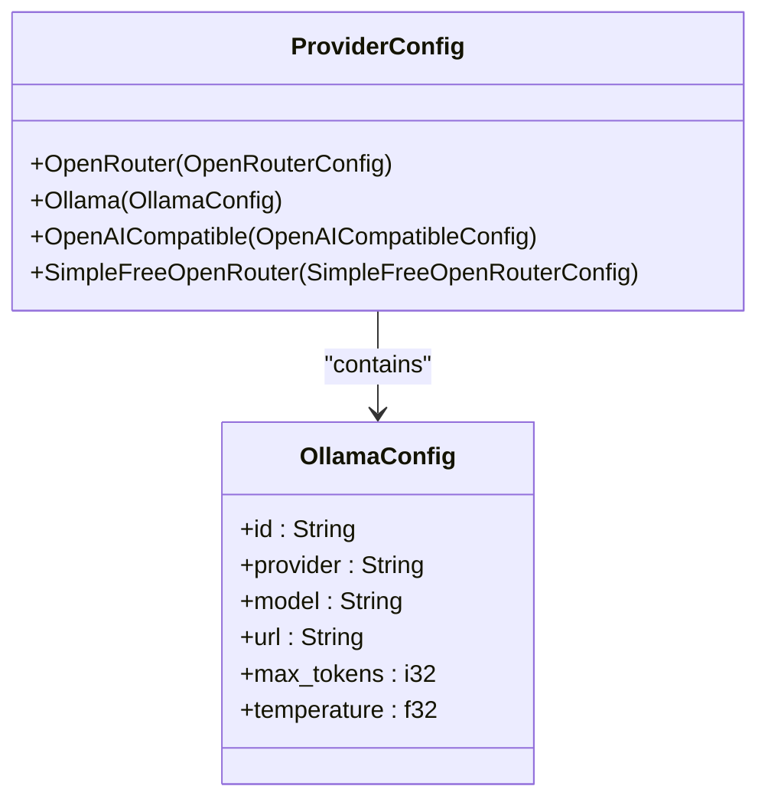
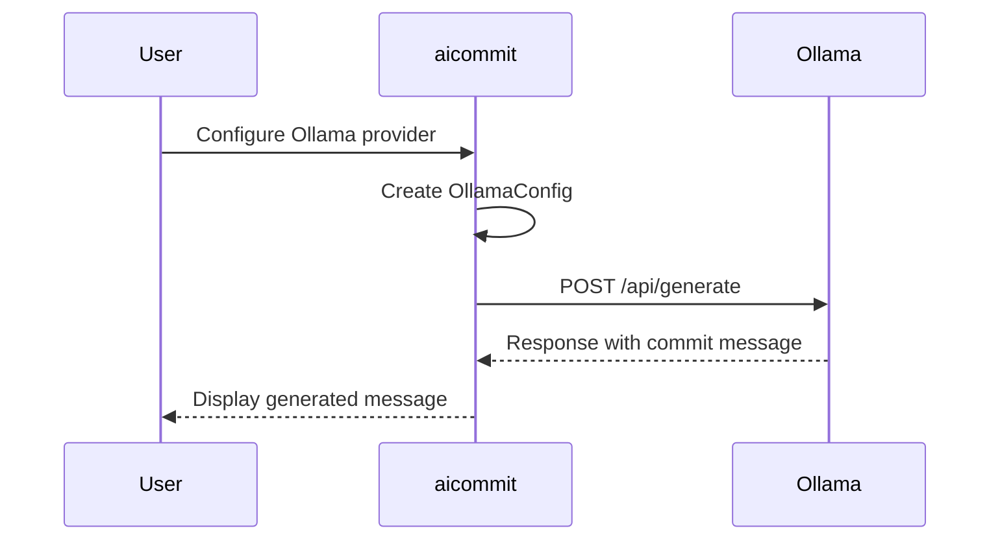

# Ollama Integration

<cite>
**Referenced Files in This Document **   
- [main.rs](file://src/main.rs)
</cite>

## Table of Contents
1. [Introduction](#introduction)
2. [Setting Up Local Ollama Server](#setting-up-local-ollama-server)
3. [Pulling Supported Models](#pulling-supported-models)
4. [Configuring Ollama Endpoint in aicommit](#configuring-ollama-endpoint-in-aicommit)
5. [Provider Configuration and Setup Logic](#provider-configuration-and-setup-logic)
6. [Custom Model Names and Optional Parameters](#custom-model-names-and-optional-parameters)
7. [Token Cost Tracking](#token-cost-tracking)
8. [Common Issues and Troubleshooting](#common-issues-and-troubleshooting)
9. [Debugging with curl Commands](#debugging-with-curl-commands)

## Introduction
This document provides comprehensive guidance on integrating Ollama with aicommit, a CLI tool for generating git commit messages using large language models (LLMs). The integration enables users to leverage local LLMs through Ollama's API interface, providing an offline-capable alternative to cloud-based providers. This documentation covers the complete setup process from installing Ollama to configuring aicommit with custom parameters and troubleshooting common issues.

## Setting Up Local Ollama Server
To use Ollama with aicommit, first install and run the Ollama server locally. Ollama provides a simple way to run large language models on your machine. After installation, the server runs by default at `http://localhost:11434`. This endpoint serves as the communication bridge between aicommit and the local LLMs. The default configuration in aicommit assumes this URL, but it can be customized based on your setup requirements.

**Section sources**
- [main.rs](file://src/main.rs#L1456)

## Pulling Supported Models
Ollama supports various models including popular ones like llama3 and mistral. Users can pull these models using the Ollama CLI. For example, to pull the llama3 model, execute `ollama pull llama3`. Similarly, other supported models can be pulled using their respective names. The choice of model affects the quality and characteristics of generated commit messages. Users should select models based on their specific needs regarding performance, accuracy, and resource consumption.

## Configuring Ollama Endpoint in aicommit
aicommit allows configuration of the Ollama API endpoint through command-line arguments or interactive setup. The `--ollama-url` parameter specifies the Ollama server address, defaulting to `http://localhost:11434`. During non-interactive setup, users can specify a custom URL if the Ollama server runs on a different host or port. This flexibility enables integration with remote Ollama instances or containers running in different network configurations.

**Section sources**
- [main.rs](file://src/main.rs#L139)
- [main.rs](file://src/main.rs#L1456)

## Provider Configuration and Setup Logic
The integration is implemented through the `ProviderConfig::Ollama` variant in the codebase. When adding an Ollama provider, either interactively or non-interactively, aicommit creates an `OllamaConfig` struct containing essential connection and generation parameters. The configuration includes fields for the provider ID, URL, model name, maximum tokens, and temperature. This structured approach ensures consistent handling of Ollama-specific settings across the application.

**Diagram sources **
- [main.rs](file://src/main.rs#L489-L494)

**Section sources**
- [main.rs](file://src/main.rs#L489-L512)

## Custom Model Names and Optional Parameters
Users can specify custom model names and optional parameters when configuring Ollama integration. The `--ollama-model` parameter allows selection of specific models available in the local Ollama instance, defaulting to "llama2". Additional parameters include `max_tokens` which controls the response length, and `temperature` which influences the randomness of generated text. These parameters can be set during provider addition via command-line flags or through interactive configuration.

**Diagram sources **
- [main.rs](file://src/main.rs#L2449-L2550)

**Section sources**
- [main.rs](file://src/main.rs#L143)
- [main.rs](file://src/main.rs#L1457)

## Token Cost Tracking
For Ollama integration, token cost tracking is handled differently than cloud-based providers since local inference doesn't incur direct monetary costs. The implementation estimates input and output tokens based on character count (dividing by 4 as a rough approximation). The cost calculation returns zero values since there are no financial costs associated with local model usage. However, tracking token usage remains valuable for monitoring computational resources and optimizing prompt efficiency.

**Section sources**
- [main.rs](file://src/main.rs#L2527-L2535)

## Common Issues and Troubleshooting
Several common issues may arise when integrating Ollama with aicommit. Connection refused errors typically indicate that the Ollama server isn't running or is accessible at a different address. Missing models occur when specified models haven't been pulled to the local Ollama instance. Version compatibility issues can arise between aicommit and Ollama, particularly regarding API changes. Ensuring both components are updated to compatible versions resolves most compatibility problems.

**Section sources**
- [main.rs](file://src/main.rs#L2477-L2482)

## Debugging with curl Commands
Users can verify Ollama server health and model availability using curl commands. To check server status, execute `curl http://localhost:11434/api/tags` which returns available models. Testing model functionality can be done with `curl http://localhost:11434/api/generate -d '{ "model": "llama3", "prompt": "test", "stream": false }'`. These commands help diagnose connectivity issues and validate that models are properly loaded before attempting integration with aicommit.

**Section sources**
- [main.rs](file://src/main.rs#L2495-L2505)