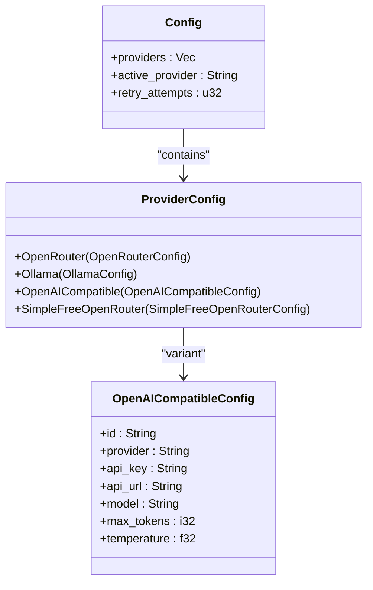

# OpenAI-compatible Endpoints

<cite>
**Referenced Files in This Document **   
- [main.rs](file://src/main.rs)
- [Cargo.toml](file://Cargo.toml)
</cite>

## Table of Contents
1. [Introduction](#introduction)
2. [Configuration Parameters](#configuration-parameters)
3. [Provider Configuration Structure](#provider-configuration-structure)
4. [API Request Formatting](#api-request-formatting)
5. [Authentication and Headers](#authentication-and-headers)
6. [Supported Services Examples](#supported-services-examples)
7. [Compatibility Issues](#compatibility-issues)
8. [Testing and Validation](#testing-and-validation)

## Introduction
This document provides comprehensive guidance for integrating with any OpenAI-compatible API endpoint using the aicommit tool. The system supports connecting to various services that implement the OpenAI API contract, including local LLM servers, alternative cloud providers, and specialized inference platforms. The integration allows users to leverage different models and deployment options while maintaining consistent functionality for generating git commit messages through AI assistance.

The core capability is implemented through the `OpenAICompatible` provider type, which enables connection to endpoints that follow the OpenAI Chat Completions API specification. This flexibility allows developers to use self-hosted solutions like LM Studio or LocalAI, enterprise offerings like Azure OpenAI, or proxy services like LiteLLM, all with minimal configuration changes.

**Section sources**
- [main.rs](file://src/main.rs#L499-L513)
- [main.rs](file://src/main.rs#L820-L1019)

## Configuration Parameters
The OpenAI-compatible provider requires several key parameters to establish a successful connection:

- **API Key**: Authentication credential for the target service (required)
- **API URL**: Complete endpoint URL including path (e.g., https://api.example.com/v1/chat/completions)
- **Model Name**: Identifier of the specific model to use on the target service
- **Max Tokens**: Maximum number of tokens to generate in the response
- **Temperature**: Controls randomness in the output generation

These parameters can be configured either interactively through the setup process or non-interactively via command-line arguments. When adding an OpenAI-compatible provider, users must specify these values to properly configure the connection settings.

The configuration system uses UUIDs to uniquely identify each provider instance, allowing multiple configurations for different services or environments within the same setup.

**Section sources**
- [main.rs](file://src/main.rs#L130-L180)
- [main.rs](file://src/main.rs#L991-L1045)

## Provider Configuration Structure
The provider configuration is implemented using Rust's enum and struct system to maintain type safety while supporting multiple provider types. The `ProviderConfig` enum contains variants for different service types, with `OpenAICompatible` specifically designed for OpenAI-API compatible endpoints.



**Diagram sources **
- [main.rs](file://src/main.rs#L499-L513)

**Section sources**
- [main.rs](file://src/main.rs#L499-L698)

## API Request Formatting
When communicating with OpenAI-compatible endpoints, the system formats requests according to the standard Chat Completions API structure. The request body follows the expected JSON format with proper fields for model selection, message content, and generation parameters.

The serialization format used in src/main.rs constructs a JSON payload with:
- Model identifier matching the configured model name
- Array of message objects with role and content fields
- Max tokens limit from configuration
- Temperature setting from configuration

The prompt engineering approach uses a carefully crafted instruction that specifies the desired output format (Conventional Commits specification) and provides examples to guide the model's response generation. This ensures consistent formatting of commit messages across different underlying models.

Response handling includes parsing of the standard OpenAI response format, extracting the generated message content, and calculating token usage statistics from the response metadata.

**Section sources**
- [main.rs](file://src/main.rs#L2545-L2744)

## Authentication and Headers
Authentication for OpenAI-compatible endpoints is handled through Bearer token authentication in the Authorization header. The system sets the Authorization header with the format "Bearer {api_key}" where the API key comes from the provider configuration.

```mermaid
sequenceDiagram
participant Client as "aicommit CLI"
participant Server as "OpenAI-compatible API"
Client->>Server : POST /v1/chat/completions
activate Server
Note over Client,Server : Headers : \
Authorization : Bearer <api_key>\
Content-Type : application/json
Server-->>Client : 200 OK + Response JSON
deactivate Server
Note over Client,Server : Response contains generated\
commit message and usage data
```

**Diagram sources **
- [main.rs](file://src/main.rs#L2545-L2744)

**Section sources**
- [main.rs](file://src/main.rs#L2545-L2744)

## Supported Services Examples
### LiteLLM Configuration
To configure LiteLLM as an OpenAI-compatible endpoint:
- Set API URL to your LiteLLM server endpoint (e.g., http://localhost:8000/v1/chat/completions)
- Use appropriate API key if authentication is enabled on your LiteLLM instance
- Specify the target model name that LiteLLM should route to

### LocalAI Configuration
For LocalAI integration:
- API URL typically points to http://localhost:8080/v1/chat/completions
- API key can often be any non-empty string depending on LocalAI configuration
- Model name should match available models in your LocalAI installation

### Azure OpenAI Configuration
When connecting to Azure OpenAI Service:
- API URL follows the pattern https://{resource-name}.openai.azure.com/openai/deployments/{deployment-id}/chat/completions?api-version={api-version}
- API key is the access key from Azure portal
- Model parameter may correspond to the deployment ID rather than the base model name

The interactive setup guides users through these configuration options, providing appropriate prompts and defaults for common scenarios.

**Section sources**
- [main.rs](file://src/main.rs#L991-L1045)

## Compatibility Issues
Several common compatibility issues may arise when integrating with OpenAI-compatible endpoints:

### Non-standard Response Fields
Some implementations may return additional or modified fields in the response structure. The current implementation expects the standard OpenAI response format with choices, message, and usage fields. Responses that deviate from this structure may cause parsing errors.

### Streaming Differences
The system currently does not support streaming responses, which some OpenAI-compatible endpoints may default to. This could lead to incomplete data reception or connection timeouts if the endpoint attempts to stream the response.

### Model Name Mismatches
Differences in model naming conventions between providers can cause errors. For example, Azure OpenAI uses deployment names rather than model names, requiring careful configuration to match the correct endpoint.

### URL Path Variations
While most services follow the /v1/chat/completions path, some implementations may use different endpoints. Users must provide the complete URL including the correct path component.

Error handling includes retry logic with exponential backoff and detailed error reporting to help diagnose connectivity and compatibility issues.

**Section sources**
- [main.rs](file://src/main.rs#L2545-L2744)
- [main.rs](file://src/main.rs#L2745-L2944)

## Testing and Validation
Before integrating with production workflows, it's recommended to validate connectivity and response compatibility using external tools:

1. **Manual API Testing**: Use curl or Postman to send test requests to the endpoint with sample payloads
2. **Response Structure Verification**: Confirm that the response matches the expected OpenAI format
3. **Authentication Testing**: Validate that the API key works with the target service
4. **Model Availability Check**: Verify that the specified model name is available and accessible

The aicommit tool itself can be used in dry-run mode (`--dry-run` flag) to test the integration without creating actual commits. This allows verification of the complete workflow from diff extraction to message generation.

Verbose output mode (`--verbose`) provides detailed information about the constructed prompts, request parameters, and API interactions, aiding in troubleshooting and validation.

**Section sources**
- [main.rs](file://src/main.rs#L2545-L2744)
- [main.rs](file://src/main.rs#L1800-L1999)