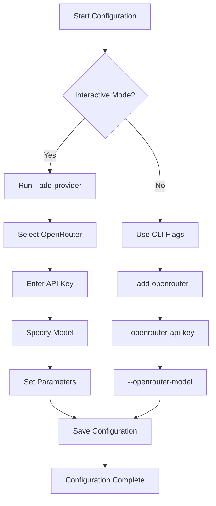

# OpenRouter Setup

<cite>
**Referenced Files in This Document**   
- [main.rs](file://src/main.rs)
- [.aicommit.json](file://~/.aicommit.json)
- [free_models.json](file://openrouter_models/free_models.json)
- [get_free_models.py](file://bin/get_free_models.py)
</cite>

## Table of Contents
1. [Introduction](#introduction)
2. [Obtaining an OpenRouter API Key](#obtaining-an-openrouter-api-key)
3. [Configuration Setup](#configuration-setup)
4. [Model Selection and ID Format](#model-selection-and-id-format)
5. [Automatic Cost Tracking](#automatic-cost-tracking)
6. [Provider Configuration in Code](#provider-configuration-in-code)
7. [Simple Free Mode vs Standard Selection](#simple-free-mode-vs-standard-selection)
8. [Common Issues and Troubleshooting](#common-issues-and-troubleshooting)
9. [Security Best Practices](#security-best-practices)
10. [Utility Scripts](#utility-scripts)

## Introduction
This document provides comprehensive guidance on integrating OpenRouter with the aicommit tool. It covers the complete setup process from obtaining API credentials to advanced configuration options. The integration enables users to leverage various Large Language Models (LLMs) through OpenRouter's unified API, with support for both specific model selection and automated free model usage. The system includes sophisticated features like automatic cost tracking, model failover mechanisms, and secure credential management.

## Obtaining an OpenRouter API Key
To use OpenRouter services, you need to obtain an API key from their platform. Visit the OpenRouter website and sign up for an account. After registration, navigate to your account settings or dashboard to generate a new API key. This key authenticates your requests to OpenRouter's API endpoints. The API key should be kept confidential as it grants access to your account and usage limits. Once obtained, the key can be configured either interactively through the aicommit setup process or directly in the configuration file. Multiple authentication methods are supported, including direct API key input and environment variable references for enhanced security.

**Section sources**
- [main.rs](file://src/main.rs#L723-L774)
- [main.rs](file://src/main.rs#L877-L893)

## Configuration Setup
The OpenRouter configuration is managed through the `~/.aicommit.json` file in your home directory. You can configure OpenRouter either interactively using command-line flags or by directly editing this JSON configuration file. For interactive setup, use the `--add-provider` flag and select OpenRouter from the menu, then enter your API key and preferred model. Non-interactive configuration allows you to specify parameters directly through command-line arguments like `--add-openrouter`, `--openrouter-api-key`, and `--openrouter-model`. The configuration supports essential parameters including maximum tokens, temperature for response randomness, and the specific model identifier. When configuring manually, ensure the JSON structure follows the expected schema with proper field names and data types.



**Diagram sources **
- [main.rs](file://src/main.rs#L776-L804)
- [main.rs](file://src/main.rs#L877-L893)

**Section sources**
- [main.rs](file://src/main.rs#L723-L804)
- [main.rs](file://src/main.rs#L877-L893)

## Model Selection and ID Format
OpenRouter models are identified using a specific format: `provider/model-name:suffix`. For example, `mistralai/mistral-tiny` represents the Mistral Tiny model from Mistral AI. The suffix `:free` indicates free-tier models available through OpenRouter's free quota system. When configuring standard mode, you must specify the exact model ID you wish to use. The system supports a wide range of models from various providers including Mistral AI, Google, Meta, and others. Model IDs are case-sensitive and must be entered exactly as documented by OpenRouter. In addition to the primary model identifier, you can also specify performance parameters such as context length and token limits. The configuration validates model IDs against OpenRouter's catalog to ensure they exist and are accessible with your API key.

**Section sources**
- [main.rs](file://src/main.rs#L877-L893)
- [main.rs](file://src/main.rs#L965-L1000)

## Automatic Cost Tracking
The integration automatically fetches token pricing information from OpenRouter's API to provide accurate cost tracking for each API call. When a commit message is generated, the system displays both input and output token counts along with the calculated API cost. This information is extracted directly from OpenRouter's response, which includes detailed usage statistics. The cost calculation considers both prompt and completion tokens based on the specific model's pricing structure. For free models, the cost is displayed as $0.00, while paid models show the actual monetary value based on current pricing. This feature helps users monitor their usage and optimize their model selection based on cost-effectiveness. The token tracking is transparent and shown in the command output after each commit generation.

**Section sources**
- [main.rs](file://src/main.rs#L1124-L1175)
- [main.rs](file://src/main.rs#L2642-L2674)

## Provider Configuration in Code
The OpenRouter provider is implemented in the codebase as a variant of the `ProviderConfig` enum in `src/main.rs`. The `OpenRouterConfig` struct contains fields for the provider ID, API key, selected model, maximum tokens, and temperature settings. This configuration is deserialized from JSON using Serde, allowing seamless storage and retrieval from the configuration file. The initialization occurs when the `--add-openrouter` flag is used, creating a new `ProviderConfig::OpenRouter` variant with the specified parameters. The code includes validation to ensure required fields like the API key are present before creating the configuration. Error handling is implemented to provide meaningful feedback if configuration fails due to missing or invalid parameters.

```mermaid
classDiagram
class ProviderConfig {
+OpenRouter(OpenRouterConfig)
+Ollama(OllamaConfig)
+OpenAICompatible(OpenAICompatibleConfig)
+SimpleFreeOpenRouter(SimpleFreeOpenRouterConfig)
}
class OpenRouterConfig {
+id : String
+provider : String
+api_key : String
+model : String
+max_tokens : i32
+temperature : f32
}
ProviderConfig <|-- OpenRouterConfig : contains
note right of ProviderConfig
Enum variant that contains
different provider configurations
end note
note right of OpenRouterConfig
Struct holding OpenRouter-specific
configuration parameters
end note
```

**Diagram sources **
- [main.rs](file://src/main.rs#L384-L438)
- [main.rs](file://src/main.rs#L440-L486)

**Section sources**
- [main.rs](file://src/main.rs#L384-L486)

## Simple Free Mode vs Standard Selection
The integration offers two distinct modes for OpenRouter usage: Simple Free Mode and Standard Model Selection. Simple Free Mode automatically selects the best available free model from OpenRouter without requiring manual model specification. It uses an internally ranked list of preferred free models and implements a sophisticated failover mechanism that tracks model performance and availability. In contrast, Standard Model Selection requires users to explicitly specify which model to use via the model ID parameter. Simple Free Mode is recommended for most users as it eliminates the need for model research and automatically adapts to changing model availability. It includes advanced features like model jail/blacklist systems that temporarily restrict underperforming models and prioritize more reliable ones. Standard selection provides more control for users with specific model preferences or requirements.

**Section sources**
- [main.rs](file://src/main.rs#L756-L774)
- [main.rs](file://src/main.rs#L877-L893)

## Common Issues and Troubleshooting
Several common issues may arise when using the OpenRouter integration. Invalid API keys result in authentication failures and prevent API access; verify your key is correctly entered and has not been revoked. Rate limiting occurs when exceeding OpenRouter's request limits, typically resolved by waiting before retrying or upgrading your plan. Unreachable endpoints may indicate network connectivity problems or temporary OpenRouter service outages. The system includes built-in error handling that provides descriptive messages for these scenarios. For persistent issues, check your internet connection, verify the OpenRouter status page, and ensure your API key has sufficient quota. The `--verbose` flag can provide additional diagnostic information to help identify the root cause of problems.

**Section sources**
- [main.rs](file://src/main.rs#L2125-L2158)
- [main.rs](file://src/main.rs#L2642-L2674)

## Security Best Practices
To securely manage OpenRouter credentials, follow these best practices. Store API keys in environment variables rather than hardcoding them in configuration files, using the `OPENROUTER_API_KEY` environment variable. If using configuration files, ensure the `~/.aicommit.json` file has restrictive permissions (600) to prevent unauthorized access. Never commit configuration files containing API keys to version control systems. Consider using OpenRouter's API key rotation feature to periodically update your credentials. For shared environments, use separate API keys with limited permissions. The application supports reading API keys from environment variables as a more secure alternative to configuration files. Regularly monitor your OpenRouter dashboard for unusual activity that might indicate compromised credentials.

**Section sources**
- [main.rs](file://src/main.rs#L877-L893)
- [main.rs](file://src/main.rs#L756-L774)

## Utility Scripts
The repository includes utility scripts to assist with OpenRouter integration. The `bin/get_free_models.py` script fetches all available models from OpenRouter's API and identifies which ones are free to use. It saves the results to JSON and text files in the `openrouter_models` directory for reference. This script requires a valid OpenRouter API key, which it retrieves from the existing configuration. It analyzes model IDs, pricing information, and free tier indicators to compile a comprehensive list of available free models. The output includes model details such as ID, name, size, context length, and free token allocation. This utility helps users discover new free models and understand the available options without manually browsing the OpenRouter website.

**Section sources**
- [get_free_models.py](file://bin/get_free_models.py#L0-L161)
- [free_models.json](file://openrouter_models/free_models.json#L0-L491)