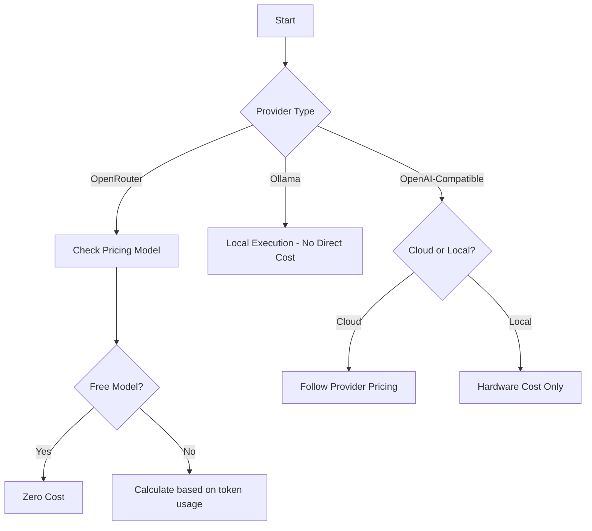
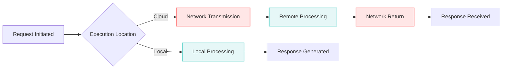
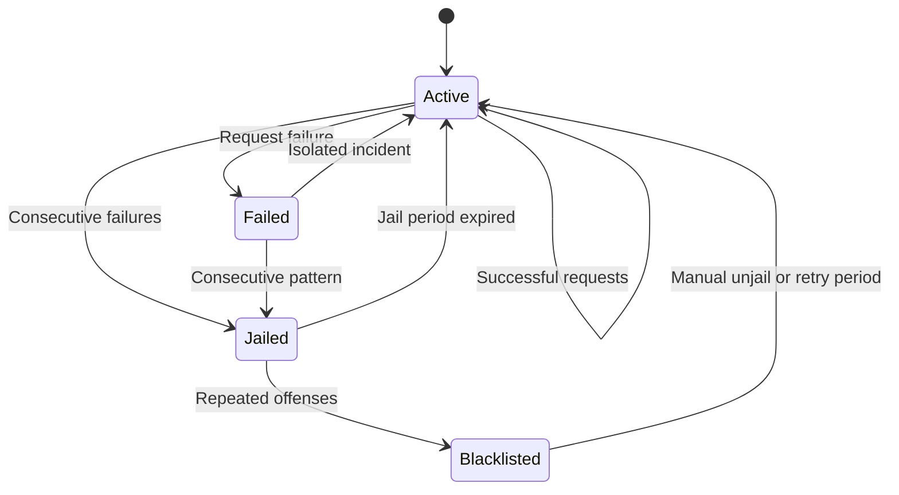
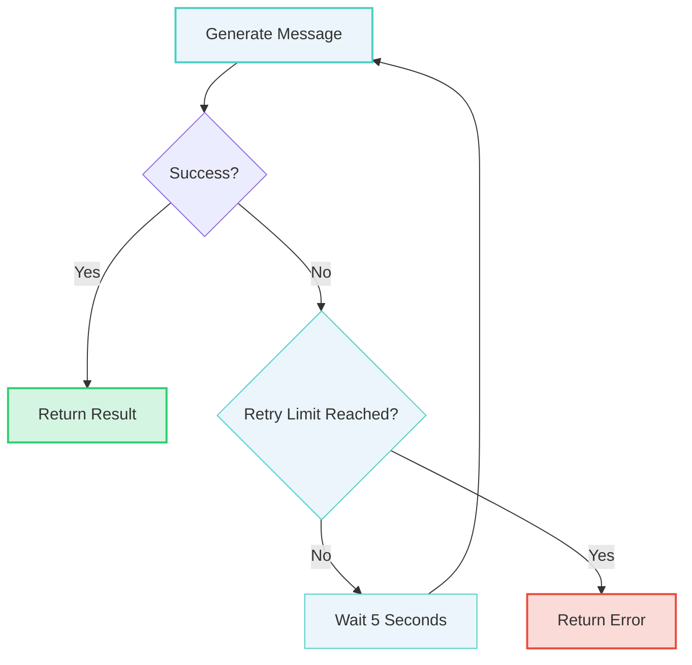

# Provider Comparison

<cite>
**Referenced Files in This Document**   
- [main.rs](file://src/main.rs)
- [free_models.json](file://openrouter_models/free_models.json)
- [all_models.json](file://openrouter_models/all_models.json)
- [get_free_models.py](file://bin/get_free_models.py)
- [readme.md](file://readme.md)
</cite>

## Table of Contents
1. [Introduction](#introduction)
2. [Cost Analysis](#cost-analysis)
3. [Latency and Performance](#latency-and-performance)
4. [Privacy Considerations](#privacy-considerations)
5. [Model Quality and Reliability](#model-quality-and-reliability)
6. [Ease of Setup and Configuration](#ease-of-setup-and-configuration)
7. [Hybrid Strategies and Fallback Mechanisms](#hybrid-strategies-and-fallback-mechanisms)
8. [Decision-Making Guidance](#decision-making-guidance)
9. [Configuration Patterns](#configuration-patterns)

## Introduction
This document provides a comprehensive comparison of the supported LLM providers in the aicommit tool: OpenRouter, Ollama, and OpenAI-compatible endpoints. The analysis covers key dimensions including cost, latency, privacy, model quality, reliability, and ease of setup. Special attention is given to the hybrid strategy of using Ollama by default with OpenRouter as fallback, and the decision-making process for different user profiles.

**Section sources**
- [main.rs](file://src/main.rs#L0-L51)
- [readme.md](file://readme.md#L554-L707)

## Cost Analysis
The cost structure varies significantly between provider types:

### Free vs. Paid Models
OpenRouter offers both free and paid models, with free models identified by ":free" in their ID or zero pricing. The system maintains a curated list of preferred free models in order of preference, prioritizing larger parameter models like "meta-llama/llama-4-maverick:free" and "nvidia/llama-3.1-nemotron-ultra-253b-v1:free". Paid models on OpenRouter have transparent pricing per 1k tokens for both prompt and completion.

Ollama and OpenAI-compatible local instances are effectively free after initial setup costs, as they run on local hardware without per-token charges. However, cloud-based OpenAI-compatible services may have their own pricing structures.

### Token Pricing Structure
OpenRouter's pricing is dynamically fetched from their API, with costs varying by model capability. For example:
- High-end models like "openai/gpt-4-turbo" cost $0.01 per 1k prompt tokens and $0.03 per 1k completion tokens
- Mid-tier models like "mistralai/mistral-small-3.1-24b-instruct:free" are available at no cost
- Entry-level models have minimal costs, often fractions of a cent per 1k tokens

The system tracks usage costs and displays them after each commit generation, providing transparency into expenses.



**Diagram sources**
- [all_models.json](file://openrouter_models/all_models.json)
- [free_models.json](file://openrouter_models/free_models.json)

**Section sources**
- [all_models.json](file://openrouter_models/all_models.json)
- [free_models.json](file://openrouter_models/free_models.json)
- [get_free_models.py](file://bin/get_free_models.py#L70-L108)

## Latency and Performance
Latency characteristics differ substantially between cloud and local execution models:

### Cloud-Based Services (OpenRouter)
Cloud-based services typically have higher latency due to network round-trip times, API processing, and potential queueing during peak usage. The system implements a 30-second timeout for requests to OpenRouter, reflecting typical response times. Performance can vary based on:
- Network connectivity quality
- Server load at the provider
- Model complexity and size
- Request queue position

### Local Models (Ollama)
Local models offer significantly lower latency when running on capable hardware, as they eliminate network transmission time. Response times are primarily determined by:
- Local hardware specifications (CPU/GPU)
- Model size and complexity
- System resource availability
- Ollama server optimization

The trade-off is that high-performance local inference requires substantial computational resources, particularly for larger models.

### Performance Monitoring
The system includes built-in performance tracking through model statistics that record success/failure rates and timestamps. This data informs the model selection algorithm, favoring consistently responsive models while temporarily avoiding those with repeated failures.



**Diagram sources**
- [main.rs](file://src/main.rs#L2761-L2793)
- [main.rs](file://src/main.rs#L2988-L3019)

**Section sources**
- [main.rs](file://src/main.rs#L2761-L2793)
- [main.rs](file://src/main.rs#L2988-L3019)

## Privacy Considerations
Privacy implications vary significantly between provider types, representing a critical decision factor:

### Data Transmission Risks
Cloud-based providers (OpenRouter, cloud OpenAI-compatible) require transmitting code changes over the internet, potentially exposing sensitive information:
- Git diffs containing code changes are sent to external servers
- Contextual information about project structure and functionality is shared
- Authentication tokens must be trusted to the provider

The system mitigates risks by:
- Using secure HTTPS connections
- Supporting API key management
- Providing clear indication of data transmission

### Local Execution Benefits
Ollama and local OpenAI-compatible servers offer superior privacy:
- All code analysis occurs on the local machine
- No data leaves the user's environment
- Complete control over model inputs and outputs
- No dependency on external service availability

This makes local execution ideal for projects with sensitive codebases, proprietary algorithms, or strict compliance requirements.

### Hybrid Privacy Strategy
The recommended configuration uses Ollama as the primary provider with OpenRouter as fallback, balancing privacy and reliability:
- Default to local processing for maximum privacy
- Fall back to cloud services only when local models fail
- Maintain offline capability for sensitive environments

**Section sources**
- [main.rs](file://src/main.rs#L2398-L2435)
- [main.rs](file://src/main.rs#L2548-L2580)

## Model Quality and Reliability
Model quality and reliability are assessed through multiple dimensions:

### Quality Assessment
Model quality is primarily determined by:
- Parameter count and model architecture
- Training data quality and recency
- Specialization (general vs. coding-specific)
- Context window size

The system prioritizes higher-parameter models in its selection algorithm, with preferences ordered from largest to smallest within categories. Models like "meta-llama/llama-4-scout:free" (512K context) and "nvidia/llama-3.1-nemotron-ultra-253b-v1:free" (253B parameters) represent the high end of available free models.

### Reliability Mechanisms
The system implements sophisticated reliability features:
- **Retry Logic**: Up to 3 retry attempts by default when generation fails
- **Model Jail System**: Temporarily disables models with consecutive failures
- **Blacklisting**: Permanently excludes consistently problematic models
- **Fallback Selection**: Intelligent model selection based on historical performance

The jail system implements escalating penalties:
- Initial failure: Monitor closely
- Consecutive failures: Temporary jail (hours)
- Repeated issues: Permanent blacklisting (days)

This ensures reliable operation even when individual models experience issues.



**Diagram sources**
- [main.rs](file://src/main.rs#L2943-L2986)
- [main.rs](file://src/main.rs#L3016-L3036)

**Section sources**
- [main.rs](file://src/main.rs#L2943-L2986)
- [main.rs](file://src/main.rs#L3016-L3036)

## Ease of Setup and Configuration
The configuration system supports multiple provider types with flexible setup options:

### Configuration Structure
The system uses a JSON configuration file (~/.aicommit.json) that supports multiple providers simultaneously:
```json
{
  "providers": [{
    "id": "provider-id",
    "provider": "provider-type",
    "configuration": { /* provider-specific settings */ }
  }],
  "active_provider": "provider-id",
  "retry_attempts": 3
}
```

Each provider type has specific configuration requirements:
- **OpenRouter**: API key, model name, URL
- **Ollama**: API URL, model name
- **OpenAI-Compatible**: API key, URL, model name

### Setup Methods
Multiple setup methods are available:
- **Interactive**: Guided setup with prompts
- **Non-interactive**: Command-line arguments for automation
- **Manual editing**: Direct JSON configuration

The system supports seamless switching between providers by changing the active_provider field, enabling easy experimentation and fallback configurations.

**Section sources**
- [main.rs](file://src/main.rs#L488-L548)
- [readme.md](file://readme.md#L325-L365)

## Hybrid Strategies and Fallback Mechanisms
The system implements sophisticated hybrid strategies for optimal performance:

### Default Fallback Strategy
The recommended approach uses Ollama by default with OpenRouter as fallback:
- Primary: Ollama (local, private, no cost)
- Secondary: OpenRouter free models (cloud, reliable, no cost)
- Tertiary: OpenRouter paid models (cloud, high quality, paid)

This strategy maximizes privacy while ensuring reliability through cloud fallbacks.

### Simple Free OpenRouter Intelligence
The SimpleFreeOpenRouter provider implements advanced model selection:
1. **Preferred Model List**: Uses curated PREFERRED_FREE_MODELS ordering
2. **Dynamic Selection**: Queries OpenRouter API for currently available models
3. **Performance Tracking**: Maintains statistics on model success/failure rates
4. **Intelligent Fallback**: Falls back to predefined list if API unavailable

The selection algorithm follows this priority:
1. Previously successful model (if available)
2. Preferred models in order
3. Largest available model by parameter count
4. Least recently jailed model
5. Any available model as last resort

### Retry and Recovery
The system implements robust retry logic:
- Configurable retry attempts (default: 3)
- 5-second delay between attempts
- Comprehensive error reporting
- Final failure with detailed diagnostics



**Diagram sources**
- [main.rs](file://src/main.rs#L1812-L1842)
- [main.rs](file://src/main.rs#L1946-L1979)

**Section sources**
- [main.rs](file://src/main.rs#L1812-L1842)
- [main.rs](file://src/main.rs#L1946-L1979)

## Decision-Making Guidance
Recommendations vary by user profile and requirements:

### Individual Developers
For individual developers, prioritize:
- **Privacy**: Use Ollama with local models
- **Cost**: Leverage free OpenRouter models
- **Convenience**: Simple setup with minimal configuration

Recommended configuration: Ollama as primary, SimpleFreeOpenRouter as backup.

### Teams
For development teams, consider:
- **Consistency**: Standardized configurations across team members
- **Reliability**: Multiple fallback options
- **Cost Management**: Track and limit expenses

Recommended approach: Centralized configuration with OpenRouter paid models for consistency, supplemented by local Ollama instances for privacy-sensitive work.

### Enterprise
For enterprise environments:
- **Security**: On-premises Ollama instances
- **Compliance**: Avoid transmission of sensitive code
- **Scalability**: Dedicated inference servers
- **Support**: Commercially supported models

Enterprise strategy should emphasize air-gapped operation with periodic updates, avoiding external API dependencies for production systems.

**Section sources**
- [main.rs](file://src/main.rs#L2228-L2254)
- [main.rs](file://src/main.rs#L2256-L2290)

## Configuration Patterns
The system enables seamless switching between providers through configuration:

### Configuration File Structure
The ~/.aicommit.json file supports multiple providers with an active provider selector:
```json
{
  "providers": [
    {
      "id": "uuid-1",
      "provider": "ollama",
      "url": "http://localhost:11434",
      "model": "llama2"
    },
    {
      "id": "uuid-2",
      "provider": "openrouter",
      "api_key": "your-key",
      "model": "mistralai/mistral-tiny"
    }
  ],
  "active_provider": "uuid-1"
}
```

### Switching Providers
Providers can be switched via:
- **Command line**: `aicommit --set <provider-id>`
- **Configuration edit**: Manual JSON modification
- **Interactive setup**: Guided provider addition

The system validates the selected provider exists before updating the configuration.

### Environment Variables
Configuration can be overridden with environment variables:
- `AICOMMIT_PROVIDER` - Set active provider
- `AICOMMIT_MODEL` - Override model selection
- `AICOMMIT_TEMPERATURE` - Adjust creativity level

This enables dynamic configuration in CI/CD pipelines and automated environments.

**Section sources**
- [main.rs](file://src/main.rs#L1562-L1588)
- [main.rs](file://src/main.rs#L1590-L1625)
- [readme.md](file://readme.md#L458-L503)