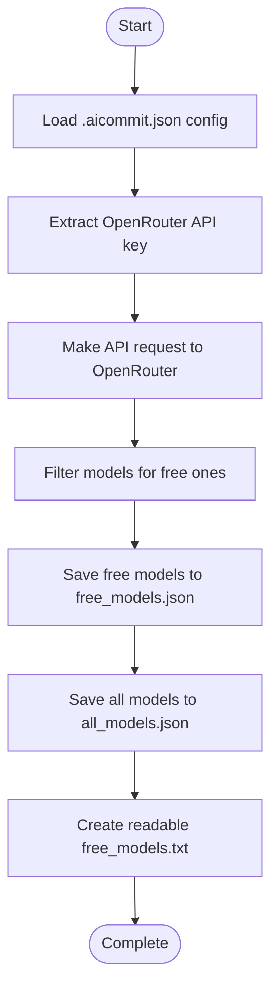
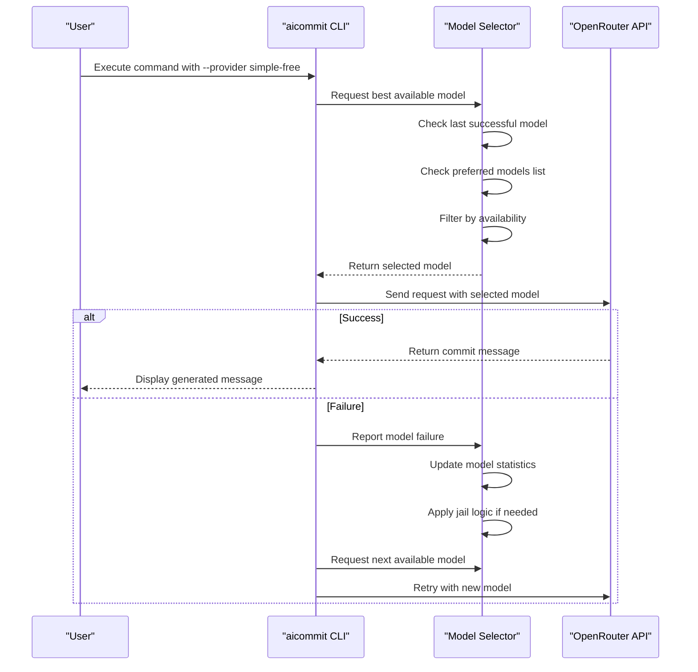
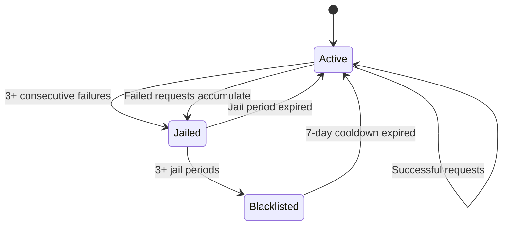

# Simple Free Mode

<cite>
**Referenced Files in This Document**   
- [get_free_models.py](file://bin/get_free_models.py)
- [main.rs](file://src/main.rs)
- [free_models.json](file://openrouter_models/free_models.json)
</cite>

## Table of Contents
1. [Introduction](#introduction)
2. [Free Models Management](#free-models-management)
3. [Model Selection and Rotation](#model-selection-and-rotation)
4. [Usage Examples](#usage-examples)
5. [Failure Detection and Statistics](#failure-detection-and-statistics)
6. [Troubleshooting](#troubleshooting)
7. [Limitations](#limitations)

## Introduction
Simple Free Mode is a feature that automatically selects free models from OpenRouter for generating git commit messages. This mode eliminates the need for manual model selection by dynamically rotating through available free models when one fails or becomes temporarily unavailable. The system intelligently manages model availability, tracks performance statistics, and implements fallback mechanisms to ensure continuous operation even when individual models experience issues.

The core functionality relies on two main components: the `bin/get_free_models.py` script that fetches and caches available free models, and the Rust implementation in `src/main.rs` that handles model rotation, failure detection, and selection logic. This documentation explains how these components work together to provide a seamless experience with free OpenRouter models.

**Section sources**
- [main.rs](file://src/main.rs#L0-L3191)
- [get_free_models.py](file://bin/get_free_models.py#L0-L161)

## Free Models Management

### Model Fetching Process
The `bin/get_free_models.py` script is responsible for fetching available free models from the OpenRouter API and caching them locally. The script performs the following steps:

1. Loads the aicommit configuration file to extract the OpenRouter API key
2. Makes an authenticated request to the OpenRouter API endpoint `https://openrouter.ai/api/v1/models`
3. Filters models based on multiple criteria to identify free models:
   - Models with ":free" in their ID
   - Models with the "free" property set to true
   - Models with positive "free_tokens" value
   - Models with zero pricing for both prompt and completion
4. Saves the results to JSON and text files in the `openrouter_models/` directory

The script creates three output files:
- `free_models.json`: Contains metadata about free models including ID, name, size, context length, and free tokens
- `all_models.json`: Contains information about all available models
- `free_models.txt`: A human-readable list of free models sorted by parameter size



**Diagram sources**
- [get_free_models.py](file://bin/get_free_models.py#L0-L161)

**Section sources**
- [get_free_models.py](file://bin/get_free_models.py#L0-L161)

## Model Selection and Rotation

### Model Selection Algorithm
The Simple Free mode implements a sophisticated model selection algorithm that prioritizes reliability and performance. When generating a commit message, the system follows this decision process:

1. **Prefer previously successful model**: If the last used model is still available and not jailed, it will be reused
2. **Check preferred models list**: The system maintains a curated list of preferred free models ordered by quality and performance
3. **Intelligent fallback**: If preferred models are unavailable, the system sorts remaining models by estimated parameter size and selects the largest available model
4. **Last resort options**: If all models are jailed or blacklisted, the system attempts to use the least recently jailed model or any available model as a final fallback

The selection process is implemented in the `find_best_available_model` function in `src/main.rs`, which takes into account both the available models from the API and the local model statistics stored in the configuration.

### Fallback Behavior
When a model fails during the commit message generation process, the system automatically rotates to another available model. The fallback behavior includes:

- Immediate retry with a different model when an API request fails
- Network timeout handling with appropriate error classification
- Intelligent retry scheduling based on failure patterns
- Gradual escalation of jail time for repeatedly failing models

The system uses a combination of in-memory tracking and persistent storage to maintain model availability status across sessions.



**Diagram sources**
- [main.rs](file://src/main.rs#L2245-L2399)

**Section sources**
- [main.rs](file://src/main.rs#L2245-L2399)

## Usage Examples

### Basic Usage
To use Simple Free mode, first configure the provider with your OpenRouter API key:

```bash
aicommit --add-simple-free --openrouter-api-key=your_api_key_here
```

Once configured, generate commit messages using the simple-free provider:

```bash
aicommit --provider simple-free
```

### Advanced Usage
You can combine Simple Free mode with other options for enhanced functionality:

```bash
# Generate commit message with verbose output
aicommit --provider simple-free --verbose

# Use with automatic staging
aicommit --provider simple-free --add

# Monitor model usage statistics
aicommit --jail-status
```

### Configuration Example
The configuration is stored in `~/.aicommit.json` and includes model statistics:

```json
{
  "providers": [
    {
      "id": "uuid-here",
      "provider": "simple_free_openrouter",
      "api_key": "your-key-here",
      "max_tokens": 200,
      "temperature": 0.2,
      "failed_models": [],
      "model_stats": {
        "meta-llama/llama-4-maverick:free": {
          "success_count": 15,
          "failure_count": 2,
          "last_success": 1700000000,
          "last_failure": 1699000000,
          "jail_until": null,
          "jail_count": 0,
          "blacklisted": false
        }
      },
      "last_used_model": "meta-llama/llama-4-maverick:free",
      "last_config_update": 1700000000
    }
  ],
  "active_provider": "uuid-here",
  "retry_attempts": 3
}
```

**Section sources**
- [main.rs](file://src/main.rs#L764-L895)
- [main.rs](file://src/main.rs#L2643-L2907)

## Failure Detection and Statistics

### Model Monitoring System
The Simple Free mode implements a comprehensive model monitoring system that tracks various metrics for each model:

- **Success count**: Number of successful API calls
- **Failure count**: Number of failed API calls
- **Last success/failure times**: Timestamps of most recent success and failure
- **Jail status**: Temporary unavailability period
- **Blacklist status**: Permanent exclusion status

These statistics are stored in memory during execution and persisted to the configuration file between sessions.

### Jail and Blacklist Mechanism
The system implements a progressive punishment system for unreliable models:

- **Consecutive failures**: Three consecutive failures trigger a jail period
- **Jail duration**: Initial 24-hour jail, doubling with each subsequent offense (up to 7 days maximum)
- **Blacklisting**: After three jail periods, models are blacklisted for 7 days
- **Automatic recovery**: Blacklisted models are automatically retried after the cooldown period

The jail mechanism prevents the system from repeatedly attempting to use known problematic models while still allowing for recovery if the model's availability improves.



**Diagram sources**
- [main.rs](file://src/main.rs#L2944-L3038)

**Section sources**
- [main.rs](file://src/main.rs#L2944-L3038)

## Troubleshooting

### No Free Models Available
If no free models are available, check the following:

1. Verify your OpenRouter API key is valid and has access to free models
2. Check network connectivity to the OpenRouter API
3. Ensure the `get_free_models.py` script can execute properly
4. Verify the `openrouter_models/` directory is writable

Use the verbose flag to get detailed diagnostic information:

```bash
aicommit --provider simple-free --verbose
```

### All Models Temporarily Jailed
When all models are temporarily jailed, you have several options:

1. **Wait for jail periods to expire**: Models will automatically become available again
2. **Manually release models**: Use the unjail commands to reset specific models
3. **Force refresh**: Re-fetch the model list from the API

Commands for managing jailed models:

```bash
# Check current jail status
aicommit --jail-status

# Release a specific model from jail
aicommit --unjail="model-id-here"

# Release all models from jail
aicommit --unjail-all
```

### Debugging Tips
For troubleshooting issues with Simple Free mode:

1. Enable verbose output to see detailed processing information
2. Check the configuration file at `~/.aicommit.json` for model statistics
3. Manually run the `get_free_models.py` script to verify model fetching
4. Test API connectivity directly using curl or similar tools

**Section sources**
- [main.rs](file://src/main.rs#L3080-L3189)

## Limitations

### Performance Considerations
Simple Free mode has several limitations compared to paid alternatives:

- **Latency variability**: Free models may have inconsistent response times due to rate limiting and resource constraints
- **Lower model quality**: Free models generally have lower performance and accuracy than premium models
- **Availability fluctuations**: Free models may become temporarily unavailable without notice
- **Rate limiting**: Usage may be restricted by OpenRouter's free tier limits

### Feature Constraints
Additional limitations include:

- **No guaranteed uptime**: Free models may be taken offline without warning
- **Limited context windows**: Some free models have smaller context lengths than paid alternatives
- **Reduced capabilities**: Advanced features like vision or specialized reasoning may not be available in free models
- **Potential throttling**: High-frequency usage may trigger additional rate limiting

Despite these limitations, Simple Free mode provides a valuable option for users who want to leverage AI-powered commit message generation without incurring costs, with intelligent fallback mechanisms to maintain reliability.

**Section sources**
- [main.rs](file://src/main.rs#L2245-L2399)
- [get_free_models.py](file://bin/get_free_models.py#L0-L161)