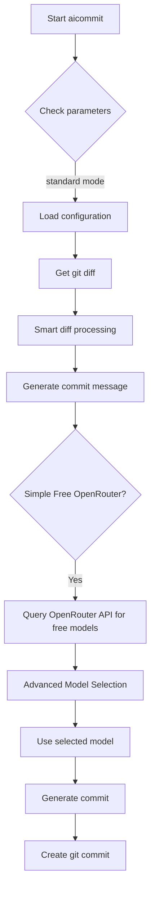

# Quick Start Tutorial

<cite>
**Referenced Files in This Document**   
- [readme.md](file://readme.md)
- [src/main.rs](file://src/main.rs)
- [Cargo.toml](file://Cargo.toml)
</cite>

## Table of Contents
1. [Introduction](#introduction)
2. [Setting Up Your Environment](#setting-up-your-environment)
3. [Initializing a Git Repository and Making Changes](#initializing-a-git-repository-and-making-changes)
4. [Generating Your First Commit Message](#generating-your-first-commit-message)
5. [Understanding the Default Configuration Process](#understanding-the-default-configuration-process)
6. [Using Interactive Mode with --dry-run](#using-interactive-mode-with---dry-run)
7. [Adding a Provider with --add-provider](#adding-a-provider-with---add-provider)
8. [Version Incrementation with --version-patch](#version-incrementation-with---version-patch)
9. [Conclusion](#conclusion)

## Introduction
This tutorial guides new users through their first experience with `aicommit`, a CLI tool that generates concise and descriptive git commit messages using Large Language Models (LLMs). You'll learn how to initialize a Git repository, make code changes, generate commit messages using the default configuration, use interactive mode, add providers, and increment versions. The flow mirrors the actual user onboarding journey, emphasizing the zero-configuration value proposition while introducing advanced capabilities.

**Section sources**
- [readme.md](file://readme.md#L1-L50)

## Setting Up Your Environment
Before starting, ensure you have `aicommit` installed. You can install it via npm or cargo as shown in the documentation. This tutorial assumes you're working in a directory where you want to initialize a new project. No prior configuration is needed, as `aicommit` supports zero-configuration setup through its Simple Free OpenRouter mode, which automatically uses the best available free models from OpenRouter.

**Section sources**
- [readme.md](file://readme.md#L150-L160)

## Initializing a Git Repository and Making Changes
Start by initializing a new Git repository and creating a sample file to demonstrate the workflow. This step sets up the environment for generating your first AI-powered commit message.

```bash
# Initialize a new Git repository
git init

# Create a sample JavaScript file
echo "console.log('Hello, aicommit!');" > index.js

# Check the status of your repository
git status
```

After running these commands, you'll see that `index.js` is listed as an untracked file. This change will be used to generate your first commit message. The `aicommit` tool will analyze this diff to create a meaningful commit description.

**Section sources**
- [readme.md](file://readme.md#L200-L210)

## Generating Your First Commit Message
With your changes staged, you can now generate a commit message using `aicommit`. This process leverages the default configuration, which uses OpenRouter's free models without requiring manual setup.

```bash
# Stage the changes
git add index.js

# Generate and apply a commit message
aicommit
```

When you run `aicommit`, the tool performs several behind-the-scenes operations:
1. Extracts the git diff of your staged changes
2. Processes the diff to ensure it's within size limits
3. Sends the processed diff to an LLM via OpenRouter's API
4. Receives and cleans the generated commit message
5. Applies the message to create a git commit

The output will display the generated commit message, token usage, and API cost. For example:
```
Generated commit message: Add initial implementation with console log
Tokens: 8↑ 32↓
API Cost: $0.0000
```

This demonstrates the zero-configuration value proposition—no need to set up providers or models manually.

**Section sources**
- [readme.md](file://readme.md#L220-L240)
- [src/main.rs](file://src/main.rs#L2400-L2450)

## Understanding the Default Configuration Process
The default configuration process in `aicommit` is designed to work out-of-the-box with minimal setup. When you run `aicommit` without prior configuration, it uses the Simple Free OpenRouter mode, which automatically selects the best available free model from OpenRouter. This process involves:

1. **Diff Extraction**: The tool extracts the git diff of your staged changes using `git diff --cached`.
2. **Diff Processing**: Large diffs are intelligently truncated to prevent excessive API usage while preserving context.
3. **LLM Processing**: The processed diff is sent to OpenRouter's API with a refined prompt asking for a Conventional Commits formatted message.
4. **Message Application**: The generated message is cleaned and applied as a git commit.

The system uses a sophisticated failover mechanism to ensure reliability:
- Models are categorized as Active, Jailed, or Blacklisted based on performance
- Three consecutive failures move a model to Jailed status for 24 hours
- Blacklisted models are retried weekly to allow for recovery
- Network errors are distinguished from model errors to avoid unfair penalties

This ensures that your commit message generation remains resilient even if individual models fail.



**Diagram sources **
- [src/main.rs](file://src/main.rs#L2400-L2450)
- [readme.md](file://readme.md#L500-L550)

**Section sources**
- [src/main.rs](file://src/main.rs#L2400-L2450)
- [readme.md](file://readme.md#L500-L550)

## Using Interactive Mode with --dry-run
Interactive mode allows you to review and edit commit message suggestions before applying them. This is useful for ensuring the generated message accurately reflects your changes.

```bash
# Make additional changes
echo "// Updated comment" >> index.js
git add index.js

# Run in dry-run mode to see the suggestion
aicommit --dry-run
```

The `--dry-run` flag shows the generated commit message without creating an actual commit. This lets you:
- Review the suggested message for accuracy
- Understand how the LLM interpreted your changes
- Decide whether to accept, modify, or reject the suggestion

Example output:
```
Add comment update to index.js
```

If you're satisfied with the message, you can run `aicommit` without `--dry-run` to create the commit. This interactive approach gives you control over the final commit message while leveraging AI assistance.

**Section sources**
- [readme.md](file://readme.md#L250-L260)

## Adding a Provider with --add-provider
While the default configuration works well for most users, you may want to add a specific provider for more control over the LLM selection. The `--add-provider` flag enables interactive setup of different LLM providers.

```bash
# Add a new provider interactively
aicommit --add-provider
```

This command launches an interactive menu where you can choose from:
- Free OpenRouter (recommended)
- OpenRouter
- Ollama
- OpenAI Compatible

For example, selecting "Free OpenRouter" prompts you for your OpenRouter API key and configures the tool to automatically use the best available free models. This enhances the zero-configuration experience by setting up the optimal provider with minimal input.

Alternatively, you can add providers non-interactively:
```bash
# Add Simple Free OpenRouter provider
aicommit --add-simple-free --openrouter-api-key=<YOUR_API_KEY>
```

This flexibility allows users to start with zero-configuration and gradually explore advanced options as needed.

**Section sources**
- [readme.md](file://readme.md#L270-L290)

## Version Incrementation with --version-patch
`aicommit` includes built-in version management capabilities that simplify release workflows. You can automatically increment version numbers and synchronize them across multiple files.

```bash
# Create a version file
echo "0.1.0" > version

# Increment patch version and update Cargo.toml
aicommit --version-file version --version-iterate --version-cargo
```

This command sequence:
1. Reads the current version from the `version` file
2. Increments the patch version (e.g., 0.1.0 → 0.1.1)
3. Updates the version in both the version file and Cargo.toml
4. Generates a commit message for the version change

The version incrementation follows semantic versioning principles:
- `--version-iterate` increments the patch version by default
- The change is applied to all specified files (version file, Cargo.toml, package.json, etc.)
- A git commit is created with an appropriate message

You can combine version flags to update multiple files simultaneously:
```bash
aicommit --version-file version --version-iterate --version-cargo --version-npm --version-github
```

This feature streamlines release processes by automating version synchronization across your project.

**Section sources**
- [readme.md](file://readme.md#L300-L320)
- [Cargo.toml](file://Cargo.toml#L1-L5)

## Conclusion
This tutorial has guided you through your first experience with `aicommit`, demonstrating its zero-configuration value proposition and core functionality. You've learned how to:
- Initialize a Git repository and make code changes
- Generate commit messages using the default configuration
- Understand the behind-the-scenes process of diff extraction, LLM processing, and message application
- Use interactive mode with `--dry-run` to review suggestions
- Add providers for enhanced control
- Increment versions automatically

The `aicommit` tool simplifies the commit process by leveraging LLMs to generate meaningful commit messages, reducing the cognitive load of writing descriptive commits. Its Simple Free OpenRouter mode provides immediate value without configuration, while advanced features like provider management and version incrementation offer scalability for complex workflows. As you continue exploring `aicommit`, you'll discover additional capabilities like watch mode, automatic pushing, and integration with various LLM providers, all designed to enhance your development workflow.

**Section sources**
- [readme.md](file://readme.md#L1-L50)
- [src/main.rs](file://src/main.rs#L1-L50)