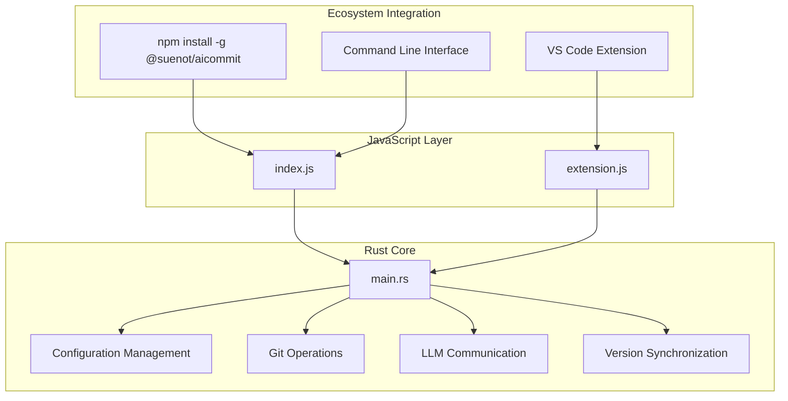
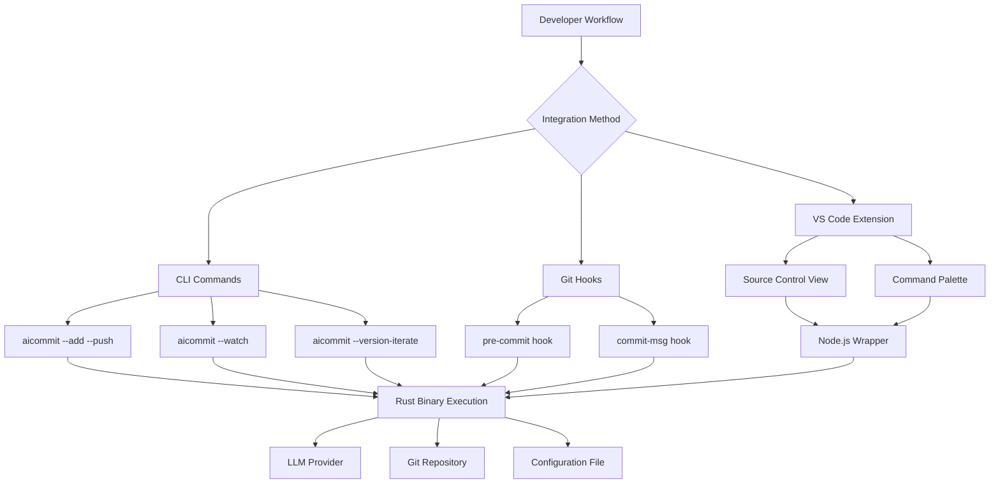
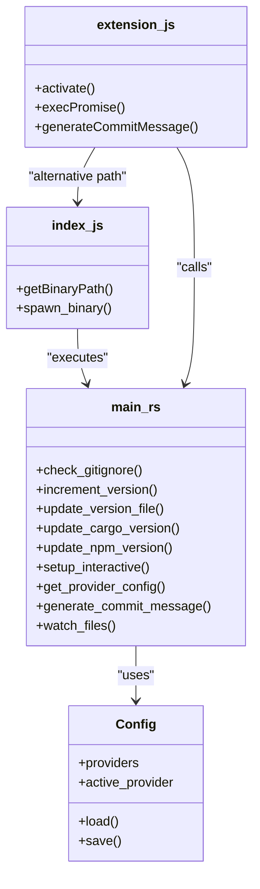

# Tool Overview & Core Value

<cite>
**Referenced Files in This Document**   
- [main.rs](file://src/main.rs)
- [index.js](file://index.js)
- [package.json](file://package.json)
- [Cargo.toml](file://Cargo.toml)
- [readme.md](file://readme.md)
- [vscode-extension/extension.js](file://vscode-extension/extension.js)
- [vscode-extension/package.json](file://vscode-extension/package.json)
</cite>

## Table of Contents
1. [Introduction](#introduction)
2. [Architecture Overview](#architecture-overview)
3. [Core Components](#core-components)
4. [Key Features](#key-features)
5. [Integration Methods](#integration-methods)
6. [Usage Examples](#usage-examples)
7. [Component Relationships](#component-relationships)
8. [Technical Characteristics](#technical-characteristics)

## Introduction
aicommit is an AI-powered Git commit message generator that leverages Large Language Models (LLMs) to create concise and descriptive commit messages from code changes. The tool supports multiple LLM providers including OpenRouter, Ollama, and OpenAI-compatible APIs, offering developers flexibility in how they generate commit messages. Built as a Rust-based binary for performance and reliability, aicommit also includes Node.js wrappers that enable npm distribution and seamless integration with development environments like VS Code. This hybrid architecture combines the efficiency of compiled Rust code with the accessibility of JavaScript-based ecosystem tools, making it easy to install globally via npm while maintaining high performance during execution.

**Section sources**
- [readme.md](file://readme.md#L0-L734)

## Architecture Overview
The aicommit tool follows a layered architecture with a clear separation between the core logic implementation and ecosystem integration components. At its foundation is a Rust binary that handles all critical operations including Git diff processing, LLM communication, configuration management, and version synchronization. This core component is wrapped by a Node.js interface that serves as the entry point when installed via npm, enabling cross-platform compatibility and integration with JavaScript-based tools. The architecture supports multiple deployment methods: direct installation via Cargo, global npm installation, and IDE-specific extensions. This design allows the performance-critical components to benefit from Rust's speed and memory safety, while the wrapper enables broad ecosystem adoption through familiar JavaScript tooling.

**Diagram sources **
- [main.rs](file://src/main.rs#L0-L3192)
- [index.js](file://index.js#L0-L70)
- [vscode-extension/extension.js](file://vscode-extension/extension.js#L0-L127)

**Section sources**
- [main.rs](file://src/main.rs#L0-L3192)
- [index.js](file://index.js#L0-L70)
- [package.json](file://package.json#L0-L57)
- [Cargo.toml](file://Cargo.toml#L0-L27)

## Core Components
The aicommit tool consists of several interconnected components that work together to provide AI-generated commit messages. The Rust core, implemented in main.rs, contains the primary logic for processing Git diffs, communicating with LLM providers, managing configurations, and handling version synchronization across different package managers. This component uses asynchronous Rust with Tokio for efficient network operations and implements sophisticated algorithms for model selection and failover. The Node.js wrapper in index.js serves as the entry point for npm installations, detecting the appropriate platform-specific binary and executing it with the provided arguments. Configuration is managed through a JSON file stored in the user's home directory, allowing persistent storage of provider settings and preferences. The system also includes specialized components for version management that can synchronize version numbers across Cargo.toml, package.json, and GitHub tags.

**Section sources**
- [main.rs](file://src/main.rs#L0-L3192)
- [index.js](file://index.js#L0-L70)
- [readme.md](file://readme.md#L0-L734)

## Key Features
aicommit offers a comprehensive set of features designed to streamline the commit process and enhance developer productivity. The tool provides automated commit generation using LLMs from various providers, with support for both cloud-based services like OpenRouter and local models via Ollama. A unique "Simple Free Mode" automatically selects the best available free models from OpenRouter, implementing an advanced failover mechanism with a sophisticated jail/blacklist system to track model performance over time. Version synchronization capabilities allow automatic incrementation of version numbers with simultaneous updates to Cargo.toml, package.json, and GitHub tags. Watch mode enables automatic committing when files are modified, with configurable delay timers to prevent premature commits during active editing sessions. The model jail system tracks success/failure ratios, temporarily restricting underperforming models while allowing them to recover after a cooling-off period, ensuring optimal model selection over time.

**Section sources**
- [main.rs](file://src/main.rs#L0-L3192)
- [readme.md](file://readme.md#L0-L734)

## Integration Methods
aicommit integrates into developer workflows through multiple channels, providing flexibility in how developers interact with the tool. As a CLI utility, it can be invoked directly from the terminal with various flags to control its behavior, including automatic staging, pushing, and version management. The tool can be incorporated into Git hooks to automate commit message generation as part of the standard Git workflow. For npm users, the tool is distributed through the npm registry, allowing global installation and execution from any project directory. The VS Code extension provides seamless integration within the popular code editor, adding a "Generate Commit Message" button to the Source Control view that executes aicommit with dry-run mode and populates the commit message input box. This multi-channel approach ensures that developers can use aicommit in the way that best fits their existing workflows, whether they prefer command-line tools, IDE integrations, or automated Git processes.

**Diagram sources **
- [index.js](file://index.js#L0-L70)
- [vscode-extension/extension.js](file://vscode-extension/extension.js#L0-L127)
- [main.rs](file://src/main.rs#L0-L3192)

**Section sources**
- [index.js](file://index.js#L0-L70)
- [vscode-extension/extension.js](file://vscode-extension/extension.js#L0-L127)
- [readme.md](file://readme.md#L0-L734)

## Usage Examples
aicommit supports various use cases that demonstrate its versatility in different development scenarios. For regular commits, developers can simply run `aicommit` after staging changes, which generates an AI-powered commit message based on the diff. To combine staging and committing in one step, the `--add` flag automatically stages all changes before generating the commit message. For version releases, the tool can automatically increment version numbers and synchronize them across multiple files using flags like `--version-iterate`, `--version-cargo`, and `--version-npm`. Interactive editing is supported through the `--dry-run` flag, which displays the generated message without creating a commit, allowing developers to review and modify it before finalizing. Watch mode with `--watch` enables continuous monitoring of file changes, automatically committing when modifications are detected, optionally with a delay specified by `--wait-for-edit` to avoid premature commits during active editing sessions.

**Section sources**
- [readme.md](file://readme.md#L0-L734)

## Component Relationships
The relationship between aicommit's components follows a clear hierarchy where the Rust core handles all business logic and data processing, while the JavaScript components serve as integration points with the broader development ecosystem. The main.rs file contains the primary application logic, including Git operations, LLM communication, and configuration management, compiled into a standalone binary for optimal performance. The index.js file acts as a launcher that detects the appropriate platform-specific binary and executes it with the provided command-line arguments, enabling npm distribution and cross-platform compatibility. The VS Code extension uses extension.js to integrate with the editor's API, calling the aicommit binary in dry-run mode and populating the commit message field with the generated result. This architecture ensures that performance-critical operations are handled by the efficient Rust code, while the JavaScript components provide accessibility and integration with popular development tools and package managers.

**Diagram sources **
- [main.rs](file://src/main.rs#L0-L3192)
- [index.js](file://index.js#L0-L70)
- [vscode-extension/extension.js](file://vscode-extension/extension.js#L0-L127)

**Section sources**
- [main.rs](file://src/main.rs#L0-L3192)
- [index.js](file://index.js#L0-L70)
- [vscode-extension/extension.js](file://vscode-extension/extension.js#L0-L127)

## Technical Characteristics
aicommit demonstrates several technical characteristics that contribute to its reliability and extensibility. The Rust implementation provides memory safety and thread safety without requiring garbage collection, resulting in a highly performant binary with minimal runtime overhead. The asynchronous architecture using Tokio enables efficient handling of network requests to LLM providers, with built-in retry mechanisms and timeout handling. The configuration system is designed for extensibility, supporting multiple provider types through a flexible enum-based structure that can easily accommodate new LLM services. The model management system implements sophisticated state tracking with time-based restrictions and performance metrics, allowing the tool to adapt to changing conditions in model availability and reliability. Cross-platform compatibility is achieved through the combination of Rust's excellent cross-compilation support and the Node.js wrapper that handles platform-specific execution details. This technical foundation ensures that aicommit remains reliable, maintainable, and adaptable to future requirements while delivering consistent performance across different operating systems and development environments.

**Section sources**
- [main.rs](file://src/main.rs#L0-L3192)
- [Cargo.toml](file://Cargo.toml#L0-L27)
- [readme.md](file://readme.md#L0-L734)