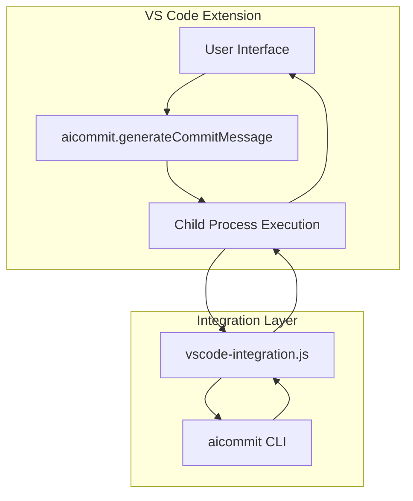
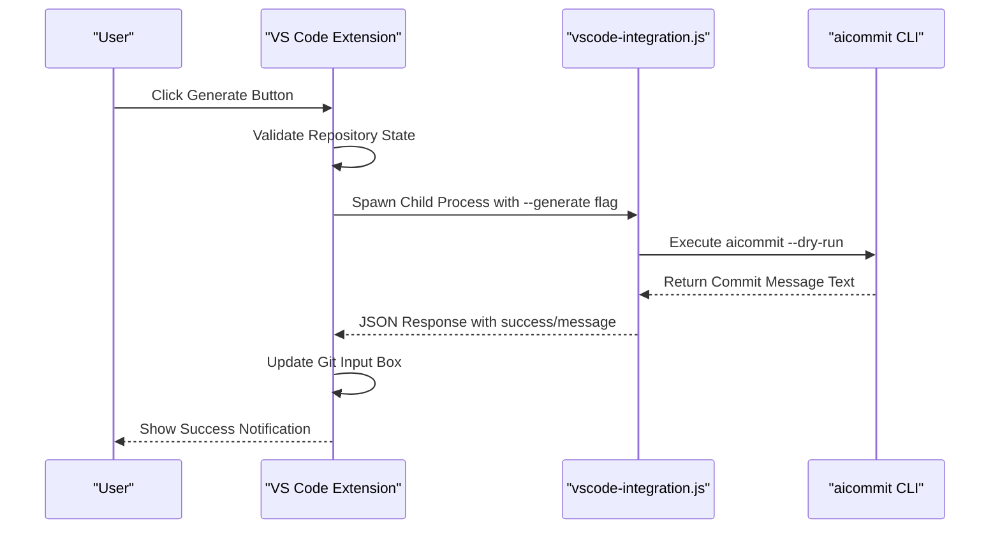
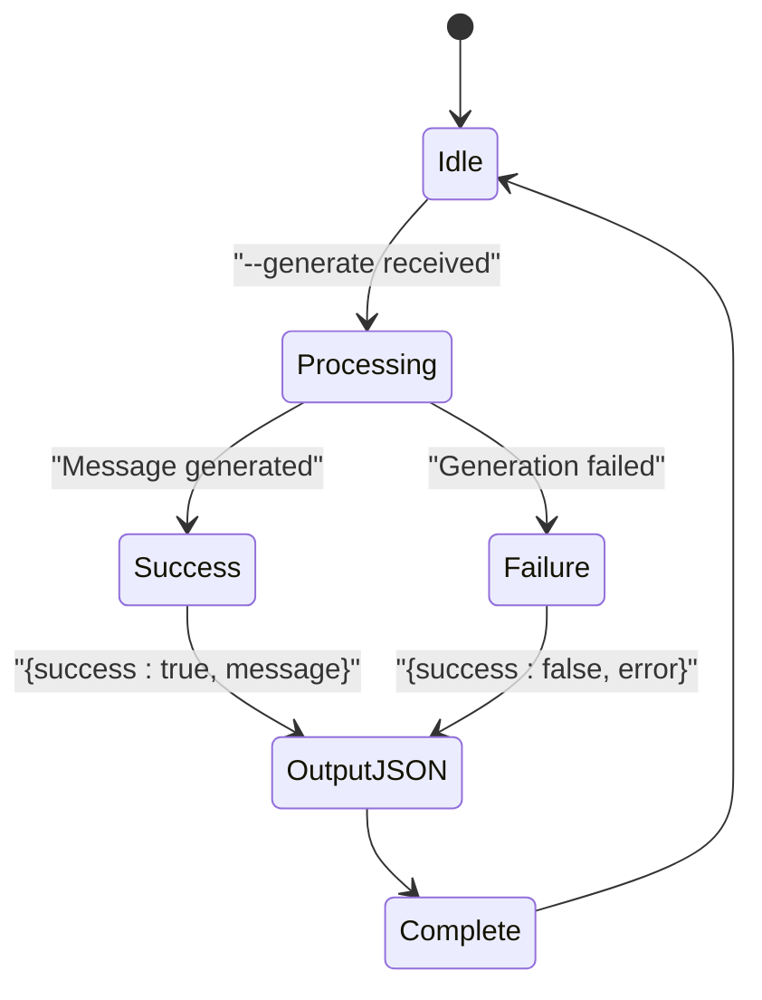

# Integration Details

<cite>
**Referenced Files in This Document**   
- [extension.js](file://vscode-extension/extension.js)
- [vscode-integration.js](file://bin/vscode-integration.js)
- [package.json](file://vscode-extension/package.json)
</cite>

## Table of Contents
1. [Integration Architecture Overview](#integration-architecture-overview)
2. [Data Flow Analysis](#data-flow-analysis)
3. [Message Format Specification](#message-format-specification)
4. [Error Handling and Status Updates](#error-handling-and-status-updates)
5. [Performance Considerations](#performance-considerations)
6. [Debugging Techniques](#debugging-techniques)

## Integration Architecture Overview

The VS Code extension integrates with the aicommit CLI tool through a child process execution model, establishing bidirectional communication via JSON-structured stdout messages. The architecture follows a clear separation of concerns where the extension handles UI interactions and the integration script manages CLI execution.



**Diagram sources**
- [extension.js](file://vscode-extension/extension.js#L27-L120)
- [vscode-integration.js](file://bin/vscode-integration.js#L39-L55)

**Section sources**
- [extension.js](file://vscode-extension/extension.js#L1-L127)
- [vscode-integration.js](file://bin/vscode-integration.js#L1-L58)

## Data Flow Analysis

The integration follows a well-defined data flow from user action to UI update, leveraging Node.js child_process module for IPC communication. The process begins when a user triggers the "Generate Commit Message" command from the Source Control view.



**Diagram sources**
- [extension.js](file://vscode-extension/extension.js#L45-L115)
- [vscode-integration.js](file://bin/vscode-integration.js#L15-L36)

**Section sources**
- [extension.js](file://vscode-extension/extension.js#L11-L25)
- [vscode-integration.js](file://bin/vscode-integration.js#L39-L55)

## Message Format Specification

The communication between the extension and integration script uses a standardized JSON message format that ensures reliable parsing and error handling. The main() function in vscode-integration.js processes command line arguments and formats responses accordingly.

```mermaid
flowchart TD
Start([Process Arguments]) --> CheckGenerate{"--generate flag present?"}
CheckGenerate --> |Yes| Generate[Call generateCommitMessage()]
CheckGenerate --> |No| Usage[Show Usage Instructions]
Generate --> HasMessage{"Message generated successfully?"}
HasMessage --> |Yes| SuccessResponse["Output JSON: {success: true, message: '...'}"]
HasMessage --> |No| ErrorResponse["Output JSON: {success: false, error: '...'}"]
SuccessResponse --> End
ErrorResponse --> End
Usage --> End
```

**Diagram sources**
- [vscode-integration.js](file://bin/vscode-integration.js#L39-L55)

**Section sources**
- [vscode-integration.js](file://bin/vscode-integration.js#L39-L55)

### Request Schema
When the extension invokes the integration script, it passes the `--generate` argument to trigger commit message generation:

[SPEC SYMBOL](file://vscode-extension/extension.js#L85-L95)

### Response Schema
The integration script returns structured JSON responses containing either success with message or failure with error details:

[SPEC SYMBOL](file://bin/vscode-integration.js#L46-L48)

## Error Handling and Status Updates

The integration implements comprehensive error handling at multiple levels, ensuring robust operation even when underlying components fail. Both the extension and integration script provide detailed status updates through console logging and user notifications.



**Diagram sources**
- [vscode-integration.js](file://bin/vscode-integration.js#L15-L36)
- [extension.js](file://vscode-extension/extension.js#L100-L120)

**Section sources**
- [extension.js](file://vscode-extension/extension.js#L100-L120)
- [vscode-integration.js](file://bin/vscode-integration.js#L20-L36)

## Performance Considerations

The integration design addresses performance challenges associated with child process creation and CLI execution overhead. While process startup time is inherent to the architecture, several strategies minimize perceived latency during commit generation.

The current implementation spawns a new child process for each commit message request, which includes the overhead of Node.js runtime initialization and CLI parsing. However, this approach ensures isolation between requests and prevents state contamination.

Key performance characteristics:
- **Process Startup Overhead**: Inherent cost of spawning Node.js process
- **CLI Initialization Time**: Time to load and parse aicommit configuration
- **Synchronous Execution**: Blocking execSync calls ensure response reliability
- **Repository Context**: Working directory context passed to maintain git state

Optimization opportunities include implementing a long-lived daemon process or connection pooling, though these would increase architectural complexity.

**Section sources**
- [extension.js](file://vscode-extension/extension.js#L11-L25)
- [vscode-integration.js](file://bin/vscode-integration.js#L15-L36)

## Debugging Techniques

Effective debugging of the VS Code extension integration requires monitoring both the extension's JavaScript execution and the integration script's output. Several techniques facilitate troubleshooting and development.

### Logging Strategy
Both components implement comprehensive console logging to track execution flow:
- Extension logs command execution details and repository context
- Integration script logs CLI invocation and JSON response generation

[SPEC SYMBOL](file://vscode-extension/extension.js#L15-L18)

### Independent Testing
The vscode-integration.js script can be tested independently of the extension:
```bash
node bin/vscode-integration.js --generate
```

This allows developers to verify CLI connectivity and message formatting without involving the VS Code environment.

### Asynchronous Operation Handling
The extension uses Promise-based async/await patterns to handle the asynchronous nature of child process execution, preventing UI blocking while maintaining responsiveness:

[SPEC SYMBOL](file://vscode-extension/extension.js#L11-L25)

**Section sources**
- [extension.js](file://vscode-extension/extension.js#L11-L25)
- [vscode-integration.js](file://bin/vscode-integration.js#L15-L36)