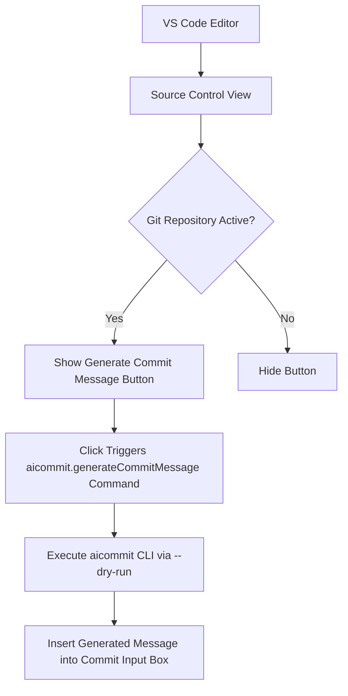
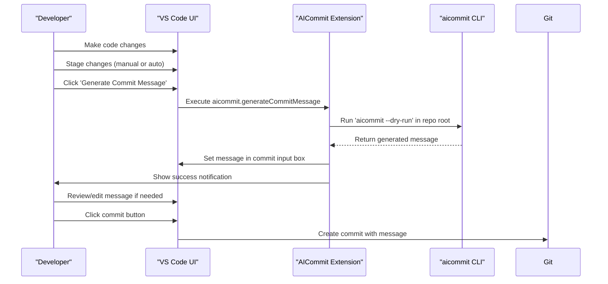
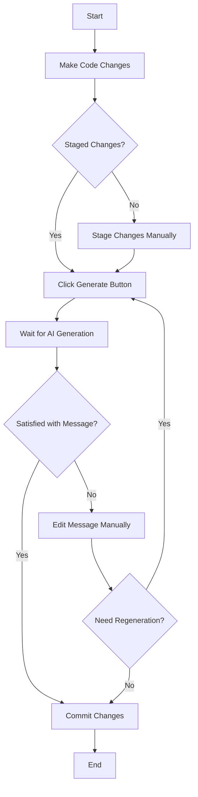
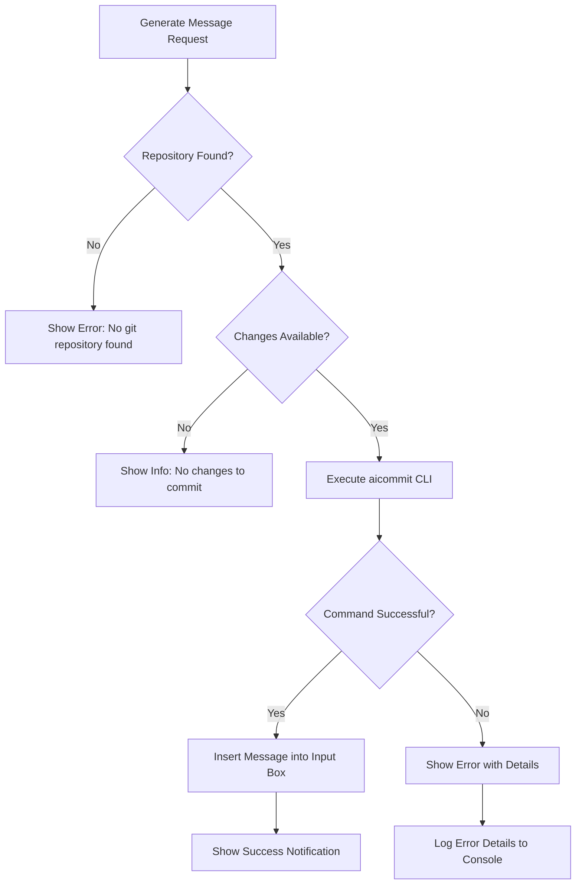

# Usage

<cite>
**Referenced Files in This Document **  
- [extension.js](file://vscode-extension/extension.js)
- [package.json](file://vscode-extension/package.json)
- [README.md](file://vscode-extension/README.md)
</cite>

## Table of Contents
1. [Integration with VS Code Git Interface](#integration-with-vs-code-git-interface)  
2. [User Interaction Flow](#user-interaction-flow)  
3. [Key Features](#key-features)  
4. [Usage Patterns](#usage-patterns)  
5. [Configuration Settings](#configuration-settings)  
6. [Error Handling and Feedback](#error-handling-and-feedback)  
7. [Command Palette and Keyboard Shortcuts](#command-palette-and-keyboard-shortcuts)

## Integration with VS Code Git Interface

The AICommit extension integrates directly into VS Code's built-in Source Control view, enabling seamless access to AI-powered commit message generation without leaving the editor environment. The extension adds a dedicated button labeled "Generate Commit Message" with a sparkle icon $(sparkle) to the SCM toolbar when a Git repository is detected.

This integration leverages the `vscode.git` API to interact with the active repository, ensuring compatibility with standard Git workflows. The extension only appears when the SCM provider is Git (`scmProvider == git`), maintaining consistency with VS Code's native source control experience.



**Diagram sources**  
- [extension.js](file://vscode-extension/extension.js#L27-L127)  
- [package.json](file://vscode-extension/package.json#L50-L60)

**Section sources**  
- [extension.js](file://vscode-extension/extension.js#L27-L127)  
- [package.json](file://vscode-extension/package.json#L50-L60)  
- [README.md](file://vscode-extension/README.md#L45-L55)

## User Interaction Flow

The user interaction flow for generating AI-powered commit messages follows a streamlined process within the VS Code interface:

1. **Stage Changes**: Users make changes to their files and stage them through the Source Control panel. If the `aicommit.autoStage` setting is enabled, all changes will be automatically staged before message generation.

2. **Trigger Generation**: Click the "Generate Commit Message" button in the SCM toolbar or use the command palette entry.

3. **Progress Indication**: A progress notification appears showing "AICommit: Generating commit message..." while the extension executes the `aicommit --dry-run` command.

4. **Message Insertion**: The generated commit message is automatically inserted into the commit message input box in the Source Control panel.

5. **Review and Edit**: Users can review and manually edit the AI-generated message before committing.

6. **Commit**: Once satisfied with the message, users click the commit button (✓) to finalize the commit.



**Diagram sources**  
- [extension.js](file://vscode-extension/extension.js#L27-L127)

**Section sources**  
- [extension.js](file://vscode-extension/extension.js#L27-L127)  
- [README.md](file://vscode-extension/README.md#L45-L55)

## Key Features

### Real-time Feedback
The extension provides real-time feedback through VS Code's notification system:
- Progress indicators during message generation
- Success notifications when a message is successfully generated
- Error messages with details when generation fails
- Informational messages when no changes are available to commit

### Multi-root Workspace Compatibility
The extension supports multi-root workspaces by accessing the first available repository in the workspace. While currently limited to one repository at a time, it properly detects when no repositories are available and displays an appropriate error message.

### Seamless Editor Integration
Unlike CLI usage, the VS Code extension allows developers to:
- Stay within the editor environment
- Visually review diffs before and after message generation
- Edit generated messages inline with immediate context
- Benefit from VS Code's native Git visualization tools

### Dry-run Execution
The extension uses the `--dry-run` flag when calling the aicommit CLI, ensuring that no actual commit is created during message generation. This allows safe experimentation with different message suggestions without affecting the repository state.

**Section sources**  
- [extension.js](file://vscode-extension/extension.js#L27-L127)  
- [README.md](file://vscode-extension/README.md#L1-L88)

## Usage Patterns

### Standard Commits
For regular development workflow:
1. Make changes to source files
2. Stage the desired changes in the Source Control view
3. Click the "Generate Commit Message" button
4. Review the AI-generated message describing the changes
5. Edit if necessary and commit

### Version Bumps
When combined with version management features:
1. Update version numbers in relevant files (Cargo.toml, package.json, etc.)
2. Stage the version-related changes
3. Generate commit message which will include version update context
4. The AI will typically generate messages like "Bump version to x.x.x" or "Update package versions"

### Interactive Editing
The extension supports interactive editing workflows:
1. Generate initial commit message
2. Modify the suggested message to better reflect intent
3. Use the same process iteratively until satisfied
4. Commit with the final refined message



**Diagram sources**  
- [extension.js](file://vscode-extension/extension.js#L27-L127)  
- [README.md](file://vscode-extension/README.md#L45-L55)

**Section sources**  
- [extension.js](file://vscode-extension/extension.js#L27-L127)  
- [README.md](file://vscode-extension/README.md#L45-L55)

## Configuration Settings

The extension provides two configurable settings accessible through VS Code's settings UI:

### Auto-stage Changes
- **Setting**: `aicommit.autoStage`
- **Default**: `false`
- **Description**: When enabled, automatically stages all changes in the repository before generating a commit message using `git add .`

### Provider Override
- **Setting**: `aicommit.providerOverride`
- **Default**: `""` (empty string)
- **Description**: Overrides the default LLM provider specified in the aicommit configuration, allowing per-project provider selection

These settings can be configured globally or on a per-workspace basis, enabling flexible adaptation to different project requirements.

```json
{
  "aicommit.autoStage": true,
  "aicommit.providerOverride": "openrouter/gpt-4"
}
```

**Section sources**  
- [package.json](file://vscode-extension/package.json#L65-L78)  
- [README.md](file://vscode-extension/README.md#L38-L44)

## Error Handling and Feedback

The extension implements comprehensive error handling to provide clear feedback:

### Common Error Scenarios
- **No Git Repository**: Displays "No git repository found" when attempting to use the extension outside a Git repository
- **No Changes to Commit**: Shows "No changes to commit" when there are no staged or unstaged changes
- **CLI Execution Failure**: Presents detailed error messages when the aicommit CLI fails to execute
- **Network Issues**: Handles API connectivity problems gracefully with descriptive error messages

### Feedback Mechanisms
- Uses VS Code's native notification system for all messages
- Shows progress indicators during potentially long-running operations
- Provides both success and error notifications with appropriate icons
- Logs detailed information to the developer console for troubleshooting



**Diagram sources**  
- [extension.js](file://vscode-extension/extension.js#L27-L127)

**Section sources**  
- [extension.js](file://vscode-extension/extension.js#L27-L127)

## Command Palette and Keyboard Shortcuts

### Command Palette Entry
The extension registers a command in VS Code's command palette:
- **Command ID**: `aicommit.generateCommitMessage`
- **Title**: "Generate Commit Message"
- **Activation**: Press `Ctrl+Shift+P` (or `Cmd+Shift+P` on macOS) and type "Generate Commit Message"

### Menu Integration
The command is integrated into the SCM title menu, appearing as a button with a sparkle icon $(sparkle) in the Source Control view toolbar when a Git repository is active.

### Keyboard Shortcut (Customizable)
While no default keyboard shortcut is provided, users can assign a custom keybinding in VS Code:
```json
{
  "key": "ctrl+alt+c",
  "command": "aicommit.generateCommitMessage",
  "when": "scmProvider == git"
}
```

This allows rapid access to AI-powered commit message generation directly from the keyboard, enhancing productivity during development workflows.

**Section sources**  
- [package.json](file://vscode-extension/package.json#L50-L60)  
- [extension.js](file://vscode-extension/extension.js#L27-L127)