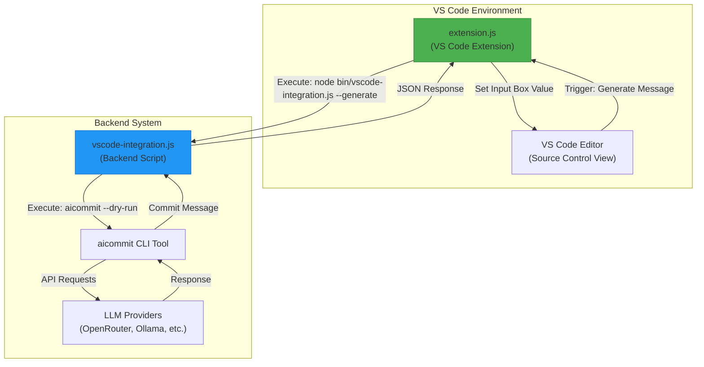
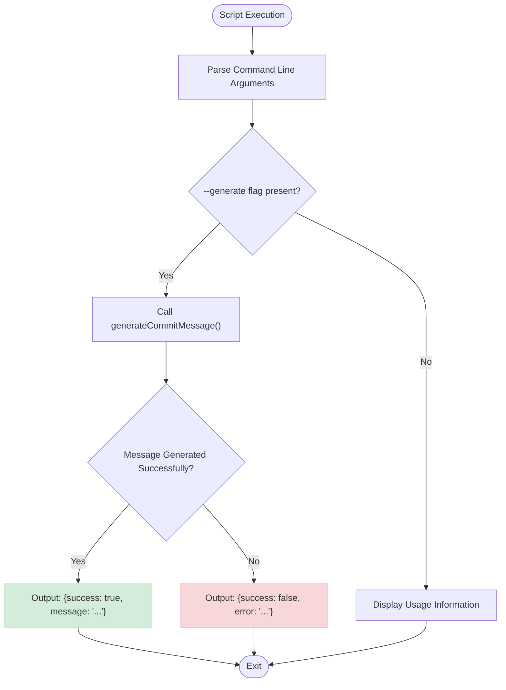
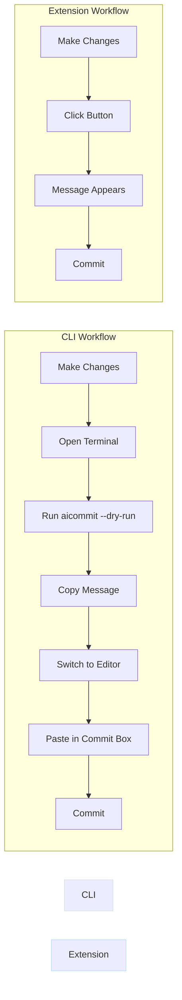

# VS Code Extension

<cite>
**Referenced Files in This Document **   
- [extension.js](file://vscode-extension/extension.js)
- [vscode-integration.js](file://bin/vscode-integration.js)
- [package.json](file://vscode-extension/package.json)
- [build.sh](file://vscode-extension/build.sh)
- [README.md](file://vscode-extension/README.md)
</cite>

## Table of Contents
1. [Introduction](#introduction)
2. [Installation Methods](#installation-methods)
3. [Usage in VS Code Editor](#usage-in-vs-code-editor)
4. [Integration Architecture](#integration-architecture)
5. [Message Format Specification](#message-format-specification)
6. [CLI Integration and GUI Experience](#cli-integration-and-gui-experience)
7. [Debugging Techniques](#debugging-techniques)
8. [Customization Options](#customization-options)
9. [Benefits Over Pure CLI Usage](#benefits-over-pure-cli-usage)
10. [Conclusion](#conclusion)

## Introduction
The AICommit VS Code extension provides seamless integration between the aicommit CLI tool and the Visual Studio Code editor, enabling developers to generate AI-powered commit messages directly within the Git interface. This documentation covers the complete functionality, architecture, and usage patterns of the extension, focusing on how it enhances the development workflow by combining the power of command-line capabilities with a user-friendly graphical interface.

## Installation Methods

### Marketplace Installation
The extension can be installed directly from the VS Code Marketplace:
```bash
# Search for "AICommit for VS Code" in the Extensions view
# Or install via command line:
code --install-extension suenot.suenot-aicommit-vscode
```

### Manual Build and Installation
For users who prefer building from source or contributing to development:

1. Clone the repository and navigate to the extension directory:
```bash
git clone https://github.com/suenot/aicommit.git
cd aicommit/vscode-extension
```

2. Build the extension using the provided script:
```bash
./build.sh
```

3. Install the generated VSIX package:
```bash
code --install-extension aicommit-vscode-*.vsix
```

The build process automatically checks for required dependencies (npm and vsce), installs them if necessary, packages the extension, and provides installation instructions upon successful completion.

**Section sources**
- [build.sh](file://vscode-extension/build.sh#L1-L40)
- [README.md](file://vscode-extension/README.md#L50-L75)

## Usage in VS Code Editor

### Triggering Commit Generation
To use the extension within VS Code's Git interface:

1. Open a git repository in VS Code
2. Make changes to your files
3. Open the Source Control view (Ctrl+Shift+G)
4. Click the "Generate Commit Message" button (sparkle icon) in the source control toolbar
5. The generated message will appear in the commit message input box
6. Review and edit the message as needed before committing

The extension integrates directly with the standard SCM provider interface, making the AI-generated commit message feature accessible through a dedicated button in the git toolbar when working with git repositories.

### Reviewing AI Suggestions
After triggering the generation process, users can:
- View progress notifications during message generation
- See success or error messages indicating the outcome
- Edit the generated message before finalizing the commit
- Rerun the generation process if a different message is desired

The extension ensures that the workflow remains familiar to VS Code users while enhancing it with AI-powered suggestions.

**Section sources**
- [extension.js](file://vscode-extension/extension.js#L32-L119)
- [README.md](file://vscode-extension/README.md#L25-L45)

## Integration Architecture

The extension employs a two-component architecture that bridges the VS Code environment with the backend CLI tool:



**Diagram sources **
- [extension.js](file://vscode-extension/extension.js#L30-L119)
- [vscode-integration.js](file://bin/vscode-integration.js#L15-L55)

The architecture follows a clear separation of concerns:
- The VS Code extension handles UI integration and user interaction
- The backend script acts as an intermediary that executes the CLI tool
- The aicommit CLI processes git diffs and communicates with LLM providers
- Results flow back through the chain to populate the commit message field

This design allows the extension to leverage the full capabilities of the CLI tool while maintaining a responsive and integrated user experience within the editor.

**Section sources**
- [extension.js](file://vscode-extension/extension.js#L30-L119)
- [vscode-integration.js](file://bin/vscode-integration.js#L1-L58)

## Message Format Specification

The communication between the backend script (`vscode-integration.js`) and the VS Code extension follows a standardized JSON format over stdout. This message protocol is defined in the `main()` function of the integration script:



**Diagram sources **
- [vscode-integration.js](file://bin/vscode-integration.js#L39-L55)

The message format specification includes:
- **Request Protocol**: The extension invokes the script with the `--generate` argument to trigger message generation
- **Success Response**: When successful, the script outputs a JSON object containing:
  - `success`: boolean set to `true`
  - `message`: string containing the generated commit message
- **Error Response**: When failed, the script outputs a JSON object containing:
  - `success`: boolean set to `false`
  - `error`: string describing the failure reason
- **Content Type**: All responses are valid JSON strings written to stdout
- **Encoding**: UTF-8 encoding is used for all text content

This standardized format ensures reliable parsing by the extension and consistent error handling across different execution scenarios.

**Section sources**
- [vscode-integration.js](file://bin/vscode-integration.js#L39-L55)

## CLI Integration and GUI Experience

The extension seamlessly combines the robust functionality of the aicommit CLI with an intuitive graphical interface:

```mermaid
classDiagram
class VSCodeExtension {
+activate(context)
-execPromise(command, cwd)
-handleConfiguration()
-displayProgress()
-showNotifications()
}
class BackendScript {
+main()
+generateCommitMessage()
-executeCLICommand()
-formatJSONResponse()
}
class AICLITool {
+processGitDiff()
+communicateWithLLM()
+generateCommitMessage()
+handleVersionManagement()
}
VSCodeExtension --> BackendScript : "executes"
BackendScript --> AICLITool : "invokes"
AICLITool --> LLMProviders : "communicates with"
note right of VSCodeExtension
Handles UI integration,
progress indicators,
and configuration
end note
note right of BackendScript
Acts as bridge between
extension and CLI,
formats responses
end note
note right of AICLITool
Core logic for message
generation, supports
multiple providers
end note
```

**Diagram sources **
- [extension.js](file://vscode-extension/extension.js#L11-L119)
- [vscode-integration.js](file://bin/vscode-integration.js#L15-L55)

Key integration aspects include:
- **Full CLI Feature Access**: The extension leverages the complete functionality of the aicommit CLI, including support for multiple LLM providers (OpenRouter, Ollama, OpenAI-compatible endpoints)
- **Context Preservation**: Commands are executed with the correct working directory (repository root) to ensure proper access to git history and project files
- **Configuration Propagation**: Extension settings are translated into appropriate CLI arguments (e.g., provider override becomes `--set` parameter)
- **Error Propagation**: Errors from the CLI layer are captured and presented as user-friendly notifications in the VS Code interface
- **Progress Indication**: Long-running operations show progress notifications in the editor

This integration model allows users to benefit from advanced CLI features like automatic version management, smart retry mechanisms, and provider flexibility while enjoying the convenience of a visual editor workflow.

**Section sources**
- [extension.js](file://vscode-extension/extension.js#L30-L119)
- [vscode-integration.js](file://bin/vscode-integration.js#L15-L36)

## Debugging Techniques

When troubleshooting issues with the extension, several diagnostic approaches can be employed:

### Enable Verbose Logging
The extension includes comprehensive console logging that can help identify issues:

1. Open the VS Code Developer Tools (Help → Toggle Developer Tools)
2. Monitor the Console tab for extension-related messages
3. Look for log entries prefixed with "Executing command", "Repository root", or "Error in aicommit extension"

Key log messages include:
- Command execution details with working directory
- Repository detection and root path
- Progress notifications for staging and message generation
- Error stack traces when failures occur

### Verify Prerequisites
Ensure all requirements are met:
```bash
# Check if aicommit CLI is installed
aicommit --version

# Verify git repository status
git status

# Test CLI functionality independently
aicommit --dry-run
```

### Test Backend Script Directly
The integration script can be tested outside of VS Code:
```bash
# Navigate to project root
cd /path/to/your/repo

# Execute the integration script directly
node /path/to/aicommit/bin/vscode-integration.js --generate
```

### Common Issues and Solutions
- **"No git repository found"**: Ensure you have opened a folder containing a git repository in VS Code
- **"Command failed" errors**: Verify that the aicommit CLI is properly installed and accessible in your PATH
- **Empty commit messages**: Check if there are actually staged changes or enable auto-staging in settings
- **Provider-specific errors**: Validate your aicommit configuration and provider credentials

### Development Mode Testing
For extension developers:
- Press F5 in VS Code to launch a new window with the extension loaded
- Make changes and reload (F5 again) to test modifications
- Use breakpoints in extension.js for step-by-step debugging

**Section sources**
- [extension.js](file://vscode-extension/extension.js#L11-L119)
- [vscode-integration.js](file://bin/vscode-integration.js#L1-L58)

## Customization Options

The extension provides configurable settings through VS Code's settings system:

### Available Settings
The following configuration options are available under the "AICommit" section:

```json
{
  "aicommit.autoStage": {
    "type": "boolean",
    "default": false,
    "description": "Automatically stage all changes before generating commit message"
  },
  "aicommit.providerOverride": {
    "type": "string",
    "default": "",
    "description": "Override the default provider specified in aicommit configuration"
  }
}
```

### Configuration Methods
Users can customize these settings through multiple interfaces:

1. **Settings UI**: Open VS Code Settings (Ctrl+,) and search for "AICommit"
2. **settings.json**: Edit the workspace or user settings file directly:
```json
{
  "aicommit.autoStage": true,
  "aicommit.providerOverride": "openrouter/free"
}
```

### Setting Behaviors
- **Auto-Stage**: When enabled, all changes are automatically staged before message generation, eliminating the need for manual staging
- **Provider Override**: Allows temporary switching to a different LLM provider without modifying the global aicommit configuration

These settings provide flexibility for different workflow preferences while maintaining compatibility with the underlying CLI tool's configuration system.

**Section sources**
- [package.json](file://vscode-extension/package.json#L65-L80)
- [extension.js](file://vscode-extension/extension.js#L35-L37)

## Benefits Over Pure CLI Usage

The VS Code extension offers several advantages over using the aicommit CLI tool directly:

### Rapid Iteration Workflows


**Diagram sources **
- [extension.js](file://vscode-extension/extension.js#L32-L119)

### Key Advantages
- **Reduced Context Switching**: Eliminates the need to switch between editor and terminal
- **Immediate Feedback**: Generated messages appear directly in the commit interface
- **Visual Progress Indicators**: Clear notifications show operation status
- **Seamless Integration**: Works within the familiar VS Code source control flow
- **One-Click Operation**: Single button press triggers the entire generation process
- **Preserved Editing Context**: No need to copy/paste between applications
- **Enhanced Discoverability**: The sparkle icon makes the feature visible and accessible

For rapid iteration workflows, where developers frequently make small changes and commit often, the extension significantly reduces friction and cognitive load compared to the CLI approach. The ability to generate and review AI suggestions without leaving the editor context enables faster development cycles and more natural integration of AI assistance into the coding process.

**Section sources**
- [extension.js](file://vscode-extension/extension.js#L30-L119)
- [README.md](file://vscode-extension/README.md#L25-L45)

## Conclusion
The AICommit VS Code extension successfully bridges the gap between powerful CLI functionality and intuitive editor integration. By leveraging the full capabilities of the aicommit tool while providing a seamless GUI experience, it enhances developer productivity and simplifies the process of creating meaningful commit messages. The well-defined architecture, clear message protocols, and thoughtful customization options make it a robust solution for teams looking to incorporate AI assistance into their version control workflows. Whether installing from the marketplace or building from source, users gain access to advanced AI-powered commit generation that fits naturally within their existing development environment.