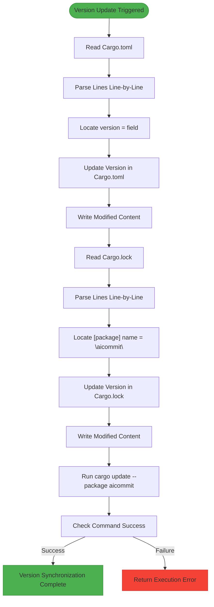

# Cargo.toml Synchronization

<cite>
**Referenced Files in This Document**   
- [Cargo.toml](file://Cargo.toml)
- [Cargo.lock](file://Cargo.lock)
- [src/main.rs](file://src/main.rs)
</cite>

## Table of Contents
1. [Introduction](#introduction)
2. [Version Synchronization Overview](#version-synchronization-overview)
3. [Core Components](#core-components)
4. [Architecture Overview](#architecture-overview)
5. [Detailed Component Analysis](#detailed-component-analysis)
6. [Error Handling and Recovery](#error-handling-and-recovery)
7. [Practical Examples](#practical-examples)
8. [Conclusion](#conclusion)

## Introduction
This document details the internal mechanism by which the `aicommit` tool synchronizes version information across Cargo manifest files. The system ensures consistency between `Cargo.toml` and `Cargo.lock` when updating the application's version, maintaining integrity through proper dependency resolution. This synchronization is critical for reliable package management and release tracking in Rust projects.

## Version Synchronization Overview
The version synchronization feature enables coordinated updates of the `aicommit` package version across both `Cargo.toml` and `Cargo.lock` files. When activated via the `--version-cargo` flag, the tool performs atomic updates to both manifest files, ensuring they remain consistent. After modifying the version fields directly in both files, it executes `cargo update --package aicommit` to validate and reconcile any dependency changes, guaranteeing that the lock file accurately reflects the current state of dependencies.

**Section sources**
- [src/main.rs](file://src/main.rs#L193-L193)
- [src/main.rs](file://src/main.rs#L1872-L1872)

## Core Components
The version synchronization functionality centers around the `update_cargo_version` function, which handles parsing, modification, and validation of Cargo manifest files. It operates on both `Cargo.toml` and `Cargo.lock`, locating version fields through line-by-line analysis rather than full TOML parsing to preserve formatting and comments. The process concludes with execution of Cargo's native update command to ensure dependency graph integrity.

**Section sources**
- [src/main.rs](file://src/main.rs#L296-L350)

## Architecture Overview


**Diagram sources **
- [src/main.rs](file://src/main.rs#L296-L350)

## Detailed Component Analysis

### update_cargo_version Function Analysis
The `update_cargo_version` function implements a precise text-based approach to modify version declarations without disrupting other configuration elements. By processing files line-by-line, it avoids potential issues associated with full TOML deserialization and re-serialization, such as whitespace changes or comment removal.

#### Version Update Logic
```mermaid
flowchart TD
A[Start update_cargo_version] --> B[Read Cargo.toml content]
B --> C{Content read successfully?}
C --> |No| D[Return read error]
C --> |Yes| E[Process each line]
E --> F{Line starts with "version = "?}
F --> |Yes| G[Replace with new version]
F --> |No| H[Keep original line]
G --> I[Collect updated lines]
H --> I
I --> J[Join lines into string]
J --> K[Write back to Cargo.toml]
K --> L{Write successful?}
L --> |No| M[Return write error]
L --> |Yes| N[Proceed to Cargo.lock update]
N --> O[Read Cargo.lock content]
O --> P{Content read successfully?}
P --> |No| Q[Return read error]
P --> |Yes| R[Process each line]
R --> S{Line is "name = \"aicommit\""?}
S --> |Yes| T[Set in_aicommit_package = true]
S --> |No| U{in_aicommit_package AND line starts with "version = "?}
U --> |Yes| V[Replace version, reset flag]
U --> |No| W{Line is empty?}
W --> |Yes| X[Reset in_aicommit_package]
W --> |No| Y[Keep original line]
V --> Z[Collect updated lines]
X --> Z
Y --> Z
Z --> AA[Join lines into string]
AA --> AB[Write back to Cargo.lock]
AB --> AC{Write successful?}
AC --> |No| AD[Return write error]
AC --> |Yes| AE[Execute cargo update command]
AE --> AF{Command succeeded?}
AF --> |No| AG[Return command error]
AF --> |Yes| AH[Return success]
style D fill:#FFCDD2,stroke:#C62828
style M fill:#FFCDD2,stroke:#C62828
style Q fill:#FFCDD2,stroke:#C62828
AD fill:#FFCDD2,stroke:#C62828
AG fill:#FFCDD2,stroke:#C62828
AH fill:#C8E6C9,stroke:#2E7D32
```

**Diagram sources **
- [src/main.rs](file://src/main.rs#L296-L350)

**Section sources**
- [src/main.rs](file://src/main.rs#L296-L350)

## Error Handling and Recovery
The version synchronization system incorporates comprehensive error handling at multiple levels to ensure reliability and prevent partial updates that could leave the project in an inconsistent state.

### Error Conditions
The following error conditions are explicitly handled:

- **Missing Manifest Files**: If either `Cargo.toml` or `Cargo.lock` does not exist, the operation fails with a descriptive message indicating the missing file.
- **File Access Errors**: Any permission issues or I/O errors during reading or writing manifest files result in immediate termination with specific error context.
- **Parse Failures**: While the line-by-line approach minimizes parsing risks, malformed input that prevents proper version field identification triggers appropriate error responses.
- **Command Execution Failures**: If the final `cargo update --package aicommit` command fails (e.g., due to network issues or corrupted state), the error is captured and propagated.

### Atomicity Considerations
Although the updates to `Cargo.toml` and `Cargo.lock` occur sequentially, the design prioritizes consistency. If an error occurs after modifying one file but before completing the other, the resulting inconsistency must be resolved manually, typically by reverting changes or running `cargo update` independently.

**Section sources**
- [src/main.rs](file://src/main.rs#L296-L350)

## Practical Examples

### Successful Synchronization Scenario
When a user runs `aicommit --version-cargo`, the following sequence occurs:
1. Current version is read from `Cargo.toml` (e.g., 0.1.139)
2. Version is incremented to 0.1.140
3. `Cargo.toml` is updated with new version
4. `Cargo.lock` is scanned and `aicommit` package version is updated
5. `cargo update --package aicommit` is executed successfully
6. Both files reflect the new version consistently

### Merge Conflict Recovery
In cases where version bumps create merge conflicts:
1. Git detects conflict in both `Cargo.toml` and `Cargo.lock`
2. Developer resolves conflict manually, ensuring both files have identical version numbers
3. Run `cargo update --package aicommit` to verify lock file integrity
4. Commit resolved files

Alternative recovery approach:
```bash
# Revert changes
git checkout HEAD Cargo.toml Cargo.lock

# Manually set desired version
echo "0.1.140" > version.txt
aicommit --version-file version.txt --version-cargo

# Verify consistency
cargo check
```

**Section sources**
- [Cargo.toml](file://Cargo.toml#L2-L2)
- [Cargo.lock](file://Cargo.lock#L29-L30)
- [src/main.rs](file://src/main.rs#L296-L350)

## Conclusion
The `aicommit` tool provides robust version synchronization capabilities for Rust projects by carefully coordinating updates across both `Cargo.toml` and `Cargo.lock` files. Its line-by-line modification strategy preserves file structure while ensuring accurate version propagation. The integration of `cargo update` as a final validation step guarantees that dependency resolution remains consistent after version changes. This approach balances precision with reliability, making it suitable for automated workflows while providing clear error feedback for troubleshooting when issues arise.