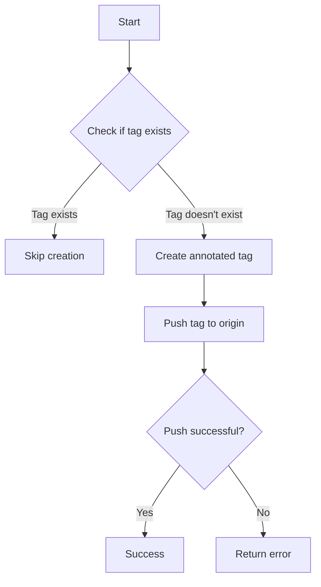
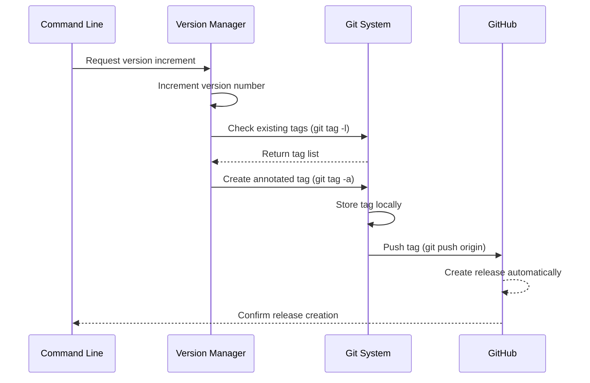
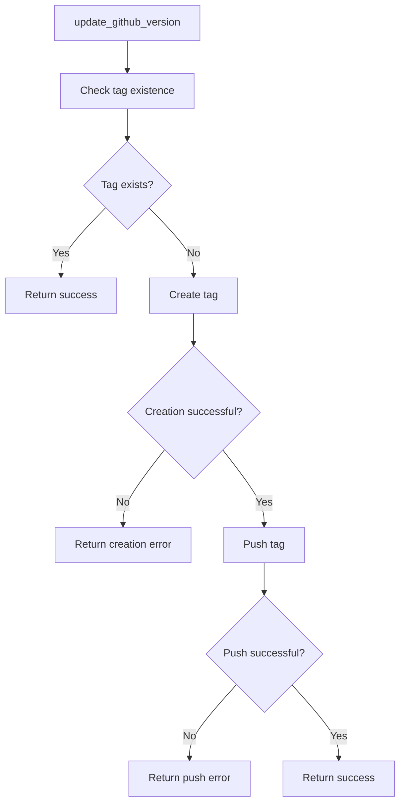

# GitHub Release Creation

<cite>
**Referenced Files in This Document **   
- [main.rs](file://src/main.rs)
- [Cargo.toml](file://Cargo.toml)
- [package.json](file://package.json)
- [readme.md](file://readme.md)
</cite>

## Table of Contents
1. [Introduction](#introduction)
2. [Core Functionality](#core-functionality)
3. [Version Management Integration](#version-management-integration)
4. [Error Handling and Failure Conditions](#error-handling-and-failure-conditions)
5. [CI/CD Pipeline Integration](#cicd-pipeline-integration)
6. [Troubleshooting Guide](#troubleshooting-guide)

## Introduction
The aicommit tool provides automated GitHub release creation through intelligent tag management, enabling seamless version control and release automation. By leveraging Git's tagging system, aicommit creates annotated tags that correspond to GitHub releases, streamlining the software release process. This documentation details how the `update_github_version` function implements this functionality, covering its integration with semantic versioning conventions, duplicate prevention mechanisms, and error handling strategies.

The release creation feature is designed to work as part of a comprehensive version management system that synchronizes version information across multiple file formats while ensuring proper Git repository state. When activated with the `--version-github` flag, the tool automatically handles the entire release workflow from version bumping to tag creation and pushing.

## Core Functionality

### update_github_version Function Analysis
The `update_github_version` function implements a three-step process for creating GitHub releases through tag management:



**Diagram sources **
- [main.rs](file://src/main.rs#L392-L450)

**Section sources**
- [main.rs](file://src/main.rs#L392-L450)

#### Tag Existence Verification
Before creating a new tag, the function checks for existing tags using the command `git tag -l v{version}`. This prevents duplicate tag creation by listing all tags matching the specified pattern and checking if any results are returned. The implementation uses exact pattern matching to ensure precise version identification.

#### Annotated Tag Creation
When no existing tag is found, the function creates an annotated tag using the command `git tag -a v{version} -m "Release v{version}"`. The annotation includes a descriptive message that follows the conventional format "Release vX.X.X", providing context for the release. The 'v' prefix adheres to semantic versioning conventions commonly used in GitHub repositories.

#### Tag Pushing to Remote Repository
After local tag creation, the function pushes the tag to the origin repository using `git push origin v{version}`. This step makes the tag available on the remote repository, where GitHub automatically recognizes it as a release. The direct tag reference ensures that only the specific version tag is pushed, avoiding unintended branch updates.

## Version Management Integration

### Semantic Versioning Convention
The tool follows standard semantic versioning practices with 'v'-prefixed tags, which GitHub recognizes as formal releases. This convention provides several benefits:

- Clear visual indication of release versions
- Proper sorting of releases in chronological order
- Compatibility with GitHub's release detection algorithms
- Consistency with industry standards

The version string is extracted from the configured version file and formatted with the 'v' prefix before tag operations, ensuring consistent naming across all releases.



**Diagram sources **
- [main.rs](file://src/main.rs#L392-L450)
- [main.rs](file://src/main.rs#L1887-L1923)

**Section sources**
- [main.rs](file://src/main.rs#L1887-L1923)
- [readme.md](file://readme.md#L217-L236)

### Integration Workflow
The GitHub release creation is triggered when the `--version-github` flag is used in conjunction with other version management flags. The complete workflow involves:

1. Version file reading and incrementation
2. Synchronization with package configuration files (Cargo.toml, package.json)
3. Creation of the annotated Git tag
4. Pushing the tag to the remote repository

This integrated approach ensures that all version references are updated consistently before the release is created, maintaining integrity across the codebase.

## Error Handling and Failure Conditions

### Network Failures
Network connectivity issues during the tag push operation result in explicit error messages containing the stderr output from the git command. The function captures these errors and returns them as descriptive strings, allowing users to diagnose connection problems, authentication issues, or network timeouts.

### Authentication Issues
Authentication failures typically occur during the push phase when credentials are invalid or missing. The function preserves the original git error message, which usually contains specific information about authentication problems, such as "remote: HTTP Basic: Access denied" or "Permission denied (publickey)".

### Repository State Conflicts
Repository state conflicts can prevent successful tag creation or pushing. Common scenarios include:
- Non-fast-forward updates when the remote repository has diverged
- Missing upstream branches
- Insufficient permissions to push to the repository

The function handles these cases by returning the underlying git error, which provides specific details about the nature of the conflict.



**Diagram sources **
- [main.rs](file://src/main.rs#L392-L450)

**Section sources**
- [main.rs](file://src/main.rs#L392-L450)

## CI/CD Pipeline Integration

### Practical Examples
The tool can be seamlessly integrated into CI/CD pipelines for automated release management. The package.json script demonstrates a complete release workflow:

```json
"new-version": "aicommit --add --version-file version --version-iterate --version-cargo --version-npm --version-github --push"
```

This single command performs multiple operations:
- Stages all changes (`--add`)
- Reads and increments the version from the version file (`--version-file version --version-iterate`)
- Updates Cargo.toml (`--version-cargo`)
- Updates package.json (`--version-npm`)
- Creates a GitHub release (`--version-github`)
- Pushes all changes including the tag (`--push`)

In a CI/CD environment, this can be triggered automatically on merge to main branch or manually by developers.

### Automation Benefits
The integration provides several advantages for continuous delivery:
- Eliminates manual release steps
- Ensures consistency across version references
- Reduces human error in release processes
- Provides audit trail through automated commits
- Enables rapid iteration with reliable version tracking

## Troubleshooting Guide

### Common Git Operation Failures
When encountering issues with GitHub release creation, consider the following troubleshooting steps:

1. **Verify Git configuration**: Ensure git is properly configured with user.name and user.email
2. **Check authentication**: Verify that SSH keys or personal access tokens are correctly set up
3. **Confirm repository access**: Ensure you have write permissions to the repository
4. **Validate network connectivity**: Test connection to the Git host
5. **Check for existing tags**: Verify that the target version tag doesn't already exist

### Resolution Strategies
For specific error conditions:

- **Authentication errors**: Update credentials or regenerate access tokens
- **Permission denied**: Verify repository permissions and team membership
- **Non-fast-forward errors**: Pull latest changes before attempting to push
- **Tag already exists**: Use a different version number or delete the existing tag
- **Network timeouts**: Retry with better connectivity or increase timeout settings

The detailed error messages returned by the function provide specific guidance for resolving most issues, making debugging more efficient.