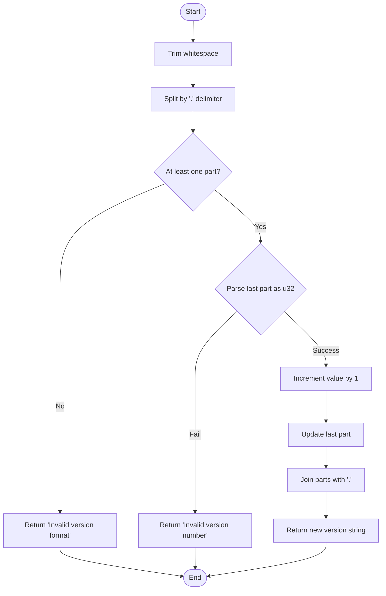
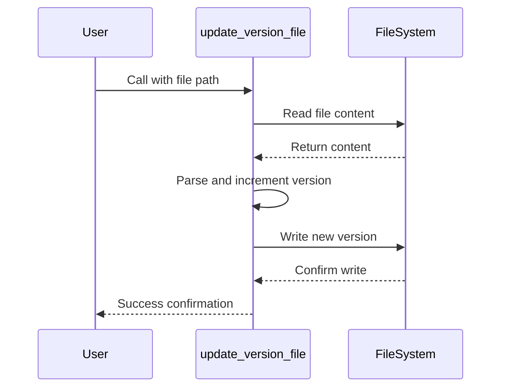
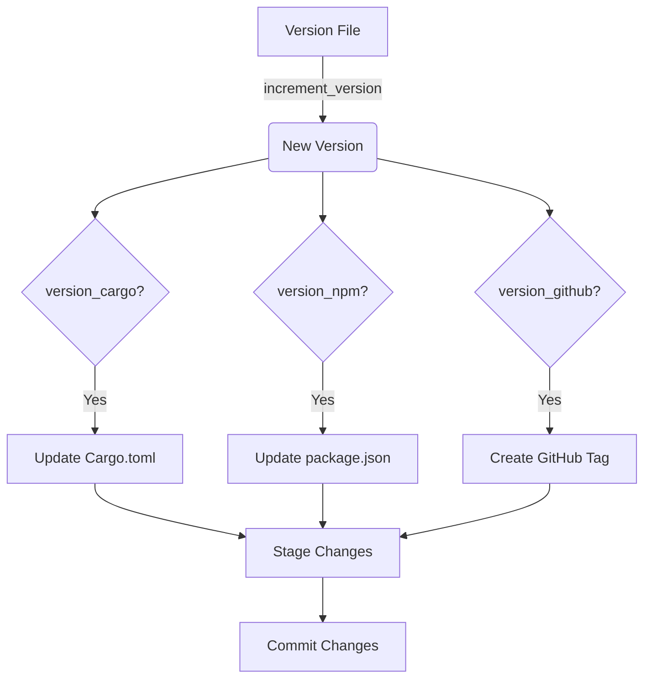

# Version File Incrementation

<cite>
**Referenced Files in This Document**   
- [main.rs](file://src/main.rs)
- [Cargo.toml](file://Cargo.toml)
- [package.json](file://package.json)
</cite>

## Table of Contents
1. [Introduction](#introduction)
2. [Core Components](#core-components)
3. [Version Increment Algorithm](#version-increment-algorithm)
4. [File Update Process](#file-update-process)
5. [Error Handling](#error-handling)
6. [Integration with Version Management](#integration-with-version-management)
7. [Common Issues and Solutions](#common-issues-and-solutions)

## Introduction
The aicommit tool provides automated version management capabilities through its version file incrementation feature. This functionality enables developers to automatically update semantic version strings across multiple project files during the commit process. The system focuses on incrementing the patch version number (e.g., changing '0.0.37' to '0.0.38') while maintaining compatibility with various version file formats including plain text version files, Cargo.toml for Rust projects, and package.json for Node.js applications.

## Core Components

The version incrementation system consists of two primary functions that work together to provide reliable version updates: `increment_version` for parsing and modifying version strings, and `update_version_file` for handling file I/O operations atomically.

**Section sources**
- [main.rs](file://src/main.rs#L260-L301)
- [main.rs](file://src/main.rs#L1844-L1885)

## Version Increment Algorithm

The `increment_version` function implements a semantic version parsing algorithm that specifically targets the patch number component of version strings. The algorithm follows these steps:

1. Trims whitespace from the input version string
2. Splits the version string by '.' delimiter into components
3. Validates that at least one component exists
4. Attempts to parse the last component (patch number) as a u32 integer
5. Increments the parsed number by 1
6. Reconstructs the version string with the updated patch number

The function handles edge cases such as invalid format specifications (empty or malformed version strings) and non-numeric components in the patch position. When validation fails, appropriate error messages are returned indicating whether the issue is with the overall format or specifically with the version number parsing.

**Diagram sources**
- [main.rs](file://src/main.rs#L260-L275)

**Section sources**
- [main.rs](file://src/main.rs#L260-L275)

## File Update Process

The `update_version_file` async function handles the complete file update workflow, ensuring atomic operations and proper error handling throughout the process. The function operates in three distinct phases:

1. **Read Phase**: Uses tokio::fs::read_to_string to asynchronously read the entire version file content
2. **Process Phase**: Passes the read content to the `increment_version` function for processing
3. **Write Phase**: Writes the updated version back to the same file using tokio::fs::write

The implementation preserves the original file's encoding and formatting since it only replaces the entire file content with the new version string without modifying any other aspects of the file structure.

**Diagram sources**
- [main.rs](file://src/main.rs#L280-L295)

**Section sources**
- [main.rs](file://src/main.rs#L280-L295)

## Error Handling

The version incrementation system implements comprehensive error handling at multiple levels:

- **Parsing Errors**: Invalid version formats trigger specific error messages that distinguish between structural issues ("Invalid version format") and numeric parsing failures ("Invalid version number")
- **File I/O Errors**: All file operations are wrapped in Result types with descriptive error messages that include the underlying OS error information
- **Dependency Validation**: The system validates prerequisites before execution, such as requiring a version file to be specified when updating Cargo.toml or package.json

Each error is propagated with contextual information to aid debugging while maintaining user-friendly messaging for common failure scenarios.

**Section sources**
- [main.rs](file://src/main.rs#L280-L295)
- [main.rs](file://src/main.rs#L1844-L1885)

## Integration with Version Management

The version incrementation feature integrates with multiple version management systems through coordinated updates across different file types:

- **Plain Version Files**: Direct text replacement of version strings
- **Cargo.toml**: Updates both the version field and corresponding Cargo.lock entries
- **package.json**: Modifies the version field while preserving JSON structure and formatting

The integration follows a dependency chain where the primary version source (specified by --version-file) is incremented first, and its value is then used to update secondary files like Cargo.toml and package.json when the corresponding flags are enabled.

**Diagram sources**
- [main.rs](file://src/main.rs#L1844-L1885)
- [main.rs](file://src/main.rs#L1887-L1923)

**Section sources**
- [main.rs](file://src/main.rs#L1844-L1885)
- [main.rs](file://src/main.rs#L1887-L1923)

## Common Issues and Solutions

### Permission Errors
When encountering permission errors during file operations, ensure that:
- The process has write permissions to the version file and directory
- No other processes are locking the file
- Running in appropriate privilege context if required

### Concurrent Access Conflicts
To avoid race conditions when multiple processes attempt version updates:
- Ensure atomic file operations through the async implementation
- Consider implementing file locking mechanisms for distributed environments
- Coordinate version updates through centralized CI/CD pipelines

### Malformed Version Files
For version files that don't conform to expected formats:
- Verify the version file contains only the semantic version string
- Check for hidden characters or encoding issues
- Ensure no additional metadata or comments exist in the version file

The system's strict parsing requirements help prevent silent failures by explicitly rejecting non-conforming version strings rather than attempting to guess intent.

**Section sources**
- [main.rs](file://src/main.rs#L260-L301)
- [main.rs](file://src/main.rs#L280-L295)