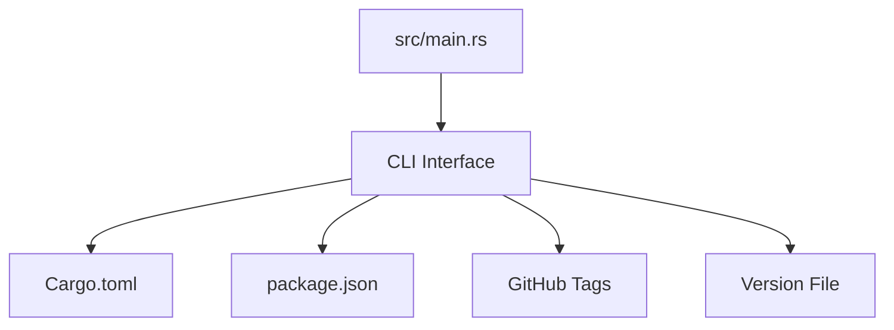
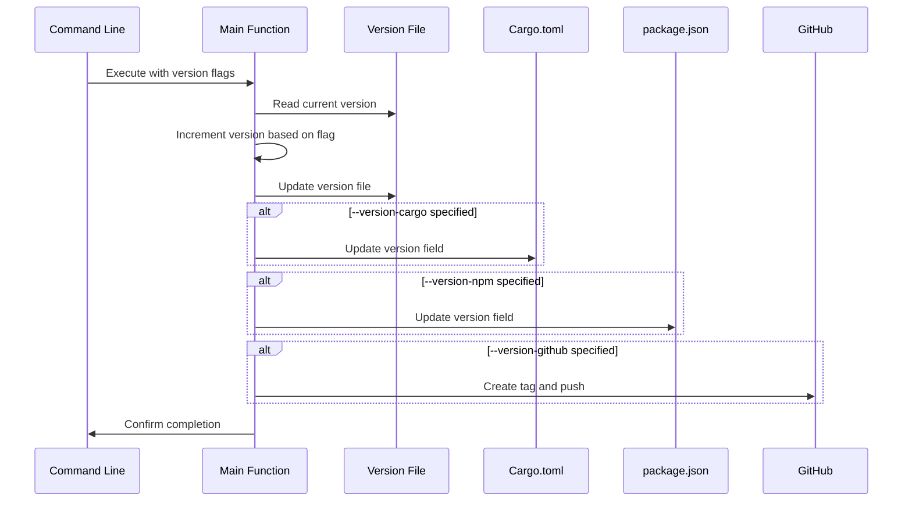
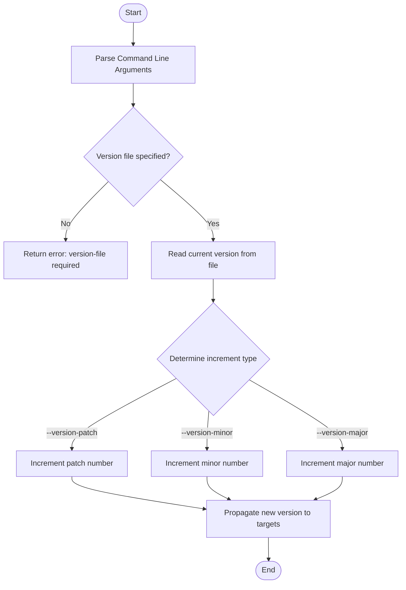
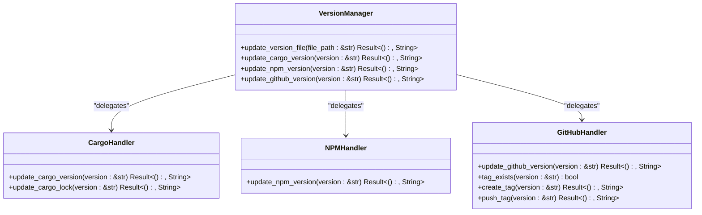
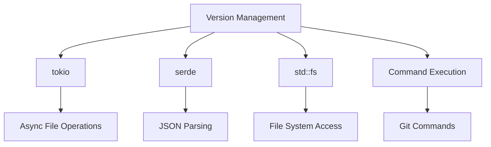

# Version Management System

<cite>
**Referenced Files in This Document **   
- [Cargo.toml](file://Cargo.toml)
- [package.json](file://package.json)
- [src/main.rs](file://src/main.rs)
</cite>

## Table of Contents
1. [Introduction](#introduction)
2. [Project Structure](#project-structure)
3. [Core Components](#core-components)
4. [Architecture Overview](#architecture-overview)
5. [Detailed Component Analysis](#detailed-component-analysis)
6. [Dependency Analysis](#dependency-analysis)
7. [Performance Considerations](#performance-considerations)
8. [Troubleshooting Guide](#troubleshooting-guide)
9. [Conclusion](#conclusion)

## Introduction
The aicommit tool provides a robust version synchronization system that ensures consistency across multiple package manifest files and GitHub tags. This documentation details the internal mechanisms that enable atomic version updates across Cargo.toml, package.json, and GitHub release tags through command-line flags. The system is designed to streamline the release process by automating version management tasks while maintaining semantic versioning principles.

## Project Structure
The project structure reveals a multi-language package with both Rust and Node.js components. The version synchronization functionality spans across these language ecosystems, connecting Rust's Cargo.toml with Node.js's package.json through a unified CLI interface implemented in Rust. The presence of both manifest files indicates that aicommit serves as both a Rust crate and an npm package, requiring coordinated version management.

**Diagram sources **
- [Cargo.toml](file://Cargo.toml)
- [package.json](file://package.json)
- [src/main.rs](file://src/main.rs)

**Section sources**
- [Cargo.toml](file://Cargo.toml)
- [package.json](file://package.json)

## Core Components
The version management system in aicommit consists of several core functions that handle version file operations, manifest synchronization, and GitHub integration. These components work together to provide a seamless version bumping experience across different packaging systems. The implementation ensures that version changes are applied atomically and consistently across all specified targets.

**Section sources**
- [src/main.rs](file://src/main.rs#L280-L380)

## Architecture Overview
The version synchronization architecture follows a centralized pattern where the main CLI handler orchestrates version updates across multiple targets. When version flags are provided, the system reads from a designated version file, applies the appropriate increment, and propagates the new version to all requested destinations. This approach ensures that version changes remain consistent across the entire project ecosystem.

**Diagram sources **
- [src/main.rs](file://src/main.rs#L1431-L2000)

## Detailed Component Analysis

### Version Synchronization Engine
The version synchronization engine in aicommit provides comprehensive support for managing versions across multiple platforms. The system uses a central version file as the source of truth, which is then propagated to various package manifests and remote repositories. This design ensures that version numbers remain consistent regardless of the packaging system being used.

#### Version Increment Logic:

**Diagram sources **
- [src/main.rs](file://src/main.rs#L280-L380)

#### Manifest File Handlers:

**Diagram sources **
- [src/main.rs](file://src/main.rs#L280-L380)

**Section sources**
- [src/main.rs](file://src/main.rs#L280-L380)

### CI/CD Integration
The version management system integrates seamlessly with CI/CD pipelines through scriptable commands and predictable behavior. The `new-version` script defined in package.json demonstrates how version operations can be automated within continuous integration workflows, enabling fully automated release processes.

**Section sources**
- [package.json](file://package.json#L45-L46)

## Dependency Analysis
The version synchronization system has minimal external dependencies for its core functionality, relying primarily on standard library components for file operations and system commands. The use of tokio for asynchronous file operations enables non-blocking I/O during version file updates, while the integration with git commands provides reliable version control operations.

**Diagram sources **
- [src/main.rs](file://src/main.rs)
- [Cargo.toml](file://Cargo.toml)

**Section sources**
- [src/main.rs](file://src/main.rs)
- [Cargo.toml](file://Cargo.toml)

## Performance Considerations
The version synchronization operations are optimized for speed and reliability. File operations are performed asynchronously using tokio, ensuring that the CLI remains responsive even when updating multiple files. The system minimizes disk I/O by reading each file only once and writing the updated content in a single operation. Network operations for GitHub integration are kept to a minimum, with tag existence checks and pushes executed as efficiently as possible.

## Troubleshooting Guide
Common issues with the version management system typically involve missing prerequisites or permission problems. The most frequent error conditions include attempting to use version flags without specifying a version file, encountering merge conflicts during automated pushes, or lacking proper git configuration for tag operations. The system provides clear error messages to help diagnose these issues.

**Section sources**
- [src/main.rs](file://src/main.rs#L1874-L1890)

## Conclusion
The version management system in aicommit provides a comprehensive solution for maintaining version consistency across multiple packaging ecosystems. By centralizing version control through a dedicated version file and providing atomic updates to all relevant manifests, the system simplifies the release process while reducing the risk of version mismatches. The integration with GitHub enables fully automated release workflows, making it an essential tool for projects that span multiple technology stacks.