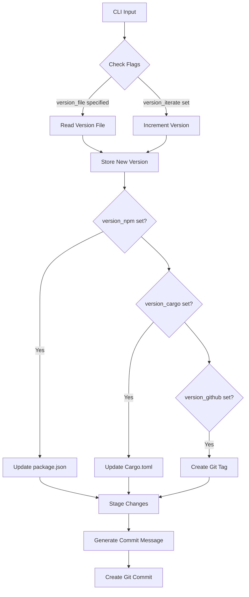
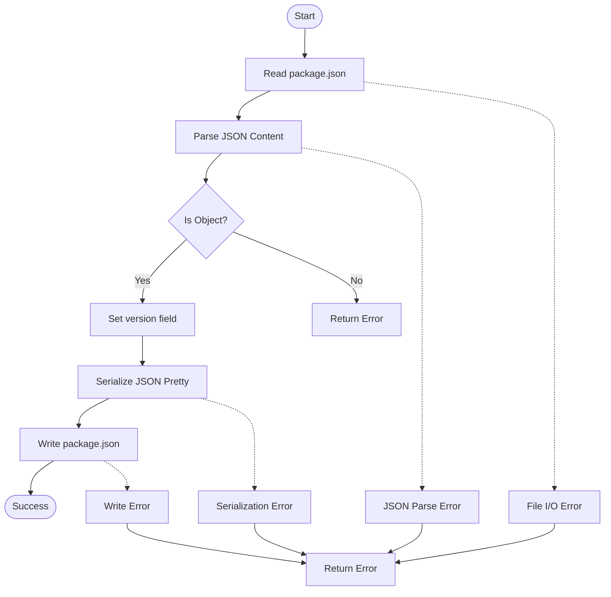
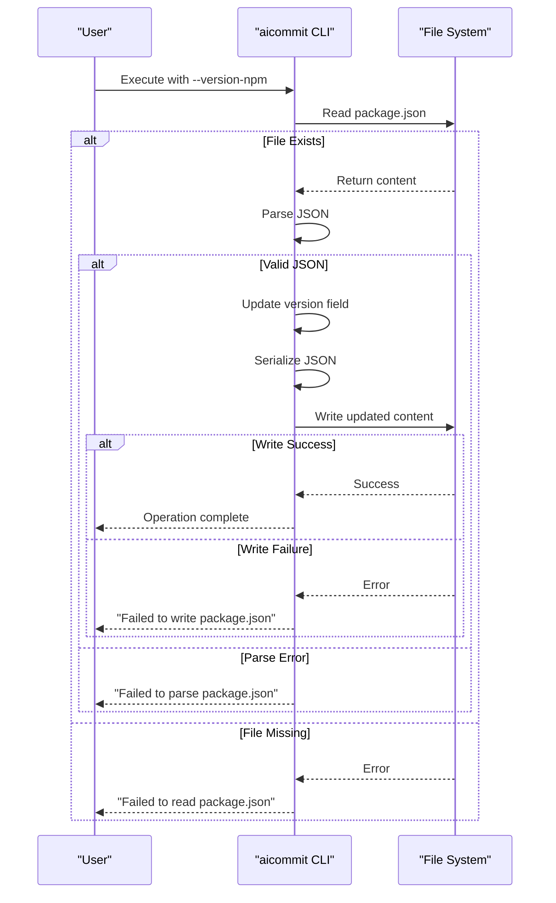
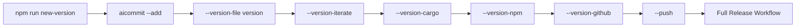
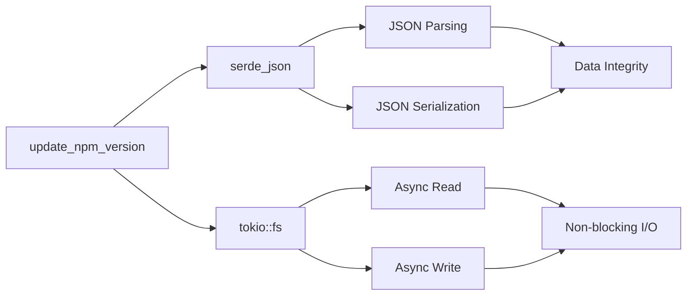

# package.json Synchronization

<cite>
**Referenced Files in This Document**
- [main.rs](file://src/main.rs)
- [package.json](file://package.json)
- [package.json](file://vscode-extension/package.json)
</cite>

## Table of Contents
1. [Introduction](#introduction)
2. [Core Components](#core-components)
3. [Architecture Overview](#architecture-overview)
4. [Detailed Component Analysis](#detailed-component-analysis)
5. [Dependency Analysis](#dependency-analysis)
6. [Performance Considerations](#performance-considerations)
7. [Troubleshooting Guide](#troubleshooting-guide)
8. [Conclusion](#conclusion)

## Introduction
The aicommit tool provides version synchronization functionality for JavaScript projects by updating the `version` field in `package.json` files. This feature is part of a broader version management system that supports multiple package formats including npm, Cargo, and custom version files. When enabled via the `--version-npm` CLI flag, the tool reads the current version from a specified version file, increments it, and propagates this updated version to all relevant configuration files including `package.json`. The implementation prioritizes data integrity by using safe JSON parsing and serialization through serde_json, preserving formatting and avoiding corruption of existing content.

## Core Components

The version synchronization functionality is implemented through several core components in the aicommit codebase. The `update_npm_version` async function handles the specific logic for modifying `package.json` files, while the CLI argument parser defined in the `Cli` struct manages user input for the `--version-npm` flag. The version incrementing logic is centralized in the `increment_version` function, which parses semantic version strings and safely increments the patch number. These components work together to provide a reliable version management workflow that integrates with git operations and other package managers.

**Section sources**
- [main.rs](file://src/main.rs#L368-L400)
- [main.rs](file://src/main.rs#L100-L299)
- [main.rs](file://src/main.rs#L300-L499)

## Architecture Overview

**Diagram sources**
- [main.rs](file://src/main.rs#L1850-L2049)

## Detailed Component Analysis

### update_npm_version Function Analysis

The `update_npm_version` function implements the core logic for modifying `package.json` files. It follows a three-step process: read, parse, and write, with comprehensive error handling at each stage.

#### Implementation Flowchart

**Diagram sources**
- [main.rs](file://src/main.rs#L368-L400)

#### Error Handling Sequence

**Diagram sources**
- [main.rs](file://src/main.rs#L368-L400)

**Section sources**
- [main.rs](file://src/main.rs#L368-L400)

### Integration with npm Scripts

The aicommit tool integrates with npm scripts through predefined commands in the `package.json` file. The `new-version` script demonstrates how multiple version synchronization flags can be combined into a single workflow that updates both Rust and JavaScript package versions, creates git tags, and pushes changes to the remote repository.

#### Script Integration Diagram

**Diagram sources**
- [package.json](file://package.json#L50-L57)

**Section sources**
- [package.json](file://package.json#L50-L57)

## Dependency Analysis

The version synchronization feature depends on several external crates that provide essential functionality. The serde_json crate enables safe JSON parsing and serialization, while tokio provides asynchronous file I/O operations. These dependencies are crucial for maintaining data integrity during file operations and preventing race conditions in concurrent environments.

**Diagram sources**
- [main.rs](file://src/main.rs#L368-L400)

**Section sources**
- [main.rs](file://src/main.rs#L1-L20)
- [Cargo.toml](file://Cargo.toml#L1-L10)

## Performance Considerations

The implementation uses asynchronous file operations to prevent blocking the main thread during I/O operations. By leveraging tokio's async runtime, the tool can perform other tasks while waiting for file system operations to complete. The JSON parsing and serialization are handled efficiently by serde_json, which minimizes memory allocations and processing time. However, since these operations are typically performed infrequently (during version updates), performance optimization is less critical than data integrity and error handling.

## Troubleshooting Guide

Common issues with the `--version-npm` functionality include missing version files, malformed JSON, permission errors, and file locking conflicts. The tool provides descriptive error messages for each failure case, helping users diagnose and resolve problems quickly.

### Common Issues and Solutions
| Issue | Error Message | Solution |
|------|---------------|----------|
| Missing version file | "Error: --version-file must be specified" | Provide version file path with --version-file flag |
| Malformed JSON | "Failed to parse package.json" | Validate JSON syntax using jsonlint or similar tool |
| Permission denied | "Failed to write package.json" | Check file permissions and ensure write access |
| Concurrent modification | "Failed to write package.json" | Ensure no other processes are modifying the file |
| Missing package.json | "Failed to read package.json" | Verify package.json exists in project root |

**Section sources**
- [main.rs](file://src/main.rs#L368-L400)
- [main.rs](file://src/main.rs#L1850-L2049)

## Conclusion

The package.json synchronization feature in aicommit provides a robust solution for managing version numbers across different package formats. By using safe JSON handling through serde_json and asynchronous file operations via tokio, the implementation ensures data integrity while maintaining good performance. The integration with npm scripts allows for automated release workflows, and comprehensive error handling helps users diagnose and resolve common issues. This functionality exemplifies how modern Rust tools can provide reliable automation for common development tasks while prioritizing safety and correctness.