# aicommit


[](https://crates.io/crates/aicommit)
[](https://docs.rs/aicommit)
[](https://opensource.org/licenses/MIT)
[](https://github.com/suenot/aicommit/tree/main/vscode-extension)

📚 [Website & Documentation](https://suenot.github.io/aicommit/)

A CLI tool that generates concise and descriptive git commit messages using LLMs (Large Language Models).

## Features

### Implemented Features
- ✅ Uses LLMs to generate meaningful commit messages from your changes
- ✅ Supports multiple LLM providers (OpenRouter, Ollama, OpenAI compatible api)
- ✅ Custom api keys for services through open router api (for google aistudio and etc) - go to https://openrouter.ai/settings/integrations and paste key from any of them: AI21, Amazon BedRock, Anthropic, AnyScale, Avian.io, Cloudflare, Cohere, DeepInfra, **DeepSeek**, Fireworks, **Google AI Studio**, Google Vertex, Hyperbolic, Infermatic, Inflection, Lambda, Lepton, Mancer, Mistral, NovitaAI, OpenAI, Perplexity, Recursal, SambaNova, SF Compute, Together, xAI
- ✅ Fast and efficient - works directly from your terminal
- ✅ Easy configuration and customization
- ✅ Transparent token usage and cost tracking
- ✅ Automatic retry on provider errors (configurable attempts with 5s delay)
- ✅ Version management with automatic incrementation
- ✅ Version synchronization with Cargo.toml
- ✅ Version synchronization with package.json
- ✅ GitHub version management
- ✅ VS Code integration for generating commit messages directly in the editor
- ✅ Provider management (add, list, set active)
- ✅ Interactive configuration setup
- ✅ Configuration file editing
- ✅ Add all to stash functionality (`aicommit --add`)
- ✅ Auto push functionality (`aicommit --push`)
- ✅ Auto pull functionality (`aicommit --pull`)
- ✅ Automatic upstream branch setup for new branches
- ✅ Interactive commit message generation (`aicommit --dry-run`)
- ✅ Basic .gitignore file checks and management (create ~/.default_gitignore and use it as template if there is no .gitignore in this directory)
- ✅ Help information display (`aicommit --help`)
- ✅ Publication in npm
- ✅ Support for cross-compilation (ARM, AARCH64, etc.)
- ✅ Installation from binary
- ✅ --verbose mode (show context for LLM)
- ✅ Watch mode for automatic commits [BROKEN_NEED_TO_FIX]

### Planned Features
- 🚧 Support github issues (sync, auto open, auto close)
- 🚧 Tests for each feature to prevent breaking changes
- 🚧 Split commits by file (`aicommit --by-file`)
- 🚧 Split commits by feature (`aicommit --by-feature`)
- 🚧 Version management for multiple languages (requirements.txt, etc.)
- 🚧 Branch safety checks for push operations
- 🚧 Publication management
- 🚧 Publication in brew/macports
- 🚧 Publication in apt/apk/yum/pacman
- 🚧 Publication in other package managers
- 🚧 Support for submodules
- 🚧 Support for mercurial
- 🚧 Langchain support for multiple providers and custom logic
- 🚧 Using priority for providers (if one of provider broken)

Legend:
- ✅ Implemented
- 🚧 Planned
- 🧪 Has tests

## Installation

There are several ways to install aicommit:

### Using Cargo (Rust package manager)

If you have Rust installed:
```bash
cargo install aicommit
```

### Using npm/npx

```bash
# Run without installation
npx @suenot/aicommit

# Or install globally
npm install -g @suenot/aicommit
aicommit
```

### Using brew
```bash
# Install Homebrew if you haven't already
/bin/bash -c "$(curl -fsSL https://raw.githubusercontent.com/Homebrew/install/HEAD/install.sh)"

# Add aicommit tap and install
brew tap suenot/tap
brew install suenot/tap/aicommit
```

### Manual Installation

#### Download Pre-built Binaries

You can download pre-built binaries from the [GitHub Releases](https://github.com/suenot/aicommit/releases) page.

Available builds:
- Linux (x86_64, ARM64)
- macOS (Intel x86_64, Apple Silicon ARM64)
- Windows (x86_64, ARM64)

#### Linux/macOS:
```bash
# 1. Download and extract (replace VERSION and ARCH with appropriate values)
# wget https://github.com/suenot/aicommit/releases/download/vVERSION/aicommit-<ARCH>
# chmod +x aicommit-<ARCH>
# mv aicommit-<ARCH> aicommit
# sudo mv aicommit /usr/local/bin/

# Example for Linux x86_64:
wget https://github.com/suenot/aicommit/releases/download/v0.1.72/aicommit-linux-x86_64
mv aicommit-linux-x86_64 aicommit
chmod +x aicommit
sudo mv aicommit /usr/local/bin/

# Example for macOS ARM64:
wget https://github.com/suenot/aicommit/releases/download/v0.1.72/aicommit-macos-aarch64
mv aicommit-macos-aarch64 aicommit
chmod +x aicommit
sudo mv aicommit /usr/local/bin/

# Example for macOS x86_64:
wget https://github.com/suenot/aicommit/releases/download/v0.1.72/aicommit-macos-x86_64
mv aicommit-macos-x86_64 aicommit
chmod +x aicommit
sudo mv aicommit /usr/local/bin/


# 2. Make it executable
chmod +x aicommit-<ARCH>


# 3. Move to a directory in your PATH (optional)

```

#### Windows:
1. Download the ZIP file for your architecture
2. Extract the executable
3. Add the directory to your PATH or move the executable to a directory in your PATH

### Build from Source

If you want to build the latest version from source:

```bash
# 1. Clone the repository
git clone https://github.com/suenot/aicommit
cd aicommit

# 2. Build and install
cargo install --path .
```

Requirements for building from source:
- Rust toolchain (install from [rustup.rs](https://rustup.rs))
- A C compiler (gcc, clang, or MSVC)
- OpenSSL development packages (on Linux)

## Quick Start

1. Add a provider (choose one method):

   Interactive mode:
   ```bash
   aicommit --add-provider
   ```

   Non-interactive mode (example with OpenRouter):
   ```bash
   aicommit --add-provider --add-openrouter --openrouter-api-key "your-api-key"
   ```

2. Make some changes to your code

3. Create a commit:
   ```bash
   # Commit only staged changes (files added with git add)
   aicommit

   # Automatically stage and commit all changes
   aicommit --add

   # Stage all changes, commit, and push
   aicommit --add --push
   ```

## Provider Management

Add a provider in interactive mode:
```bash
aicommit --add-provider
```

Add providers in non-interactive mode:
```bash
# Add OpenRouter provider
aicommit --add-provider --add-openrouter --openrouter-api-key "your-api-key" --openrouter-model "mistralai/mistral-tiny"

# Add Ollama provider
aicommit --add-provider --add-ollama --ollama-url "http://localhost:11434" --ollama-model "llama2"

# Add OpenAI compatible provider
aicommit --add-provider --add-openai-compatible \
  --openai-compatible-api-key "your-api-key" \
  --openai-compatible-api-url "https://api.deep-foundation.tech/v1/chat/completions" \
  --openai-compatible-model "gpt-4o-mini"
```

Optional parameters for non-interactive mode:
- `--max-tokens` - Maximum number of tokens (default: 50)
- `--temperature` - Controls randomness (default: 0.3)

List all configured providers:
```bash
aicommit --list
```

Set active provider:
```bash
aicommit --set <provider-id>
```

## Version Management

aicommit supports automatic version management with the following features:

1. Automatic version incrementation using a version file:
```bash
aicommit --version-file version --version-iterate
```

2. Synchronize version with Cargo.toml:
```bash
aicommit --version-file version --version-iterate --version-cargo
```

3. Synchronize version with package.json:
```bash
aicommit --version-file version --version-iterate --version-npm
```

4. Update version on GitHub (creates a new tag):
```bash
aicommit --version-file version --version-iterate --version-github
```

You can combine these flags to update multiple files at once:
```bash
aicommit --version-file version --version-iterate --version-cargo --version-npm --version-github
```

## VS Code Extension

aicommit now includes a VS Code extension for seamless integration with the editor:

1. Navigate to the vscode-extension directory
```bash
cd vscode-extension
```

2. Install the extension locally for development
```bash
code --install-extension aicommit-vscode-0.1.0.vsix
```

Or build the extension package manually:
```bash
# Install vsce if not already installed
npm install -g @vscode/vsce

# Package the extension
vsce package
```

Once installed, you can generate commit messages directly from the Source Control view in VS Code by clicking the "AICommit: Generate Commit Message" button.

See the [VS Code Extension README](./vscode-extension/README.md) for more details.

## Configuration

The configuration file is stored at `~/.aicommit.json`. You can edit it directly with:

```bash
aicommit --config
```

### Global Configuration

The configuration file supports the following global settings:

```json
{
  "providers": [...],
  "active_provider": "provider-id",
  "retry_attempts": 3  // Number of attempts to generate commit message if provider fails
}
```

- `retry_attempts`: Number of retry attempts if provider fails (default: 3)
  - Waits 5 seconds between attempts
  - Shows informative messages about retry progress
  - Can be adjusted based on your needs (e.g., set to 5 for less stable providers)

### Provider Configuration

Each provider can be configured with the following settings:

- `max_tokens`: Maximum number of tokens in the response (default: 200)
- `temperature`: Controls randomness in the response (0.0-1.0, default: 0.3)

Example configuration with all options:
```json
{
  "providers": [{
    "id": "550e8400-e29b-41d4-a716-446655440000",
    "provider": "openrouter",
    "api_key": "sk-or-v1-...",
    "model": "mistralai/mistral-tiny",
    "max_tokens": 200,
    "temperature": 0.3
  }],
  "active_provider": "550e8400-e29b-41d4-a716-446655440000",
  "retry_attempts": 3
}
```

For OpenRouter, token costs are automatically fetched from their API. For Ollama, you can specify your own costs if you want to track usage.

## Supported LLM Providers

### OpenRouter
```json
{
  "providers": [{
    "id": "550e8400-e29b-41d4-a716-446655440000",
    "provider": "openrouter",
    "api_key": "sk-or-v1-...",
    "model": "mistralai/mistral-tiny",
    "max_tokens": 50,
    "temperature": 0.3,
    "input_cost_per_1k_tokens": 0.25,
    "output_cost_per_1k_tokens": 0.25
  }],
  "active_provider": "550e8400-e29b-41d4-a716-446655440000"
}
```

#### Recommended Providers through OpenRouter

- 🌟 **Google AI Studio** - 1000000 tokens for free
  - "google/gemini-2.0-flash-exp:free"
- 🌟 **DeepSeek**
  - "deepseek/deepseek-chat"


### Ollama
```json
{
  "providers": [{
    "id": "67e55044-10b1-426f-9247-bb680e5fe0c8",
    "provider": "ollama",
    "url": "http://localhost:11434",
    "model": "llama2",
    "max_tokens": 50,
    "temperature": 0.3,
    "input_cost_per_1k_tokens": 0.0,
    "output_cost_per_1k_tokens": 0.0
  }],
  "active_provider": "67e55044-10b1-426f-9247-bb680e5fe0c8"
}
```

### OpenAI-compatible API

For example, you can use DeepGPTBot's OpenAI-compatible API for generating commit messages. Here's how to set it up:

1. Get your API key from Telegram:
   - Open [@DeepGPTBot](https://t.me/DeepGPTBot) in Telegram
   - Use the `/api` command to get your API key

2. Configure aicommit (choose one method):

   Interactive mode:
   ```bash
   aicommit --add-provider
   ```
   Select "OpenAI Compatible" and enter:
   - API Key: Your key from @DeepGPTBot
   - API URL: https://api.deep-foundation.tech/v1/chat/completions
   - Model: gpt-4o-mini
   - Max tokens: 50 (default)
   - Temperature: 0.3 (default)

   Non-interactive mode:
   ```bash
   aicommit --add-provider --add-openai-compatible \
     --openai-compatible-api-key "your-api-key" \
     --openai-compatible-api-url "https://api.deep-foundation.tech/v1/chat/completions" \
     --openai-compatible-model "gpt-4o-mini"
   ```

3. Start using it:
   ```bash
   aicommit
   ```

## Upcoming Features
- ⏳ Hooks for Git systems (pre-commit, post-commit)
- ⏳ Support for more LLM providers
- ⏳ Integration with IDEs and editors
- ⏳ EasyCode: VS Code integration for commit message generation directly from editor
- ⏳ Command history and reuse of previous messages
- ⏳ Message templates and customization options

## Usage Information

When generating a commit message, the tool will display:
- Number of tokens used (input and output)
- Total API cost (calculated separately for input and output tokens)

Example output:
```
Generated commit message: Add support for multiple LLM providers
Tokens: 8↑ 32↓
API Cost: $0.0100
```

You can have multiple providers configured and switch between them by changing the `active_provider` field to match the desired provider's `id`.

### Staging Changes

By default, aicommit will only commit changes that have been staged using `git add`. To automatically stage all changes before committing, use the `--add` flag:

```bash
# Only commit previously staged changes
aicommit

# Automatically stage and commit all changes
aicommit --add

# Stage all changes, commit, and push (automatically sets up upstream if needed)
aicommit --add --push

# Stage all changes, pull before commit, and push after (automatically sets up upstream if needed)
aicommit --add --pull --push
```

### Automatic Upstream Branch Setup

When using `--pull` or `--push` flags, aicommit automatically handles upstream branch configuration:

- If the current branch has no upstream set:
  ```bash
  # Automatically runs git push --set-upstream origin <branch> when needed
  aicommit --push

  # Automatically sets up tracking and pulls changes
  aicommit --pull
  ```

- For new branches:
  - With `--push`: Creates the remote branch and sets up tracking
  - With `--pull`: Skips pull if remote branch doesn't exist yet
  - No manual `git push --set-upstream origin <branch>` needed

This makes working with new branches much easier, as you don't need to manually configure upstream tracking.

## Watch Mode

The watch mode allows you to automatically commit changes at specified intervals. This is useful for:
- Automatic backups of your work
- Maintaining a detailed history of changes
- Not forgetting to commit your changes

### Basic Watch Mode

```bash
aicommit --watch 1m      # Check and commit changes every minute
aicommit --watch 30s     # Check every 30 seconds
aicommit --watch 2h      # Check every 2 hours
```

### Watch with Edit Delay

You can add a delay after the last edit before committing. This helps avoid creating commits while you're still actively editing files:

```bash
aicommit --watch 1m --wait-for-edit 30s   # Check every minute, but wait 30s after last edit
```

### Time Units
- `s`: seconds
- `m`: minutes
- `h`: hours

### Additional Options
You can combine watch mode with other flags:
```bash
# Watch with auto-push
aicommit --watch 1m --push

# Watch with version increment
aicommit --watch 1m --add --version-file version --version-iterate

# Interactive mode with watch
aicommit --watch 1m --dry-run
```

### Tips
- Use shorter intervals (30s-1m) for active development sessions
- Use longer intervals (5m-15m) for longer coding sessions
- Add `--wait-for-edit` when you want to avoid partial commits
- Use `Ctrl+C` to stop watching

## Алгоритм работы

Ниже представлена диаграмма алгоритма работы программы aicommit:

```mermaid
flowchart TD
    A[Запуск aicommit] --> B{Проверка параметров}
    
    %% Обработка основных флагов
    B -->|--help| C[Показать справку]
    B -->|--version| D[Показать версию]
    B -->|--add-provider| E[Добавить нового провайдера]
    B -->|--list| F[Список провайдеров]
    B -->|--set| G[Установить активного провайдера]
    B -->|--config| H[Редактировать конфигурацию]
    B -->|--dry-run| I[Режим генерации без коммита]
    B -->|стандартный режим| J[Стандартный режим коммита]
    B -->|--watch| K[Режим отслеживания изменений]
    
    %% Добавление провайдера
    E -->|интерактивно| E1[Интерактивная настройка]
    E -->|--add-openrouter| E2[Добавление OpenRouter]
    E -->|--add-ollama| E3[Добавление Ollama]
    E -->|--add-openai-compatible| E4[Добавление OpenAI совместимого API]
    E1 --> E5[Сохранение конфигурации]
    E2 --> E5
    E3 --> E5
    E4 --> E5
    
    %% Основной процесс коммита
    J --> L[Загрузка конфигурации]
    L --> M{Версионирование}
    M -->|--version-iterate| M1[Обновление версии]
    M -->|--version-cargo| M2[Обновление в Cargo.toml]
    M -->|--version-npm| M3[Обновление в package.json]
    M -->|--version-github| M4[Создание тега на GitHub]
    M1 --> N
    M2 --> N
    M3 --> N
    M4 --> N
    M -->|нет опций версионирования| N[Получение git diff]
    
    %% Git операции
    N -->|--add| N1[git add .]
    N1 --> O
    N -->|только staged изменения| O[Генерация сообщения коммита]
    
    O --> P{Успешно?}
    P -->|Да| Q[Создание коммита]
    P -->|Нет| P1{Достигнут лимит попыток?}
    P1 -->|Да| P2[Ошибка генерации]
    P1 -->|Нет| P3[Повторная попытка через 5 сек]
    P3 --> O
    
    Q --> R{Дополнительные операции}
    R -->|--pull| R1[Синхронизация с удаленным репозиторием]
    R -->|--push| R2[Отправка изменений в удаленный репозиторий]
    R1 --> S[Готово]
    R2 --> S
    R -->|нет доп. опций| S
    
    %% Улучшенный режим отслеживания
    K --> K1[Инициализация системы отслеживания файлов]
    K1 --> K2[Начало отслеживания изменений]
    K2 --> K3{Обнаружено изменение файла}
    K3 -->|Да| K4[Логирование изменения в терминал]
    K3 -->|Нет| K2
    
    K4 --> K5{Указан --wait-for-edit?}
    K5 -->|Нет| K7[git add измененного файла]
    K5 -->|Да| K6[Добавление файла в список ожидания]
    
    K6 --> K2
    
    %% Параллельный процесс для списка ожидания
    K1 --> K8[Проверка списка ожидания каждую секунду]
    K8 --> K9{Есть файлы без изменений время wait-for-edit?}
    K9 -->|Нет| K8
    K9 -->|Да| K10[git add этих файлов]
    K10 --> K11[Запуск процесса коммита]
    K11 --> K12[Удаление файлов из списка ожидания]
    K12 --> K8
    
    K7 --> K11
    
    %% Сухой запуск
    I --> I1[Загрузка конфигурации]
    I1 --> I2[Получение git diff]
    I2 --> I3[Генерация сообщения коммита]
    I3 --> I4[Вывод результата без создания коммита]
```



## License

This project is licensed under the MIT License - see the [LICENSE](LICENSE) file for details.
