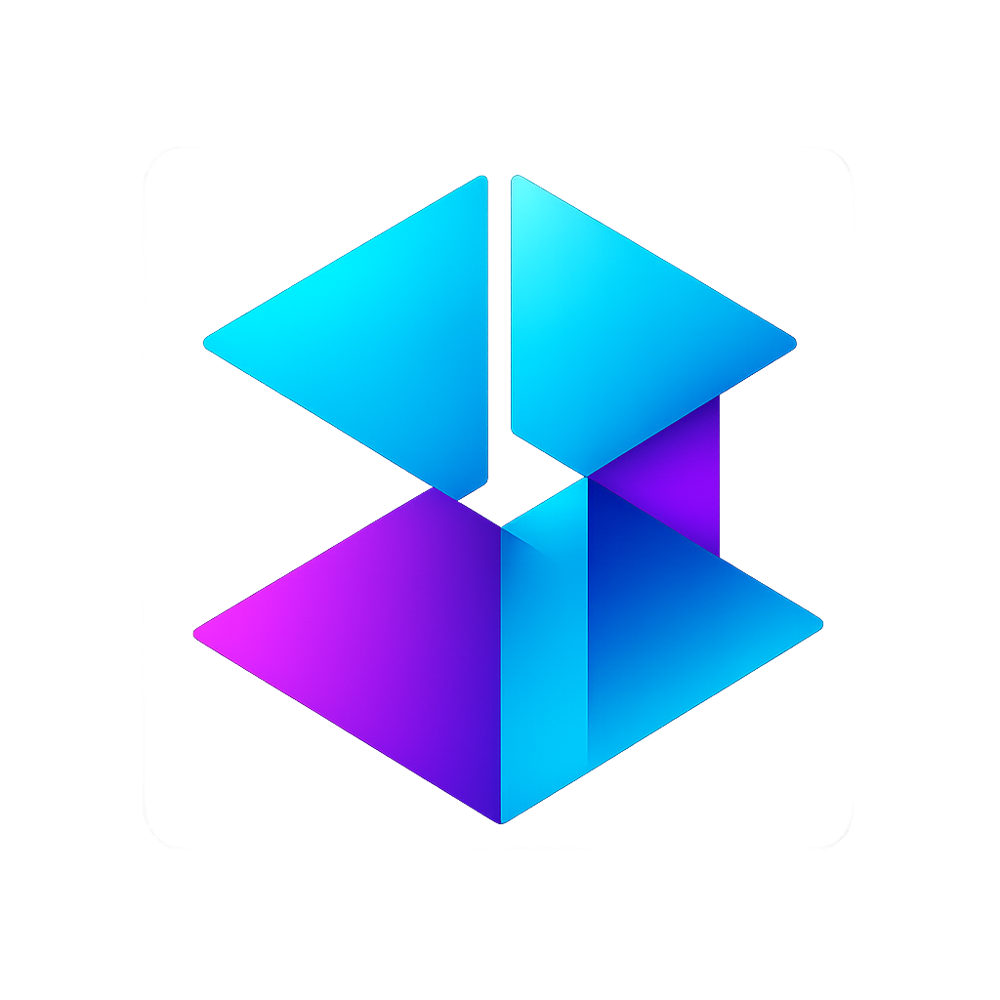

# aicommit


[](https://crates.io/crates/aicommit)
[](https://docs.rs/aicommit)
[](https://opensource.org/licenses/MIT)

📚 [Website & Documentation](https://suenot.github.io/aicommit/)

A CLI tool that generates concise and descriptive git commit messages using LLMs (Large Language Models).

## Features

### Implemented Features
- ✅ Uses LLMs to generate meaningful commit messages from your changes
- ✅ Supports multiple LLM providers (OpenRouter, Ollama)
- ✅ Custom api keys for services through open router api (for google aistudio and etc) - go to https://openrouter.ai/settings/integrations and paste key from any of them: AI21, Amazon BedRock, Anthropic, AnyScale, Avian.io, Cloudflare, Cohere, DeepInfra, **DeepSeek**, Fireworks, **Google AI Studio**, Google Vertex, Hyperbolic, Infermatic, Inflection, Lambda, Lepton, Mancer, Mistral, NovitaAI, OpenAI, Perplexity, Recursal, SambaNova, SF Compute, Together, xAI
- ✅ Fast and efficient - works directly from your terminal
- ✅ Easy configuration and customization
- ✅ Transparent token usage and cost tracking
- ✅ Version management with automatic incrementation
- ✅ Version synchronization with Cargo.toml
- ✅ Provider management (add, list, set active)
- ✅ Interactive configuration setup
- ✅ Configuration file editing
- ✅ Auto push functionality (`aicommit --push`)
- ✅ Auto push functionality (`aicommit --pull`)
- ✅ Interactive commit message generation (`aicommit --dry-run`)
- ✅ Basic .gitignore file checks and management (create ~/.default_gitignore and use it as template if there is no .gitignore in this directory)
- ✅ Watch mode (`aicommit --watch 1m`)
- ✅ Watch with edit delay (`aicommit --watch 1m --wait-for-edit 30s`)

### Planned Features
- 🚧 Tests for each feature to prevent breaking changes
- 🚧 Split commits by file (`aicommit --by-file`)
- 🚧 Split commits by feature (`aicommit --by-feature`)
- 🚧 Version management for multiple languages (package.json, requirements.txt, etc.)
- 🚧 Branch safety checks for push operations

Legend:
- ✅ Implemented
- 🚧 Planned
- 🧪 Has tests

## Installation

Install via cargo:

```bash
cargo install aicommit
```

Or build from source:

```bash
git clone https://github.com/suenot/aicommit
cd aicommit
cargo install --path .
```

## Quick Start

1. Add a provider:
```bash
aicommit --add
```

2. Make some changes to your code

3. Create a commit:
```bash
aicommit
```

## Provider Management

List all configured providers:
```bash
aicommit --list
```

Set active provider:
```bash
aicommit --set <provider-id>
```

## Version Management

Automatically increment version in a file before commit:
```bash
aicommit --version-file "./version" --version-iterate
```

Synchronize version with Cargo.toml:
```bash
aicommit --version-file "./version" --version-cargo
```

Both operations can be combined:
```bash
aicommit --version-file "./version" --version-cargo --version-iterate
```

## Configuration

The configuration file is stored at `~/.aicommit.json`. You can edit it directly with:

```bash
aicommit --config
```

### Provider Configuration

Each provider can be configured with the following settings:

- `max_tokens`: Maximum number of tokens in the response (default: 50)
- `temperature`: Controls randomness in the response (0.0-1.0, default: 0.3)

For OpenRouter, token costs are automatically fetched from their API. For Ollama, you can specify your own costs if you want to track usage.

## Supported LLM Providers

### OpenRouter
```json
{
  "providers": [{
    "id": "550e8400-e29b-41d4-a716-446655440000",
    "provider": "openrouter",
    "api_key": "sk-or-v1-...",
    "model": "mistralai/mistral-tiny",
    "max_tokens": 50,
    "temperature": 0.3,
    "input_cost_per_1k_tokens": 0.25,
    "output_cost_per_1k_tokens": 0.25
  }],
  "active_provider": "550e8400-e29b-41d4-a716-446655440000"
}
```

### Ollama
```json
{
  "providers": [{
    "id": "67e55044-10b1-426f-9247-bb680e5fe0c8",
    "provider": "ollama",
    "url": "http://localhost:11434",
    "model": "llama2",
    "max_tokens": 50,
    "temperature": 0.3,
    "input_cost_per_1k_tokens": 0.0,
    "output_cost_per_1k_tokens": 0.0
  }],
  "active_provider": "67e55044-10b1-426f-9247-bb680e5fe0c8"
}
```

## Recommended Providers through OpenRouter

- 🌟 **Google AI Studio** - 1000000 tokens for free
  - "google/gemini-2.0-flash-exp:free"
- 🌟 **DeepSeek**
  - "deepseek/deepseek-chat"

## Usage Information

When generating a commit message, the tool will display:
- Number of tokens used (input and output)
- Total API cost (calculated separately for input and output tokens)

Example output:
```
Generated commit message: Add support for multiple LLM providers
Tokens: 8↑ 32↓
API Cost: $0.0100
```

You can have multiple providers configured and switch between them by changing the `active_provider` field to match the desired provider's `id`.

## License

This project is licensed under the MIT License - see the [LICENSE](LICENSE) file for details.

## Watch Mode

The watch mode allows you to automatically commit changes at specified intervals. This is useful for:
- Automatic backups of your work
- Maintaining a detailed history of changes
- Not forgetting to commit your changes

### Basic Watch Mode

```bash
aicommit --watch 1m      # Check and commit changes every minute
aicommit --watch 30s     # Check every 30 seconds
aicommit --watch 2h      # Check every 2 hours
```

### Watch with Edit Delay

You can add a delay after the last edit before committing. This helps avoid creating commits while you're still actively editing files:

```bash
aicommit --watch 1m --wait-for-edit 30s   # Check every minute, but wait 30s after last edit
```

### Time Units
- `s`: seconds
- `m`: minutes
- `h`: hours

### Additional Options
You can combine watch mode with other flags:
```bash
# Watch with auto-push
aicommit --watch 1m --push

# Watch with version increment
aicommit --watch 1m --version-file version --version-iterate

# Interactive mode with watch
aicommit --watch 1m --dry-run
```

### Tips
- Use shorter intervals (30s-1m) for active development sessions
- Use longer intervals (5m-15m) for longer coding sessions
- Add `--wait-for-edit` when you want to avoid partial commits
- Use `Ctrl+C` to stop watching
